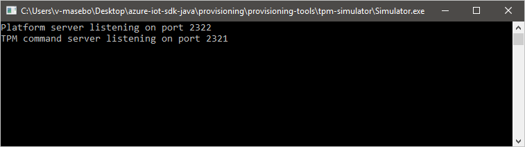
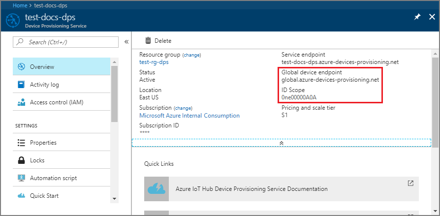
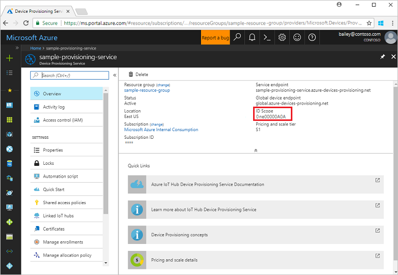
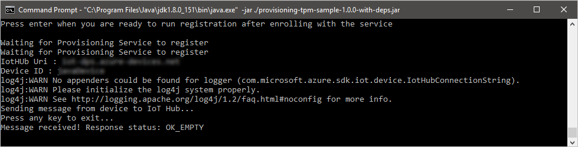
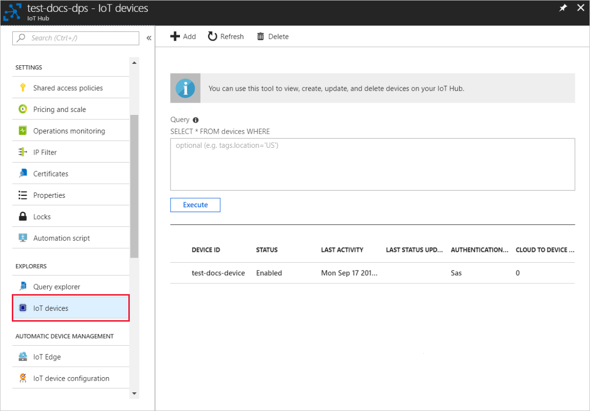

# Quickstart: Provision a simulated TPM device

::: zone pivot="programming-language-csharp, programming-language-ansi-c, programming-language-nodejs, programming-language-java"
In this quickstart, you'll create a simulated device on your Windows machine. The simulated device will be configured to use a [Trusted Platform Module (TPM) attestation](concepts-tpm-attestation.md) mechanism for authentication. After you've configured your device, you'll provision it to your IoT hub using the Azure IoT Hub Device Provisioning Service. Sample code will then be used to help enroll the device with a Device Provisioning Service instance.

If you're unfamiliar with the process of provisioning, review the [provisioning](about-iot-dps.md#provisioning-process) overview.  Also make sure you've completed the steps in [Set up IoT Hub Device Provisioning Service with the Azure portal](./quick-setup-auto-provision.md) before continuing.

The Azure IoT Device Provisioning Service supports two types of enrollments:

* [Enrollment groups](concepts-service.md#enrollment-group) that are used to enroll multiple related devices.

* [Individual Enrollments](concepts-service.md#individual-enrollment) that are used to enroll a single device.

This article demonstrates individual enrollments.
::: zone-end

::: zone pivot="programming-language-python"
Trusted Platform Module (TPM) attestation isn't supported in the Python SDK. With Python, you can provision a device using [symmetric keys](quick-create-simulated-device-symm-key.md) or [X.509 certificates](quick-create-simulated-device-x509.md).
::: zone-end

::: zone pivot="programming-language-csharp, programming-language-ansi-c, programming-language-nodejs, programming-language-java"

## Prerequisites

* If you don't have an Azure subscription, create a [free account](https://azure.microsoft.com/free/?ref=microsoft.com&utm_source=microsoft.com&utm_medium=docs&utm_campaign=visualstudio) before you begin.

* Complete the steps in [Set up IoT Hub Device Provisioning Service with the Azure portal](./quick-setup-auto-provision.md).

The following prerequisites are for a Windows development environment. For Linux or macOS, see the appropriate section in [Prepare your development environment](https://github.com/Azure/azure-iot-sdk-c/blob/master/doc/devbox_setup.md) in the SDK documentation.

::: zone-end
::: zone pivot="programming-language-ansi-c"

* [Visual Studio](https://visualstudio.microsoft.com/vs/) 2019 with the ['Desktop development with C++'](/cpp/ide/using-the-visual-studio-ide-for-cpp-desktop-development) workload enabled. Visual Studio 2015 and Visual Studio 2017 are also supported.

::: zone-end

::: zone pivot="programming-language-csharp"

* A TPM 2.0 hardware security module on your Windows-based machine.

* Install [.NET Core SDK 6.0](https://dotnet.microsoft.com/download) or later on your Windows-based machine. You can use the following command to check your version.

    ```bash
    dotnet --info
    ```

::: zone-end

::: zone pivot="programming-language-nodejs"

* Install [Node.js v4.0+](https://nodejs.org).

::: zone-end

::: zone pivot="programming-language-java"

* Install [Java SE Development Kit 8](/azure/developer/java/fundamentals/java-support-on-azure) or later installed on your machine.

* Download and install [Maven](https://maven.apache.org/install.html).

::: zone-end
::: zone pivot="programming-language-csharp, programming-language-ansi-c, programming-language-nodejs, programming-language-java"

* Install the latest version of [Git](https://git-scm.com/download/). Make sure that Git is added to the environment variables accessible to the command window. See [Software Freedom Conservancy's Git client tools](https://git-scm.com/download/) for the latest version of `git` tools to install, which includes *Git Bash*, the command-line app that you can use to interact with your local Git repository.

<a id="setupdevbox"></a>

## Prepare your development environment

::: zone-end
::: zone pivot="programming-language-ansi-c"

In this section, you'll prepare a development environment used to build the [Azure IoT C SDK](https://github.com/Azure/azure-iot-sdk-c) and the [TPM](/windows/device-security/tpm/trusted-platform-module-overview) device simulator sample.

1. Download the latest [CMake build system](https://cmake.org/download/).

    >[!IMPORTANT]
    >Confirm that the Visual Studio prerequisites (Visual Studio and the 'Desktop development with C++' workload) are installed on your machine, **before** starting the `CMake` installation. Once the prerequisites are in place, and the download is verified, install the CMake build system. Also, be aware that older versions of the CMake build system fail to generate the solution file used in this article. Make sure to use the latest version of CMake.

2. Open a web browser, and go to the [Release page of the Azure IoT C SDK](https://github.com/Azure/azure-iot-sdk-c/releases/latest).

3. Select the **Tags** tab at the top of the page.

4. Copy the tag name for the latest release of the Azure IoT C SDK.

5. Open a command prompt or Git Bash shell. Run the following commands to clone the latest release of the [Azure IoT Device SDK for C](https://github.com/Azure/azure-iot-sdk-c) GitHub repository. Replace `<release-tag>` with the tag you copied in the previous step, for example: `lts_01_2023`.

    ```cmd/sh
    git clone -b <release-tag> https://github.com/Azure/azure-iot-sdk-c.git
    cd azure-iot-sdk-c
    git submodule update --init
    ```

    This operation could take several minutes to complete.

6. When the operation is complete, run the following commands from the `azure-iot-sdk-c` directory:

    ```cmd/sh
    mkdir cmake
    cd cmake
    ```

::: zone-end

::: zone pivot="programming-language-csharp"

1. Open a Git CMD or Git Bash command-line environment.

2. Clone the [Azure IoT SDK for C#](https://github.com/Azure/azure-iot-sdk-csharp) GitHub repository using the following command:

    ```cmd
    git clone https://github.com/Azure/azure-iot-sdk-csharp.git
    ```

::: zone-end

::: zone pivot="programming-language-nodejs"

1. Open a Git CMD or Git Bash command-line environment.

2. Clone the [azure-utpm-c](https://github.com/Azure/azure-utpm-c) GitHub repository using the following command:

    ```cmd/sh
    git clone https://github.com/Azure/azure-utpm-c.git --recursive
    ```

::: zone-end

::: zone pivot="programming-language-java"

1. Open a Git CMD or Git Bash command-line environment.

2. Clone the [Java](https://github.com/Azure/azure-iot-sdk-java.git) GitHub repository using the following command:

    ```cmd/sh
    git clone https://github.com/Azure/azure-iot-sdk-java.git --recursive
    ```

::: zone-end

::: zone pivot="programming-language-ansi-c, programming-language-nodejs, programming-language-java"

## Build and run the TPM device simulator

In this section, you'll build and run the TPM simulator. This simulator listens over a socket on ports 2321 and 2322. Don't close the command window. You'll need to keep this simulator running until the end of this quickstart.

::: zone-end

::: zone pivot="programming-language-ansi-c"

1. Run the following command to build Azure IoT C SDK that includes the TPM device simulator sample code. A Visual Studio solution for the simulated device is generated in the `cmake` directory. This sample provides a TPM [attestation mechanism](concepts-service.md#attestation-mechanism) via Shared Access Signature (SAS) Token authentication.

    ```cmd
    cmake -Duse_prov_client:BOOL=ON -Duse_tpm_simulator:BOOL=ON ..
    ```

    >[!TIP]
    >If `cmake` does not find your C++ compiler, you may get build errors while running the above command. If that happens, try running the command in the [Visual Studio command prompt](/dotnet/framework/tools/developer-command-prompt-for-vs).

2. When the build succeeds, the last few output lines look similar to the following output:

    ```cmd/sh
    $ cmake -Duse_prov_client:BOOL=ON ..
    -- Building for: Visual Studio 16 2019
    -- The C compiler identification is MSVC 19.23.28107.0
    -- The CXX compiler identification is MSVC 19.23.28107.0

    ...

    -- Configuring done
    -- Generating done
    -- Build files have been written to: C:/code/azure-iot-sdk-c/cmake
    ```

3. Go to the root folder of the git repository you cloned.

4. Run the [TPM](/windows/device-security/tpm/trusted-platform-module-overview) simulator using the path shown below.

    ```cmd/sh
    cd ..
    .\provisioning_client\deps\utpm\tools\tpm_simulator\Simulator.exe
    ```

    The simulator doesn't display any output. Let it continue to run as it simulates a TPM device.

::: zone-end

::: zone pivot="programming-language-nodejs"

1. Go to the GitHub root folder.

2. Run the [TPM](/windows/device-security/tpm/trusted-platform-module-overview) simulator to be the [HSM](https://azure.microsoft.com/blog/azure-iot-supports-new-security-hardware-to-strengthen-iot-security/) for the simulated device.

    ```cmd/sh
    .\azure-utpm-c\tools\tpm_simulator\Simulator.exe
    ```

3. Create a new empty folder called **registerdevice**. In the **registerdevice** folder, create a _package.json_ file using the following command at your command prompt(make sure to answer all questions asked by `npm` or accept the defaults if they suit you):

    ```cmd/sh
    npm init
    ```

4. Install the following precursor packages:

    ```cmd/sh
    npm install node-gyp -g
    npm install ffi-napi -g
    ```

    > [!NOTE]
    > There are some known issues to installing the above packages. To resolve these issues, run `npm install --global --production windows-build-tools` using a command prompt in **Run as administrator** mode, run `SET VCTargetsPath=C:\Program Files (x86)\MSBuild\Microsoft.Cpp\v4.0\V140` after replacing the path with your installed version, and then rerun the above installation commands.
    >

5. Install all required packages running the following command at your command prompt in the **registerdevice** folder:

    ```cmd/sh
    npm install --save azure-iot-device azure-iot-device-mqtt azure-iot-security-tpm azure-iot-provisioning-device-http azure-iot-provisioning-device
    ```

    The command installs the following packages:

   * A security client that works with TPM: `azure-iot-security-tpm`
   * A transport for the device to connect to the Device Provisioning Service: either `azure-iot-provisioning-device-http` or `azure-iot-provisioning-device-amqp`
   * A client to use the transport and security client: `azure-iot-provisioning-device`
   * The device client: `azure-iot-device`
   * A transport: any of `azure-iot-device-amqp`, `azure-iot-device-mqtt`, or `azure-iot-device-http`
   * The security client that you already installed: `azure-iot-security-tpm`

     > [!NOTE]
     > The samples in this quickstart use the `azure-iot-provisioning-device-http` and `azure-iot-device-mqtt` transports.
     >

6. Open a text editor of your choices.

7. In the **registerdevice** folder, create a new _ExtractDevice.js_ file.

8. Add the following `require` statements at the start of the **ExtractDevice.js** file:

    ```Javascript

    'use strict';

    var tpmSecurity = require('azure-iot-security-tpm');
    var tssJs = require("tss.js");

    var myTpm = new tpmSecurity.TpmSecurityClient(undefined, new tssJs.Tpm(true));
    ```

9. Add the following function to implement the method:

    ```Javascript

    myTpm.getEndorsementKey(function(err, endorsementKey) {
      if (err) {
        console.log('The error returned from get key is: ' + err);
      } else {
        console.log('the endorsement key is: ' + endorsementKey.toString('base64'));
        myTpm.getRegistrationId((getRegistrationIdError, registrationId) => {
          if (getRegistrationIdError) {
            console.log('The error returned from get registration id is: ' + getRegistrationIdError);
          } else {
            console.log('The Registration Id is: ' + registrationId);
            process.exit();
          }
        });
      }
    });
    ```

10. Save and close the _ExtractDevice.js_ file.

    ```cmd/sh
    node ExtractDevice.js
    ```

11. Run the sample.

12. The output window displays the **_Endorsement key_** and the **_Registration ID_** needed for device enrollment. Copy these values.

::: zone-end

::: zone pivot="programming-language-java"

1. Run the [TPM](/windows/device-security/tpm/trusted-platform-module-overview) simulator to be the [HSM](https://azure.microsoft.com/blog/azure-iot-supports-new-security-hardware-to-strengthen-iot-security/) for the simulated device.

2. Select  **Allow Access**. The simulator listens over a socket on ports 2321 and 2322. Don't close this command window; you need to keep this simulator running until the end of this quickstart guide.

    ```cmd/sh
    .\azure-iot-sdk-java\provisioning\provisioning-tools\tpm-simulator\Simulator.exe
    ```

    

3. Open a second command prompt.

4. In the second command prompt, navigate to the root folder and build the sample dependencies.

    ```cmd/sh
    cd azure-iot-sdk-java
    mvn install -DskipTests=true
    ```

5. Navigate to the sample folder.

    ```cmd/sh
    cd provisioning/provisioning-samples/provisioning-tpm-sample
    ```

::: zone-end

::: zone pivot="programming-language-ansi-c, programming-language-csharp, programming-language-java"

<a id="simulatetpm"></a>

## Read cryptographic keys from the TPM device

::: zone-end

::: zone pivot="programming-language-ansi-c, programming-language-java"

In this section, you'll build and execute a sample that reads the endorsement key and registration ID from the TPM simulator you left running, and is still listening over ports 2321 and 2322. These values will be used for device enrollment with your Device Provisioning Service instance.

::: zone-end

::: zone pivot="programming-language-ansi-c"

1. Launch Visual Studio.

2. Open the solution generated in the *cmake* folder named `azure_iot_sdks.sln`.

3. On the Visual Studio menu, select **Build** > **Build Solution** to build all projects in the solution.

4. In Visual Studio's *Solution Explorer* window, navigate to the **Provision\_Tools** folder. Right-click the **tpm_device_provision** project and select **Set as Startup Project**.

5. On the Visual Studio menu, select **Debug** > **Start without debugging** to run the solution. The app reads and displays a **_Registration ID_** and an **_Endorsement key_**. Note or copy these values. These will be used in the next section for device enrollment.

::: zone-end

::: zone pivot="programming-language-java"

1. Sign in to the Azure portal, select the **All resources** button on the left-hand menu and open your Device Provisioning Service. Note your _ID Scope_ and _Provisioning Service Global Endpoint_.

    

2. Edit `src/main/java/samples/com/microsoft/azure/sdk/iot/ProvisioningTpmSample.java` to include your _ID Scope_ and _Provisioning Service Global Endpoint_ as noted before.

    ```java
    private static final String idScope = "[Your ID scope here]";
    private static final String globalEndpoint = "[Your Provisioning Service Global Endpoint here]";
    private static final ProvisioningDeviceClientTransportProtocol PROVISIONING_DEVICE_CLIENT_TRANSPORT_PROTOCOL = ProvisioningDeviceClientTransportProtocol.HTTPS;
    ```

3. Save the file.

4. Use the following commands to build the project, navigate to the target folder, and execute the created .jar file (replace `{version}`with your version of Java):

    ```cmd/sh
    mvn clean install
    cd target
    java -jar ./provisioning-tpm-sample-{version}-with-deps.jar
    ```

5. When the program begins running, it will display the *_Endorsement key_* and *_Registration ID_*.  Copy these values for the next section. Make sure to leave the program running.

::: zone-end

::: zone pivot="programming-language-csharp"

In this section, you'll build and execute a sample that reads the endorsement key from your TPM 2.0 hardware security module. This value will be used for device enrollment with your Device Provisioning Service instance.

1. In a command prompt, change directories to the project directory for the TPM device provisioning sample.

    ```cmd
    cd '.\azure-iot-sdk-csharp\provisioning\device\samples\how to guides\TpmSample\'
    ```

2. Type the following command to build and run the TPM device provisioning sample. Copy the endorsement key returned from your TPM 2.0 hardware security module to use later when enrolling your device.

    ```cmd
    dotnet run -- -e
    ```

::: zone-end

::: zone pivot="programming-language-csharp, programming-language-ansi-c, programming-language-nodejs, programming-language-java"

<a id="portalenrollment"></a>

## Create a device enrollment entry

::: zone-end
::: zone pivot="programming-language-ansi-c, programming-language-nodejs, programming-language-java"

<!-- INCLUDE -->
[!INCLUDE [iot-dps-individual-enrollment-tpm.md](../../includes/iot-dps-individual-enrollment-tpm.md)]

::: zone-end

::: zone pivot="programming-language-csharp"

The C# TPM sample for this quickstart doesn't provide a registration ID. When prompted to add one for the individual enrollment, provide your own value.

<!-- INCLUDE -->
[!INCLUDE [iot-dps-individual-enrollment-tpm.md](../../includes/iot-dps-individual-enrollment-tpm.md)]

::: zone-end
::: zone pivot="programming-language-csharp, programming-language-ansi-c, programming-language-nodejs, programming-language-java"

## Register the device

In this section, you'll configure sample code to use the [Advanced Message Queuing Protocol (AMQP)](https://wikipedia.org/wiki/Advanced_Message_Queuing_Protocol) to send the device's boot sequence to your Device Provisioning Service instance. This boot sequence causes the device to be registered to an IoT hub linked to the Device Provisioning Service instance.

::: zone-end
::: zone pivot="programming-language-ansi-c"

<a id="firstbootsequence"></a>

1. In the Azure portal, select the **Overview** tab for your Device Provisioning Service.

2. Copy the **_ID Scope_** value.

    
3. In Visual Studio's *Solution Explorer* window, navigate to the **Provision\_Samples** folder. Expand the sample project named **prov\_dev\_client\_sample**. Expand **Source Files**, and open **prov\_dev\_client\_sample.c**.

4. Near the top of the file, find the `#define` statements for each device protocol as shown below. Make sure only `SAMPLE_AMQP` is uncommented.

    Currently, the [MQTT protocol isn't supported for TPM Individual Enrollment](https://github.com/Azure/azure-iot-sdk-c#provisioning-client-sdk).

    ```c
    //
    // The protocol you wish to use should be uncommented
    //
    //#define SAMPLE_MQTT
    //#define SAMPLE_MQTT_OVER_WEBSOCKETS
    #define SAMPLE_AMQP
    //#define SAMPLE_AMQP_OVER_WEBSOCKETS
    //#define SAMPLE_HTTP
    ```

5. Find the `id_scope` constant, and replace the value with your **ID Scope** value that you copied earlier.

    ```c
    static const char* id_scope = "0ne00002193";
    ```

6. Find the definition for the `main()` function in the same file. Make sure the `hsm_type` variable is set to `SECURE_DEVICE_TYPE_TPM` as shown below.

    ```c
    SECURE_DEVICE_TYPE hsm_type;
    hsm_type = SECURE_DEVICE_TYPE_TPM;
    //hsm_type = SECURE_DEVICE_TYPE_X509;
    //hsm_type = SECURE_DEVICE_TYPE_SYMMETRIC_KEY;
    ```

7. Right-click the **prov\_dev\_client\_sample** project and select **Set as Startup Project**.

8. On the Visual Studio menu, select **Debug** > **Start without debugging** to run the solution. In the prompt to rebuild the project, select **Yes**, to rebuild the project before running.

    The following output is an example of the provisioning device client sample successfully booting up, and connecting to a Device Provisioning Service instance to get IoT hub information and registering:

     ```cmd
    Provisioning API Version: 1.2.7

    Registering... Press enter key to interrupt.

    Provisioning Status: PROV_DEVICE_REG_STATUS_CONNECTED
    Provisioning Status: PROV_DEVICE_REG_STATUS_ASSIGNING
    Provisioning Status: PROV_DEVICE_REG_STATUS_ASSIGNING

    Registration Information received from service:
    test-docs-hub.azure-devices.net, deviceId: test-docs-cert-device
    ```

::: zone-end

::: zone pivot="programming-language-csharp"

1. In the Azure portal, select the **Overview** tab for your Device Provisioning Service.

2. Copy the **_ID Scope_** value.

    

3. In a command prompt, change directories to the project directory for the TPM device provisioning sample.

   ```cmd
    cd '.\azure-iot-sdk-csharp\provisioning\device\samples\how to guides\TpmSample\'
   ```

4. Run the following command to register your device. Replace `<IdScope>` with the value for the DPS you copied and `<RegistrationId>` with the value you used when creating the device enrollment.

    ```cmd
    dotnet run -- -s <IdScope> -r <RegistrationId>
    ```

    If the device registration was successful, you'll see the following messages:

    ```cmd/sh
    Initializing security using the local TPM...
    Initializing the device provisioning client...
    Initialized for registration Id <RegistrationId>.
    Registering with the device provisioning service...
    Registration status: Assigned.
    Device <RegistrationId> registered to <HubName>.azure-devices.net.
    Creating TPM authentication for IoT Hub...
    Testing the provisioned device with IoT Hub...
    Sending a telemetry message...
    Finished.
    ```

::: zone-end

::: zone pivot="programming-language-nodejs"

1. In the Azure portal, select the **Overview** tab for your Device Provisioning Service.

2. Copy the **_ID Scope_** value.

     

3. Open a text editor of your choice.

4. In the **registerdevice** folder, create a new _RegisterDevice.js_ file.

5. Add the following `require` statements at the start of the  _RegisterDevice.js_ file:

    ```Javascript

    'use strict';

    var ProvisioningTransport = require('azure-iot-provisioning-device-http').Http;
    var iotHubTransport = require('azure-iot-device-mqtt').Mqtt;
    var Client = require('azure-iot-device').Client;
    var Message = require('azure-iot-device').Message;
    var tpmSecurity = require('azure-iot-security-tpm');
    var ProvisioningDeviceClient = require('azure-iot-provisioning-device').ProvisioningDeviceClient;
    ```

    > [!NOTE]
    > The **Azure IoT SDK for Node.js** supports additional protocols like _AMQP_, _AMQP WS_, and _MQTT WS_.  For more examples, see [Device Provisioning Service SDK for Node.js samples](https://github.com/Azure/azure-iot-sdk-node/tree/main/provisioning/device/samples).
    >

6. Add **globalDeviceEndpoint** and **idScope** variables and use them to create a **ProvisioningDeviceClient** instance. Replace **{globalDeviceEndpoint}** and **{idScope}** with the **_Global Device Endpoint_** and **_ID Scope_** values from **Step 1**:

    ```Javascript

    var provisioningHost = '{globalDeviceEndpoint}';
    var idScope = '{idScope}';

    var tssJs = require("tss.js");
    var securityClient = new tpmSecurity.TpmSecurityClient('', new tssJs.Tpm(true));
    // if using non-simulated device, replace the above line with following:
    //var securityClient = new tpmSecurity.TpmSecurityClient();

    var provisioningClient = ProvisioningDeviceClient.create(provisioningHost, idScope, new ProvisioningTransport(), securityClient);
    ```

7. Add the following function to implement the method on the device:

    ```JavaScript

    provisioningClient.register(function(err, result) {
      if (err) {
        console.log("error registering device: " + err);
      } else {
        console.log('registration succeeded');
        console.log('assigned hub=' + result.registrationState.assignedHub);
        console.log('deviceId=' + result.registrationState.deviceId);
        var tpmAuthenticationProvider = tpmSecurity.TpmAuthenticationProvider.fromTpmSecurityClient(result.registrationState.deviceId, result.registrationState.assignedHub, securityClient);
        var hubClient = Client.fromAuthenticationProvider(tpmAuthenticationProvider, iotHubTransport);

        var connectCallback = function (err) {
          if (err) {
            console.error('Could not connect: ' + err.message);
          } else {
            console.log('Client connected');
            var message = new Message('Hello world');
            hubClient.sendEvent(message, printResultFor('send'));
          }
        };

        hubClient.open(connectCallback);

        function printResultFor(op) {
          return function printResult(err, res) {
            if (err) console.log(op + ' error: ' + err.toString());
            if (res) console.log(op + ' status: ' + res.constructor.name);
            process.exit(1);
          };
        }
      }
    });
    ```

8. Save and close the _RegisterDevice.js_ file.

9. Run the following command:

    ```cmd/sh
    node RegisterDevice.js
    ```

10. Notice the messages that simulate the device booting and connecting to the Device Provisioning Service to get your IoT hub information.

::: zone-end

::: zone pivot="programming-language-java"

1. In the command window running the Java sample code on your machine, press *Enter* to continue running the application. Notice the messages that simulate the device booting and connecting to the Device Provisioning Service to get your IoT hub information.

    

::: zone-end
::: zone pivot="programming-language-csharp, programming-language-ansi-c, programming-language-nodejs, programming-language-java"

## Confirm your device provisioning registration

1. Sign in to the [Azure portal](https://portal.azure.com).

2. On the left-hand menu or on the portal page, select **All resources**.

3. Select the IoT hub to which your device was assigned.

4. In the **Explorers** menu, select **IoT Devices**.

:::zone-end
:::zone pivot="programming-language-ansi-c"
5. If your device was provisioned successfully, the device ID should appear in the list, with **Status** set as *enabled*. If you don't see your device, select **Refresh** at the top of the page.

    

:::zone-end

:::zone pivot="programming-language-csharp"
5. If your device was provisioned successfully, the device ID should appear in the list, with **Status** set as *enabled*. If you don't see your device, select **Refresh** at the top of the page.

      

::: zone-end

::: zone pivot="programming-language-nodejs"
5. If your device was provisioned successfully, the device ID should appear in the list, with **Status** set as *enabled*. If you don't see your device, select **Refresh** at the top of the page.

    

::: zone-end

::: zone pivot="programming-language-java"
5. If your device was provisioned successfully, the device ID should appear in the list, with **Status** set as *enabled*. If you don't see your device, select **Refresh** at the top of the page.

    

::: zone-end

::: zone pivot="programming-language-csharp, programming-language-ansi-c, programming-language-nodejs, programming-language-java"

> [!NOTE]
> If you changed the *initial device twin state* from the default value in the enrollment entry for your device, it can pull the desired twin state from the hub and act accordingly. For more information, see [Understand and use device twins in IoT Hub](../iot-hub/iot-hub-devguide-device-twins.md).
>

## Clean up resources

If you plan to continue working on and exploring the device client sample, don't clean up the resources created in this quickstart. If you don't plan to continue, use the following steps to delete all resources created by this quickstart.

### Delete your device enrollment

1. Close the device client sample output window on your machine.

2. From the left-hand menu in the Azure portal, select **All resources**.

3. Select your Device Provisioning Service.

4. In the **Settings** menu, select **Manage enrollments**.

5. Select the **Individual enrollments** tab.

6. Select the check box next to the registration ID of the device you enrolled in this quickstart.

7. At the top of the page, select  **Delete**.

### Delete your device registration from IoT Hub

1. From the left-hand menu in the Azure portal, select **All resources**.

2. Select your IoT hub.

3. In the **Explorers** menu, select **IoT devices**.

4. Select the check box next to the device ID of the device you registered in this quickstart.

5. At the top of the page, select  **Delete**.

## Next steps

In this quickstart, you've created a TPM simulated device on your machine and provisioned it to your IoT hub using the IoT Hub Device Provisioning Service. Next, learn how to enroll your TPM device programmatically.

::: zone-end
::: zone pivot="programming-language-ansi-c, programming-language-csharp"
> [!div class="nextstepaction"]
> [Create an individual enrollment for a TPM device using the DPS service SDK](quick-enroll-device-tpm.md?pivots=programming-language-csharp)
::: zone-end
::: zone pivot="programming-language-nodejs"
> [!div class="nextstepaction"]
> [Create an individual enrollment for a TPM device using the DPS service SDK](quick-enroll-device-tpm.md?pivots=programming-language-nodejs)
::: zone-end
::: zone pivot="programming-language-java"
> [!div class="nextstepaction"]
> [Create an individual enrollment for a TPM device using the DPS service SDK](quick-enroll-device-tpm.md?pivots=programming-language-java)
::: zone-end
