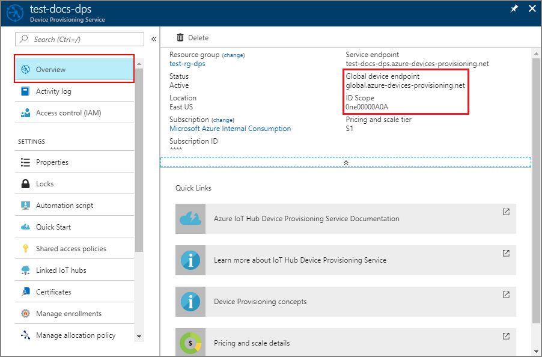

---
title: Provision simulated X.509 device to Azure IoT Hub using Node.js
description: Create and provision a simulated X.509 device using Node.js device SDK for Azure IoT Hub Device Provisioning Service (DPS).This quickstart uses individual enrollments.
author: wesmc7777
ms.author: wesmc
ms.date: 11/08/2018
ms.topic: quickstart
ms.service: iot-dps
services: iot-dps 
ms.devlang: nodejs
ms.custom: mvc
---

# Quickstart: Create and provision an X.509 simulated device using Node.js device SDK for IoT Hub Device Provisioning Service

[!INCLUDE [iot-dps-selector-quick-create-simulated-device-x509](../../includes/iot-dps-selector-quick-create-simulated-device-x509.md)]

In this quickstart, you create a simulated X.509 device on a Windows computer. You use device sample Node.js code to connect this simulated device with your IoT hub using an individual enrollment with the Device Provisioning Service (DPS).

## Prerequisites

- Review of [Auto-provisioning concepts](concepts-auto-provisioning.md).
- Completion of [Set up IoT Hub Device Provisioning Service with the Azure portal](./quick-setup-auto-provision.md).
- An Azure account with an active subscription. [Create one for free](https://azure.microsoft.com/free/?ref=microsoft.com&utm_source=microsoft.com&utm_medium=docs&utm_campaign=visualstudio).
- [Node.js v4.0+](https://nodejs.org).
- [Git](https://git-scm.com/download/).
- [OpenSSL](https://www.openssl.org/).

[!INCLUDE [IoT Device Provisioning Service basic](../../includes/iot-dps-basic.md)]

## Prepare the environment 

1. Complete the steps in the [Setup IoT Hub Device Provisioning Service with the Azure portal](./quick-setup-auto-provision.md) before you proceed.

2. Make sure you have [Node.js v4.0 or above](https://nodejs.org) installed on your machine.

3. Make sure [Git](https://git-scm.com/download/) is installed on your machine and is added to the environment variables accessible to the command window. 

4. Make sure [OpenSSL](https://www.openssl.org/) is installed on your machine and is added to the environment variables accessible to the command window. This library can either be built and installed from source or downloaded and installed from a [third party](https://wiki.openssl.org/index.php/Binaries) such as [this](https://sourceforge.net/projects/openssl/). 

    > [!NOTE]
    > If you have already created your _root_, _intermediate_, and/or _leaf_ X.509 certificates, you may skip this step and all following steps regarding certificate generation.
    >

## Create a self-signed X.509 device certificate and individual enrollment entry

In this section you, will use a self-signed X.509 certificate, it is important to keep in mind the following:

* Self-signed certificates are for testing only, and should not be used in production.
* The default expiration date for a self-signed certificate is one year.

You will use sample code from the [Azure IoT SDK for Node.js](https://github.com/Azure/azure-iot-sdk-node.git) to create the certificate to be used with the individual enrollment entry for the simulated device.

The Azure IoT Device Provisioning Service supports two types of enrollments:

- [Enrollment groups](concepts-service.md#enrollment-group): Used to enroll multiple related devices.
- [Individual enrollments](concepts-service.md#individual-enrollment): Used to enroll a single device.

This article demonstrates individual enrollments.

1. Open a command prompt. Clone the GitHub repo for the code samples:
    
    ```cmd/sh
    git clone https://github.com/Azure/azure-iot-sdk-node.git --recursive
    ```

2. Navigate to the certificate generator script and build the project. 

    ```cmd/sh
    cd azure-iot-sdk-node/provisioning/tools
    npm install
    ```

3. Create a _leaf_ X.509 certificate by running the script using your own _certificate-name_. The leaf certificate's common name becomes the [Registration ID](https://docs.microsoft.com/azure/iot-dps/concepts-device#registration-id) so be sure to only use lower-case alphanumerics and hyphens.

    ```cmd/sh
    node create_test_cert.js device {certificate-name}
    ```

4. Sign in to the [Azure portal](https://portal.azure.com), select the **All resources** button on the left-hand menu and open your Device Provisioning Service instance.

5. From the Device Provisioning Service menu, select **Manage enrollments**. Select **Individual Enrollments** tab and select the **Add individual enrollment** button at the top. 

6. In the **Add Enrollment** panel, enter the following information:
   - Select **X.509** as the identity attestation *Mechanism*.
   - Under the *Primary certificate .pem or .cer file*, choose *Select a file* to select the certificate file **{certificate-name}_cert.pem** created in the previous steps.  
   - Optionally, you may provide the following information:
     - Select an IoT hub linked with your provisioning service.
     - Enter a unique device ID. Make sure to avoid sensitive data while naming your device. 
     - Update the **Initial device twin state** with the desired initial configuration for the device.
     - Once complete, press the **Save** button. 

     [](./media/quick-create-simulated-device-x509-node/device-enrollment.png#lightbox)

     On successful enrollment, your X.509 device appears as **{certificatename}** under the *Registration ID* column in the *Individual Enrollments* tab. Note this value for later.

## Simulate the device

The [Azure IoT Hub Node.js Device SDK](https://github.com/Azure/azure-iot-sdk-node) provides an easy way to simulate a device. For further reading, see [Device concepts](https://docs.microsoft.com/azure/iot-dps/concepts-device).

1. In the Azure portal, select the **Overview** blade for your Device Provisioning service and note the **_GLobal Device Endpoint_** and **_ID Scope_** values.

     

2. Copy your _certificate_ and _key_ to the sample folder.

    ```cmd/sh
    copy .\{certificate-name}_cert.pem ..\device\samples\{certificate-name}_cert.pem
    copy .\{certificate-name}_key.pem ..\device\samples\{certificate-name}_key.pem
    ```

3. Navigate to the device test script and build the project. 

    ```cmd/sh
    cd ..\device\samples
    npm install
    ```

4. Edit the **register\_x509.js** file. Save the file after making the following changes.
    - Replace `provisioning host` with the **_Global Device Endpoint_** noted in **Step 1** above.
    - Replace `id scope` with the **_ID Scope_** noted in **Step 1** above. 
    - Replace `registration id` with the **_Registration ID_** noted in the previous section.
    - Replace `cert filename` and `key filename` with the files you copied in **Step 2** above. 

5. Execute the script and verify the device was provisioned successfully.

    ```cmd/sh
    node register_x509.js
    ```   

6. In the portal, navigate to the IoT hub linked to your provisioning service and open the **IoT devices** blade. On successful provisioning of the simulated X.509 device to the hub, its device ID appears on the **IoT devices** blade, with *STATUS* as **enabled**. You might need to press the **Refresh** button at the top if you already opened the blade prior to running the sample device application. 

     

    If you changed the *initial device twin state* from the default value in the enrollment entry for your device, it can pull the desired twin state from the hub and act accordingly. For more information, see [Understand and use device twins in IoT Hub](../iot-hub/iot-hub-devguide-device-twins.md).


## Clean up resources

If you plan to continue working on and exploring the device client sample, do not clean up the resources created in this quickstart. If you do not plan to continue, use the following steps to delete all resources created by this quickstart.

1. Close the device client sample output window on your machine.
2. From the left-hand menu in the Azure portal, select **All resources** and then select your Device Provisioning service. Open the **Manage Enrollments** blade for your service, and then select the **Individual Enrollments** tab. Select the check box next to the *REGISTRATION ID* of the device you enrolled in this quickstart, and press the **Delete** button at the top of the pane. 
3. From the left-hand menu in the Azure portal, select **All resources** and then select your IoT hub. Open the **IoT devices** blade for your hub, select the check box next to the *DEVICE ID* of the device you registered in this quickstart, and then press the **Delete** button at the top of the pane.


## Next steps

In this quickstart, you’ve created a simulated X.509 device and provisioned it to your IoT hub using the Azure IoT Hub Device Provisioning Service on the portal. To learn how to enroll your X.509 device programmatically, continue to the quickstart for programmatic enrollment of X.509 devices. 

> [!div class="nextstepaction"]
> [Azure quickstart - Enroll X.509 devices to Azure IoT Hub Device Provisioning Service](quick-enroll-device-x509-node.md)
