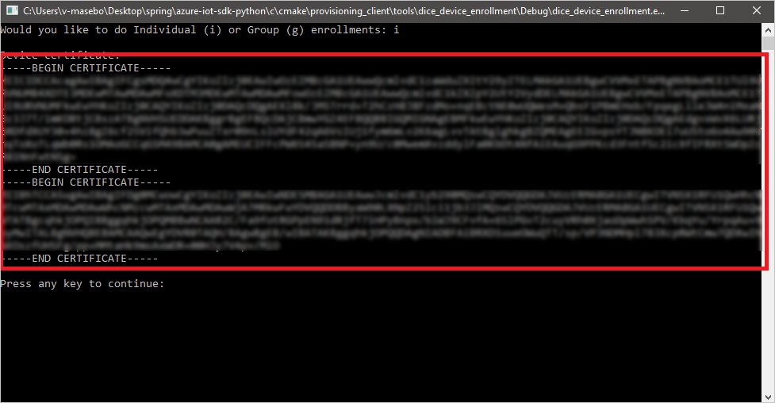
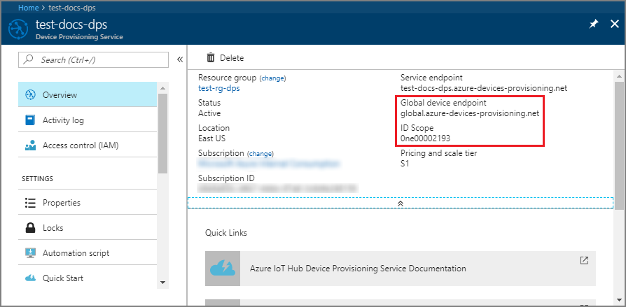
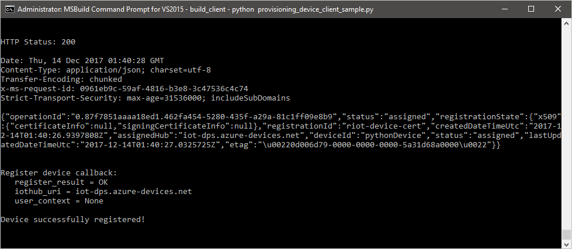
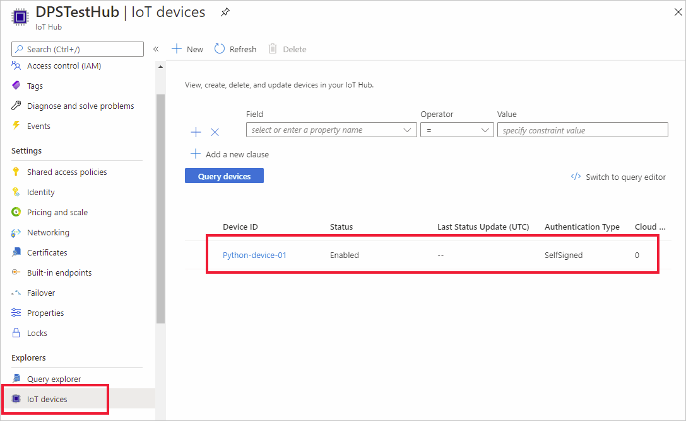

# Create and provision a simulated X.509 device using Python device SDK for IoT Hub Device Provisioning Service
[!INCLUDE [iot-dps-selector-quick-create-simulated-device-x509](../../includes/iot-dps-selector-quick-create-simulated-device-x509.md)]

These steps show how to simulate an X.509 device on your development machine running Windows OS, and use a Python code sample to connect this simulated device with the Device Provisioning Service and your IoT hub. 

If you're unfamiliar with the process of autoprovisioning, be sure to also review [Auto-provisioning concepts](concepts-auto-provisioning.md). Also make sure you've completed the steps in [Set up IoT Hub Device Provisioning Service with the Azure portal](./quick-setup-auto-provision.md) before continuing. 

The Azure IoT Device Provisioning Service supports two types of enrollments:
- [Enrollment groups](concepts-service.md#enrollment-group): Used to enroll multiple related devices.
- [Individual Enrollments](concepts-service.md#individual-enrollment): Used to enroll a single device.

This article will demonstrate individual enrollments.

[!INCLUDE [IoT Device Provisioning Service basic](../../includes/iot-dps-basic.md)]

## Prepare the environment 

1. Make sure you have installed either [Visual Studio](https://visualstudio.microsoft.com/vs/) 2015 or later, with the 'Desktop development with C++' workload enabled for your Visual Studio installation.

2. Download and install the [CMake build system](https://cmake.org/download/).

3. Make sure `git` is installed on your machine and is added to the environment variables accessible to the command window. See [Software Freedom Conservancy's Git client tools](https://git-scm.com/download/) for the latest version of `git` tools to install, which includes the **Git Bash**, the command-line app that you can use to interact with your local Git repository. 

4. Open a command prompt or Git Bash. Clone the GitHub repo for device simulation code sample.
    
    ```cmd/sh
    git clone https://github.com/Azure/azure-iot-sdk-python.git --recursive
    ```

5. Create a folder in your local copy of this GitHub repo for CMake build process. 

    ```cmd/sh
    cd azure-iot-sdk-python/c
    mkdir cmake
    cd cmake
    ```

6. Run the following command to create the Visual Studio solution for the provisioning client.

    ```cmd/sh
    cmake -Duse_prov_client:BOOL=ON ..
    ```


## Create a self-signed X.509 device certificate and individual enrollment entry

In this section you, will use a self-signed X.509 certificate. It is important to keep in mind the following points:

* Self-signed certificates are for testing only, and should not be used in production.
* The default expiration date for a self-signed certificate is one year.

You will use sample code from the Azure IoT C SDK to create the certificate to be used with the individual enrollment entry for the simulated device.

1. Open the solution generated in the *cmake* folder named `azure_iot_sdks.sln`, and build it in Visual Studio.

2. Right-click the **dice\_device\_enrollment** project under the **Provision\_Tools** folder, and select **Set as Startup Project**. Run the solution. 

3. In the output window, enter `i` for individual enrollment when prompted. The output window displays a locally generated X.509 certificate for your simulated device. 
    
    Copy the first certificate to clipboard. Begin with the first occurrence of:
    
        -----BEGIN CERTIFICATE----- 
        
    End you copying after the first occurrence of:
    
        -----END CERTIFICATE-----
        
    Make sure to include both of those lines as well. 

    
 
4. Create a file named **_X509testcertificate.pem_** on your Windows machine, open it in an editor of your choice, and copy the clipboard contents to this file. Save the file. 

5. Sign in to the Azure portal, click on the **All resources** button on the left-hand menu and open your provisioning service.

6. On the Device Provisioning Service summary blade, select **Manage enrollments**. Select **Individual Enrollments** tab and click the **Add individual enrollment** button at the top. 

7. Under the **Add Enrollment** panel, enter the following information:
   - Select **X.509** as the identity attestation *Mechanism*.
   - Under the *Primary certificate .pem or .cer file*, click *Select a file* to select the certificate file **X509testcertificate.pem** created in the previous steps.
   - Optionally, you may provide the following information:
     - Select an IoT hub linked with your provisioning service.
     - Enter a unique device ID. Make sure to avoid sensitive data while naming your device. 
     - Update the **Initial device twin state** with the desired initial configuration for the device.
   - Once complete, click the **Save** button. 

     [](./media/python-quick-create-simulated-device-x509/device-enrollment.png#lightbox)

   Upon successful enrollment, your X.509 device appears as **riot-device-cert** under the *Registration ID* column in the *Individual Enrollments* tab. 

## Simulate the device

1. On the Device Provisioning Service summary blade, select **Overview**. Note your _ID Scope_ and _Global Service Endpoint_.

    

2. Download and install [Python 2.x or 3.x](https://www.python.org/downloads/). Make sure to use the 32-bit or 64-bit installation as required by your setup. When prompted during the installation, make sure to add Python to your platform-specific environment variables. If you are using Python 2.x, you may need to [install or upgrade *pip*, the Python package management system](https://pip.pypa.io/en/stable/installing/).
    
    > [!NOTE] 
    > If you are using Windows, also install the [Visual C++ Redistributable for Visual Studio 2015](https://www.microsoft.com/download/confirmation.aspx?id=48145). The pip packages require the redistributable in order to load/execute the C DLLs.

3. Follow [these instructions](https://github.com/Azure/azure-iot-sdk-python/blob/master/doc/python-devbox-setup.md) to build the Python packages.

   > [!NOTE]
   > If using `pip` make sure to also install the `azure-iot-provisioning-device-client` package.

4. Navigate to the samples folder.

    ```cmd/sh
    cd azure-iot-sdk-python/provisioning_device_client/samples
    ```

5. Using your Python IDE, edit the python script named **provisioning\_device\_client\_sample.py**. Modify the _GLOBAL\_PROV\_URI_ and _ID\_SCOPE_ variables to the values noted previously.

    ```python
    GLOBAL_PROV_URI = "{globalServiceEndpoint}"
    ID_SCOPE = "{idScope}"
    SECURITY_DEVICE_TYPE = ProvisioningSecurityDeviceType.X509
    PROTOCOL = ProvisioningTransportProvider.HTTP
    ```

6. Run the sample. 

    ```cmd/sh
    python provisioning_device_client_sample.py
    ```

7. The application will connect, enroll the device, and display a successful enrollment message.

    

8. In the portal, navigate to the IoT hub linked to your provisioning service and open the **Device Explorer** blade. On successful provisioning of the simulated X.509 device to the hub, its device ID appears on the **Device Explorer** blade, with *STATUS* as **enabled**. You might need to click the **Refresh** button at the top if you already opened the blade prior to running the sample device application. 

     

> [!NOTE]
> If you changed the *initial device twin state* from the default value in the enrollment entry for your device, it can pull the desired twin state from the hub and act accordingly. For more information, see [Understand and use device twins in IoT Hub](../iot-hub/iot-hub-devguide-device-twins.md).
>

## Clean up resources

If you plan to continue working on and exploring the device client sample, do not clean up the resources created in this Quickstart. If you do not plan to continue, use the following steps to delete all resources created by this Quickstart.

1. Close the device client sample output window on your machine.
2. From the left-hand menu in the Azure portal, click **All resources** and then select your Device Provisioning service. Open the **Manage Enrollments** blade for your service, and then click the **Individual Enrollments** tab. Select the *REGISTRATION ID* of the device you enrolled in this Quickstart, and click the **Delete** button at the top. 
3. From the left-hand menu in the Azure portal, click **All resources** and then select your IoT hub. Open the **IoT Devices** blade for your hub, select the *DEVICE ID* of the device you registered in this Quickstart, and then click **Delete** button at the top.

## Next steps

In this Quickstart, you’ve created a simulated X.509 device on your Windows machine and provisioned it to your IoT hub using the Azure IoT Hub Device Provisioning Service on the portal. To learn how to enroll your X.509 device programmatically, continue to the Quickstart for programmatic enrollment of X.509 devices. 

> [!div class="nextstepaction"]
> [Azure Quickstart - Enroll X.509 devices to Azure IoT Hub Device Provisioning Service](quick-enroll-device-x509-python.md)
