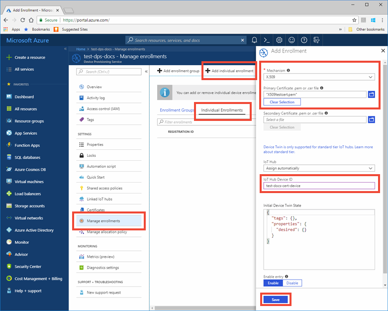

# Create and provision an X.509 simulated device using C device SDK for IoT Hub Device Provisioning Service
[!INCLUDE [iot-dps-selector-quick-create-simulated-device-x509](../../includes/iot-dps-selector-quick-create-simulated-device-x509.md)]

These steps show how to simulate an X.509 device on your development machine running Windows OS, and use a code sample to connect this simulated device with the Device Provisioning Service and your IoT hub. 

If you're unfamiliar with the process of auto-provisioning, be sure to also review [Auto-provisioning concepts](concepts-auto-provisioning.md). Also make sure you've completed the steps in [Set up IoT Hub Device Provisioning Service with the Azure portal](./quick-setup-auto-provision.md) before continuing. 

[!INCLUDE [IoT DPS basic](../../includes/iot-dps-basic.md)]

<a id="setupdevbox"></a>

## Prepare the development environment 

1. Make sure you have either Visual Studio 2015 or [Visual Studio 2017](https://www.visualstudio.com/vs/) installed on your machine. You must have ['Desktop development with C++'](https://www.visualstudio.com/vs/support/selecting-workloads-visual-studio-2017/) workload enabled for your Visual Studio installation.

2. Download and install the [CMake build system](https://cmake.org/download/). It is important that the Visual Studio with 'Desktop development with C++' workload is installed on your machine, **before** the `cmake` installation. 

3. Make sure `git` is installed on your machine and is added to the environment variables accessible to the command window. See [Software Freedom Conservancy's Git client tools](https://git-scm.com/download/) for the latest version of `git` tools to install, which includes the **Git Bash**, the command-line app that you can use to interact with your local Git repository. 

4. Open a command prompt or Git Bash. Clone the GitHub repo for device simulation code sample:
    
    ```cmd
    git clone https://github.com/Azure/azure-iot-sdk-c.git --recursive
    ```

5. Create a folder in your local copy of this GitHub repo for CMake build process. 

    ```cmd
    cd azure-iot-sdk-c
    mkdir cmake
    cd cmake
    ```

6. Run the following command to create the Visual Studio solution for the provisioning client.

    ```cmd
    cmake -Duse_prov_client:BOOL=ON ..
    ```
    
    If `cmake` does not find your C++ compiler, you might get build errors while running the above command. If that happens, try running this command in the [Visual Studio command prompt](https://docs.microsoft.com/dotnet/framework/tools/developer-command-prompt-for-vs). 


<a id="portalenroll"></a>

## Create a self-signed X.509 device certificate and individual enrollment entry

1. Open the solution generated in the *cmake* folder named `azure_iot_sdks.sln`, and build it in Visual Studio.

2. Right-click the **dice\_device\_enrollment** project under the **Provision\_Tools** folder, and select **Set as Startup Project**. Run the solution. In the output window, enter **i** for individual enrollment when prompted. The output window displays a locally generated X.509 certificate for your simulated device. Copy to clipboard the output starting from *-----BEGIN CERTIFICATE-----* and ending at the first *-----END CERTIFICATE-----*, making sure to include both of these lines as well. Note that you need only the first certificate from the output window.
 
3. Create a file named **_X509testcert.pem_** on your Windows machine, open it in an editor of your choice, and copy the clipboard contents to this file. Save the file. 

4. Log in to the Azure portal, click on the **All resources** button on the left-hand menu and open your provisioning service.

5. On the Device Provisioning Service summary blade, select **Manage enrollments**. Select **Individual Enrollments** tab and click the **Add** button at the top. 

6. Under the **Add enrollment** panel, enter the following information:
    - Select **X.509** as the identity attestation *Mechanism*.
    - Under the *Primary certificate .pem or .cer file*, click *Select a file* to select the certificate file **X509testcert.pem** created in the previous steps.
    - Optionally, you may provide the following information:
      - Select an IoT hub linked with your provisioning service.
      - Enter a unique device ID. Make sure to avoid sensitive data while naming your device. 
      - Update the **Initial device twin state** with the desired initial configuration for the device.
    - Once complete, click the **Save** button. 

    [](./media/quick-create-simulated-device-x509/individual-enrollment.png#lightbox)

   On successful enrollment, your X.509 device appears as **riot-device-cert** under the *Registration ID* column in the *Individual Enrollments* tab. 


<a id="firstbootsequence"></a>

## Simulate first boot sequence for the device

1. In the Azure portal, select the **Overview** blade for your Device Provisioning service and note down the **_ID Scope_** value.

     

2. In Visual Studio on your machine, navigate to the sample project named **prov\_dev\_client\_sample** under the **Provision\_Samples** folder, and open the file **prov\_dev\_client\_sample.c**.

3. Assign the _ID Scope_ value to the `id_scope` variable. 

    ```c
    static const char* id_scope = "[ID Scope]";
    ```

4. In the **main()** function in the same file, make sure the **SECURE_DEVICE_TYPE** is set to X.509.

    ```c
    SECURE_DEVICE_TYPE hsm_type;
    hsm_type = SECURE_DEVICE_TYPE_X509;
    ```

   Comment out or delete the statement `hsm_type = SECURE_DEVICE_TYPE_TPM;` that may be present. 

5. Right-click the **prov\_dev\_client\_sample** project and select **Set as Startup Project**. Run the sample. Notice the messages that simulate the device booting and connecting to the Device Provisioning Service to get your IoT hub information. Look for message indicating successful registration with your hub: *Registration Information received from service: yourhuburl!*. Close the window when prompted.

6. In the portal, navigate to the IoT hub linked to your provisioning service and open the **IoT Devices** blade. On successful provisioning of the simulated X.509 device to the hub, its device ID appears on the **IoT Devices** blade, with *STATUS* as **enabled**. Note that you might need to click the **Refresh** button at the top if you already opened the blade prior to running the sample device application. 

     

    If you changed the *initial device twin state* from the default value in the enrollment entry for your device, it can pull the desired twin state from the hub and act accordingly. For more information, see [Understand and use device twins in IoT Hub](../iot-hub/iot-hub-devguide-device-twins.md).


> [!IMPORTANT]
> You can also do a *Group Enrollment* of X.509 devices, by making the following modifications to the steps in this Quickstart:
>    1. Configure your Windows machine to use **OpenSSL** library instead of the default **SChannel** by following the section on **WebSockets** in the [
Set up a Windows development environment](https://github.com/Azure/azure-iot-sdk-c/blob/master/doc/devbox_setup.md#windows) guide. Note that Linux machines use OpenSSL by default. 
>    2. In step 2 of the [Create a device enrollment entry in the Device Provisioning Service](#portalenroll) section above, enter **g** for group enrollment.
>    3. In steps 4 and 5 of the [same section](#portalenroll), select **Enrollment Groups** and enter the required information for the group entry.  
>

## Clean up resources

If you plan to continue working on and exploring the device client sample, do not clean up the resources created in this Quickstart. If you do not plan to continue, use the following steps to delete all resources created by this Quickstart.

1. Close the device client sample output window on your machine.
1. From the left-hand menu in the Azure portal, click **All resources** and then select your Device Provisioning service. Open the **Manage Enrollments** blade for your service, and then click the **Individual Enrollments** tab. Select the *REGISTRATION ID* of the device you enrolled in this Quickstart, and click the **Delete** button at the top. 
1. From the left-hand menu in the Azure portal, click **All resources** and then select your IoT hub. Open the **IoT Devices** blade for your hub, select the *DEVICE ID* of the device you registered in this Quickstart, and then click **Delete** button at the top.

## Next steps

In this Quickstart, you’ve created a simulated X.509 device on your Windows machine and provisioned it to your IoT hub using the Azure IoT Hub Device Provisioning Service on the portal. To learn how to enroll your X.509 device programmatically, continue to the Quickstart for programmatic enrollment of X.509 devices. 

> [!div class="nextstepaction"]
> [Azure Quickstart - Enroll X.509 devices to Azure IoT Hub Device Provisioning Service](quick-enroll-device-x509-java.md)
