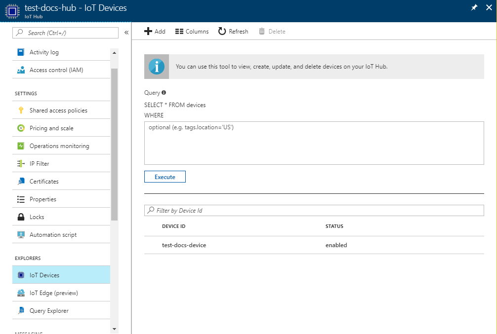

# Quickstart: Provision an X.509 simulated device using the Azure IoT C SDK

[!INCLUDE [iot-dps-selector-quick-create-simulated-device-x509](../../includes/iot-dps-selector-quick-create-simulated-device-x509.md)]

In this quickstart, you will learn how to create and run an X.509 device simulator on a Windows development machine. You will configure this simulated device to be assigned to an IoT hub using an enrollment with a Device Provisioning Service instance. Sample code from the [Azure IoT C SDK](https://github.com/Azure/azure-iot-sdk-c) will be used to simulate a boot sequence for the device. The device will be recognized based on the enrollment with the provisioning service and assigned to the IoT hub.

If you're unfamiliar with the process of autoprovisioning, review [Auto-provisioning concepts](concepts-auto-provisioning.md). Also, make sure you've completed the steps in [Set up IoT Hub Device Provisioning Service with the Azure portal](./quick-setup-auto-provision.md) before continuing with this quickstart. 

The Azure IoT Device Provisioning Service supports two types of enrollments:
- [Enrollment groups](concepts-service.md#enrollment-group): Used to enroll multiple related devices.
- [Individual Enrollments](concepts-service.md#individual-enrollment): Used to enroll a single device.

This article will demonstrate individual enrollments.

[!INCLUDE [quickstarts-free-trial-note](../../includes/quickstarts-free-trial-note.md)]


## Prerequisites

* [Visual Studio](https://visualstudio.microsoft.com/vs/) 2015 or later with the ['Desktop development with C++'](https://www.visualstudio.com/vs/support/selecting-workloads-visual-studio-2017/) workload enabled.
* Latest version of [Git](https://git-scm.com/download/) installed.


<a id="setupdevbox"></a>

## Prepare a development environment for the Azure IoT C SDK

In this section, you will prepare a development environment used to build the [Azure IoT C SDK](https://github.com/Azure/azure-iot-sdk-c) which include the sample code for the X.509 boot sequence.

1. Download the [CMake build system](https://cmake.org/download/).

    It is important that the Visual Studio prerequisites (Visual Studio and the 'Desktop development with C++' workload) are installed on your machine, **before** starting the `CMake` installation. Once the prerequisites are in place, and the download is verified, install the CMake build system.

2. Open a command prompt or Git Bash shell. Execute the following command to clone the [Azure IoT C SDK](https://github.com/Azure/azure-iot-sdk-c) GitHub repository:
    
    ```cmd/sh
    git clone https://github.com/Azure/azure-iot-sdk-c.git --recursive
    ```
    You should expect this operation to take several minutes to complete.


3. Create a `cmake` subdirectory in the root directory of the git repository, and navigate to that folder. 

    ```cmd/sh
    cd azure-iot-sdk-c
    mkdir cmake
    cd cmake
    ```

4. The code sample uses an X.509 certificate to provide attestation via X.509 authentication. Run the following command, which builds a version of the SDK specific to your development client platform. A Visual Studio solution for the simulated device will be generated in the `cmake` directory. 

    ```cmd
    cmake -Duse_prov_client:BOOL=ON ..
    ```
    
    If `cmake` does not find your C++ compiler, you might get build errors while running the above command. If that happens, try running this command in the [Visual Studio command prompt](https://docs.microsoft.com/dotnet/framework/tools/developer-command-prompt-for-vs). 

    Once the build succeeds, the last few output lines will look similar to the following output:

    ```cmd/sh
    $ cmake -Duse_prov_client:BOOL=ON ..
    -- Building for: Visual Studio 15 2017
    -- Selecting Windows SDK version 10.0.16299.0 to target Windows 10.0.17134.
    -- The C compiler identification is MSVC 19.12.25835.0
    -- The CXX compiler identification is MSVC 19.12.25835.0

    ...

    -- Configuring done
    -- Generating done
    -- Build files have been written to: E:/IoT Testing/azure-iot-sdk-c/cmake
    ```


<a id="portalenroll"></a>

## Create a self-signed X.509 device certificate

In this section you, will use a self-signed X.509 certificate, it is important to keep in mind the following points:

* Self-signed certificates are for testing only, and should not be used in production.
* The default expiration date for a self-signed certificate is one year.

You will use sample code from the Azure IoT C SDK to create the certificate to be used with the individual enrollment entry for the simulated device.

1. Launch Visual Studio and open the new solution file named `azure_iot_sdks.sln`. This solution file is located in the `cmake` folder you previously created in the root of the azure-iot-sdk-c git repository.

2. On the Visual Studio menu, select **Build** > **Build Solution** to build all projects in the solution.

3. In Visual Studio's *Solution Explorer* window, navigate to the **Provision\_Tools** folder. Right-click the **dice\_device\_enrollment** project and select **Set as Startup Project**. 

4. On the Visual Studio menu, select **Debug** > **Start without debugging** to run the solution. In the output window, enter **i** for individual enrollment when prompted. 

    The output window displays a locally generated self-signed X.509 certificate for your simulated device. Copy the output to clipboard, starting from **-----BEGIN CERTIFICATE-----** and ending with the first **-----END CERTIFICATE-----**, making sure to include both of these lines as well. You need only the first certificate from the output window.
 
5. Using a text editor, save the certificate to a new file named **_X509testcert.pem_**. 


## Create a device enrollment entry in the portal

1. Sign in to the Azure portal, click on the **All resources** button on the left-hand menu and open your Device Provisioning service.

2. Select the **Manage enrollments** tab, and then click the **Add individual enrollment** button at the top. 

3. On **Add Enrollment**, enter the following information, and click the **Save** button.

    - **Mechanism:** Select **X.509** as the identity attestation *Mechanism*.
    - **Primary certificate .pem or .cer file:** Click **Select a file** to select the certificate file, X509testcert.pem, you created earlier.
    - **IoT Hub Device ID:** Enter **test-docs-cert-device** to give the device an ID.

      [](./media/quick-create-simulated-device-x509/device-enrollment.png#lightbox)

      On successful enrollment, your X.509 device appears as **riot-device-cert** under the *Registration ID* column in the *Individual Enrollments* tab. 


<a id="firstbootsequence"></a>

## Simulate first boot sequence for the device

In this section, update the sample code to send the device's boot sequence to your Device Provisioning Service instance. This boot sequence will cause the device to be recognized and assigned to an IoT hub linked to the Device Provisioning Service instance.


1. In the Azure portal, select the **Overview** tab for your Device Provisioning service and note down the **_ID Scope_** value.

     

2. In Visual Studio's *Solution Explorer* window, navigate to the **Provision\_Samples** folder. Expand the sample project named **prov\_dev\_client\_sample**. Expand **Source Files**, and open **prov\_dev\_client\_sample.c**.

3. Find the `id_scope` constant, and replace the value with your **ID Scope** value that you copied earlier. 

    ```c
    static const char* id_scope = "0ne00002193";
    ```

4. Find the definition for the `main()` function in the same file. Make sure the `hsm_type` variable is set to `SECURE_DEVICE_TYPE_X509` instead of `SECURE_DEVICE_TYPE_TPM` as shown below.

    ```c
    SECURE_DEVICE_TYPE hsm_type;
    //hsm_type = SECURE_DEVICE_TYPE_TPM;
    hsm_type = SECURE_DEVICE_TYPE_X509;
    ```

5. Right-click the **prov\_dev\_client\_sample** project and select **Set as Startup Project**. 

6. On the Visual Studio menu, select **Debug** > **Start without debugging** to run the solution. In the prompt to rebuild the project, click **Yes**, to rebuild the project before running.

    The following output is an example of the provisioning device client sample successfully booting up, and connecting to the provisioning Service instance to get IoT hub information and registering:

    ```cmd
    Provisioning API Version: 1.2.7

    Registering... Press enter key to interrupt.

    Provisioning Status: PROV_DEVICE_REG_STATUS_CONNECTED
    Provisioning Status: PROV_DEVICE_REG_STATUS_ASSIGNING
    Provisioning Status: PROV_DEVICE_REG_STATUS_ASSIGNING

    Registration Information received from service: 
    test-docs-hub.azure-devices.net, deviceId: test-docs-cert-device    
    ```

7. In the portal, navigate to the IoT hub linked to your provisioning service and click the **IoT Devices** tab. On successful provisioning of the simulated X.509 device to the hub, its device ID appears on the **IoT Devices** blade, with *STATUS* as **enabled**. You might need to click the **Refresh** button at the top. 

     


## Clean up resources

If you plan to continue working on and exploring the device client sample, do not clean up the resources created in this Quickstart. If you do not plan to continue, use the following steps to delete all resources created by this Quickstart.

1. Close the device client sample output window on your machine.
1. From the left-hand menu in the Azure portal, click **All resources** and then select your Device Provisioning service. Open **Manage Enrollments** for your service, and then click the **Individual Enrollments** tab. Select the *REGISTRATION ID* of the device you enrolled in this Quickstart, and click the **Delete** button at the top. 
1. From the left-hand menu in the Azure portal, click **All resources** and then select your IoT hub. Open **IoT Devices** for your hub, select the *DEVICE ID* of the device you registered in this Quickstart, and then click **Delete** button at the top.

## Next steps

In this Quickstart, you’ve created a simulated X.509 device on your Windows machine and provisioned it to your IoT hub using the Azure IoT Hub Device Provisioning Service on the portal. To learn how to enroll your X.509 device programmatically, continue to the Quickstart for programmatic enrollment of X.509 devices. 

> [!div class="nextstepaction"]
> [Azure Quickstart - Enroll X.509 devices to Azure IoT Hub Device Provisioning Service](quick-enroll-device-x509-java.md)
