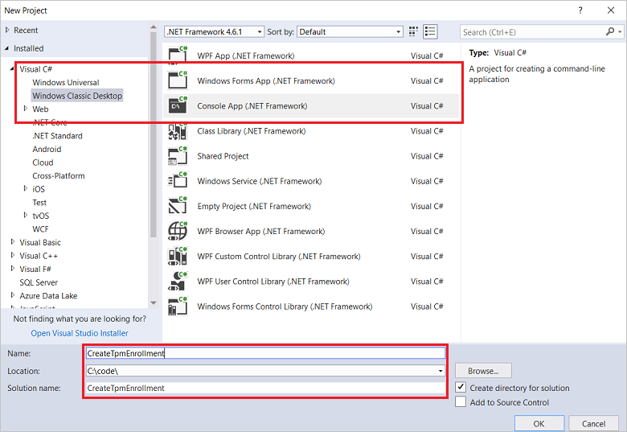
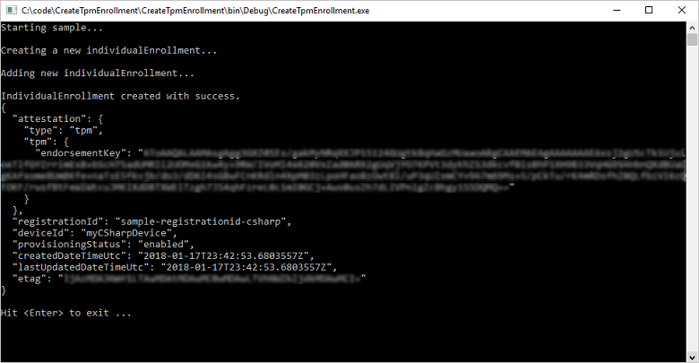
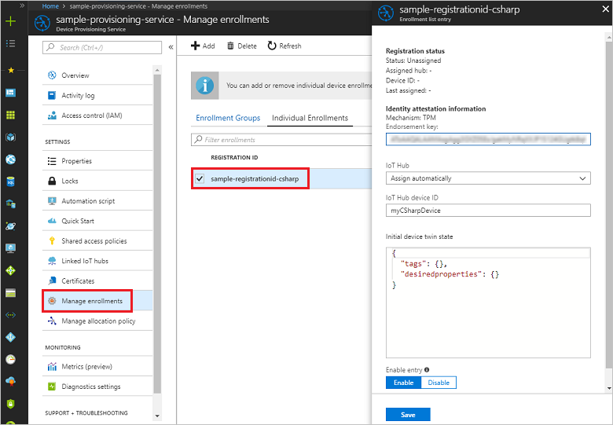

 
# Enroll TPM device to IoT Hub Device Provisioning Service using C# service SDK

[!INCLUDE [iot-dps-selector-quick-enroll-device-tpm](../../includes/iot-dps-selector-quick-enroll-device-tpm.md)]


These steps show how to programmatically create an individual enrollment for a TPM device in the Azure IoT Hub Device Provisioning Service using the [C# Service SDK](https://github.com/Azure/azure-iot-sdk-csharp) and a sample C# .NET Core application. You can optionally enroll a simulated TPM device to the provisioning service using this individual enrollment entry. Although these steps work on both Windows and Linux machines, this article uses a Windows development machine.

## Prepare the development environment

1. Make sure you have [Visual Studio 2017](https://www.visualstudio.com/vs/) installed on your machine. 
2. Make sure you have the [.Net Core SDK](https://www.microsoft.com/net/download/windows) installed on your machine. 
3. Make sure to complete the steps in [Set up the IoT Hub Device Provisioning Service with the Azure portal](./quick-setup-auto-provision.md) before you proceed.
4. (Optional) If you want to enroll a simulated device at the end of this Quickstart, follow the steps in [Create and provision a simulated TPM device using C# device SDK](quick-create-simulated-device-tpm-csharp.md) up to the step where you get an endorsement key for the device. Note down the endorsement key, registration ID, and, optionally, the device ID, you need to use them later in this Quickstart. **Do not follow the steps to create an individual enrollment using the Azure portal.**

## Get the connection string for your provisioning service

For the sample in this Quickstart, you need the connection string for your provisioning service.
1. Log in to the Azure portal, click on the **All resources** button on the left-hand menu and open your Device Provisioning Service. 
2. Click **Shared access policies**, then click the access policy you want to use to open its properties. In the **Access Policy** window, copy and note down the primary key connection string. 

    

## Create the individual enrollment sample 

The steps in this section show how to create a .NET Core console app that adds an individual enrollment for a TPM device to your provisioning service. With some modification, you can also follow these steps to create a [Windows IoT Core](https://developer.microsoft.com/en-us/windows/iot) console app to add the individual enrollment. To learn more about developing with IoT Core, see the [Windows IoT Core developer documentation](https://docs.microsoft.com/windows/iot-core/).
1. In Visual Studio, add a Visual C# .NET Core Console App project to a new solution by using the **Console App (.NET Core)** project template. Make sure the .NET Framework version is 4.5.1 or later. Name the project **CreateTpmEnrollment**.

    

2. In Solution Explorer, right-click the **CreateTpmEnrollment** project, and then click **Manage NuGet Packages**.
3. In the **NuGet Package Manager** window, select **Browse**, search for **Microsoft.Azure.Devices.Provisioning.Service**, select **Install** to install the **Microsoft.Azure.Devices.Provisioning.Service** package, and accept the terms of use. This procedure downloads, installs, and adds a reference to the [Azure IoT Provisioning Service Client SDK](https://www.nuget.org/packages/Microsoft.Azure.Devices.Provisioning.Service/) NuGet package and its dependencies.

    

4. Add the following `using` statements after the other `using` statements at the top of the **Program.cs** file:
   
   ```csharp
   using System.Threading.Tasks;
   using Microsoft.Azure.Devices.Provisioning.Service;
   ```
    
5. Add the following fields to the **Program** class.  
   - Replace the **ProvisioningConnectionString** placeholder value with the connection string of the provisioning service that you want to create the enrollment for.
   - You may optionally change the registration ID, endorsement key, device ID, and provisioning status. 
   - If you are using this Quickstart together with the [Create and provision a simulated TPM device using C# device SDK](quick-create-simulated-device-tpm-csharp.md) Quickstart to provision a simulated device, replace the endorsement key and registration ID with the values that you noted down in that Quickstart. You can replace the device ID with the value suggested in that Quickstart, use your own value, or use the default value in this sample.
        
   ```csharp
   private static string ProvisioningConnectionString = "{Your provisioning service connection string}";
   private const string RegistrationId = "sample-registrationid-csharp";
   private const string TpmEndorsementKey =
       "AToAAQALAAMAsgAgg3GXZ0SEs/gakMyNRqXXJP1S124GUgtk8qHaGzMUaaoABgCAAEMAEAgAAAAAAAEAxsj2gUS" +
       "cTk1UjuioeTlfGYZrrimExB+bScH75adUMRIi2UOMxG1kw4y+9RW/IVoMl4e620VxZad0ARX2gUqVjYO7KPVt3d" +
       "yKhZS3dkcvfBisBhP1XH9B33VqHG9SHnbnQXdBUaCgKAfxome8UmBKfe+naTsE5fkvjb/do3/dD6l4sGBwFCnKR" +
       "dln4XpM03zLpoHFao8zOwt8l/uP3qUIxmCYv9A7m69Ms+5/pCkTu/rK4mRDsfhZ0QLfbzVI6zQFOKF/rwsfBtFe" +
       "WlWtcuJMKlXdD8TXWElTzgh7JS4qhFzreL0c1mI0GCj+Aws0usZh7dLIVPnlgZcBhgy1SSDQMQ==";
       
   // Optional parameters
   private const string OptionalDeviceId = "myCSharpDevice";
   private const ProvisioningStatus OptionalProvisioningStatus = ProvisioningStatus.Enabled;
   ```
    
6. Add the following method to the **Program** class.  This code creates individual enrollment entry and then calls the **CreateOrUpdateIndividualEnrollmentAsync** method on the **ProvisioningServiceClient** to add the individual enrollment to the provisioning service.
   
   ```csharp
   public static async Task RunSample()
   {
       Console.WriteLine("Starting sample...");

       using (ProvisioningServiceClient provisioningServiceClient =
               ProvisioningServiceClient.CreateFromConnectionString(ProvisioningConnectionString))
       {
           #region Create a new individualEnrollment config
           Console.WriteLine("\nCreating a new individualEnrollment...");
           Attestation attestation = new TpmAttestation(TpmEndorsementKey);
           IndividualEnrollment individualEnrollment =
                   new IndividualEnrollment(
                           RegistrationId,
                           attestation);

           // The following parameters are optional. Remove them if you don't need them.
           individualEnrollment.DeviceId = OptionalDeviceId;
           individualEnrollment.ProvisioningStatus = OptionalProvisioningStatus;
           #endregion

           #region Create the individualEnrollment
           Console.WriteLine("\nAdding new individualEnrollment...");
           IndividualEnrollment individualEnrollmentResult =
               await provisioningServiceClient.CreateOrUpdateIndividualEnrollmentAsync(individualEnrollment).ConfigureAwait(false);
           Console.WriteLine("\nIndividualEnrollment created with success.");
           Console.WriteLine(individualEnrollmentResult);
           #endregion
        
       }
   }
   ```
       
7. Finally, replace the body of the **Main** method with the following lines:
   
   ```csharp
   RunSample().GetAwaiter().GetResult();
   Console.WriteLine("\nHit <Enter> to exit ...");
   Console.ReadLine();
   ```
        
8. Build the solution.

## Run the individual enrollment sample
  
1. Run the sample in Visual Studio to create the individual enrollment for your TPM device.
 
2. On successful creation, the command window displays the properties of the new individual enrollment.

    

3. To verify that the individual enrollment has been created, on the Device Provisioning Service summary blade in the Azure portal, select **Manage enrollments**, then select the **Individual Enrollments** tab. You should see a new enrollment entry that corresponds to the registration ID you used in the sample. Click the entry to verify the endorsement key and other properties for the entry.

    
 
4. (Optional) If you've been following the steps in the [Create and provision a simulated TPM device using C# device SDK](quick-create-simulated-device-tpm-csharp.md) Quickstart, you can continue with the remaining steps in that Quickstart to enroll your simulated device. Be sure to skip the steps to create an individual enrollment using the Azure portal.

## Clean up resources
If you plan to explore the C# service sample, do not clean up the resources created in this Quickstart. If you do not plan to continue, use the following steps to delete all resources created by this Quickstart.

1. Close the C# sample output window on your machine.
2. Navigate to your Device Provisioning service in the Azure portal, click **Manage enrollments**, and then select the **Individual Enrollments** tab. Select the *Registration ID* for the enrollment entry you created using this Quickstart, and click the **Delete** button at the top of the blade. 
3. If you followed the steps in the [Create and provision a simulated TPM device using C# device SDK](quick-create-simulated-device-tpm-csharp.md) Quickstart to create a simulated TPM device: 

    1. Close the TPM simulator window and the sample output window for the simulated device.
    2. In the Azure portal, navigate to the IoT Hub where your device was provisioned. In the left-hand menu under **Explorers**, click **IoT Devices**, select the check box next to your device, and then click **Delete** at the top of the window.
 
## Next steps
In this Quickstart, you’ve programmatically created an individual enrollment entry for a TPM device, and, optionally, created a TPM simulated device on your machine and provisioned it to your IoT hub using the Azure IoT Hub Device Provisioning Service. To learn about device provisioning in depth, continue to the tutorial for the Device Provisioning Service setup in the Azure portal. 
 
> [!div class="nextstepaction"]
> [Azure IoT Hub Device Provisioning Service tutorials](./tutorial-set-up-cloud.md)

