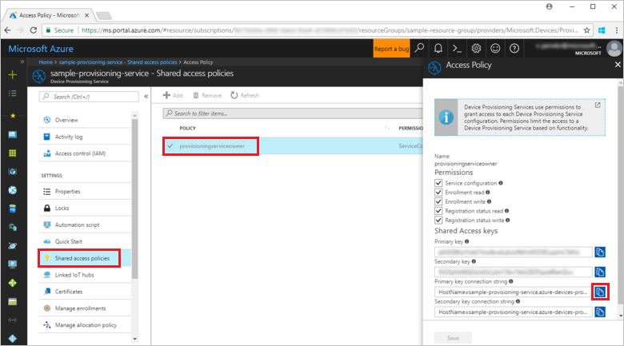
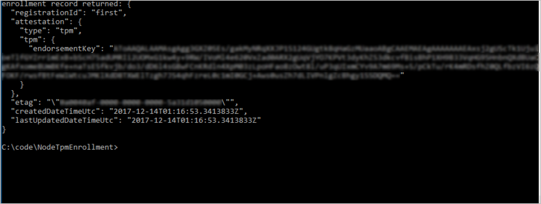

 
# Quickstart: Enroll TPM device to IoT Hub Device Provisioning Service using Node.js service SDK

[!INCLUDE [iot-dps-selector-quick-enroll-device-tpm](../../includes/iot-dps-selector-quick-enroll-device-tpm.md)]

In this quickstart, you programmatically create an individual enrollment for a TPM device in the Azure IoT Hub Device Provisioning Service using the Node.js Service SDK and a sample Node.js application. You can optionally enroll a simulated TPM device to the provisioning service using this individual enrollment entry.

## Prerequisites

- Completion of [Set up the IoT Hub Device Provisioning Service with the Azure portal](./quick-setup-auto-provision.md).
- An Azure account with an active subscription. [Create one for free](https://azure.microsoft.com/free/?ref=microsoft.com&utm_source=microsoft.com&utm_medium=docs&utm_campaign=visualstudio).
- [Node.js v4.0+](https://nodejs.org). This quickstart installs the [Node.js Service SDK](https://github.com/Azure/azure-iot-sdk-node) below.
- Endorsement key (optional). Follow the steps in [Create and provision a simulated device](quick-create-simulated-device.md) until you get the key. Do not create an individual enrollment using the Azure portal.

## Create the individual enrollment sample 

 
1. From a command window in your working folder, run:
  
    ```cmd\sh
    npm install azure-iot-provisioning-service
    ```  

2. Using a text editor, create a **create_individual_enrollment.js** file in your working folder. Add the following code to the file and save:

    ```
    'use strict';

    var provisioningServiceClient = require('azure-iot-provisioning-service').ProvisioningServiceClient;

    var serviceClient = provisioningServiceClient.fromConnectionString(process.argv[2]);
    var endorsementKey = process.argv[3];

    var enrollment = {
      registrationId: 'first',
      attestation: {
        type: 'tpm',
        tpm: {
          endorsementKey: endorsementKey
        }
      }
    };

    serviceClient.createOrUpdateIndividualEnrollment(enrollment, function(err, enrollmentResponse) {
      if (err) {
        console.log('error creating the individual enrollment: ' + err);
      } else {
        console.log("enrollment record returned: " + JSON.stringify(enrollmentResponse, null, 2));
      }
    });
    ```

## Run the individual enrollment sample
  
1. To run the sample, you need the connection string for your provisioning service. 
    1. Sign in to the Azure portal, select the **All resources** button on the left-hand menu and open your Device Provisioning service. 
    2. Select **Shared access policies**, then select the access policy you want to use to open its properties. In the **Access Policy** window, copy and note down the primary key connection string. 

        


2. You also need the endorsement key for your device. If you have followed the [Create and provision a simulated device](quick-create-simulated-device.md) quickstart to create a simulated TPM device, use the key created for that device. Otherwise, to create a sample individual enrollment, you can use the following endorsement key supplied with the [Node.js Service SDK](https://github.com/Azure/azure-iot-sdk-node):

    ```
    AToAAQALAAMAsgAgg3GXZ0SEs/gakMyNRqXXJP1S124GUgtk8qHaGzMUaaoABgCAAEMAEAgAAAAAAAEAxsj2gUScTk1UjuioeTlfGYZrrimExB+bScH75adUMRIi2UOMxG1kw4y+9RW/IVoMl4e620VxZad0ARX2gUqVjYO7KPVt3dyKhZS3dkcvfBisBhP1XH9B33VqHG9SHnbnQXdBUaCgKAfxome8UmBKfe+naTsE5fkvjb/do3/dD6l4sGBwFCnKRdln4XpM03zLpoHFao8zOwt8l/uP3qUIxmCYv9A7m69Ms+5/pCkTu/rK4mRDsfhZ0QLfbzVI6zQFOKF/rwsfBtFeWlWtcuJMKlXdD8TXWElTzgh7JS4qhFzreL0c1mI0GCj+Aws0usZh7dLIVPnlgZcBhgy1SSDQMQ==
    ```

3. To create an individual enrollment for your TPM device, run the following command (include the quotes around the command arguments):
 
     ```cmd\sh
     node create_individual_enrollment.js "<the connection string for your provisioning service>" "<endorsement key>"
     ```
 
3. On successful creation, the command window displays the properties of the new individual enrollment.

     

4. Verify that an individual enrollment has been created. In the Azure portal, on the Device Provisioning Service summary blade, select **Manage enrollments**. Select the **Individual Enrollments** tab and select the new enrollment entry (*first*) to verify the endorsement key and other properties for the entry.

     
 
Now that you've created an individual enrollment for a TPM device, if you want to enroll a simulated device, you can continue with the remaining steps in [Create and provision a simulated device](quick-create-simulated-device.md). Be sure to skip the steps to create an individual enrollment using the Azure portal in that quickstart.

## Clean up resources
If you plan to explore the Node.js service samples, do not clean up the resources created in this quickstart. If you do not plan to continue, use the following steps to delete all resources created by this quickstart.

1. Close the Node.js sample output window on your machine.
1. If you created a simulated TPM device, close the TPM simulator window.
2. Navigate to your Device Provisioning service in the Azure portal, select **Manage enrollments**, and then select the **Individual Enrollments** tab. Select the check box next to the *Registration ID* for the enrollment entry you created using this quickstart, and press the **Delete** button at the top of the pane. 
 
## Next steps
In this quickstart, you’ve programmatically created an individual enrollment entry for a TPM device, and, optionally, created a TPM simulated device on your machine and provisioned it to your IoT hub using the Azure IoT Hub Device Provisioning Service. To learn about device provisioning in depth, continue to the tutorial for the Device Provisioning Service setup in the Azure portal. 
 
> [!div class="nextstepaction"]
> [Azure IoT Hub Device Provisioning Service tutorials](./tutorial-set-up-cloud.md)