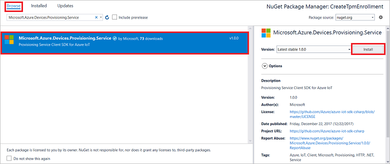

 
# Quickstart: Enroll individual device to IoT Hub Device Provisioning Service using TPM attestation

This article shows you how to programmatically create an individual enrollment for a TPM device in the Azure IoT Hub Device Provisioning Service by using the [Microsoft Azure IoT SDK](../iot-hub/iot-hub-devguide-sdks.md) and a sample application. You can optionally enroll a simulated TPM device to the provisioning service by using this individual enrollment entry. 

Although these steps work on both Windows and Linux computers, this article uses a Windows development computer.

## Prerequisites

[!INCLUDE [quickstarts-free-trial-note](../../includes/quickstarts-free-trial-note.md)]

* Complete the steps in [Set up IoT Hub Device Provisioning Service with the Azure portal](./quick-setup-auto-provision.md).

:::zone pivot="programming-language-csharp"

* Install [Visual Studio 2019](https://www.visualstudio.com/vs/).

* Install [.NET Core 3.1 SDK or later](https://dotnet.microsoft.com/download) or later on your Windows-based machine. You can use the following command to check your version.

    ```bash
    dotnet --info
    ```

* (Optional) If you want to enroll a simulated device at the end of this quickstart, follow the procedure in [Create and provision a simulated TPM device](quick-create-simulated-device-tpm.md) up to the step where you get an endorsement key for the device. Save the endorsement key, registration ID, and, optionally, the device ID.

:::zone-end

:::zone pivot="programming-language-nodejs"

* Install [Node.js v4.0+](https://nodejs.org).

* (Optional) Create an endorsement key. Follow the steps in [Create and provision a simulated device](quick-create-simulated-device-tpm.md) until you get the key.

:::zone-end

:::zone pivot="programming-language-java"

* Install the [Java SE Development Kit 8](/azure/developer/java/fundamentals/java-support-on-azure). This quickstart installs the [Java Service SDK](https://azure.github.io/azure-iot-sdk-java/master/service/) below. It works on both Windows and Linux. This quickstart uses Windows.

* Install [Maven 3](https://maven.apache.org/download.cgi).

* Install [Git](https://git-scm.com/download/) and make sure the the path is added to the environment variable `PATH`.


:::zone-end

> [!NOTE]
> Don't follow the steps to create an individual enrollment by using the Azure portal.

:::zone pivot="programming-language-java"

<a id="setupdevbox"></a>

## Prepare the development environment 

### Set up environment variables

To set up environment variables:

1. The `PATH` variable should include the full path to *jdk1.8.x\bin* directory. If this is your machine's first Java installation, then create a new environment variable named `JAVA_HOME` and point it to the full path to the *jdk1.8.x* directory. On Windows machine, this directory is found in the *C:\\Program Files\\Java\\* folder, and you can create or edit environment variables by searching for **Edit the system environment variables** on the **Control panel** of your Windows machine.

    You can check if Java is successfully set up on your machine by running the following command on your command window:

    ```cmd\sh
    java -version
    ```

2. Edit environment variable `PATH` to point to the *apache-maven-3.x.x\\bin* folder inside the folder where Maven was extracted. You may confirm that Maven is successfully installed by running this command on your command window:

    ```cmd\sh
    mvn --version
    ```

3. Make sure [git](https://git-scm.com/download/) is installed on your machine and is added to the environment variable `PATH`.

### Clone Git repository for Azure IoT Java SDK

To clone the Azure IoT Java SDK:

1. Open a command prompt. 

2. Clone the GitHub repo for device enrollment code sample using the [Java Service SDK](https://azure.github.io/azure-iot-sdk-java/master/service/):

    ```cmd\sh
    git clone https://github.com/Azure/azure-iot-sdk-java.git --recursive
    ```

:::zone-end

## Get the connection string for your provisioning service

For the sample in this quickstart, you'll need to copy the connection string for your provisioning service.

1. Sign in to the [Azure portal](https://portal.azure.com).

2. On the left-hand menu or on the portal page, select **All resources**.

3. Select your Device Provisioning Service.

4. In the **Settings** menu, select **Shared access policies**.

5. Select the access policy that you want to use.

6. In the **Access Policy** panel, copy and save the primary key connection string.

    :::image type="content" source="./media/quick-enroll-device-tpm/get-service-connection-string.png" alt-text="Get provisioning service connection string from the portal.":::

## Create the individual enrollment sample

:::zone pivot="programming-language-csharp"

This section shows you how to create a .NET Core console app that adds an individual enrollment for a TPM device to your provisioning service. With some modification, you can also follow these steps to create a [Windows IoT Core](https://developer.microsoft.com/en-us/windows/iot) console app to add the individual enrollment. To learn more about developing with IoT Core, see [Windows IoT Core developer documentation](/windows/iot-core/).

1. Open Visual Studio, and select **Create a new project**.

2. In the **Create a new project** panel, select **Console Application*.

3. Select **Next**.

4. For **Project name**, type *CreateEnrollmentGroup*.

5. Select**Next**. Keep the default **Target framework**.

6. Select **Create**.

7. After the solution opens, in the **Solution Explorer** pane, right-click the **CreateEnrollmentGroup** project, and then select **Manage NuGet Packages**.

8. In **NuGet Package Manager**, select **Browse**.

9. Type in and select *Microsoft.Azure.Devices.Provisioning.Service*.

10. Select **Install**.

    

    This step downloads, installs, and adds a reference to the [Azure IoT Provisioning Service Client SDK](https://www.nuget.org/packages/Microsoft.Azure.Devices.Provisioning.Service/) NuGet package and its dependencies.

11. Add the following `using` statements after the other `using` statements at the top of `Program.cs`:
  
    ```csharp
    using System.Threading.Tasks;
    using Microsoft.Azure.Devices.Provisioning.Service;
    ```

12. Add the following fields to the `Program` class, and make the listed changes.  

    ```csharp
    private static string ProvisioningConnectionString = "{ProvisioningServiceConnectionString}";
    private const string RegistrationId = "sample-registrationid-csharp";
    private const string TpmEndorsementKey =
        "AToAAQALAAMAsgAgg3GXZ0SEs/gakMyNRqXXJP1S124GUgtk8qHaGzMUaaoABgCAAEMAEAgAAAAAAAEAxsj2gUS" +
        "cTk1UjuioeTlfGYZrrimExB+bScH75adUMRIi2UOMxG1kw4y+9RW/IVoMl4e620VxZad0ARX2gUqVjYO7KPVt3d" +
        "yKhZS3dkcvfBisBhP1XH9B33VqHG9SHnbnQXdBUaCgKAfxome8UmBKfe+naTsE5fkvjb/do3/dD6l4sGBwFCnKR" +
        "dln4XpM03zLpoHFao8zOwt8l/uP3qUIxmCYv9A7m69Ms+5/pCkTu/rK4mRDsfhZ0QLfbzVI6zQFOKF/rwsfBtFe" +
        "WlWtcuJMKlXdD8TXWElTzgh7JS4qhFzreL0c1mI0GCj+Aws0usZh7dLIVPnlgZcBhgy1SSDQMQ==";
        
    // Optional parameters
    private const string OptionalDeviceId = "myCSharpDevice";
    private const ProvisioningStatus OptionalProvisioningStatus = ProvisioningStatus.Enabled;
    ```

13. Replace the `ProvisioningServiceConnectionString` placeholder value with the connection string of the provisioning service that you copied in the previous section.

14. If you're using this quickstart together with the [Create and provision a simulated TPM device](quick-create-simulated-device-tpm.md) quickstart to provision a simulated device, replace the endorsement key and registration ID with the values that you noted in that quickstart. You can replace the device ID with the value suggested in that quickstart, use your own value, or use the default value in this sample.

15. Add the following method to the `Program` class.  This code creates individual enrollment entry and then calls the `CreateOrUpdateIndividualEnrollmentAsync` method on the `ProvisioningServiceClient` to add the individual enrollment to the provisioning service.

    ```csharp
    public static async Task RunSample()
    {
        Console.WriteLine("Starting sample...");
    
        using (ProvisioningServiceClient provisioningServiceClient =
                ProvisioningServiceClient.CreateFromConnectionString(ProvisioningConnectionString))
        {
            #region Create a new individualEnrollment config
            Console.WriteLine("\nCreating a new individualEnrollment...");
            Attestation attestation = new TpmAttestation(TpmEndorsementKey);
            IndividualEnrollment individualEnrollment =
                    new IndividualEnrollment(
                            RegistrationId,
                            attestation);
    
            // The following parameters are optional. Remove them if you don't need them.
            individualEnrollment.DeviceId = OptionalDeviceId;
            individualEnrollment.ProvisioningStatus = OptionalProvisioningStatus;
            #endregion
    
            #region Create the individualEnrollment
            Console.WriteLine("\nAdding new individualEnrollment...");
            IndividualEnrollment individualEnrollmentResult =
                await provisioningServiceClient.CreateOrUpdateIndividualEnrollmentAsync(individualEnrollment).ConfigureAwait(false);
            Console.WriteLine("\nIndividualEnrollment created with success.");
            Console.WriteLine(individualEnrollmentResult);
            #endregion
        
        }
    }
    ```

16. Finally, replace the `Main` method with the following lines:

    ```csharp
    static async Task Main(string[] args)
    {
        await RunSample();
        Console.WriteLine("\nHit <Enter> to exit ...");
        Console.ReadLine();
    }
    ```

17. Build the solution.

:::zone-end

:::zone pivot="programming-language-nodejs"

1. From a command window in your working folder, run:
  
    ```cmd\sh
    npm install azure-iot-provisioning-service
    ```  

2. Using a text editor, create a _create_individual_enrollment.js_ file in your working folder. Add the following code to the file:

    ```Java
    'use strict';

    var provisioningServiceClient = require('azure-iot-provisioning-service').ProvisioningServiceClient;

    var serviceClient = provisioningServiceClient.fromConnectionString(process.argv[2]);
    var endorsementKey = process.argv[3];

    var enrollment = {
      registrationId: 'first',
      attestation: {
        type: 'tpm',
        tpm: {
          endorsementKey: endorsementKey
        }
      }
    };

    serviceClient.createOrUpdateIndividualEnrollment(enrollment, function(err, enrollmentResponse) {
      if (err) {
        console.log('error creating the individual enrollment: ' + err);
      } else {
        console.log("enrollment record returned: " + JSON.stringify(enrollmentResponse, null, 2));
      }
    });
    ```

3. Save the file.

:::zone-end

:::zone pivot="programming-language-java"

1. In the downloaded source code, navigate to the sample folder *_azure-iot-sdk-java/provisioning/provisioning-samples/service-enrollment-sample_*. Open the file *_/src/main/java/samples/com/microsoft/azure/sdk/iot/ServiceEnrollmentSample.java_*.

2. Replace `[Provisioning Connection String]` with the connection string that you copied in [Get the connection string for your provisioning service](#get-the-connection-string-for-your-provisioning-service).

    ```Java
    private static final String PROVISIONING_CONNECTION_STRING = "[Provisioning Connection String]";
    ```

   2. Add the TPM device details:
       1. Get the *Registration ID* and the *TPM endorsement key* for a TPM device simulation, by following the steps leading to the section [Simulate TPM device](quick-create-simulated-device-tpm.md#simulatetpm).
       2. Use the **_Registration ID_** and the **_Endorsement Key_** from the output of the preceding step, to replace the `[RegistrationId]` and `[TPM Endorsement Key]` in the sample code file **_ServiceEnrollmentSample.java_**:
    
           ```Java
           private static final String REGISTRATION_ID = "[RegistrationId]";
           private static final String TPM_ENDORSEMENT_KEY = "[TPM Endorsement Key]";
           ```

3. To configure your provisioning service from within the sample code, proceed to the next step. If you  do not want to configure it, make sure to comment out or delete the following statements in the _ServiceEnrollmentSample.java_ file:

    ```Java
    / / The following parameters are optional. Remove it if you don't need.
    individualEnrollment.setDeviceId(DEVICE_ID);
    individualEnrollment.setIotHubHostName(IOTHUB_HOST_NAME);
    individualEnrollment.setProvisioningStatus(PROVISIONING_STATUS);
    ```

4. This step shows you how to configure your provisioning service in the sample code.

    1. Go to the [Azure portal](https://portal.azure.com).

    2. On the left-hand menu or on the portal page, select **All resources**.

    3. Select your Device Provisioning Service.

    4. In the **Overview** panel, copy the hostname of the *Service endpoint*.  In the source code sample, replace `[Host name]` with the copied hostname.

    ```Java
    private static final String IOTHUB_HOST_NAME = "[Host name].azure-devices.net";
    ```

5. Study the sample code. It creates, updates, queries, and deletes an individual TPM device enrollment. To verify successful enrollment in portal, temporarily comment out the following lines of code at the end of the _ServiceEnrollmentSample.java_ file:

    ```Java
    // *********************************** Delete info of individualEnrollment ************************************
    System.out.println("\nDelete the individualEnrollment...");
    provisioningServiceClient.deleteIndividualEnrollment(REGISTRATION_ID);
    ```

6. Save the file _ServiceEnrollmentSample.java_.

:::zone-end

## Run the individual enrollment sample

:::zone pivot="programming-language-csharp"

1. Run the sample in Visual Studio to create the enrollment. A command window will appear, and will display confirmation messages.

2. Upon successful creation, the command window displays the properties of the new enrollment.

:::zone-end

:::zone pivot="programming-language-nodejs"

To run the sample, you'll need the connection string for your provisioning service that you copied in the previous section, as well as the endorsement key for device. If you've followed the [Create and provision a simulated device](quick-create-simulated-device-tpm.md) quickstart to create a simulated TPM device, use the key created for that device. Otherwise, to create a sample individual enrollment, you can use the following endorsement key supplied with the [Node.js Service SDK](https://github.com/Azure/azure-iot-sdk-node):

```bash
AToAAQALAAMAsgAgg3GXZ0SEs/gakMyNRqXXJP1S124GUgtk8qHaGzMUaaoABgCAAEMAEAgAAAAAAAEAxsj2gUScTk1UjuioeTlfGYZrrimExB+bScH75adUMRIi2UOMxG1kw4y+9RW/IVoMl4e620VxZad0ARX2gUqVjYO7KPVt3dyKhZS3dkcvfBisBhP1XH9B33VqHG9SHnbnQXdBUaCgKAfxome8UmBKfe+naTsE5fkvjb/do3/dD6l4sGBwFCnKRdln4XpM03zLpoHFao8zOwt8l/uP3qUIxmCYv9A7m69Ms+5/pCkTu/rK4mRDsfhZ0QLfbzVI6zQFOKF/rwsfBtFeWlWtcuJMKlXdD8TXWElTzgh7JS4qhFzreL0c1mI0GCj+Aws0usZh7dLIVPnlgZcBhgy1SSDQMQ==
```

1. To create an individual enrollment for your TPM device, run the following command (include the quotes around the command arguments):

     ```cmd\sh
     node create_individual_enrollment.js "<the connection string for your provisioning service>" "<endorsement key>"
     ```

2. Upon successful creation, the command window displays the properties of the new enrollment.

:::zone-end

:::zone pivot="programming-language-java"

1. Open a command window in Administrator mode, and go to the folder *_azure-iot-sdk-java/provisioning/provisioning-samples/service-enrollment-group-sample_*.

2. In the command prompt, use this command:

    ```cmd\sh
    mvn install -DskipTests
    ```

    This command downloads the Maven package [`com.microsoft.azure.sdk.iot.provisioning.service`](https://mvnrepository.com/artifact/com.microsoft.azure.sdk.iot.provisioning/provisioning-service-client) to your machine. This package includes the binaries for the Java service SDK, that the sample code needs to build. If you ran the _X.509 certificate generator_ tool in the preceding section, this package will be already downloaded on your machine.

3. In the command prompt, run the script:

    ```cmd\sh
    cd target
    java -jar ./service-enrollment-group-sample-{version}-with-deps.jar
    ```

4. Upon successful creation, the command window displays the properties of the new enrollment.


:::zone-end

To verify that the enrollment group has been created:

1. In the Azure portal, select your Device Provisioning Service.

2. In the **Settings** menu, select **Manage enrollments**.

3. Select **Individual Enrollments**. You should see a new enrollment entry that corresponds to the registration ID that you used in the sample.

:::zone pivot="programming-language-csharp"

:::image type="content" source="./media/quick-enroll-device-tpm/verify-enrollment-csharp.png" alt-text="Verify enrollment for C# individual device in the portal.":::

:::zone-end

:::zone pivot="programming-language-nodejs"

:::image type="content" source="./media/quick-enroll-device-tpm/verify-enrollment-nodejs.png" alt-text="Verify enrollment for Node.js individual device in the portal.":::

:::zone-end

:::zone pivot="programming-language-java"

:::image type="content" source="./media/quick-enroll-device-tpm/verify-enrollment-java.png" alt-text="Verify enrollment for Java individual device in the portal.":::

:::zone-end

## Clean up resources

If you plan to explore the DPS tutorials, don't clean up the resources created in this quickstart. Otherwise, use the following steps to delete all resources created by this quickstart.

1. Close the sample output window on your computer.

2. From the left-hand menu in the Azure portal, select **All resources**.

3. Select your Device Provisioning Service.

4. In the **Settings** menu, select **Manage enrollments**.

5. Select the **Individual Enrollments** tab.

6. Select the check box next to the *REGISTRATION ID* of the device you enrolled in this quickstart.

7. At the top of the page, select  **Delete**.

8. From your Device Provisioning Service in the Azure portal, select **Certificates**.

9. Select the certificate you uploaded for this quickstart.

10. At the top of **Certificate Details**, select **Delete**.  

11. If you followed the steps in [Create and provision a simulated TPM device](quick-create-simulated-device-tpm.md) to create a simulated TPM device, do the following steps:

    1. Close the TPM simulator window and the sample output window for the simulated device.

    2. In the Azure portal, navigate to the IoT Hub where your device was provisioned. 

    3. In the menu under **Explorers**, select **IoT devices**.

    4. Select the check box next to the *DEVICE ID* of the device you registered in this quickstart.

    5. At the top of the pane, select **Delete**.

## Next steps

In this quickstart, you’ve programmatically created an individual enrollment entry for a TPM device. Optionally, you created a TPM simulated device on your computer and provisioned it to your IoT hub using the Azure IoT Hub Device Provisioning Service. To learn about provisioning multiple devices, continue to the tutorials for the Device Provisioning Service.

> [!div class="nextstepaction"]
> [How to provision devices using symmetric key enrollment groups](how-to-legacy-device-symm-key.md)
