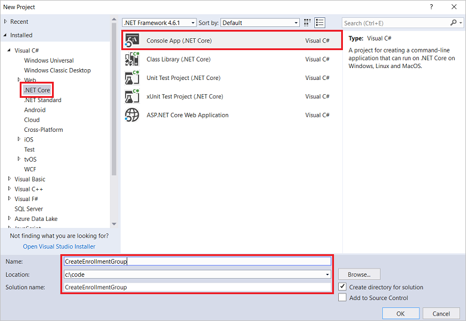
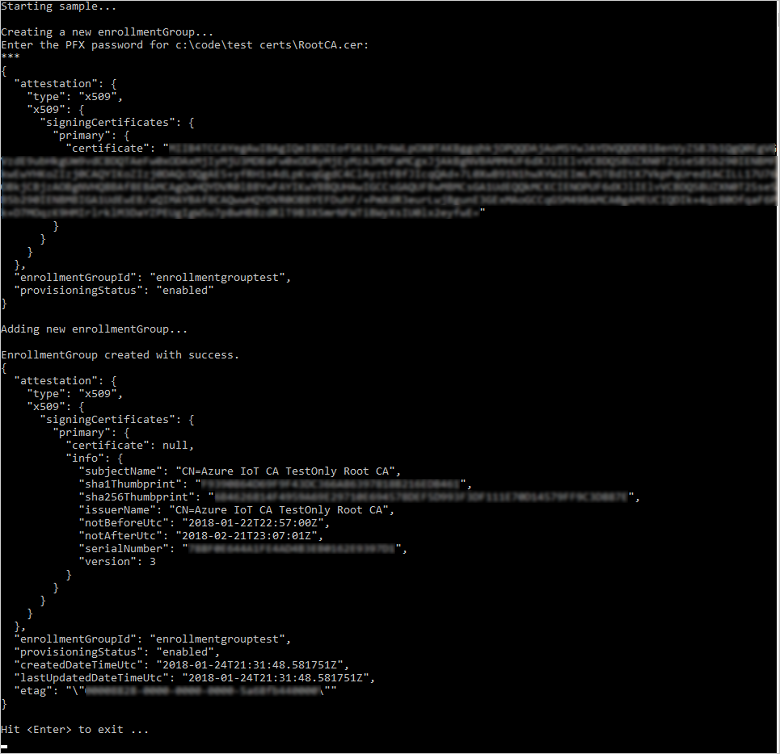
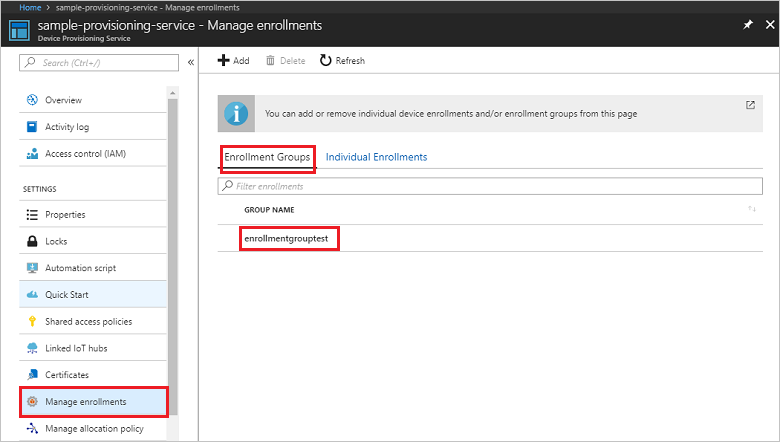

 
# Quickstart: Enroll X.509 devices to the Device Provisioning Service using C#

[!INCLUDE [iot-dps-selector-quick-enroll-device-x509](../../includes/iot-dps-selector-quick-enroll-device-x509.md)]


This quickstart shows how to use C# to programmatically create an [Enrollment group](concepts-service.md#enrollment-group) that uses intermediate or root CA X.509 certificates. The enrollment group is created using the [Microsoft Azure IoT SDK for .NET](https://github.com/Azure/azure-iot-sdk-csharp) and a sample C# .NET Core application. An enrollment group controls access to the provisioning service for devices that share a common signing certificate in their certificate chain. To learn more, see [Controlling device access to the provisioning service with X.509 certificates](./concepts-security.md#controlling-device-access-to-the-provisioning-service-with-x509-certificates). For more information about using X.509 certificate-based Public Key Infrastructure (PKI) with Azure IoT Hub and Device Provisioning Service, see [X.509 CA certificate security overview](https://docs.microsoft.com/azure/iot-hub/iot-hub-x509ca-overview). 

This quickstart expects you have already created an IoT hub and Device Provisioning Service instance. If you have not already created these resources, complete the [Set up IoT Hub Device Provisioning Service with the Azure portal](./quick-setup-auto-provision.md) quickstart before proceeding with this article.

Although the steps in this article work on both Windows and Linux machines, this article is developed for a Windows development machine.

[!INCLUDE [quickstarts-free-trial-note](../../includes/quickstarts-free-trial-note.md)]


## Prerequisites

* Install [Visual Studio 2017](https://www.visualstudio.com/vs/).
* Install [.NET Core SDK](https://www.microsoft.com/net/download/windows).
* Install [Git](https://git-scm.com/download/).


## Prepare test certificates

For this quickstart, you must have a .pem or a .cer file that contains the public portion of an intermediate or root CA X.509 certificate. This certificate must be uploaded to your provisioning service, and verified by the service. 

The [Azure IoT C SDK](https://github.com/Azure/azure-iot-sdk-c) contains test tooling that can help you create an X.509 certificate chain, upload a root or intermediate certificate from that chain, and perform proof-of-possession with the service to verify the certificate. Certificates created with the SDK tooling are designed to use for **development testing only**. These certificates **must not be used in production**. They contain hard-coded passwords ("1234") that expire after 30 days. To learn about obtaining certificates suitable for production use, see [How to get an X.509 CA certificate](https://docs.microsoft.com/azure/iot-hub/iot-hub-x509ca-overview#how-to-get-an-x509-ca-certificate) in the Azure IoT Hub documentation.

To use this test tooling to generate certificates, perform the following steps: 
 
1. Open a command prompt or Git Bash shell, and change to a working folder on your machine. Execute the following command to clone the [Azure IoT C SDK](https://github.com/Azure/azure-iot-sdk-c) GitHub repository:
    
   ```cmd/sh
   git clone https://github.com/Azure/azure-iot-sdk-c.git --recursive
   ```

   You should expect this operation to take several minutes to complete.

   The test tooling is located in the *azure-iot-sdk-c/tools/CACertificates* of the repository you cloned.    

2. Follow the steps in [Managing test CA certificates for samples and tutorials](https://github.com/Azure/azure-iot-sdk-c/blob/master/tools/CACertificates/CACertificateOverview.md). 

In addition to the tooling in the C SDK, the [Group certificate verification sample](https://github.com/Azure-Samples/azure-iot-samples-csharp/tree/master/provisioning/Samples/service/GroupCertificateVerificationSample) in the *Microsoft Azure IoT SDK for .NET* shows how to perform proof-of-possession in C# with an existing X.509 intermediate or root CA certificate. 


## Get the connection string for your provisioning service

For the sample in this quickstart, you need the connection string for your provisioning service.
1. Sign in to the Azure portal, click on the **All resources** button on the left-hand menu and open your Device Provisioning Service. 
2. Click **Shared access policies**, then click the access policy you want to use to open its properties. In the **Access Policy** window, copy and note down the primary key connection string. 

    

## Create the enrollment group sample 

The steps in this section show how to create a .NET Core console app that adds an enrollment group to your provisioning service. With some modification, you can also follow these steps to create a [Windows IoT Core](https://developer.microsoft.com/en-us/windows/iot) console app to add the enrollment group. To learn more about developing with IoT Core, see the [Windows IoT Core developer documentation](https://docs.microsoft.com/windows/iot-core/).
1. In Visual Studio, add a Visual C# .NET Core Console App project to a new solution by using the **Console App (.NET Core)** project template. Make sure the .NET Framework version is 4.5.1 or later. Name the project **CreateEnrollmentGroup**.

    

2. In Solution Explorer, right-click the **CreateEnrollmentGroup** project, and then click **Manage NuGet Packages**.
3. In the **NuGet Package Manager** window, select **Browse**, search for **Microsoft.Azure.Devices.Provisioning.Service**, select **Install** to install the **Microsoft.Azure.Devices.Provisioning.Service** package, and accept the terms of use. This procedure downloads, installs, and adds a reference to the [Azure IoT Provisioning Service Client SDK](https://www.nuget.org/packages/Microsoft.Azure.Devices.Provisioning.Service/) NuGet package and its dependencies.

    

4. Add the following `using` statements after the other `using` statements at the top of the **Program.cs** file:
   
   ```csharp
   using System.Security.Cryptography.X509Certificates;
   using System.Threading.Tasks;
   using Microsoft.Azure.Devices.Provisioning.Service;
   ```
    
5. Add the following fields to the **Program** class.  
   - Replace the **ProvisioningConnectionString** placeholder value with the connection string of the provisioning service that you want to create the enrollment for.
   - Replace the **X509RootCertPath** placeholder value with the path to a .pem or .cer file that represents the public part of an intermediate or root CA X.509 certificate that has been previously uploaded and verified with your provisioning service.
   - You may optionally change the **EnrollmentGroupId** value. The string can contain only lower case characters and hyphens. 

   > [!IMPORTANT]
   > In production code, be aware of the following security considerations:
   >
   > - Hard-coding the connection string for the provisioning service administrator is against security best practices. Instead, the connection string should be held in a secure manner, such as in a secure configuration file or in the registry.
   > - Be sure to upload only the public part of the signing certificate. Never upload .pfx (PKCS12) or .pem files containing private keys to the provisioning service.
        
   ```csharp
   private static string ProvisioningConnectionString = "{Your provisioning service connection string}";
   private static string EnrollmentGroupId = "enrollmentgrouptest";
   private static string X509RootCertPath = @"{Path to a .cer or .pem file for a verified root CA or intermediate CA X.509 certificate}";
   ```
    
6. Add the following method to the **Program** class. This code creates an enrollment group entry and then calls the **CreateOrUpdateEnrollmentGroupAsync** method on the **ProvisioningServiceClient** to add the enrollment group to the provisioning service.
   
   ```csharp
   public static async Task RunSample()
   {
       Console.WriteLine("Starting sample...");
 
       using (ProvisioningServiceClient provisioningServiceClient =
               ProvisioningServiceClient.CreateFromConnectionString(ProvisioningConnectionString))
       {
           #region Create a new enrollmentGroup config
           Console.WriteLine("\nCreating a new enrollmentGroup...");
           var certificate = new X509Certificate2(X509RootCertPath);
           Attestation attestation = X509Attestation.CreateFromRootCertificates(certificate);
           EnrollmentGroup enrollmentGroup =
                   new EnrollmentGroup(
                           EnrollmentGroupId,
                           attestation)
                   {
                       ProvisioningStatus = ProvisioningStatus.Enabled
                   };
           Console.WriteLine(enrollmentGroup);
           #endregion
 
           #region Create the enrollmentGroup
           Console.WriteLine("\nAdding new enrollmentGroup...");
           EnrollmentGroup enrollmentGroupResult =
               await provisioningServiceClient.CreateOrUpdateEnrollmentGroupAsync(enrollmentGroup).ConfigureAwait(false);
           Console.WriteLine("\nEnrollmentGroup created with success.");
           Console.WriteLine(enrollmentGroupResult);
           #endregion
 
       }
   }
   ```

7. Finally, replace the body of the **Main** method with the following lines:
   
   ```csharp
   RunSample().GetAwaiter().GetResult();
   Console.WriteLine("\nHit <Enter> to exit ...");
   Console.ReadLine();
   ```
        
8. Build the solution.

## Run the enrollment group sample
  
1. Run the sample in Visual Studio to create the enrollment group.
 
2. On successful creation, the command window displays the properties of the new enrollment group.

    

3. To verify that the enrollment group has been created, on the Device Provisioning Service summary blade in the Azure portal, select **Manage enrollments**, then select the **Enrollment Groups** tab. You should see a new enrollment entry that corresponds to the registration ID you used in the sample. Click the entry to verify the certificate thumbprint and other properties for the entry.

    
 
## Clean up resources
If you plan to explore the C# service sample, do not clean up the resources created in this Quickstart. If you do not plan to continue, use the following steps to delete all resources created by this Quickstart.

1. Close the C# sample output window on your machine.
2. Navigate to your Device Provisioning service in the Azure portal, click **Manage enrollments**, and then select the **Enrollment Groups** tab. Select the *Registration ID* for the enrollment entry you created using this Quickstart and click the **Delete** button at the top of the blade.  
3. From your Device Provisioning service in the Azure portal, click **Certificates**, click the certificate you uploaded for this Quickstart, and click the **Delete** button at the top of the **Certificate Details** window.  
 
## Next steps
In this Quickstart, you created an enrollment group for an X.509 intermediate or root CA certificate using the Azure IoT Hub Device Provisioning Service. To learn about device provisioning in depth, continue to the tutorial for the Device Provisioning Service setup in the Azure portal. 
 
> [!div class="nextstepaction"]
> [Azure IoT Hub Device Provisioning Service tutorials](./tutorial-set-up-cloud.md)
