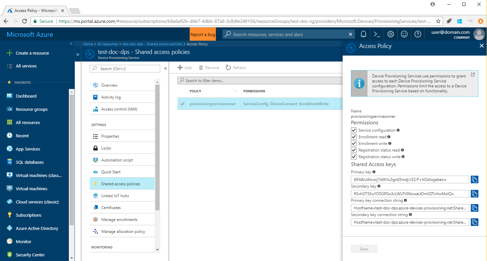
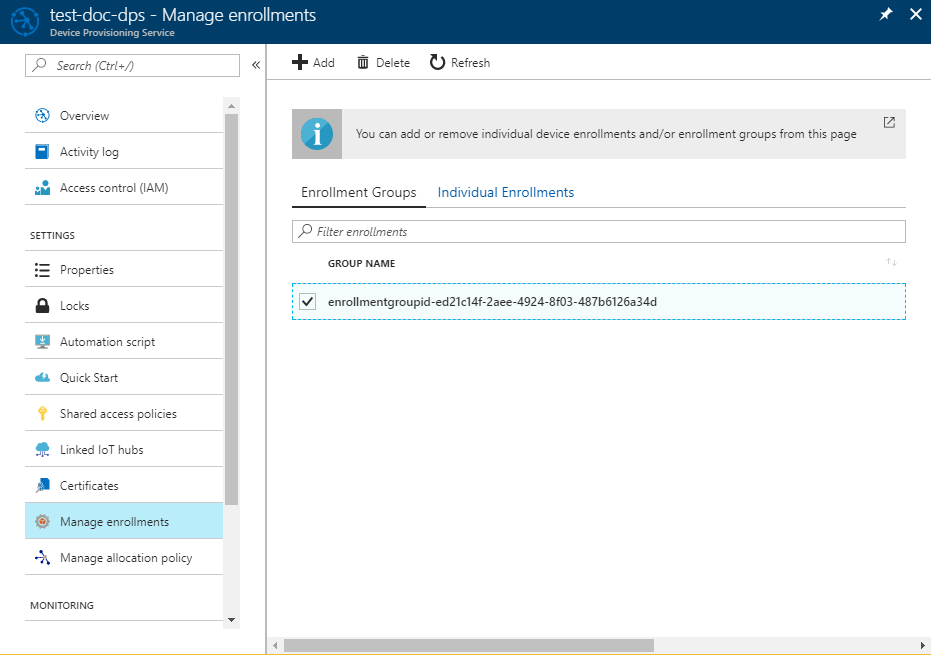

# Quickstart: Enroll X.509 devices to the Device Provisioning Service using Java

[!INCLUDE [iot-dps-selector-quick-enroll-device-x509](../../includes/iot-dps-selector-quick-enroll-device-x509.md)]

This quickstart shows how to use Java to programmatically enroll a group of X.509 simulated devices to the Azure IoT Hub Device Provisioning Service. Devices are enrolled to a provisioning service instance by creating an [Enrollment group](concepts-service.md#enrollment-group), or an [Individual enrollment](concepts-service.md#individual-enrollment). This quickstart shows how to create both types of enrollments. The enrollments are created using the [Java Service SDK](https://azure.github.io/azure-iot-sdk-java/service/) with the help of a sample Java application. 

This quickstart expects you have already created an IoT hub and Device Provisioning Service instance. If you have not already created these resources, complete the [Set up IoT Hub Device Provisioning Service with the Azure portal](./quick-setup-auto-provision.md) quickstart before proceeding with this article.

Although the Java Service SDK works on both Windows and Linux machines, this article uses a Windows development machine to walk through the enrollment process.

[!INCLUDE [quickstarts-free-trial-note](../../includes/quickstarts-free-trial-note.md)]

## Prerequisites

* Install [Java SE Development Kit 8](https://aka.ms/azure-jdks).
* Install [Maven 3](https://maven.apache.org/download.cgi). You can verify your current Maven version by running:

    ```cmd/sh
    mvn --version
    ```

* Install [Git](https://git-scm.com/download/).


<a id="javasample"></a>

## Download and modify the Java sample code

This section uses a self-signed X.509 certificate, it is important to keep in mind the following points:

* Self-signed certificates are for testing only, and should not be used in production.
* The default expiration date for a self-signed certificate is one year.

The following steps show how to add the provisioning details of your X.509 device to the sample code. 

1. Open a command prompt. Clone the GitHub repo for device enrollment code sample using the Java Service SDK:
    
    ```cmd\sh
    git clone https://github.com/Azure/azure-iot-sdk-java.git --recursive
    ```

2. In the downloaded source code, navigate to the sample folder **_azure-iot-sdk-java/provisioning/provisioning-samples/service-enrollment-group-sample_**. Open the file **_/src/main/java/samples/com/microsoft/azure/sdk/iot/ServiceEnrollmentGroupSample.java_** in an editor of your choice, and add the following details:

    1. Add the `[Provisioning Connection String]` for your provisioning service, from the portal as following:
        1. Navigate to your provisioning service in the [Azure portal](https://portal.azure.com). 
        2. Open the **Shared access policies**, and select a policy, which has the *EnrollmentWrite* permission.
        3. Copy the **Primary key connection string**. 

              

        4. In the sample code file **_ServiceEnrollmentGroupSample.java_**, replace the `[Provisioning Connection String]` with the **Primary key connection string**.

            ```Java
            private static final String PROVISIONING_CONNECTION_STRING = "[Provisioning Connection String]";
            ```

    2. Add the root certificate for the group of devices. If you need a sample root certificate, use the _X.509 certificate generator_ tool as follows:
        1. In a command window, navigate to the folder **_azure-iot-sdk-java/provisioning/provisioning-tools/provisioning-x509-cert-generator_**.
        2. Build the tool by running the following command:

                ```cmd\sh
                mvn clean install
                ```

        4. Run the tool using the following commands:

                ```cmd\sh
                cd target
                java -jar ./provisioning-x509-cert-generator-{version}-with-deps.jar
                ```

        5. When prompted, you may optionally enter a _Common Name_ for your certificates.
        6. The tool locally generates a **Client Cert**, the **Client Cert Private Key**, and the **Root Cert**.
        7. Copy the **Root Cert**, including the lines **_-----BEGIN CERTIFICATE-----_** and **_-----END CERTIFICATE-----_**. 
        8. Assign the value of the **Root Cert** to the parameter **PUBLIC_KEY_CERTIFICATE_STRING** as shown below:

                ```Java
                private static final String PUBLIC_KEY_CERTIFICATE_STRING =
                        "-----BEGIN CERTIFICATE-----\n" +
                        "XXXXXXXXXXXXXXXXXXXXXXXXXXXXXXXXXXXXXXXXXXXXXXXXXXXXXXXXXXXXXXXX\n" +
                        "XXXXXXXXXXXXXXXXXXXXXXXXXXXXXXXXXXXXXXXXXXXXXXXXXXXXXXXXXXXXXXXX\n" +
                        "XXXXXXXXXXXXXXXXXXXXXXXXXXXXXXXXXXXXXXXXXXXXXXXXXXXXXXXXXXXXXXXX\n" +
                        "XXXXXXXXXXXXXXXXXXXXXXXXXXXXXXXXXXXXXXXXXXXXXXXXXXXXXXXXXXXXXXXX\n" +
                        "XXXXXXXXXXXXXXXXXXXXXXXXXXXXXXXXXXXXXXXXXXXXXXXXXXXXXXXXXXXXXXXX\n" +
                        "XXXXXXXXXXXXXXXXXXXXXXXXXXXXXXXXXXXXXXXXXXXXXXXXXXXXXXXXXXXXXXXX\n" +
                        "XXXXXXXXXXXXXXXXXXXXXXXXXXXXXXXXXXXXXXXXXXXXXXXXXXXXXXXXXXXXXXXX\n" +
                        "XXXXXXXXXXXXXXXXXXXXXXXXXXXXXXXXXXXXXXXXXXXXXXXXXXXXXXXXXXXXXXXX\n" +
                        "XXXXXXXXXXXXXXXXXXXXXXXXXXXXXXXXXXXXXXXXXXXXXXXXXXXXXXXXXXXXXXXX\n" +
                        "XXXXXXXXXXXXXXXXXXXXXXXXXXXXXXXXXXXXXXXXXXXXXXXXXXXXXXXXXXXXXXXX\n" +
                        "-----END CERTIFICATE-----\n";
                ```

        9. Close the command window, or enter **n** when prompted for *Verification Code*. 
 
    3. Optionally, you may configure your provisioning service through the sample code:
        - To add this configuration to the sample, follow these steps:
            1. Navigate to the IoT hub linked to your provisioning service in the [Azure portal](https://portal.azure.com). Open the **Overview** tab for the hub, and copy the **Hostname**. Assign this **Hostname** to the *IOTHUB_HOST_NAME* parameter.

                ```Java
                private static final String IOTHUB_HOST_NAME = "[Host name].azure-devices.net";
                ```
            2. Assign a friendly name to the *DEVICE_ID* parameter, and keep the *PROVISIONING_STATUS* as the default *ENABLED* value. 

        - OR, if you choose not to configure your provisioning service, make sure to comment out or delete the following statements in the _ServiceEnrollmentGroupSample.java_ file:

            ```Java
            enrollmentGroup.setIotHubHostName(IOTHUB_HOST_NAME);                // Optional parameter.
            enrollmentGroup.setProvisioningStatus(ProvisioningStatus.ENABLED);  // Optional parameter.
            ```

    4. Study the sample code. It creates, updates, queries, and deletes a group enrollment for X.509 devices. To verify successful enrollment in portal, temporarily comment out the following lines of code at the end of the _ServiceEnrollmentGroupSample.java_ file:

        ```Java
        // ************************************** Delete info of enrollmentGroup ***************************************
        System.out.println("\nDelete the enrollmentGroup...");
        provisioningServiceClient.deleteEnrollmentGroup(enrollmentGroupId);
        ```

    5. Save the file _ServiceEnrollmentGroupSample.java_. 
 

<a id="runjavasample"></a>

## Build and run sample group enrollment

1. Open a command window, and navigate to the folder **_azure-iot-sdk-java/provisioning/provisioning-samples/service-enrollment-group-sample_**.

2. Build the sample code by using this command:

    ```cmd\sh
    mvn install -DskipTests
    ```

   This command downloads the Maven package [`com.microsoft.azure.sdk.iot.provisioning.service`](https://www.mvnrepository.com/artifact/com.microsoft.azure.sdk.iot.provisioning/provisioning-service-client) to your machine. This package includes the binaries for the Java service SDK, that the sample code needs to build. If you ran the _X.509 certificate generator_ tool in the preceding section, this package will be already downloaded on your machine. 

3. Run the sample by using these commands at the command window:

    ```cmd\sh
    cd target
    java -jar ./service-enrollment-group-sample-{version}-with-deps.jar
    ```

4. Observe the output window for successful enrollment.

5. Navigate to your provisioning service in the Azure portal. Click **Manage enrollments**. Notice that your group of X.509 devices appears under the **Enrollment Groups** tab, with an autogenerated *GROUP NAME*. 

      

## Modifications to enroll a single X.509 device

To enroll a single X.509 device, modify the *individual enrollment* sample code used in [Enroll TPM device to IoT Hub Device Provisioning Service using Java service SDK](quick-enroll-device-tpm-java.md#javasample) as follows:

1. Copy the *Common Name* of your X.509 client certificate to the clipboard. If you wish to use the _X.509 certificate generator_ tool as shown in the [preceding sample code section](#javasample), either enter a _Common Name_ for your certificate, or use the default **microsoftriotcore**. Use this **Common Name** as the value for the *REGISTRATION_ID* variable. 

    ```Java
    // Use common name of your X.509 client certificate
    private static final String REGISTRATION_ID = "[RegistrationId]";
    ```

2. Rename the variable *TPM_ENDORSEMENT_KEY* as *PUBLIC_KEY_CERTIFICATE_STRING*. Copy your client certificate or the **Client Cert** from the output of the _X.509 certificate generator_ tool, as the value for the *PUBLIC_KEY_CERTIFICATE_STRING* variable. 

    ```Java
    // Rename the variable *TPM_ENDORSEMENT_KEY* as *PUBLIC_KEY_CERTIFICATE_STRING*
    private static final String PUBLIC_KEY_CERTIFICATE_STRING =
            "-----BEGIN CERTIFICATE-----\n" +
            "XXXXXXXXXXXXXXXXXXXXXXXXXXXXXXXXXXXXXXXXXXXXXXXXXXXXXXXXXXXXXXXX\n" +
            "XXXXXXXXXXXXXXXXXXXXXXXXXXXXXXXXXXXXXXXXXXXXXXXXXXXXXXXXXXXXXXXX\n" +
            "XXXXXXXXXXXXXXXXXXXXXXXXXXXXXXXXXXXXXXXXXXXXXXXXXXXXXXXXXXXXXXXX\n" +
            "XXXXXXXXXXXXXXXXXXXXXXXXXXXXXXXXXXXXXXXXXXXXXXXXXXXXXXXXXXXXXXXX\n" +
            "XXXXXXXXXXXXXXXXXXXXXXXXXXXXXXXXXXXXXXXXXXXXXXXXXXXXXXXXXXXXXXXX\n" +
            "XXXXXXXXXXXXXXXXXXXXXXXXXXXXXXXXXXXXXXXXXXXXXXXXXXXXXXXXXXXXXXXX\n" +
            "XXXXXXXXXXXXXXXXXXXXXXXXXXXXXXXXXXXXXXXXXXXXXXXXXXXXXXXXXXXXXXXX\n" +
            "XXXXXXXXXXXXXXXXXXXXXXXXXXXXXXXXXXXXXXXXXXXXXXXXXXXXXXXXXXXXXXXX\n" +
            "XXXXXXXXXXXXXXXXXXXXXXXXXXXXXXXXXXXXXXXXXXXXXXXXXXXXXXXXXXXXXXXX\n" +
            "XXXXXXXXXXXXXXXXXXXXXXXXXXXXXXXXXXXXXXXXXXXXXXXXXXXXXXXXXXXXXXXX\n" +
            "-----END CERTIFICATE-----\n";
    ```
3. In the **main** function, replace the line `Attestation attestation = new TpmAttestation(TPM_ENDORSEMENT_KEY);` with the following to use the X.509 client certificate:
    ```Java
    Attestation attestation = X509Attestation.createFromClientCertificates(PUBLIC_KEY_CERTIFICATE_STRING);
    ```

4. Save, build, and run the *individual enrollment* sample file, using the steps in the section [Build and run the sample code for individual enrollment](quick-enroll-device-tpm-java.md#runjavasample).


## Clean up resources
If you plan to explore the Java service sample, do not clean up the resources created in this Quickstart. If you do not plan to continue, use the following steps to delete all resources created by this Quickstart.

1. Close the Java sample output window on your machine.
1. Close the _X509 Cert Generator_ window on your machine.
1. Navigate to your Device Provisioning service in the Azure portal, click **Manage enrollments**, and then select the **Enrollment Groups** tab. Select the *GROUP NAME* for the X.509 devices you enrolled using this Quickstart, and click the **Delete** button at the top of the blade.  

## Next steps
In this Quickstart, you enrolled a simulated group of X.509 devices to your Device Provisioning service. To learn about device provisioning in depth, continue to the tutorial for the Device Provisioning Service setup in the Azure portal. 

> [!div class="nextstepaction"]
> [Azure IoT Hub Device Provisioning Service tutorials](./tutorial-set-up-cloud.md)
