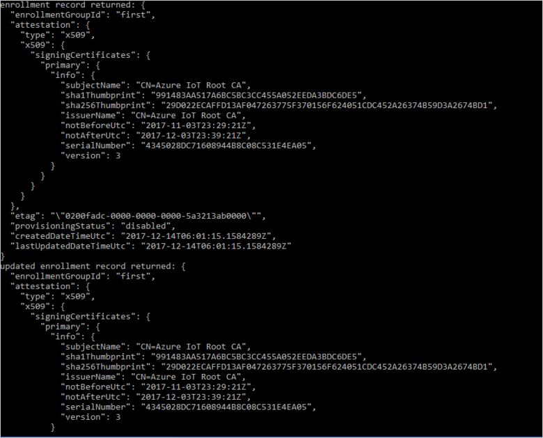

 
# Quickstart: Enroll X.509 devices to the Device Provisioning Service using Node.js

[!INCLUDE [iot-dps-selector-quick-enroll-device-x509](../../includes/iot-dps-selector-quick-enroll-device-x509.md)]

This quickstart shows how to use Node.js to programmatically create an [Enrollment group](concepts-service.md#enrollment-group) that uses intermediate or root CA X.509 certificates. The enrollment group is created using the [IoT SDK for Node.js](https://github.com/Azure/azure-iot-sdk-node) and a sample Node.js application. An enrollment group controls access to the provisioning service for devices that share a common signing certificate in their certificate chain. To learn more, see [Controlling device access to the provisioning service with X.509 certificates](./concepts-security.md#controlling-device-access-to-the-provisioning-service-with-x509-certificates). For more information about using X.509 certificate-based Public Key Infrastructure (PKI) with Azure IoT Hub and Device Provisioning Service, see [X.509 CA certificate security overview](https://docs.microsoft.com/azure/iot-hub/iot-hub-x509ca-overview). 

This quickstart expects you have already created an IoT hub and Device Provisioning Service instance. If you have not already created these resources, complete the [Set up IoT Hub Device Provisioning Service with the Azure portal](./quick-setup-auto-provision.md) quickstart before proceeding with this article.

Although the steps in this article work on both Windows and Linux machines, this article is developed for a Windows development machine.

[!INCLUDE [quickstarts-free-trial-note](../../includes/quickstarts-free-trial-note.md)]


## Prerequisites

- Install [Node.js v4.0 or above](https://nodejs.org).
- Install [Git](https://git-scm.com/download/).


## Prepare test certificates

For this quickstart, you must have a .pem or a .cer file that contains the public portion of an intermediate or root CA X.509 certificate. This certificate must be uploaded to your provisioning service, and verified by the service. 

The [Azure IoT C SDK](https://github.com/Azure/azure-iot-sdk-c) contains test tooling that can help you create an X.509 certificate chain, upload a root or intermediate certificate from that chain, and perform proof-of-possession with the service to verify the certificate. Certificates created with the SDK tooling are designed to use for **development testing only**. These certificates **must not be used in production**. They contain hard-coded passwords ("1234") that expire after 30 days. To learn about obtaining certificates suitable for production use, see [How to get an X.509 CA certificate](https://docs.microsoft.com/azure/iot-hub/iot-hub-x509ca-overview#how-to-get-an-x509-ca-certificate) in the Azure IoT Hub documentation.

To use this test tooling to generate certificates, perform the following steps:
 
1. Find the tag name for the [latest release](https://github.com/Azure/azure-iot-sdk-c/releases/latest) of the Azure IoT C SDK.

2. Open a command prompt or Git Bash shell, and change to a working folder on your machine. Run the following commands to clone the latest release of the [Azure IoT C SDK](https://github.com/Azure/azure-iot-sdk-c) GitHub repository. Use the tag you found in the previous step as the value for the `-b` parameter:

    ```cmd/sh
    git clone -b <release-tag> https://github.com/Azure/azure-iot-sdk-c.git
    cd azure-iot-sdk-c
    git submodule update --init
    ```

    You should expect this operation to take several minutes to complete.

   The test tooling is located in the *azure-iot-sdk-c/tools/CACertificates* of the repository you cloned.

3. Follow the steps in [Managing test CA certificates for samples and tutorials](https://github.com/Azure/azure-iot-sdk-c/blob/master/tools/CACertificates/CACertificateOverview.md). 


## Create the enrollment group sample 

 
1. From a command window in your working folder, run:
  
     ```cmd\sh
     npm install azure-iot-provisioning-service
     ```  

2. Using a text editor, create a **create_enrollment_group.js** file in your working folder. Add the following code to the file and save:

    ```
    'use strict';
    var fs = require('fs');

    var provisioningServiceClient = require('azure-iot-provisioning-service').ProvisioningServiceClient;

    var serviceClient = provisioningServiceClient.fromConnectionString(process.argv[2]);

    var enrollment = {
      enrollmentGroupId: 'first',
      attestation: {
        type: 'x509',
        x509: {
          signingCertificates: {
            primary: {
              certificate: fs.readFileSync(process.argv[3], 'utf-8').toString()
            }
          }
        }
      },
      provisioningStatus: 'disabled'
    };

    serviceClient.createOrUpdateEnrollmentGroup(enrollment, function(err, enrollmentResponse) {
      if (err) {
        console.log('error creating the group enrollment: ' + err);
      } else {
        console.log("enrollment record returned: " + JSON.stringify(enrollmentResponse, null, 2));
        enrollmentResponse.provisioningStatus = 'enabled';
        serviceClient.createOrUpdateEnrollmentGroup(enrollmentResponse, function(err, enrollmentResponse) {
          if (err) {
            console.log('error updating the group enrollment: ' + err);
          } else {
            console.log("updated enrollment record returned: " + JSON.stringify(enrollmentResponse, null, 2));
          }
        });
      }
    });
    ```

## Run the enrollment group sample
 
1. To run the sample, you need the connection string for your provisioning service. 
    1. Sign in to the Azure portal, select the **All resources** button on the left-hand menu and open your Device Provisioning service. 
    2. Click **Shared access policies**, then select the access policy you want to use to open its properties. In the **Access Policy** window, copy and note down the primary key connection string. 

        


3. As stated in [Prepare test certificates](quick-enroll-device-x509-node.md#prepare-test-certificates), you also need a .pem file that contains an X.509 intermediate or root CA certificate that has been previously uploaded and verified with your provisioning service. To check that your certificate has been uploaded and verified, on the Device Provisioning Service summary page in the Azure portal, select **Certificates**. Find the certificate that you want to use for the group enrollment and ensure that its status value is *verified*.

     

1. To create an enrollment group for your certificate, run the following command (include the quotes around the command arguments):
 
     ```cmd\sh
     node create_enrollment_group.js "<the connection string for your provisioning service>" "<your certificate's .pem file>"
     ```
 
3. On successful creation, the command window displays the properties of the new enrollment group.

     

4. Verify that the enrollment group has been created. In the Azure portal, on the Device Provisioning Service summary blade, select **Manage enrollments**. Select the **Enrollment Groups** tab and verify that the new enrollment entry (*first*) is present.

     
 
## Clean up resources
If you plan to explore the Node.js service samples, do not clean up the resources created in this quickstart. If you do not plan to continue, use the following steps to delete all Azure resources created by this quickstart.
 
1. Close the Node.js sample output window on your machine.
2. Navigate to your Device Provisioning service in the Azure portal, select **Manage enrollments**, and then select the **Enrollment Groups** tab. Select the check box next to the *GROUP NAME* for the X.509 devices you enrolled using this quickstart, and press the **Delete** button at the top of the pane.    
3. From your Device Provisioning service in the Azure portal, select **Certificates**, select the certificate you uploaded for this quickstart, and press the **Delete** button at the top of the **Certificate Details** window.  
 
## Next steps

In this quickstart, you created a group enrollment for an X.509 intermediate or root CA certificate using the Azure IoT Hub Device Provisioning Service. To learn about device provisioning in depth, continue to the tutorial for the Device Provisioning Service setup in the Azure portal. 

Also, see the [Node.js device provisioning sample](https://github.com/Azure/azure-iot-sdk-node/tree/master/provisioning/device/samples).
 
> [!div class="nextstepaction"]
> [Azure IoT Hub Device Provisioning Service tutorials](./tutorial-set-up-cloud.md)
