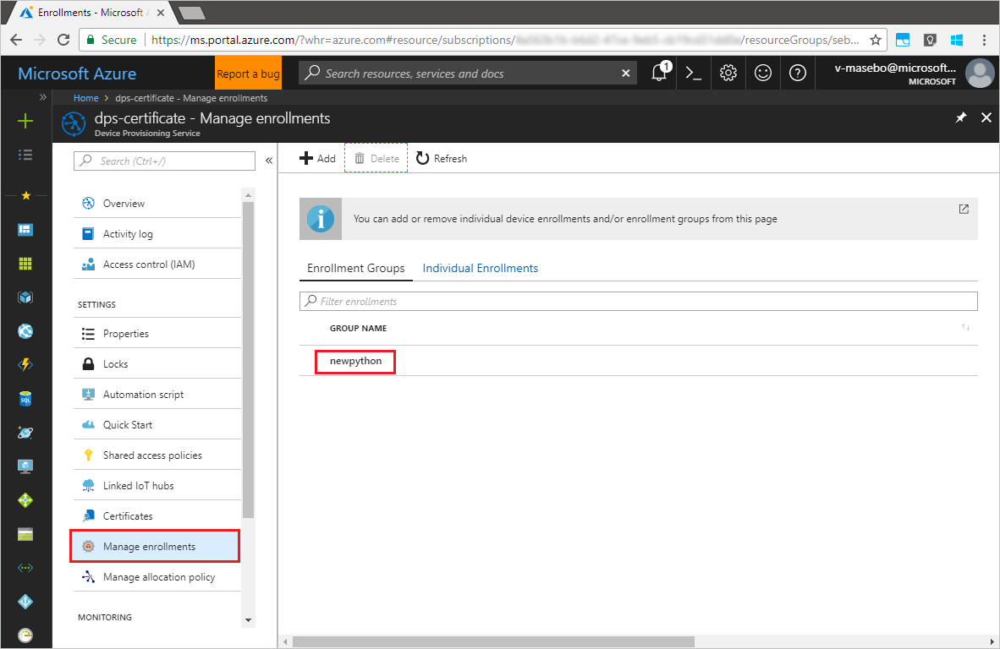

# Quickstart: Enroll X.509 devices to the Device Provisioning Service using Python

[!INCLUDE [iot-dps-selector-quick-enroll-device-x509](../../includes/iot-dps-selector-quick-enroll-device-x509.md)]

In this quickstart, you use Python to programmatically create an enrollment group that uses intermediate or root CA X.509 certificates. An enrollment group controls access to the provisioning service for devices that share a common signing certificate in their certificate chain. The enrollment group is created using the Python Provisioning Service SDK and a sample Python application.

## Prerequisites

- Completion of [Set up the IoT Hub Device Provisioning Service with the Azure portal](./quick-setup-auto-provision.md).
- An Azure account with an active subscription. [Create one for free](https://azure.microsoft.com/free/?ref=microsoft.com&utm_source=microsoft.com&utm_medium=docs&utm_campaign=visualstudio).
- [Python 2.x or 3.x](https://www.python.org/downloads/). Add Python to your platform-specific environment variables. This quickstart installs the [Python Provisioning Service SDK](https://github.com/Azure/azure-iot-sdk-python/tree/v1-deprecated/provisioning_service_client) below.
- [Pip](https://pip.pypa.io/en/stable/installing/), if not included with your distribution of Python.
- [Git](https://git-scm.com/download/).

> [!IMPORTANT]
> This article only applies to the deprecated V1 Python SDK. Device and service clients for the IoT Hub Device Provisioning Service are not yet available in V2. The team is currently hard at work to bring V2 to feature parity.

## Prepare test certificates

For this quickstart, you must have a .pem or a .cer file that contains the public portion of an intermediate or root CA X.509 certificate. This certificate must be uploaded to your provisioning service, and verified by the service.

For more information about using X.509 certificate-based Public Key Infrastructure (PKI) with Azure IoT Hub and Device Provisioning Service, see [X.509 CA certificate security overview](https://docs.microsoft.com/azure/iot-hub/iot-hub-x509ca-overview).

The [Azure IoT C SDK](https://github.com/Azure/azure-iot-sdk-c) contains test tooling that can help you create an X.509 certificate chain, upload a root or intermediate certificate from that chain, and perform proof-of-possession with the service to verify the certificate. Certificates created with the SDK tooling are designed to use for **development testing only**. These certificates **must not be used in production**. They contain hard-coded passwords ("1234") that expire after 30 days. To learn about obtaining certificates suitable for production use, see [How to get an X.509 CA certificate](https://docs.microsoft.com/azure/iot-hub/iot-hub-x509ca-overview#how-to-get-an-x509-ca-certificate) in the Azure IoT Hub documentation.

To use this test tooling to generate certificates, perform the following steps:

1. Find the tag name for the [latest release](https://github.com/Azure/azure-iot-sdk-c/releases/latest) of the Azure IoT C SDK.

2. Open a command prompt or Git Bash shell, and change to a working folder on your machine. Run the following commands to clone the latest release of the [Azure IoT C SDK](https://github.com/Azure/azure-iot-sdk-c) GitHub repository. Use the tag you found in the previous step as the value for the `-b` parameter:

    ```cmd/sh
    git clone -b <release-tag> https://github.com/Azure/azure-iot-sdk-c.git
    cd azure-iot-sdk-c
    git submodule update --init
    ```

    You should expect this operation to take several minutes to complete.

   The test tooling is located in the *azure-iot-sdk-c/tools/CACertificates* of the repository you cloned.

3. Follow the steps in [Managing test CA certificates for samples and tutorials](https://github.com/Azure/azure-iot-sdk-c/blob/master/tools/CACertificates/CACertificateOverview.md). 

## Modify the Python sample code

This section shows how to add the provisioning details of your X.509 device to the sample code. 

1. Using a text editor, create a new **EnrollmentGroup.py** file.

1. Add the following `import` statements and variables at the start of the **EnrollmentGroup.py** file. Then replace `dpsConnectionString` with your connection string found under **Shared access policies** in your **Device Provisioning Service** on the **Azure portal**. Replace the certificate placeholder with the certificate created previously in [Prepare test certificates](quick-enroll-device-x509-python.md#prepare-test-certificates). Finally, create a unique `registrationid` and be sure that it only consists of lower-case alphanumerics and hyphens.  
   
    ```python
    from provisioningserviceclient import ProvisioningServiceClient
    from provisioningserviceclient.models import EnrollmentGroup, AttestationMechanism

    CONNECTION_STRING = "{dpsConnectionString}"

    SIGNING_CERT = """-----BEGIN CERTIFICATE-----
    XXXXXXXXXXXXXXXXXXXXXXXXXXXXXXXXXXXXXXXXXXXXXXXXXXXXXXXXXXXXXXXX
    XXXXXXXXXXXXXXXXXXXXXXXXXXXXXXXXXXXXXXXXXXXXXXXXXXXXXXXXXXXXXXXX
    XXXXXXXXXXXXXXXXXXXXXXXXXXXXXXXXXXXXXXXXXXXXXXXXXXXXXXXXXXXXXXXX
    XXXXXXXXXXXXXXXXXXXXXXXXXXXXXXXXXXXXXXXXXXXXXXXXXXXXXXXXXXXXXXXX
    XXXXXXXXXXXXXXXXXXXXXXXXXXXXXXXXXXXXXXXXXXXXXXXXXXXXXXXXXXXXXXXX
    XXXXXXXXXXXXXXXXXXXXXXXXXXXXXXXXXXXXXXXXXXXXXXXXXXXXXXXXXXXXXXXX
    XXXXXXXXXXXXXXXXXXXXXXXXXXXXXXXXXXXXXXXXXXXXXXXXXXXXXXXXXXXXXXXX
    XXXXXXXXXXXXXXXXXXXXXXXXXXXXXXXXXXXXXXXXXXXXXXXXXXXXXXXXXXXXXXXX
    XXXXXXXXXXXXXXXXXXXXXXXXXXXXXXXXXXXXXXXXXXXXXXXXXXXXXXXXXXXXXXXX
    XXXXXXXXXXXXXXXXXXXXXXXXXXXXXXXXXXXXXXXXXXXXXXXXXXXXXXXXXXXXXXXX
    XXXXXXXXXXXXXXXXXXXXXXXXXXXXXXXXXXXXXXXXXXXXXXXXXXXXXXXXXXXXXXXX
    XXXXXXXXXXXXXXXXXXXXXXXXXXXXXXXXXXXXXXXXXXXXXXXXXXXXXXXXXXXXXXXX
    XXXXXXXXXXXXXXXXXXXXXXXXXXXXXXXXXXXXXXXXXXXXXXXXXXXXXXXXXXXXXXXX
    XXXXXXXXXXXXXXXXXXXXXXXXXXXXXXXXXXXXXXXXXXXXXXXXXXXXXXXXXXXXXXXX
    XXXXXXXXXXXXXXXXXXXXXXXXXXXXXXXXXXXXXXXXXXXXXXXXXXXXXXXX
    -----END CERTIFICATE-----"""

    GROUP_ID = "{registrationid}"
    ```

1. Add the following function and function call to implement the group enrollment creation:
   
    ```python
    def main():
        print ( "Initiating enrollment group creation..." )

        psc = ProvisioningServiceClient.create_from_connection_string(CONNECTION_STRING)
        att = AttestationMechanism.create_with_x509_signing_certs(SIGNING_CERT)
        eg = EnrollmentGroup.create(GROUP_ID, att)

        eg = psc.create_or_update(eg)
    
        print ( "Enrollment group created." )

    if __name__ == '__main__':
        main()
    ```

1. Save and close the **EnrollmentGroup.py** file.
 

## Run the sample group enrollment

The Azure IoT Device Provisioning Service supports two types of enrollments:

- [Enrollment groups](concepts-service.md#enrollment-group): Used to enroll multiple related devices.
- [Individual enrollments](concepts-service.md#individual-enrollment): Used to enroll a single device.

Creating Individual enrollments using the [Python Provisioning Service SDK](https://github.com/Azure/azure-iot-sdk-python/tree/v1-deprecated/provisioning_service_client) is still a work in progress. To learn more, see [Controlling device access to the provisioning service with X.509 certificates](./concepts-security.md#controlling-device-access-to-the-provisioning-service-with-x509-certificates).

1. Open a command prompt, and run the following command to install the [azure-iot-provisioning-device-client](https://pypi.org/project/azure-iot-provisioning-device-client).

    ```cmd/sh
    pip install azure-iothub-provisioningserviceclient    
    ```

2. In the command prompt, and run the script.

    ```cmd/sh
    python EnrollmentGroup.py
    ```

3. Observe the output for the successful enrollment.

4. Navigate to your provisioning service in the Azure portal. Click **Manage enrollments**. Notice that your group of X.509 devices appears under the **Enrollment Groups** tab, with the name `registrationid` created earlier. 

      


## Clean up resources
If you plan to explore the Java service sample, do not clean up the resources created in this quickstart. If you do not plan to continue, use the following steps to delete all resources created by this quickstart.

1. Close the Java sample output window on your machine.
1. Close the _X509 Cert Generator_ window on your machine.
1. Navigate to your Device Provisioning service in the Azure portal, select **Manage enrollments**, and then select the **Enrollment Groups** tab. Select the check box next to the *GROUP NAME* for the X.509 devices you enrolled using this quickstart, and press the **Delete** button at the top of the pane.    


## Next steps
In this quickstart, you enrolled a simulated group of X.509 devices to your Device Provisioning service. To learn about device provisioning in depth, continue to the tutorial for the Device Provisioning Service setup in the Azure portal. 

> [!div class="nextstepaction"]
> [Azure IoT Hub Device Provisioning Service tutorials](./tutorial-set-up-cloud.md)
