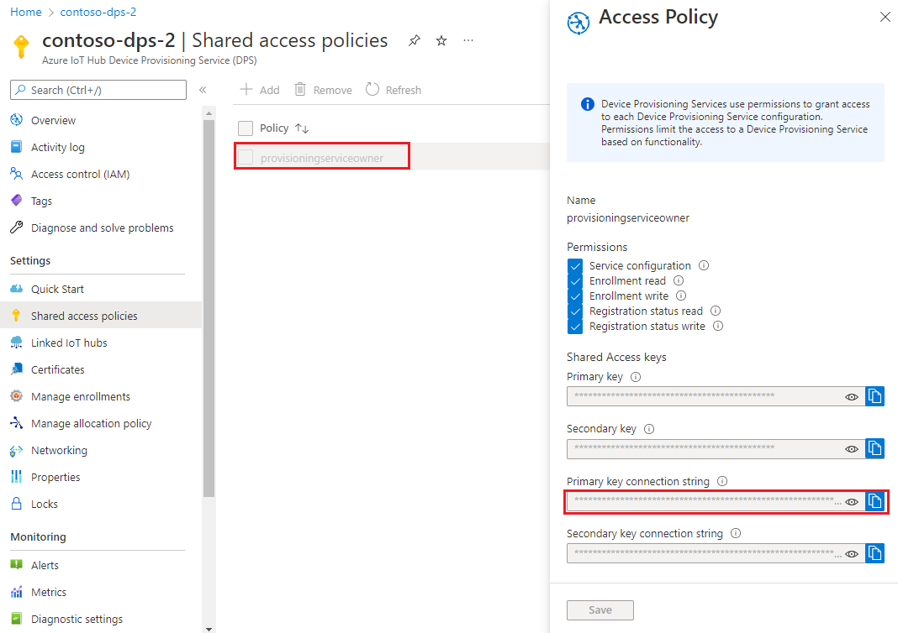
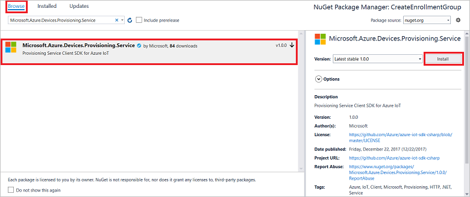
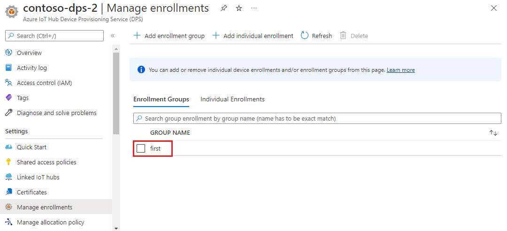

 
# Quickstart: Create an enrollment group that uses X.509 certificates

This quickstart shows you how to programmatically create an [enrollment group](concepts-service.md#enrollment-group) that uses intermediate or root CA X.509 certificates. The enrollment group is created by using the [Microsoft Azure IoT SDK](../iot-hub/iot-hub-devguide-sdks.md) and a sample application. An enrollment group controls access to the provisioning service for devices that share a common signing certificate in their certificate chain. To learn more, see [Controlling device access to the provisioning service with X.509 certificates](./concepts-x509-attestation.md#controlling-device-access-to-the-provisioning-service-with-x509-certificates). For more information about using X.509 certificate-based Public Key Infrastructure (PKI) with Azure IoT Hub and Device Provisioning Service, see [X.509 CA certificate security overview](../iot-hub/iot-hub-x509ca-overview.md).

## Prerequisites

[!INCLUDE [quickstarts-free-trial-note](../../includes/quickstarts-free-trial-note.md)]

* Complete the steps in [Set up IoT Hub Device Provisioning Service with the Azure portal](./quick-setup-auto-provision.md).

:::zone pivot="programming-language-csharp"

* Install [Visual Studio 2019](https://www.visualstudio.com/vs/).

* Install [.NET Core 3.1 SDK or later](https://dotnet.microsoft.com/download) or later on your Windows-based machine. You can use the following command to check your version.

    ```bash
    dotnet --info
    ```

:::zone-end

:::zone pivot="programming-language-nodejs"

* Install [Node.js v4.0 or above](https://nodejs.org) or later on your machine.

:::zone-end

:::zone pivot="programming-language-python"

* Install the [Python 2.x or 3.x](https://www.python.org/downloads/) and add Python to your platform-specific environment variables.

    > [!IMPORTANT]
    > This article only applies to the deprecated V1 Python SDK. Device and service clients for the IoT Hub Device Provisioning Service are not yet available in V2. The team is currently hard at work to bring V2 to feature parity.

* Install [Pip](https://pip.pypa.io/en/stable/installing/), if it is not already included with your Python distribution.

:::zone-end

:::zone pivot="programming-language-java"

* [Java SE Development Kit 8](/azure/developer/java/fundamentals/java-support-on-azure). This quickstart installs the [Java Service SDK](https://azure.github.io/azure-iot-sdk-java/master/service/) below. It works on both Windows and Linux. This quickstart uses Windows.

* [Maven 3](https://maven.apache.org/download.cgi).

:::zone-end

* Install the latest version of [Git](https://git-scm.com/download/). Make sure that Git is added to the environment variables accessible to the command window. See [Software Freedom Conservancy's Git client tools](https://git-scm.com/download/) for the latest version of `git` tools to install, which includes *Git Bash*, the command-line app that you can use to interact with your local Git repository.

>[!NOTE]
>Although the steps in this article work on both Windows and Linux computers, this article uses a Windows development computer.

:::zone pivot="programming-language-csharp,programming-language-nodejs, programming-language-python"

## Prepare test certificates

For this quickstart, you must have a *.pem* or a *.cer* file that contains the public portion of an intermediate or root CA X.509 certificate. This certificate must be uploaded to your provisioning service, and verified by the service.

### Clone the Azure IoT C SDK

The [Azure IoT C SDK](https://github.com/Azure/azure-iot-sdk-c) contains test tooling that can help you create an X.509 certificate chain, upload a root or intermediate certificate from that chain, and do proof-of-possession with the service to verify the certificate.

If you've already cloned the latest release of the [Azure IoT C SDK](https://github.com/Azure/azure-iot-sdk-c) GitHub repository, skip to the [next section](create-a-test-self-signed-x.509-device-certificate).

1. Open a web browser, and go to the [Release page of the Azure IoT C SDK](https://github.com/Azure/azure-iot-sdk-c/releases/latest).

2. Copy the tag name for the latest release of the Azure IoT C SDK.

3. Open a command prompt or Git Bash shell. Run the following commands to clone the latest release of the [Azure IoT C SDK](https://github.com/Azure/azure-iot-sdk-c) GitHub repository. (replace `<release-tag>` with the tag you copied in the previous step).

    ```cmd/sh
    git clone -b <release-tag> https://github.com/Azure/azure-iot-sdk-c.git
    cd azure-iot-sdk-c
    git submodule update --init
    ```

    This operation may take several minutes to complete.

4. The test tooling should now be located in the *azure-iot-sdk-c/tools/CACertificates* of the repository that you cloned.

### Create the test certificates

To create the test certificates:

1. Follow the steps in [Managing test CA certificates for samples and tutorials](https://github.com/Azure/azure-iot-sdk-c/blob/master/tools/CACertificates/CACertificateOverview.md).

2. After you've created the certificates, sign in to the [Azure portal](https://portal.azure.com).

3. On the left-hand menu or on the portal page, select **All resources**.

4. Select your Device Provisioning Service.

5. In the **Settings** menu, select **Certificates*.

6. On the top menu, select **+ Add:**.

7. Type in in a certificate name, and upload the *.pem* file you create in the preceding section.

8. Select **Set certificate status to verified on upload**.

9. Select **Save**.

:::image type="content" source="./media/quick-enroll-device-x509/add-certificate.png" alt-text="Add a certificate for verification.":::

>[!TIP]
>In addition to the tooling in the C SDK, the [Group certificate verification sample](https://github.com/Azure-Samples/azure-iot-samples-csharp/tree/master/provisioning/Samples/service/GroupCertificateVerificationSample) in the *Microsoft Azure IoT SDK for .NET* shows how to do proof-of-possession in C# with an existing X.509 intermediate or root CA certificate.
:::zone-end

## Get the connection string for your provisioning service

For the sample in this quickstart, you'll need to copy the connection string for your provisioning service.

1. Sign in to the [Azure portal](https://portal.azure.com).

2. On the left-hand menu or on the portal page, select **All resources**.

3. Select your Device Provisioning Service.

4. In the **Settings** menu, select **Shared access policies**.

5. Select the access policy that you want to use.

6. In the **Access Policy** panel, copy and save the primary key connection string.

    

:::zone-end

## Create the enrollment group sample

:::zone pivot="programming-language-csharp"

This section shows you how to create a .NET Core console application that adds an enrollment group to your provisioning service.

>[!TIP]
>You can, with some modification, follow these steps to create a [Windows IoT Core](https://developer.microsoft.com/en-us/windows/iot) console application that adds an enrollment group. To learn more about developing with IoT Core, see the [Windows IoT Core developer documentation](/windows/iot-core/).

1. Open Visual Studio, and select **Create a new project**.

2. In the **Create a new project** panel, select **Console Application*.

3. Select **Next**.

4. For **Project name**, type *CreateEnrollmentGroup*.

5. Select**Next**. Keep the default **Target framework**.

6. Select **Create**.

7. After the solution is opened, in the **Solution Explorer** pane, right-click the **CreateEnrollmentGroup** project, and then select **Manage NuGet Packages**.

8. In **NuGet Package Manager**, select **Browse**.

9. Type in and select *Microsoft.Azure.Devices.Provisioning.Service*.

10. Select **Install**.

    

    This step downloads, installs, and adds a reference to the [Azure IoT Provisioning Service Client SDK](https://www.nuget.org/packages/Microsoft.Azure.Devices.Provisioning.Service/) NuGet package and its dependencies.

11. Add the following `using` statements after the other `using` statements at the top of `Program.cs`:

    ```csharp
    using System.Security.Cryptography.X509Certificates;
    using System.Threading.Tasks;
    using Microsoft.Azure.Devices.Provisioning.Service;
    ```

12. Add the following fields to the `Program` class, and make the listed changes.  

    ```csharp
    private static string ProvisioningConnectionString = "{ProvisioningServiceConnectionString}";
    private static string EnrollmentGroupId = "enrollmentgrouptest";
    private static string X509RootCertPath = @"{Path to a .cer or .pem file for a verified root CA or intermediate CA X.509 certificate}";
    ```

13. Replace the `ProvisioningServiceConnectionString` placeholder value with the connection string of the provisioning service that you copied in the previous section.

14. Replace the `X509RootCertPath` placeholder value with the path to a .pem or .cer file. This file represents the public part of an intermediate or root CA X.509 certificate that has been previously uploaded and verified with your provisioning service.

15. You may optionally change the `EnrollmentGroupId` value. The string can contain only lower case characters and hyphens.

    > [!IMPORTANT]
    > In production code, be aware of the following security considerations:
    >
    > * Hard-coding the connection string for the provisioning service administrator is against security best practices. Instead, the connection string should be held in a secure manner, such as in a secure configuration file or in the registry.
    > * Be sure to upload only the public part of the signing certificate. Never upload .pfx (PKCS12) or .pem files containing private keys to the provisioning service.

16. Add the following method to the `Program` class. This code creates an enrollment group entry and then calls the `CreateOrUpdateEnrollmentGroupAsync` method on `ProvisioningServiceClient` to add the enrollment group to the provisioning service.

    ```csharp
    public static async Task RunSample()
    {
        Console.WriteLine("Starting sample...");
    
        using (ProvisioningServiceClient provisioningServiceClient =
                ProvisioningServiceClient.CreateFromConnectionString(ProvisioningConnectionString))
        {
            #region Create a new enrollmentGroup config
            Console.WriteLine("\nCreating a new enrollmentGroup...");
            var certificate = new X509Certificate2(X509RootCertPath);
            Attestation attestation = X509Attestation.CreateFromRootCertificates(certificate);
            EnrollmentGroup enrollmentGroup =
                    new EnrollmentGroup(
                            EnrollmentGroupId,
                            attestation)
                    {
                        ProvisioningStatus = ProvisioningStatus.Enabled
                    };
            Console.WriteLine(enrollmentGroup);
            #endregion
    
            #region Create the enrollmentGroup
            Console.WriteLine("\nAdding new enrollmentGroup...");
            EnrollmentGroup enrollmentGroupResult =
                await provisioningServiceClient.CreateOrUpdateEnrollmentGroupAsync(enrollmentGroup).ConfigureAwait(false);
            Console.WriteLine("\nEnrollmentGroup created with success.");
            Console.WriteLine(enrollmentGroupResult);
            #endregion
    
        }
    }
    ```

17. Finally, replace the `Main` method with the following lines:

    ```csharp
    static async Task Main(string[] args)
    {
        await RunSample();
        Console.WriteLine("\nHit <Enter> to exit ...");
        Console.ReadLine();
    }
    ```

18. Build the solution.

:: zone-end

:::zone pivot="programming-language-nodejs"

This section shows you how to create a node.js script that adds an enrollment group to your provisioning service.

1. From a command window in your working folder, run:

     ```cmd\sh
     npm install azure-iot-provisioning-service
     ```  

2. Using a text editor, create a **create_enrollment_group.js** file in your working folder. Add the following code to the file and save:

    ```javascript
        'use strict';
        var fs = require('fs');
    
        var provisioningServiceClient = require('azure-iot-provisioning-service').ProvisioningServiceClient;
    
        var serviceClient = provisioningServiceClient.fromConnectionString(process.argv[2]);
    
        var enrollment = {
          enrollmentGroupId: 'first',
          attestation: {
            type: 'x509',
            x509: {
              signingCertificates: {
                primary: {
                  certificate: fs.readFileSync(process.argv[3], 'utf-8').toString()
                }
              }
            }
          },
          provisioningStatus: 'disabled'
        };
    
        serviceClient.createOrUpdateEnrollmentGroup(enrollment, function(err, enrollmentResponse) {
          if (err) {
            console.log('error creating the group enrollment: ' + err);
          } else {
            console.log("enrollment record returned: " + JSON.stringify(enrollmentResponse, null, 2));
            enrollmentResponse.provisioningStatus = 'enabled';
            serviceClient.createOrUpdateEnrollmentGroup(enrollmentResponse, function(err, enrollmentResponse) {
              if (err) {
                console.log('error updating the group enrollment: ' + err);
              } else {
                console.log("updated enrollment record returned: " + JSON.stringify(enrollmentResponse, null, 2));
              }
            });
          }
        });
    ```

:::zone-end

:::zone pivot="programming-language-python"

1. Using a text editor, create a new *EnrollmentGroup.py* file.

2. Copy the following Python code into the file(replace `{dpsConnectionString}` with the connection string you copied earlier, the certificate placeholder with the certificate created in 
[Prepare test certificates](#prepare-test-certificates), and `{registrationid}` with a unique `registrationid` that consists only of lower-case alphanumerics and hyphens):

    ```python
    from provisioningserviceclient import ProvisioningServiceClient
    from provisioningserviceclient.models import EnrollmentGroup, AttestationMechanism
    
    CONNECTION_STRING = "{dpsConnectionString}"
    
    SIGNING_CERT = """-----BEGIN CERTIFICATE-----
    XXXXXXXXXXXXXXXXXXXXXXXXXXXXXXXXXXXXXXXXXXXXXXXXXXXXXXXXXXXXXXXX
    XXXXXXXXXXXXXXXXXXXXXXXXXXXXXXXXXXXXXXXXXXXXXXXXXXXXXXXXXXXXXXXX
    XXXXXXXXXXXXXXXXXXXXXXXXXXXXXXXXXXXXXXXXXXXXXXXXXXXXXXXXXXXXXXXX
    XXXXXXXXXXXXXXXXXXXXXXXXXXXXXXXXXXXXXXXXXXXXXXXXXXXXXXXXXXXXXXXX
    XXXXXXXXXXXXXXXXXXXXXXXXXXXXXXXXXXXXXXXXXXXXXXXXXXXXXXXXXXXXXXXX
    XXXXXXXXXXXXXXXXXXXXXXXXXXXXXXXXXXXXXXXXXXXXXXXXXXXXXXXXXXXXXXXX
    XXXXXXXXXXXXXXXXXXXXXXXXXXXXXXXXXXXXXXXXXXXXXXXXXXXXXXXXXXXXXXXX
    XXXXXXXXXXXXXXXXXXXXXXXXXXXXXXXXXXXXXXXXXXXXXXXXXXXXXXXXXXXXXXXX
    XXXXXXXXXXXXXXXXXXXXXXXXXXXXXXXXXXXXXXXXXXXXXXXXXXXXXXXXXXXXXXXX
    XXXXXXXXXXXXXXXXXXXXXXXXXXXXXXXXXXXXXXXXXXXXXXXXXXXXXXXXXXXXXXXX
    XXXXXXXXXXXXXXXXXXXXXXXXXXXXXXXXXXXXXXXXXXXXXXXXXXXXXXXXXXXXXXXX
    XXXXXXXXXXXXXXXXXXXXXXXXXXXXXXXXXXXXXXXXXXXXXXXXXXXXXXXXXXXXXXXX
    XXXXXXXXXXXXXXXXXXXXXXXXXXXXXXXXXXXXXXXXXXXXXXXXXXXXXXXXXXXXXXXX
    XXXXXXXXXXXXXXXXXXXXXXXXXXXXXXXXXXXXXXXXXXXXXXXXXXXXXXXXXXXXXXXX
    XXXXXXXXXXXXXXXXXXXXXXXXXXXXXXXXXXXXXXXXXXXXXXXXXXXXXXXX
    -----END CERTIFICATE-----"""
    
    GROUP_ID = "{registrationid}"

    def main():
        print ( "Initiating enrollment group creation..." )

        psc = ProvisioningServiceClient.create_from_connection_string(CONNECTION_STRING)
        att = AttestationMechanism.create_with_x509_signing_certs(SIGNING_CERT)
        eg = EnrollmentGroup.create(GROUP_ID, att)

        eg = psc.create_or_update(eg)
    
        print ( "Enrollment group created." )

    if __name__ == '__main__':
        main()
    ```

3. Save and close the **EnrollmentGroup.py** file.

:::zone-end

:::zone pivot="programming-language-java"

:::zone-end

## Run the enrollment group sample

:::zone pivot="programming-language-csharp"

1. Run the sample in Visual Studio to create the enrollment group. A command window will appear, and will show confirmation messages.

2. Upon successful creation, the command window displays the properties of the new enrollment group.

:::zone-end

:::zone pivot="programming-language-nodejs"

1. Open a command prompt, and the following command (include the quotes around the command arguments and replace `<connection string>` withe connection string you copied in the previous section, and `<certificate .pem file>` with the path of your `.pem` file):

    ```cmd\sh
    node create_enrollment_group.js "<connection string>" "<certificate .pem file>"
    ```

2. Upon successful creation, the command window displays the properties of the new enrollment group.

:::zone-end

826D90BB32FABDAEFD58697C0194A9604D07B2C6

1. Open a command prompt in Administrator Mode, and run the following command to install the [azure-iot-provisioning-device-client](https://pypi.org/project/azure-iot-provisioning-device-client).

    ```cmd/sh
    pip install azure-iothub-provisioningserviceclient    
    ```

2. In the command prompt, run the script:

    ```cmd/sh
    python EnrollmentGroup.py
    ```

3. Upon successful creation, the command window displays the properties of the new enrollment group.

:::zone-end

:::zone pivot="programming-language-java"

:::zone-end

To verify that the enrollment group has been created:

1. In the Azure portal, select your Device Provisioning Service.

2. In the **Settings** menu, select **Manage enrollments**.

3. Select **Enrollment Groups**. You should see a new enrollment entry that corresponds to the registration ID that you used in the sample.

:::zone pivot="programming-language-csharp"

:::image type="content" source="./media/quick-enroll-device-x509/verify-enrollment-csharp.png" alt-text="Verify enrollment for C# group in the portal.":::

:::zone-end

:::zone pivot="programming-language-nodejs"



:::zone-end

:::zone pivot="programming-language-python"

:::image type="content" source="./media/quick-enroll-device-x509/verify-enrollment-python.png" alt-text="Verify enrollment for Python group in the portal.":::

:::zone-end

## Clean up resources

If you plan to explore the [Azure IoT Hub Device Provisioning Service tutorials](./tutorial-set-up-cloud.md), don't clean up the resources created in this quickstart. Otherwise, use the following steps to delete all resources created by this quickstart.

1. Close the sample output window on your computer.

2. From the left-hand menu in the Azure portal, select **All resources**.

3. Select your Device Provisioning Service.

4. In the **Settings** menu, select **Manage enrollments**.

5. Select the **Enrollment Groups** tab.

6. Select the check box next to the *REGISTRATION ID* of the device you enrolled in this quickstart.

7. At the top of the page, select  **Delete**.

8. From your Device Provisioning Service in the Azure portal, select **Certificates**.

9. Select the certificate you uploaded for this quickstart.

10. At the top of **Certificate Details**, select **Delete**.  

## Next steps

In this quickstart, you created an enrollment group for an X.509 intermediate or root CA certificate using the Azure IoT Hub Device Provisioning Service. To learn about device provisioning in depth, continue to the tutorial for the Device Provisioning Service setup in the Azure portal.

> [!div class="nextstepaction"]
> [Azure IoT Hub Device Provisioning Service tutorials](./tutorial-set-up-cloud.md)

:::zone pivot="programming-language-nodejs"

> [!div class="nextstepaction"]
>[Node.js device provisioning sample](https://github.com/Azure/azure-iot-sdk-node/tree/master/provisioning/device/samples).

:::zone-end