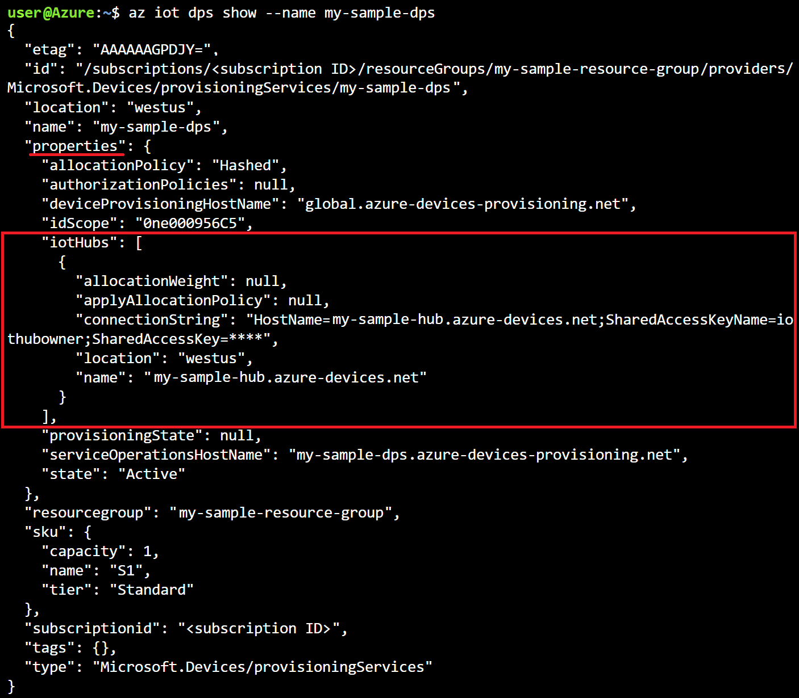

# Quickstart: Set up the IoT Hub Device Provisioning Service with Azure CLI

The Azure CLI is used to create and manage Azure resources from the command line or in scripts. This quickstart details using the Azure CLI to create an IoT hub and an IoT Hub Device Provisioning Service, and to link the two services together. 

[!INCLUDE [quickstarts-free-trial-note](../../includes/quickstarts-free-trial-note.md)]

> [!IMPORTANT]
> Both the IoT hub and the provisioning service you create in this quickstart will be publicly discoverable as DNS endpoints. Make sure to avoid any sensitive information if you decide to change the names used for these resources.
>

[!INCLUDE [azure-cli-prepare-your-environment.md](../../includes/azure-cli-prepare-your-environment.md)]


## Create a resource group

Create a resource group with the [az group create](/cli/azure/group#az_group_create) command. An Azure resource group is a logical container into which Azure resources are deployed and managed. 

The following example creates a resource group named *my-sample-resource-group* in the *westus* location.

```azurecli-interactive 
az group create --name my-sample-resource-group --location westus
```

> [!TIP]
> The example creates the resource group in the West US location. You can view a list of available locations by running the command `az account list-locations -o table`.
>
>

## Create an IoT hub

Create an IoT hub with the [az iot hub create](/cli/azure/iot/hub#az_iot_hub_create) command.

The following example creates an IoT hub named *my-sample-hub* in the *westus* location. An IoT hub name must be globally unique in Azure, so you may want to add a unique prefix or suffix to the example name, or choose a new name altogether. Make sure your name follows proper naming conventions for an IoT hub: it should be 3-50 characters in length, and can contain only upper or lower case alphanumeric characters or hyphens ('-'). 

```azurecli-interactive 
az iot hub create --name my-sample-hub --resource-group my-sample-resource-group --location westus
```

## Create a Device Provisioning Service

Create a Device Provisioning Service with the [az iot dps create](/cli/azure/iot/dps#az_iot_dps_create) command. 

The following example creates a provisioning service named *my-sample-dps* in the *westus* location. You will also need to choose a globally unique name for your own provisioning service. Make sure it follows proper naming conventions for an IoT Hub Device Provisioning Service: it should be 3-64 characters in length and can contain only upper or lower case alphanumeric characters or hyphens ('-').

```azurecli-interactive 
az iot dps create --name my-sample-dps --resource-group my-sample-resource-group --location westus
```

> [!TIP]
> The example creates the provisioning service in the West US location. You can view a list of available locations by running the command `az provider show --namespace Microsoft.Devices --query "resourceTypes[?resourceType=='ProvisioningServices'].locations | [0]" --out table` or by going to the [Azure Status](https://azure.microsoft.com/status/) page and searching for "Device Provisioning Service". In commands, locations can be specified either in one word or multi-word format; for example: westus, West US, WEST US, etc. The value is not case sensitive. If you use multi-word format to specify location, enclose the value in quotes; for example, `--location "West US"`.
>

## Get the connection string for the IoT hub

You need your IoT hub's connection string to link it with the Device Provisioning Service. Use the [az iot hub show-connection-string](/cli/azure/iot/hub#az_iot_hub_show_connection_string) command to get the connection string and use its output to set a variable that you will use when you link the two resources. 

The following example sets the *hubConnectionString* variable to the value of the connection string for the primary key of the hub's *iothubowner* policy (the `--policy-name` parameter can be used to specify a different policy). Trade out *my-sample-hub* for the unique IoT hub name you chose earlier. The command uses the Azure CLI [query](/cli/azure/query-azure-cli) and [output](/cli/azure/format-output-azure-cli#tsv-output-format) options to extract the connection string from the command output.

```azurecli-interactive 
hubConnectionString=$(az iot hub show-connection-string --name my-sample-hub --key primary --query connectionString -o tsv)
```

You can use the `echo` command to see the connection string.

```azurecli-interactive 
echo $hubConnectionString
```

> [!NOTE]
> These two commands are valid for a host running under Bash.
> 
> If you're using a local Windows/CMD shell or a PowerShell host, modify the commands to use the correct syntax for that environment.
>
> If you're using Azure Cloud Shell, check that the environment drop-down on the left side of the shell window says **Bash**.
>

## Link the IoT hub and the provisioning service

Link the IoT hub and your provisioning service with the [az iot dps linked-hub create](/cli/azure/iot/dps/linked-hub#az_iot_dps_linked_hub_create) command. 

The following example links an IoT hub named *my-sample-hub* in the *westus* location and a Device Provisioning Service named *my-sample-dps*. Trade out these names for the unique IoT hub and Device Provisioning Service names you chose earlier. The command uses the connection string for your IoT hub that was stored in the *hubConnectionString* variable in the previous step.

```azurecli-interactive 
az iot dps linked-hub create --dps-name my-sample-dps --resource-group my-sample-resource-group --connection-string $hubConnectionString --location westus
```

The command may take a few minutes to complete.

## Verify the provisioning service

Get the details of your provisioning service with the [az iot dps show](/cli/azure/iot/dps#az_iot_dps_show) command.

The following example gets the details of a provisioning service named *my-sample-dps*. Trade out this name for your own Device Provisioning Service name.

```azurecli-interactive
az iot dps show --name my-sample-dps
```
The linked IoT hub is shown in the *properties.iotHubs* collection.



## Clean up resources

Other quickstarts in this collection build upon this quickstart. If you plan to continue on to work with subsequent quickstarts or with the tutorials, do not clean up the resources created in this quickstart. If you do not plan to continue, you can use the following commands to delete the provisioning service, the IoT hub or the resource group and all of its resources. Replace the names of the resources written below with the names of your own resources.

To delete the provisioning service, run the [az iot dps delete](/cli/azure/iot/dps#az_iot_dps_delete) command:

```azurecli-interactive
az iot dps delete --name my-sample-dps --resource-group my-sample-resource-group
```
To delete the IoT hub, run the [az iot hub delete](/cli/azure/iot/hub#az_iot_hub_delete) command:

```azurecli-interactive
az iot hub delete --name my-sample-hub --resource-group my-sample-resource-group
```

To delete a resource group and all its resources, run the [az group delete](/cli/azure/group#az_group_delete) command:

```azurecli-interactive
az group delete --name my-sample-resource-group
```

## Next steps

In this quickstart, you’ve deployed an IoT hub and a Device Provisioning Service instance, and linked the two resources. To learn how to use this setup to provision a simulated device, continue to the quickstart for creating a simulated device.

> [!div class="nextstepaction"]
> [Quickstart to create a simulated device](./quick-create-simulated-device.md)
