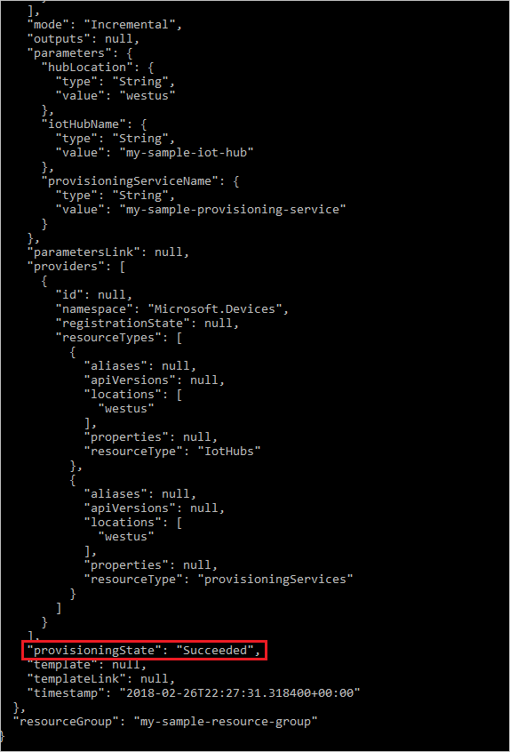

# Set up the IoT Hub Device Provisioning Service with an Azure Resource Manager template

You can use [Azure Resource Manager](https://docs.microsoft.com/azure/azure-resource-manager/resource-group-overview) to programmatically set up the Azure cloud resources necessary for provisioning your devices. These steps show how to create an IoT hub, a new IoT Hub Device Provisioning Service, and link the two services together using an Azure Resource Manager template. This Quickstart uses [Azure CLI](https://docs.microsoft.com/azure/azure-resource-manager/resource-group-template-deploy-cli) to perform the programmatic steps necessary to create a resource group and deploy the template, but you can easily use the [Azure portal](https://docs.microsoft.com/azure/azure-resource-manager/resource-group-template-deploy-portal), [PowerShell](https://docs.microsoft.com/azure/azure-resource-manager/resource-group-template-deploy), .NET, ruby, or other programming languages to perform these steps and deploy your template. 


## Prerequisites

- If you don't have an Azure subscription, create a [free account](https://azure.microsoft.com/free/?WT.mc_id=A261C142F) before you begin.
- This Quickstart requires that you run the Azure CLI locally. You must have the Azure CLI version 2.0 or later installed. Run `az --version` to find the version. If you need to install or upgrade the CLI, see [Install the Azure CLI](https://docs.microsoft.com/cli/azure/install-azure-cli).


## Sign in to Azure and create a resource group

Sign in to your Azure account and select your subscription.

1. At the command prompt, run the [login command][lnk-login-command]:
    
    ```azurecli
    az login
    ```

    Follow the instructions to authenticate using the code and sign in to your Azure account through a web browser.

2. If you have multiple Azure subscriptions, signing in to Azure grants you access to all the Azure accounts associated with your credentials. Use the following [command to list the Azure accounts][lnk-az-account-command] available for you to use:
    
    ```azurecli
    az account list 
    ```

    Use the following command to select subscription that you want to use to run the commands to create your IoT hub. You can use either the subscription name or ID from the output of the previous command:

    ```azurecli
    az account set --subscription {your subscription name or id}
    ```

3. When you create Azure cloud resources like IoT hubs and provisioning services, you create them in a resource group. Either use an existing resource group, or run the following [command to create a resource group][lnk-az-resource-command]:
    
    ```azurecli
     az group create --name {your resource group name} --location westus
    ```

    > [!TIP]
    > The previous example creates the resource group in the West US location. You can view a list of available locations by running the command `az account list-locations -o table`.
    >
    >

## Create a Resource Manager template

Use a JSON template to create a provisioning service and a linked IoT hub in your resource group. You can also use an Azure Resource Manager template to make changes to an existing provisioning service or IoT hub.

1. Use a text editor to create an Azure Resource Manager template called **template.json** with the following skeleton content. 

   ```json
   {
       "$schema": "https://schema.management.azure.com/schemas/2015-01-01/deploymentTemplate.json#",
       "contentVersion": "1.0.0.0",
       "parameters": {},
       "variables": {},
       "resources": []
   }
   ```

2. Replace the **parameters** section with the following content. The parameters section specifies parameters that can be passed in from another file. This section specifies the name of the IoT hub and provisioning service to create. It also specifies the location for both the IoT hub and provisioning service. The values are restricted to Azure regions that support IoT hubs and provisioning services. For a list of supported locations for Device Provisioning Service, you can run the following command `az provider show --namespace Microsoft.Devices --query "resourceTypes[?resourceType=='ProvisioningServices'].locations | [0]" --out table` or go to the [Azure Status](https://azure.microsoft.com/status/) page and search on "Device Provisioning Service".

   ```json
    "parameters": {
        "iotHubName": {
            "type": "string"
        },
        "provisioningServiceName": {
            "type": "string"
        },
        "hubLocation": {
            "type": "string",
            "allowedValues": [
                "eastus",
                "westus",
                "westeurope",
                "northeurope",
                "southeastasia",
                "eastasia"
            ]
        }
    },

   ```

3. Replace the **variables** section with the following content. This section defines values that are used later to construct the IoT hub connection string, which is needed to link the provisioning service and the IoT hub. 
 
   ```json
    "variables": {        
        "iotHubResourceId": "[resourceId('Microsoft.Devices/Iothubs', parameters('iotHubName'))]",
        "iotHubKeyName": "iothubowner",
        "iotHubKeyResource": "[resourceId('Microsoft.Devices/Iothubs/Iothubkeys', parameters('iotHubName'), variables('iotHubKeyName'))]"
    },

   ```

4. To create an IoT hub, add the following lines to the **resources** collection. The JSON specifies the minimum properties required to create an IoT Hub. The **name** and **location** properties are passed as parameters. To learn more about the properties you can specify for an IoT Hub in a template, see [Microsoft.Devices/IotHubs template reference](https://docs.microsoft.com/azure/templates/microsoft.devices/iothubs).

   ```json
        {
            "apiVersion": "2017-07-01",
            "type": "Microsoft.Devices/IotHubs",
            "name": "[parameters('iotHubName')]",
            "location": "[parameters('hubLocation')]",
            "sku": {
                "name": "S1",
                "capacity": 1
            },
            "tags": {
            },
            "properties": {
            }            
        },

   ``` 

5. To create the provisioning service, add the following lines after the IoT hub specification in the **resources** collection. The **name** and **location** of the provisioning service are passed in parameters. Specify the IoT hubs to link to the provisioning service in the **iotHubs** collection. At a minimum, you must specify the **connectionString** and **location** properties for each linked IoT hub. You can also set properties like **allocationWeight** and **applyAllocationPolicy** on each IoT hub, as well as properties like **allocationPolicy** and **authorizationPolicies** on the provisioning service itself. To learn more, see [Microsoft.Devices/provisioningServices template reference](https://docs.microsoft.com/azure/templates/microsoft.devices/provisioningservices).

   The **dependsOn** property is used to ensure that Resource Manager creates the IoT hub before it creates the provisioning service. The template requires the connection string of the IoT hub to specify its linkage to the provisioning service, so the hub and its keys must be created first. The template uses functions like **concat** and **listKeys** to create the connection string. To learn more, see [Azure Resource Manager template functions](https://docs.microsoft.com/azure/azure-resource-manager/resource-group-template-functions).

   ```json
        {
            "type": "Microsoft.Devices/provisioningServices",
            "sku": {
                "name": "S1",
                "capacity": 1
            },
            "name": "[parameters('provisioningServiceName')]",
            "apiVersion": "2017-11-15",
            "location": "[parameters('hubLocation')]",
            "tags": {},
            "properties": {
                "iotHubs": [
                    {
                        "connectionString": "[concat('HostName=', reference(variables('iotHubResourceId')).hostName, ';SharedAccessKeyName=', variables('iotHubKeyName'), ';SharedAccessKey=', listkeys(variables('iotHubKeyResource'), '2017-07-01').primaryKey)]",
                        "location": "[parameters('hubLocation')]",
                        "name": "[concat(parameters('iotHubName'),'.azure-devices.net')]"
                    }
                ]
            },
            "dependsOn": ["[parameters('iotHubName')]"]
        }

   ```

6. Save the template file. The finished template should look like the following:

   ```json
   {
       "$schema": "https://schema.management.azure.com/schemas/2015-01-01/deploymentTemplate.json#",
       "contentVersion": "1.0.0.0",
       "parameters": {
           "iotHubName": {
               "type": "string"
           },
           "provisioningServiceName": {
               "type": "string"
           },
           "hubLocation": {
               "type": "string",
               "allowedValues": [
                   "eastus",
                   "westus",
                   "westeurope",
                   "northeurope",
                   "southeastasia",
                   "eastasia"
               ]
           }
       },
       "variables": {        
           "iotHubResourceId": "[resourceId('Microsoft.Devices/Iothubs', parameters('iotHubName'))]",
           "iotHubKeyName": "iothubowner",
           "iotHubKeyResource": "[resourceId('Microsoft.Devices/Iothubs/Iothubkeys', parameters('iotHubName'), variables('iotHubKeyName'))]"
       },
       "resources": [
           {
               "apiVersion": "2017-07-01",
               "type": "Microsoft.Devices/IotHubs",
               "name": "[parameters('iotHubName')]",
               "location": "[parameters('hubLocation')]",
               "sku": {
                   "name": "S1",
                   "capacity": 1
               },
               "tags": {
               },
               "properties": {
               }            
           },
           {
               "type": "Microsoft.Devices/provisioningServices",
               "sku": {
                   "name": "S1",
                   "capacity": 1
               },
               "name": "[parameters('provisioningServiceName')]",
               "apiVersion": "2017-11-15",
               "location": "[parameters('hubLocation')]",
               "tags": {},
               "properties": {
                   "iotHubs": [
                       {
                           "connectionString": "[concat('HostName=', reference(variables('iotHubResourceId')).hostName, ';SharedAccessKeyName=', variables('iotHubKeyName'), ';SharedAccessKey=', listkeys(variables('iotHubKeyResource'), '2017-07-01').primaryKey)]",
                           "location": "[parameters('hubLocation')]",
                           "name": "[concat(parameters('iotHubName'),'.azure-devices.net')]"
                       }
                   ]
               },
               "dependsOn": ["[parameters('iotHubName')]"]
           }
       ]
   }
   ```

## Create a Resource Manager parameter file

The template that you defined in the last step uses parameters to specify the name of the IoT Hub, the name of the provisioning service, and the location (Azure region) to create them. You pass these parameters in a separate file. Doing so enables you to reuse the same template for multiple deployments. To create the parameter file, follow these steps:

1. Use a text editor to create an Azure Resource Manager parameter file called **parameters.json** with the following skeleton content: 

   ```json
   {
       "$schema": "https://schema.management.azure.com/schemas/2015-01-01/deploymentParameters.json#",
       "contentVersion": "1.0.0.0",
       "parameters": {}
       }
   }
   ```

2. Add the **iotHubName** value to the parameter section. If you change the name, make sure it follows proper naming conventions for an IoT hub. It should be 3-50 characters in length and can contain only upper or lower case alphanumeric characters or hyphens ('-'). 

   ```json
    "parameters": {
        "iotHubName": {
            "value": "my-sample-iot-hub"
        },
    }
   
   ```

3. Add the **provisioningServiceName** value to the parameter section. If you change the name, make sure it follows proper naming conventions for an IoT Hub Device Provisioning Service. It should be 3-64 characters in length and can contain only upper or lower case alphanumeric characters or hyphens ('-').

   ```json
    "parameters": {
        "iotHubName": {
            "value": "my-sample-iot-hub"
        },
        "provisioningServiceName": {
            "value": "my-sample-provisioning-service"
        },
    }

   ```

4. Add the **hubLocation** value to the parameter section. This value specifies the location for both the IoT hub and provisioning service. The value must correspond to one of the locations specified in the **allowedValues** collection in the parameter definition in the template file. This collection restricts the values to Azure locations that support both IoT hubs and provisioning services. For a list of supported locations for Device Provisioning Service, you can run the following command `az provider show --namespace Microsoft.Devices --query "resourceTypes[?resourceType=='ProvisioningServices'].locations | [0]" --out table` or go to the [Azure Status](https://azure.microsoft.com/status/) page and search on "Device Provisioning Service".

   ```json
    "parameters": {
        "iotHubName": {
            "value": "my-sample-iot-hub"
        },
        "provisioningServiceName": {
            "value": "my-sample-provisioning-service"
        },
        "hubLocation": {
            "value": "westus"
        }
    }

   ```

5. Save the file. 


> [!IMPORTANT]
> Both the IoT hub and the provisioning service will be publicly discoverable as DNS endpoints, so make sure to avoid any sensitive information when naming them.
>

## Deploy the template

Use the following Azure CLI commands to deploy your templates and verify the deployment.

1. To deploy your template, run the following [command to start a deployment](https://docs.microsoft.com/cli/azure/group/deployment?view=azure-cli-latest#az-group-deployment-create):
    
    ```azurecli
     az group deployment create -g {your resource group name} --template-file template.json --parameters @parameters.json
    ```

   Look for the **provisioningState** property set to "Succeeded" in the output. 

    


2. To verify your deployment, run the following [command to list resources](https://docs.microsoft.com/cli/azure/resource?view=azure-cli-latest#az-resource-list) and look for the new provisioning service and IoT hub in the output:

    ```azurecli
     az resource list -g {your resource group name}
    ```


## Clean up resources

Other Quickstarts in this collection build upon this Quickstart. If you plan to continue on to work with subsequent Quickstarts or with the tutorials, do not clean up the resources created in this Quickstart. If you do not plan to continue, you can use the Azure CLI to [delete an individual resource][lnk-az-resource-command], such as an IoT hub or a provisioning service, or to delete a resource group and all its resources.

To delete the provisioning service, run the following command:

```azurecli
az iot hub delete --name {your provisioning service name} --resource-group {your resource group name}
```
To delete an IoT hub, run the following command:

```azurecli
az iot hub delete --name {your iot hub name} --resource-group {your resource group name}
```

To delete a resource group and all its resources, run the following command:

```azurecli
az group delete --name {your resource group name}
```

You can also delete resource groups and individual resources using the Azure portal, PowerShell, or REST APIs or supported platform SDKs published for Azure Resource Manager or IoT Hub Device Provisioning Service.

## Next steps

In this Quickstart, you’ve deployed an IoT hub and a Device Provisioning Service instance, and linked the two resources. To learn how to use this set up to provision a simulated device, continue to the Quickstart for creating simulated device.

> [!div class="nextstepaction"]
> [Quickstart to create simulated device](./quick-create-simulated-device.md)


<!-- Links -->
[lnk-free-trial]: https://azure.microsoft.com/pricing/free-trial/
[lnk-CLI-install]: https://docs.microsoft.com/cli/azure/install-az-cli2
[lnk-login-command]: https://docs.microsoft.com/cli/azure/get-started-with-az-cli2
[lnk-az-account-command]: https://docs.microsoft.com/cli/azure/account
[lnk-az-register-command]: https://docs.microsoft.com/cli/azure/provider
[lnk-az-addcomponent-command]: https://docs.microsoft.com/cli/azure/component
[lnk-az-resource-command]: https://docs.microsoft.com/cli/azure/resource
[lnk-az-iot-command]: https://docs.microsoft.com/cli/azure/iot
[lnk-iot-pricing]: https://azure.microsoft.com/pricing/details/iot-hub/
[lnk-devguide]: iot-hub-devguide.md
[lnk-portal]: iot-hub-create-through-portal.md 
