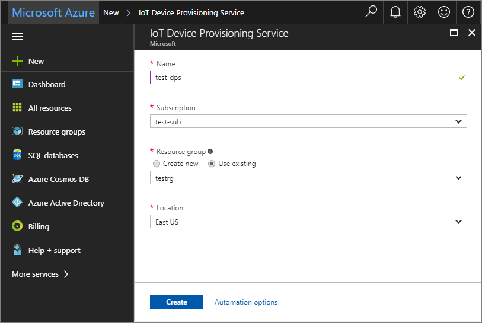
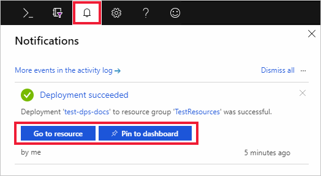
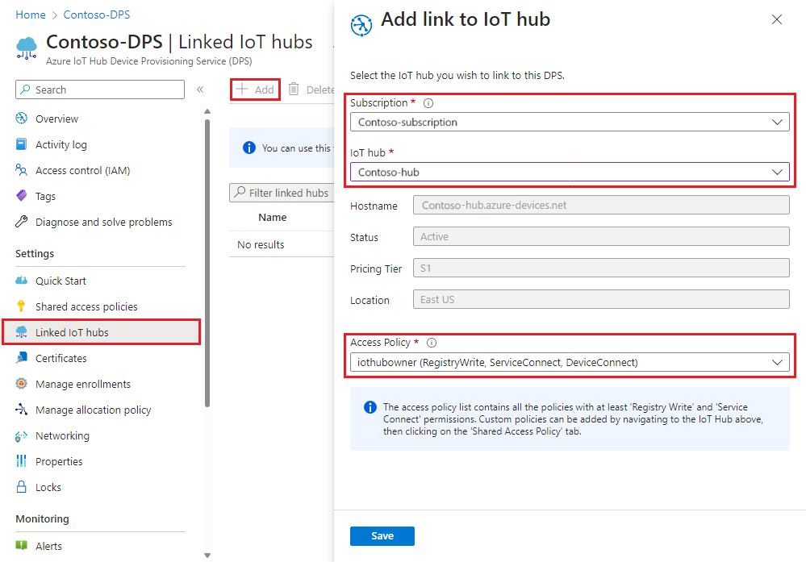

# Quickstart: Set up the IoT Hub Device Provisioning Service with the Azure portal

The IoT Hub Device Provisioning Service can be used with IoT Hub to enable zero-touch, just-in-time provisioning to the desired IoT hub without requiring human intervention, enabling customers to provision millions of IoT devices in a secure and scalable manner. Azure IoT Hub Device Provisioning Service supports IoT devices with TPM, symmetric key and X.509 certificate authentications. For more information, please refer to [IoT Hub Device Provisioning Service overview](./about-iot-dps.md)

In this quickstart, you will learn how to set up the IoT Hub Device Provisioning Service in the Azure Portal for provisioning your devices with the following steps:
> [!div class="checklist"]
> * Use the Azure portal to create an IoT Hub
> * Use the Azure portal to create an IoT Hub Device Provisioning Service and get the ID scope
> * Link the IoT hub to the Device Provisioning Service

If you don't have an Azure subscription, create a [free account](https://azure.microsoft.com/free/?WT.mc_id=A261C142F) before you begin.

## Create an IoT hub

[!INCLUDE [iot-hub-include-create-hub](../../includes/iot-hub-include-create-hub.md)]

## Create a new IoT Hub Device Provisioning Service

1. Select the **+ Create a resource** button again.

2. *Search the Marketplace* for the **Device Provisioning Service**. Select **IoT Hub Device Provisioning Service** and hit the **Create** button. 

3. Provide the following information for your new Device Provisioning Service instance and hit **Create**.

    * **Name:** Provide a unique name for your new Device Provisioning Service instance. If the name you enter is available, a green check mark appears.
    * **Subscription:** Choose the subscription that you want to use to create this Device Provisioning Service instance.
    * **Resource group:** This field allows you to create a new resource group, or choose an existing one to contain the new instance. Choose the same resource group that contains the Iot hub you created above, for example, **TestResources**. By putting all related resources in a group together, you can manage them together. For example, deleting the resource group deletes all resources contained in that group. For more information, see [Manage Azure Resource Manager resource groups](../azure-resource-manager/management/manage-resource-groups-portal.md).
    * **Location:** Select the closest location to your devices.

        

4. Select the notification button to monitor the creation of the resource instance. Once the service is successfully deployed, select **Pin to dashboard**, and then **Go to resource**.

    

## Link the IoT hub and your Device Provisioning Service

In this section, you will add a configuration to the Device Provisioning Service instance. This configuration sets the IoT hub for which devices will be provisioned.

1. Select the **All resources** button from the left-hand menu of the Azure portal. Select the Device Provisioning Service instance that you created in the preceding section. 

    If your menu is configured using **Flyout** instead of the **Docked** mode in the portal settings, you will need to click the 3 lines at the top left to open the portal menu on the left.  

2. From the Device Provisioning Service's menu, select **Linked IoT hubs**. Hit the **+ Add** button seen at the top. 

3. On the **Add link to IoT hub** page, provide the following information to link your new Device Provisioning Service instance to an IoT hub. Then hit **Save**. 

    * **Subscription:** Select the subscription containing the IoT hub that you want to link with your new Device Provisioning Service instance.
    * **Iot hub:** Select the IoT hub to link with your new Device Provisioning Service instance.
    * **Access Policy:** Select **iothubowner** as the credentials for establishing the link with the IoT hub.  

        

3. Now you should see the selected hub under the **Linked IoT hubs** blade. You might need to hit **Refresh** for it to show up.

## Clean up resources

Other quickstarts in this collection build upon this quickstart. If you plan to continue on to work with subsequent quickstarts or with the tutorials, do not clean up the resources created in this quickstart. If you do not plan to continue, use the following steps to delete all resources created by this quickstart in the Azure portal.

1. From the left-hand menu in the Azure portal, select **All resources** and then select your Device Provisioning Service. At the top of the device detail pane, select **Delete**.  
2. From the left-hand menu in the Azure portal, select **All resources** and then select your IoT hub. At the top of the hub detail pane, select **Delete**.  

## Next steps

In this quickstart, you’ve deployed an IoT hub and a Device Provisioning Service instance, and linked the two resources. To learn how to use this setup to provision a simulated device, continue to the quickstart for creating a simulated device.

> [!div class="nextstepaction"]
> [Quickstart to create a simulated device](./quick-create-simulated-device-symm-key.md)
