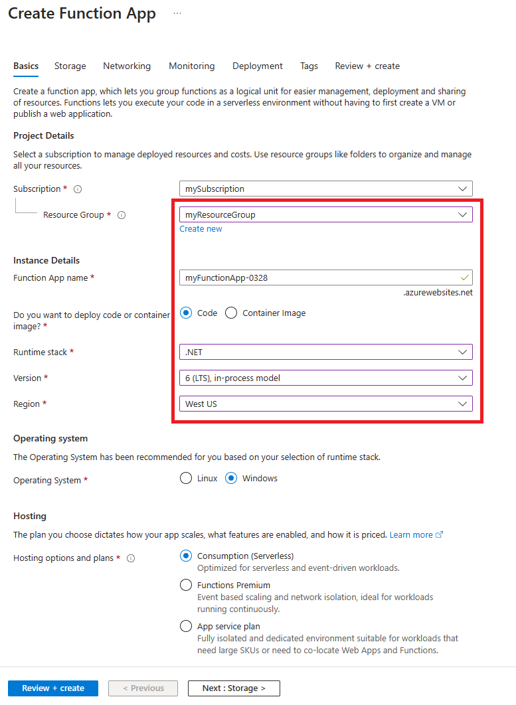
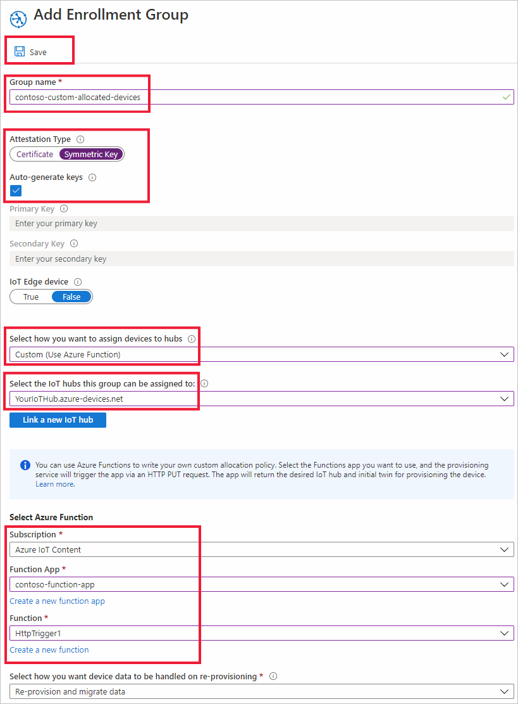

# Tutorial: Use custom allocation policies with Device Provisioning Service (DPS)

A custom allocation policy gives you more control over how devices are assigned to an IoT hub. This is accomplished by using custom code in an [Azure Function](../azure-functions/functions-overview.md) that runs during provisioning to assign devices to an IoT hub. The device provisioning service calls your Azure Function code providing all relevant information about the device and the enrollment. Your function code is executed and returns the IoT hub information used to provisioning the device.

By using custom allocation policies, you define your own allocation policies when the policies provided by the Device Provisioning Service don't meet the requirements of your scenario.

For example, maybe you want to examine the certificate a device is using during provisioning and assign the device to an IoT hub based on a certificate property. Or, maybe you have information stored in a database for your devices and need to query the database to determine which IoT hub a device should be assigned to.

This article demonstrates an enrollment group with a custom allocation policy that uses an Azure Function written in C# to provision toaster devices using symmetric keys. Any device not recognized as a toaster device will not be provisioned to an IoT hub.

Devices will request provisioning using provisioning sample code included in the [Azure IoT C SDK](https://github.com/Azure/azure-iot-sdk-c).


In this tutorial you will do the following:

> [!div class="checklist"]
> * Create a new Azure Function App to support a custom allocation function
> * Create a new group enrollment using an Azure Function for the custom allocation policy
> * Create device keys for two devices
> * Set up the development environment for example device code from the [Azure IoT C SDK](https://github.com/Azure/azure-iot-sdk-c)
> * Run the devices and verify that they are provisioned according to the custom allocation policy


[!INCLUDE [quickstarts-free-trial-note](../../includes/quickstarts-free-trial-note.md)]

## Prerequisites

* This article assumes you've completed the steps in [Set up IoT Hub Device Provisioning Service with the Azure portal](./quick-setup-auto-provision.md) to create your IoT Hub and DPS instance.

* Latest version of [Git](https://git-scm.com/download/) installed.

* For a Windows development environment, [Visual Studio](https://visualstudio.microsoft.com/vs/) 2019 with the ['Desktop development with C++'](/cpp/ide/using-the-visual-studio-ide-for-cpp-desktop-development) workload enabled is required. Visual Studio 2015 and Visual Studio 2017 are also supported.

* For Linux or macOS, see the appropriate section in [Prepare your development environment](https://github.com/Azure/azure-iot-sdk-c/blob/master/doc/devbox_setup.md) in the [Azure IoT C SDK](https://github.com/Azure/azure-iot-sdk-c) documentation.


[!INCLUDE [cloud-shell-try-it.md](../../includes/cloud-shell-try-it.md)]

## Create the custom allocation function

In this section, you create an Azure function that implements your custom allocation policy. This function decides whether a device should be registered to your IoT Hub based on whether its registration ID contains the string prefix **contoso-toaster**.

1. Sign in to the [Azure portal](https://portal.azure.com). From your home page, select **+ Create a resource**.

2. In the *Search the Marketplace* search box, type "Function App". From the drop-down list select **Function App**, and then select **Create**.

3. On **Function App** create page, under the **Basics** tab, enter the following settings for your new function app and select **Review + create**:

    **Subscription**: If you have multiple subscriptions and the desired subscription is not selected, select the subscription you want to use.

    **Resource Group**: This field allows you to create a new resource group, or choose an existing one to contain the function app. Choose the same resource group that contains the Iot hub you created for testing previously, for example, **TestResources**. By putting all related resources in a group together, you can manage them together.

    **Function App name**: Enter a unique function app name. This example uses **contoso-function-app**.

    **Publish**: Verify that **Code** is selected.

    **Runtime Stack**: Select **.NET Core** from the drop-down.

    **Region**: Select the same region as your resource group. This example uses **West US**.

    > [!NOTE]
    > By default, Application Insights is enabled. Application Insights is not necessary for this article, but it might help you understand and investigate any issues you encounter with the custom allocation. If you prefer, you can disable Application Insights by selecting the **Monitoring** tab and then selecting **No** for **Enable Application Insights**.

    

4. On the **Summary** page, select **Create** to create the function app. Deployment may take several minutes. When it completes, select **Go to resource**.

5. On the left pane under **Functions** click **Functions** and then **+ Add** to add a new function.

6. On the templates page, select the **HTTP Trigger** tile, then select **Create Function**. A function named **HttpTrigger1** is created, and the portal displays the overview page for your function.

7. Click **Code + Test** for your new function. The portal displays the contents of the **run.csx** code file. 

8. Replace the code for the **HttpTrigger1** function with the following code and select **Save**. Your custom allocation code is ready to be used.

    ```csharp
    #r "Newtonsoft.Json"

    using System.Net;
    using Microsoft.AspNetCore.Mvc;
    using Microsoft.Extensions.Primitives;
    using Newtonsoft.Json;

    public static async Task<IActionResult> Run(HttpRequest req, ILogger log)
    {
        log.LogInformation("C# HTTP trigger function processed a request.");

        // Get request body
        string requestBody = await new StreamReader(req.Body).ReadToEndAsync();
        dynamic data = JsonConvert.DeserializeObject(requestBody);

        log.LogInformation("Request.Body:...");
        log.LogInformation(requestBody);

        // Get registration ID of the device
        string regId = data?.deviceRuntimeContext?.registrationId;

        string message = "Uncaught error";
        bool fail = false;
        ResponseObj obj = new ResponseObj();

        if (regId == null)
        {
            message = "Registration ID not provided for the device.";
            log.LogInformation("Registration ID : NULL");
            fail = true;
        }
        else
        {
            string[] hubs = data?.linkedHubs.ToObject<string[]>();

            // Must have hubs selected on the enrollment
            if (hubs == null)
            {
                message = "No hub group defined for the enrollment.";
                log.LogInformation("linkedHubs : NULL");
                fail = true;
            }
            else
            {
                // This is a Contoso Toaster 
                if (regId.Contains("contoso-toaster"))
                {
                    //Log IoT hubs configured for the enrollment
                    foreach(string hubString in hubs)
                    {
                        log.LogInformation("linkedHub : " + hubString);
                    }

                    obj.iotHubHostName = hubs[0];
                    log.LogInformation("Selected hub : " + obj.iotHubHostName);
                }
                else
                {
                    fail = true;
                    message = "Unrecognized device registration.";
                    log.LogInformation("Unknown device registration");
                }
            }
        }

        log.LogInformation("\nResponse");
        log.LogInformation((obj.iotHubHostName != null) ? JsonConvert.SerializeObject(obj) : message);

        return (fail)
            ? new BadRequestObjectResult(message) 
            : (ActionResult)new OkObjectResult(obj);
    }

    public class ResponseObj
    {
        public string iotHubHostName {get; set;}
    }
    ```

9. Just below the bottom of the **run.csx** code file, click **Logs** to monitor the logging from the custom allocation function. 


## Create the enrollment

In this section, you'll create a new enrollment group that uses the custom allocation policy. For simplicity, this article uses [Symmetric key attestation](concepts-symmetric-key-attestation.md) with the enrollment. For a more secure solution, consider using [X.509 certificate attestation](concepts-x509-attestation.md) with a chain of trust.

1. Still on the [Azure portal](https://portal.azure.com), open your provisioning service.

2. Select **Manage enrollments** on the left pane, and then select the **Add enrollment group** button at the top of the page.

3. On **Add Enrollment Group**, enter the information in the table below and click the **Save** button.

    | Field | Description and/or suggested value |
    | :---- | :----------------------------- |
    | **Group name** | Enter **contoso-custom-allocated-devices** |
    | **Attestation Type** | Select **Symmetric Key** |
    | **Auto Generate Keys** | This checkbox should already be checked. |
    | **Select how you want to assign devices to hubs** | Select **Custom (Use Azure Function)** |
    | **Select the IoT hubs this group can be assigned to** | Select the IoT hub you created previously when you completed the quick start. |
    | **Select Azure Function** | Select the subscription that contains the function app you created. Then select the **contoso-function-app** and **HttpTrigger1** for the function. |

    

4. After saving the enrollment, reopen it and make a note of the **Primary Key**. You must save the enrollment first to have the keys generated. This primary symmetric key will be used to generate unique device keys for devices that attempt provisioning later. 

## Derive unique device keys

Devices don't use the primary symmetric key directly. Instead you use the primary key to derive a device key for each device. In this section, you create two unique device keys. One key will be used for a simulated toaster device. The other key will be used for a simulated heat pump device. The keys generated will allow both devices to attempt a registration. Only one device registration ID will have a valid suffix to be accepted by custom allocation policy example code. As a result, one will be accepted and the other rejected

To derive the device key, you use the symmetric key you noted earlier to compute the [HMAC-SHA256](https://wikipedia.org/wiki/HMAC) of the device registration ID for each device and convert the result into Base64 format. For more information on creating derived device keys with enrollment groups, see the group enrollments section of [Symmetric key attestation](concepts-symmetric-key-attestation.md).

For the example in this article, use the following two device registration IDs with the code below to compute a device key for both devices:

* **contoso-toaster-007**
* **contoso-heatpump-088**


# [Azure CLI](#tab/azure-cli)

The IoT extension for the Azure CLI provides the [`compute-device-key`](/cli/azure/iot/dps?view=azure-cli-latest&preserve-view=true#az_iot_dps_compute_device_key) command for generating derived device keys. This command can be used on Windows-based or Linux systems, from PowerShell or a Bash shell.

Replace the value of `--key` argument with the **Primary Key** from your enrollment group.

```azurecli
az iot dps compute-device-key --key oiK77Oy7rBw8YB6IS6ukRChAw+Yq6GC61RMrPLSTiOOtdI+XDu0LmLuNm11p+qv2I+adqGUdZHm46zXAQdZoOA== --registration-id contoso-toaster-007

"JC8F96eayuQwwz+PkE7IzjH2lIAjCUnAa61tDigBnSs="
```

```azurecli
az iot dps compute-device-key --key oiK77Oy7rBw8YB6IS6ukRChAw+Yq6GC61RMrPLSTiOOtdI+XDu0LmLuNm11p+qv2I+adqGUdZHm46zXAQdZoOA== --registration-id contoso-heatpump-088

"6uejA9PfkQgmYylj8Zerp3kcbeVrGZ172YLa7VSnJzg="
```

# [PowerShell](#tab/powershell)

If you're using a Windows-based workstation, you can use PowerShell to generate your derived device key as shown in the following example.

Replace the value of **KEY** variable with the **Primary Key** you noted earlier after your enrollment group was created. The key value and output shown with the code below is only an example.

```powershell
$KEY='oiK77Oy7rBw8YB6IS6ukRChAw+Yq6GC61RMrPLSTiOOtdI+XDu0LmLuNm11p+qv2I+adqGUdZHm46zXAQdZoOA=='

$REG_ID1='contoso-toaster-007'
$REG_ID2='contoso-heatpump-088'

$hmacsha256 = New-Object System.Security.Cryptography.HMACSHA256
$hmacsha256.key = [Convert]::FromBase64String($key)
$sig1 = $hmacsha256.ComputeHash([Text.Encoding]::ASCII.GetBytes($REG_ID1))
$sig2 = $hmacsha256.ComputeHash([Text.Encoding]::ASCII.GetBytes($REG_ID2))
$derivedkey1 = [Convert]::ToBase64String($sig1)
$derivedkey2 = [Convert]::ToBase64String($sig2)

echo "`n`n$REG_ID1 : $derivedkey1`n$REG_ID2 : $derivedkey2`n`n"
```

```powershell
contoso-toaster-007 : JC8F96eayuQwwz+PkE7IzjH2lIAjCUnAa61tDigBnSs=
contoso-heatpump-088 : 6uejA9PfkQgmYylj8Zerp3kcbeVrGZ172YLa7VSnJzg=
```

# [Bash](#tab/bash)

If you're using a Linux workstation, you can use openssl to generate your derived device keys as shown in the following Bash example.

Replace the value of **KEY** variable with the **Primary Key** you noted earlier after your enrollment group was created. The key value and output shown with the code below is only an example.


```bash
KEY=oiK77Oy7rBw8YB6IS6ukRChAw+Yq6GC61RMrPLSTiOOtdI+XDu0LmLuNm11p+qv2I+adqGUdZHm46zXAQdZoOA==

REG_ID1=contoso-toaster-007
REG_ID2=contoso-heatpump-088

keybytes=$(echo $KEY | base64 --decode | xxd -p -u -c 1000)
devkey1=$(echo -n $REG_ID1 | openssl sha256 -mac HMAC -macopt hexkey:$keybytes -binary | base64)
devkey2=$(echo -n $REG_ID2 | openssl sha256 -mac HMAC -macopt hexkey:$keybytes -binary | base64)

echo -e $"\n\n$REG_ID1 : $devkey1\n$REG_ID2 : $devkey2\n\n"
```

```bash
contoso-toaster-007 : JC8F96eayuQwwz+PkE7IzjH2lIAjCUnAa61tDigBnSs=
contoso-heatpump-088 : 6uejA9PfkQgmYylj8Zerp3kcbeVrGZ172YLa7VSnJzg=
```

---


## Prepare an Azure IoT C SDK development environment

Devices will request provisioning using provisioning sample code included in the [Azure IoT C SDK](https://github.com/Azure/azure-iot-sdk-c).

In this section, you prepare the development environment used to build the [Azure IoT C SDK](https://github.com/Azure/azure-iot-sdk-c). The SDK includes the sample code for the simulated device. This simulated device will attempt provisioning during the device's boot sequence.

This section is oriented toward a Windows-based workstation. For a Linux example, see the set-up of the VMs in [How to provision for multitenancy](how-to-provision-multitenant.md).

1. Download the [CMake build system](https://cmake.org/download/).

    It is important that the Visual Studio prerequisites (Visual Studio and the 'Desktop development with C++' workload) are installed on your machine, **before** starting the `CMake` installation. Once the prerequisites are in place, and the download is verified, install the CMake build system.

2. Find the tag name for the [latest release](https://github.com/Azure/azure-iot-sdk-c/releases/latest) of the SDK.

3. Open a command prompt or Git Bash shell. Run the following commands to clone the latest release of the [Azure IoT C SDK](https://github.com/Azure/azure-iot-sdk-c) GitHub repository. Use the tag you found in the previous step as the value for the `-b` parameter:

    ```cmd/sh
    git clone -b <release-tag> https://github.com/Azure/azure-iot-sdk-c.git
    cd azure-iot-sdk-c
    git submodule update --init
    ```

    You should expect this operation to take several minutes to complete.

4. Create a `cmake` subdirectory in the root directory of the git repository, and navigate to that folder. Run the following commands from the `azure-iot-sdk-c` directory:

    ```cmd/sh
    mkdir cmake
    cd cmake
    ```

5. Run the following command, which builds a version of the SDK specific to your development client platform. A Visual Studio solution for the simulated device will be generated in the `cmake` directory. 

    ```cmd
    cmake -Dhsm_type_symm_key:BOOL=ON -Duse_prov_client:BOOL=ON  ..
    ```

    If `cmake` doesn't find your C++ compiler, you might get build errors while running the command. If that happens, try running the command in the [Visual Studio command prompt](/dotnet/framework/tools/developer-command-prompt-for-vs).

    Once the build succeeds, the last few output lines will look similar to the following output:

    ```cmd/sh
    $ cmake -Dhsm_type_symm_key:BOOL=ON -Duse_prov_client:BOOL=ON  ..
    -- Building for: Visual Studio 15 2017
    -- Selecting Windows SDK version 10.0.16299.0 to target Windows 10.0.17134.
    -- The C compiler identification is MSVC 19.12.25835.0
    -- The CXX compiler identification is MSVC 19.12.25835.0

    ...

    -- Configuring done
    -- Generating done
    -- Build files have been written to: E:/IoT Testing/azure-iot-sdk-c/cmake
    ```

## Simulate the devices

In this section, you update a provisioning sample named **prov\_dev\_client\_sample** located in the Azure IoT C SDK you set up previously.

This sample code simulates a device boot sequence that sends the provisioning request to your Device Provisioning Service instance. The boot sequence will cause the toaster device to be recognized and assigned to the IoT hub using the custom allocation policy.

1. In the Azure portal, select the **Overview** tab for your Device Provisioning service and note down the **_ID Scope_** value.

     

2. In Visual Studio, open the **azure_iot_sdks.sln** solution file that was generated by running CMake earlier. The solution file should be in the following location:

    ```
    azure-iot-sdk-c\cmake\azure_iot_sdks.sln
    ```

3. In Visual Studio's *Solution Explorer* window, navigate to the **Provision\_Samples** folder. Expand the sample project named **prov\_dev\_client\_sample**. Expand **Source Files**, and open **prov\_dev\_client\_sample.c**.

4. Find the `id_scope` constant, and replace the value with your **ID Scope** value that you copied earlier. 

    ```c
    static const char* id_scope = "0ne00002193";
    ```

5. Find the definition for the `main()` function in the same file. Make sure the `hsm_type` variable is set to `SECURE_DEVICE_TYPE_SYMMETRIC_KEY` as shown below:

    ```c
    SECURE_DEVICE_TYPE hsm_type;
    //hsm_type = SECURE_DEVICE_TYPE_TPM;
    //hsm_type = SECURE_DEVICE_TYPE_X509;
    hsm_type = SECURE_DEVICE_TYPE_SYMMETRIC_KEY;
    ```

6. In the `main()` function, find the call to `Prov_Device_Register_Device()`. Just before that call, add the following lines of code that use [`Prov_Device_Set_Provisioning_Payload()`](/azure/iot-hub/iot-c-sdk-ref/prov-device-client-h/prov-device-set-provisioning-payload) to pass a custom JSON payload during provisioning. This can be used to provide more information to your custom allocation functions. This could also be used to pass the device type instead of examining the registration ID. For more information on sending and receiving custom data payloads with DPS, see [How to transfer payloads between devices and DPS](how-to-send-additional-data.md).

    ```c
    // An example custom payload
    const char* custom_json_payload = "{\"MyDeviceFirmwareVersion\":\"12.0.2.5\",\"MyDeviceProvisioningVersion\":\"1.0.0.0\"}";

    prov_device_result = Prov_Device_Set_Provisioning_Payload(prov_device_handle, custom_json_payload);
    if (prov_device_result != PROV_DEVICE_RESULT_OK)
    {
        (void)printf("\r\nFailure setting provisioning payload: %s\r\n", MU_ENUM_TO_STRING(PROV_DEVICE_RESULT, prov_device_result));
    }
    ```

7. Right-click the **prov\_dev\_client\_sample** project and select **Set as Startup Project**.

### Simulate the Contoso toaster device

1. To simulate the toaster device, find the call to `prov_dev_set_symmetric_key_info()` in **prov\_dev\_client\_sample.c** which is commented out.

    ```c
    // Set the symmetric key if using they auth type
    //prov_dev_set_symmetric_key_info("<symm_registration_id>", "<symmetric_Key>");
    ```

    Uncomment the function call and replace the placeholder values (including the angle brackets) with the toaster registration ID and derived device key you generated previously. The key value **JC8F96eayuQwwz+PkE7IzjH2lIAjCUnAa61tDigBnSs=** shown below is only given as an example.

    ```c
    // Set the symmetric key if using they auth type
    prov_dev_set_symmetric_key_info("contoso-toaster-007", "JC8F96eayuQwwz+PkE7IzjH2lIAjCUnAa61tDigBnSs=");
    ```

    Save the file.

2. On the Visual Studio menu, select **Debug** > **Start without debugging** to run the solution. In the prompt to rebuild the project, select **Yes**, to rebuild the project before running.

    The following text is example logging output from the custom allocation function code running for the toaster device. Notice a hub is successfully selected for a toaster device. Also notice the `payload` member that contains the custom JSON content you added to the code. This is available for your code to use within the `deviceRuntimeContext`.

    This logging is available by clicking **Logs** under the function code in the portal:

    ```cmd
    2020-09-23T11:44:37.505 [Information] Executing 'Functions.HttpTrigger1' (Reason='This function was programmatically called via the host APIs.', Id=4596d45e-086f-4e86-929b-4a02814eee40)
    2020-09-23T11:44:41.380 [Information] C# HTTP trigger function processed a request.
    2020-09-23T11:44:41.381 [Information] Request.Body:...
    2020-09-23T11:44:41.381 [Information] {"enrollmentGroup":{"enrollmentGroupId":"contoso-custom-allocated-devices","attestation":{"type":"symmetricKey"},"capabilities":{"iotEdge":false},"etag":"\"e8002126-0000-0100-0000-5f6b2a570000\"","provisioningStatus":"enabled","reprovisionPolicy":{"updateHubAssignment":true,"migrateDeviceData":true},"createdDateTimeUtc":"2020-09-23T10:58:31.62286Z","lastUpdatedDateTimeUtc":"2020-09-23T10:58:31.62286Z","allocationPolicy":"custom","iotHubs":["contoso-toasters-hub-1098.azure-devices.net"],"customAllocationDefinition":{"webhookUrl":"https://contoso-function-app.azurewebsites.net/api/HttpTrigger1?****","apiVersion":"2019-03-31"}},"deviceRuntimeContext":{"registrationId":"contoso-toaster-007","symmetricKey":{},"payload":{"MyDeviceFirmwareVersion":"12.0.2.5","MyDeviceProvisioningVersion":"1.0.0.0"}},"linkedHubs":["contoso-toasters-hub-1098.azure-devices.net"]}
    2020-09-23T11:44:41.687 [Information] linkedHub : contoso-toasters-hub-1098.azure-devices.net
    2020-09-23T11:44:41.688 [Information] Selected hub : contoso-toasters-hub-1098.azure-devices.net
    2020-09-23T11:44:41.688 [Information] Response
    2020-09-23T11:44:41.688 [Information] {"iotHubHostName":"contoso-toasters-hub-1098.azure-devices.net"}
    2020-09-23T11:44:41.689 [Information] Executed 'Functions.HttpTrigger1' (Succeeded, Id=4596d45e-086f-4e86-929b-4a02814eee40, Duration=4347ms)    
    ```

    The following example device output shows the simulated toaster device successfully booting up and connecting to the provisioning service instance to be assigned to the toasters IoT hub by the custom allocation policy:

    ```cmd
    Provisioning API Version: 1.3.6

    Registering Device

    Provisioning Status: PROV_DEVICE_REG_STATUS_CONNECTED
    Provisioning Status: PROV_DEVICE_REG_STATUS_ASSIGNING
    Provisioning Status: PROV_DEVICE_REG_STATUS_ASSIGNING

    Registration Information received from service: contoso-toasters-hub-1098.azure-devices.net, deviceId: contoso-toaster-007

    Press enter key to exit:
    ```

### Simulate the Contoso heat pump device

1. To simulate the heat pump device, update the call to `prov_dev_set_symmetric_key_info()` in **prov\_dev\_client\_sample.c** again with the heat pump registration ID and derived device key you generated earlier. The key value **6uejA9PfkQgmYylj8Zerp3kcbeVrGZ172YLa7VSnJzg=** shown below is also only given as an example.

    ```c
    // Set the symmetric key if using they auth type
    prov_dev_set_symmetric_key_info("contoso-heatpump-088", "6uejA9PfkQgmYylj8Zerp3kcbeVrGZ172YLa7VSnJzg=");
    ```

    Save the file.

2. On the Visual Studio menu, select **Debug** > **Start without debugging** to run the solution. In the prompt to rebuild the project, select **Yes** to rebuild the project before running.

    The following text is example logging output from the custom allocation function code running for the heat pump device. The custom allocation policy rejects this registration with a HTTP error 400 Bad Request. Notice the `payload` member that contains the custom JSON content you added to the code. This is available for your code to use within the `deviceRuntimeContext`.

    This logging is available by clicking **Logs** under the function code in the portal:

    ```cmd
    2020-09-23T11:50:23.652 [Information] Executing 'Functions.HttpTrigger1' (Reason='This function was programmatically called via the host APIs.', Id=2fa77f10-42f8-43fe-88d9-a8c01d4d3f68)
    2020-09-23T11:50:23.653 [Information] C# HTTP trigger function processed a request.
    2020-09-23T11:50:23.654 [Information] Request.Body:...
    2020-09-23T11:50:23.654 [Information] {"enrollmentGroup":{"enrollmentGroupId":"contoso-custom-allocated-devices","attestation":{"type":"symmetricKey"},"capabilities":{"iotEdge":false},"etag":"\"e8002126-0000-0100-0000-5f6b2a570000\"","provisioningStatus":"enabled","reprovisionPolicy":{"updateHubAssignment":true,"migrateDeviceData":true},"createdDateTimeUtc":"2020-09-23T10:58:31.62286Z","lastUpdatedDateTimeUtc":"2020-09-23T10:58:31.62286Z","allocationPolicy":"custom","iotHubs":["contoso-toasters-hub-1098.azure-devices.net"],"customAllocationDefinition":{"webhookUrl":"https://contoso-function-app.azurewebsites.net/api/HttpTrigger1?****","apiVersion":"2019-03-31"}},"deviceRuntimeContext":{"registrationId":"contoso-heatpump-088","symmetricKey":{},"payload":{"MyDeviceFirmwareVersion":"12.0.2.5","MyDeviceProvisioningVersion":"1.0.0.0"}},"linkedHubs":["contoso-toasters-hub-1098.azure-devices.net"]}
    2020-09-23T11:50:23.654 [Information] Unknown device registration
    2020-09-23T11:50:23.654 [Information] Response
    2020-09-23T11:50:23.654 [Information] Unrecognized device registration.
    2020-09-23T11:50:23.655 [Information] Executed 'Functions.HttpTrigger1' (Succeeded, Id=2fa77f10-42f8-43fe-88d9-a8c01d4d3f68, Duration=11ms)
    ```

    The following example device output shows the simulated heat pump device booting up and connecting to the provisioning service instance to attempt registration to an IoT hub using the custom allocation policy. This fails with error (`Custom allocation failed with status code: 400`) since the custom allocation policy was designed to only allows toaster devices:


    ```cmd
    Provisioning API Version: 1.3.7
    
    Registering Device
    
    Provisioning Status: PROV_DEVICE_REG_STATUS_CONNECTED
    Provisioning Status: PROV_DEVICE_REG_STATUS_ASSIGNING
    Provisioning Status: PROV_DEVICE_REG_STATUS_ASSIGNING
    Error: Time:Wed Sep 23 13:06:01 2020 File:d:\testing\azure-iot-sdk-c\provisioning_client\src\prov_device_ll_client.c Func:_prov_transport_process_json_reply Line:658 Provisioning Failure: OperationId: 4.eb89f3e8407a3711.2525bd34-02e9-4e91-a9c0-4dbc4ad5de66 - Date: 2020-09-23T17:05:58.2363145Z - Msg: Custom allocation failed with status code: 400
    Error: Time:Wed Sep 23 13:06:01 2020 File:d:\testing\azure-iot-sdk-c\provisioning_client\src\prov_transport_mqtt_common.c Func:_prov_transport_common_mqtt_dowork Line:1014 Unable to process registration reply.
    Error: Time:Wed Sep 23 13:06:01 2020 File:d:\testing\azure-iot-sdk-c\provisioning_client\src\prov_device_ll_client.c Func:_on_transport_registration_data Line:770 Failure retrieving data from the provisioning service
    
    Failure registering device: PROV_DEVICE_RESULT_DEV_AUTH_ERROR
    Press enter key to exit:    
    ```
    
## Clean up resources

If you plan to continue working with the resources created in this article, you can leave them. If you don't plan to continue using the resources, use the following steps to delete all of the resources created in this article to avoid unnecessary charges.

The steps here assume you created all resources in this article as instructed in the same resource group named **contoso-us-resource-group**.

> [!IMPORTANT]
> Deleting a resource group is irreversible. The resource group and all the resources contained in it are permanently deleted. Make sure that you don't accidentally delete the wrong resource group or resources. If you created the IoT Hub inside an existing resource group that contains resources you want to keep, only delete the IoT Hub resource itself instead of deleting the resource group.
>

To delete the resource group by name:

1. Sign in to the [Azure portal](https://portal.azure.com) and select **Resource groups**.

2. In the **Filter by name...** textbox, type the name of the resource group containing your resources, **contoso-us-resource-group**. 

3. To the right of your resource group in the result list, select **...** then **Delete resource group**.

4. You'll be asked to confirm the deletion of the resource group. Type the name of your resource group again to confirm, and then select **Delete**. After a few moments, the resource group and all of its contained resources are deleted.

## Next steps

For a more in-depth custom allocation policy example, see 

> [!div class="nextstepaction"]
> [How to use custom allocation policies](how-to-use-custom-allocation-policies.md)

* To learn more Reprovisioning, see

> [!div class="nextstepaction"]
> [IoT Hub Device reprovisioning concepts](concepts-device-reprovision.md)

* To learn more Deprovisioning, see

> [!div class="nextstepaction"]
> [How to deprovision devices that were previously autoprovisioned](how-to-unprovision-devices.md)