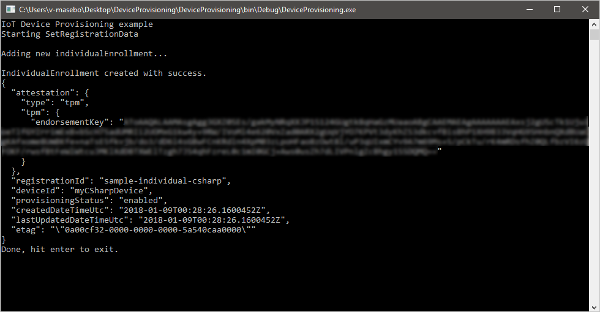
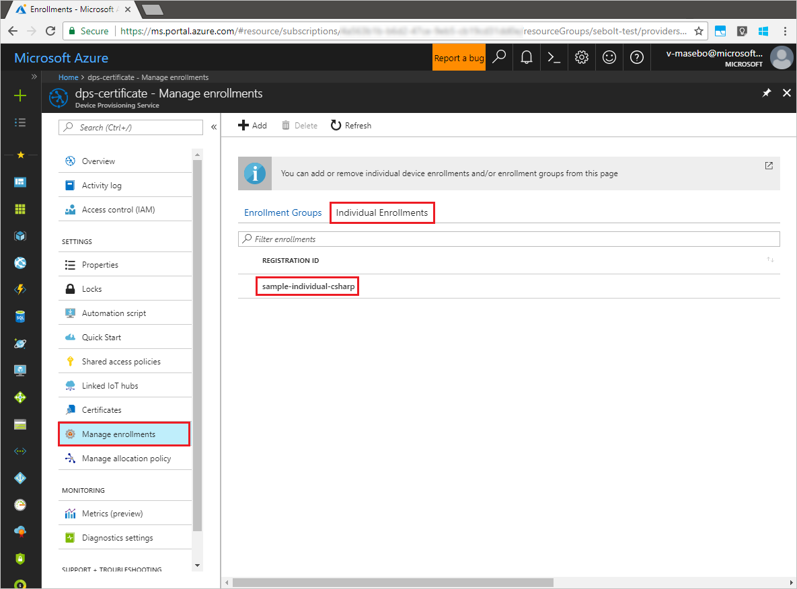
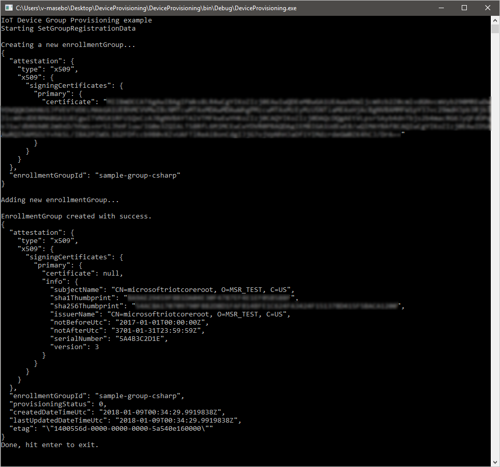
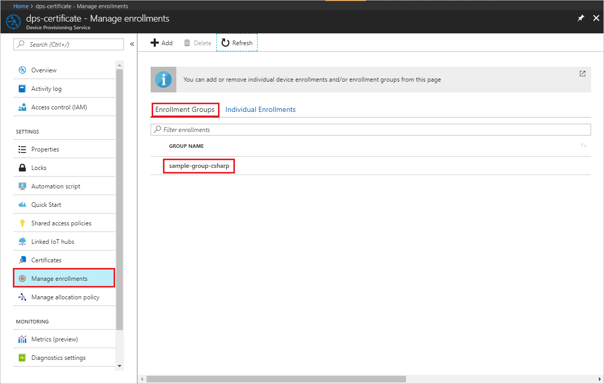
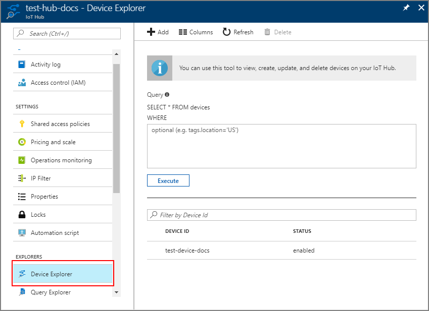

# Tutorial: Enroll the device to an IoT hub using the Azure IoT Hub Provisioning Service Client (.NET)

In the previous tutorial, you learned how to set up a device to connect to your Device Provisioning service. In this tutorial, you learn how to use this service to provision your device to a single IoT hub, using both **_Individual Enrollment_** and **_Enrollment Groups_**. This tutorial shows you how to:

> [!div class="checklist"]
> * Enroll the device
> * Start the device
> * Verify the device is registered

## Prerequisites

Before you proceed, make sure to configure your device and its *Hardware Security Module* as discussed in the tutorial [Set up a device to provision using Azure IoT Hub Device Provisioning Service](./tutorial-set-up-device.md).

* Visual Studio

> [!NOTE]
> Visual Studio is not required. The installation of [.NET](https://www.microsoft.com/net) is sufficient and developers can use their preferred editor on Windows or Linux.  

This tutorial simulates the period during or right after the hardware manufacturing process, when device information is added to the provisioning service. This code is usually run on a PC or a factory device that can run .NET code and should not be added to the devices themselves.


## Enroll the device

This step involves adding the device's unique security artifacts to the Device Provisioning Service. These security artifacts are as follows:

- For TPM-based devices:
    - The *Endorsement Key* that is unique to each TPM chip or simulation. Read the [Understand TPM Endorsement Key](https://technet.microsoft.com/library/cc770443.aspx) for more information.
    - The *Registration ID* that is used to uniquely identify a device in the namespace/scope. This may or may not be the same as the device ID. The ID is mandatory for every device. For TPM-based devices, the registration ID may be derived from the TPM itself, for example, an SHA-256 hash of the TPM Endorsement Key.

- For X.509 based devices:
    - The [X.509 certificate issued to the device](https://msdn.microsoft.com/library/windows/desktop/bb540819.aspx), in the form of either a *.pem* or a *.cer* file. For individual enrollment, you need to use the *leaf certificate* for your X.509 system, while for enrollment groups, you need to use the *root certificate* or an equivalent *signer certificate*.
    - The *Registration ID* that is used to uniquely identify a device in the namespace/scope. This may or may not be the same as the device ID. The ID is mandatory for every device. For X.509 based devices, the registration ID is derived from the certificate's common name (CN). For further information on these requirements see [Device concepts](https://docs.microsoft.com/azure/iot-dps/concepts-device).

There are two ways to enroll the device to the Device Provisioning Service:

- **Individual Enrollments**
    This represents an entry for a single device that may register with the Device Provisioning Service. Individual enrollments may use either X.509 certificates or SAS tokens (in a real or virtual TPM) as attestation mechanisms. We recommend using individual enrollments for devices, which require unique initial configurations, or for devices that can only use SAS tokens via TPM as the attestation mechanism. Individual enrollments may have the desired IoT hub device ID specified.

- **Enrollment Groups**
    This represents a group of devices that share a specific attestation mechanism. We recommend using an enrollment group for a large number of devices, which share a desired initial configuration, or for devices all going to the same tenant. Enrollment groups are X.509 only and all share a signing certificate in their X.509 certificate chain.

### Enroll the device using Individual Enrollments

1. In Visual Studio, create a Visual C# Console Application project by using the **Console App** project template. Name the project **DeviceProvisioning**.
    
1. In Solution Explorer, right-click the **DeviceProvisioning** project, and then click **Manage NuGet Packages...**.

1. In the **NuGet Package Manager** window, select **Browse** and search for **microsoft.azure.devices.provisioning.service**. Select the entry and click **Install** to install the **Microsoft.Azure.Devices.Provisioning.Service** package, and accept the terms of use. This procedure downloads, installs, and adds a reference to the [Azure IoT Device Provisioning Service SDK](https://www.nuget.org/packages/Microsoft.Azure.Devices.Provisioning.Service/) NuGet package and its dependencies.

1. Add the following `using` statements at the top of the **Program.cs** file:
   
    ```csharp
    using Microsoft.Azure.Devices.Provisioning.Service;
    ```

1. Add the following fields to the **Program** class. Replace the placeholder value with the Device Provisioning Service connection string noted in the previous section.
   
    ```csharp
    static readonly string ServiceConnectionString = "{Device Provisioning Service connection string}";

    private const string SampleRegistrationId = "sample-individual-csharp";
    private const string SampleTpmEndorsementKey =
            "AToAAQALAAMAsgAgg3GXZ0SEs/gakMyNRqXXJP1S124GUgtk8qHaGzMUaaoABgCAAEMAEAgAAAAAAAEAxsj2gUS" +
            "cTk1UjuioeTlfGYZrrimExB+bScH75adUMRIi2UOMxG1kw4y+9RW/IVoMl4e620VxZad0ARX2gUqVjYO7KPVt3d" +
            "yKhZS3dkcvfBisBhP1XH9B33VqHG9SHnbnQXdBUaCgKAfxome8UmBKfe+naTsE5fkvjb/do3/dD6l4sGBwFCnKR" +
            "dln4XpM03zLpoHFao8zOwt8l/uP3qUIxmCYv9A7m69Ms+5/pCkTu/rK4mRDsfhZ0QLfbzVI6zQFOKF/rwsfBtFe" +
            "WlWtcuJMKlXdD8TXWElTzgh7JS4qhFzreL0c1mI0GCj+Aws0usZh7dLIVPnlgZcBhgy1SSDQMQ==";
    private const string OptionalDeviceId = "myCSharpDevice";
    private const ProvisioningStatus OptionalProvisioningStatus = ProvisioningStatus.Enabled;
    ```

1. Add the following to implement the enrollment for the device:

    ```csharp
    static async Task SetRegistrationDataAsync()
    {
        Console.WriteLine("Starting SetRegistrationData");

        Attestation attestation = new TpmAttestation(SampleTpmEndorsementKey);

        IndividualEnrollment individualEnrollment = new IndividualEnrollment(SampleRegistrationId, attestation);

        individualEnrollment.DeviceId = OptionalDeviceId;
        individualEnrollment.ProvisioningStatus = OptionalProvisioningStatus;

        Console.WriteLine("\nAdding new individualEnrollment...");
        var serviceClient = ProvisioningServiceClient.CreateFromConnectionString(ServiceConnectionString);

        IndividualEnrollment individualEnrollmentResult =
            await serviceClient.CreateOrUpdateIndividualEnrollmentAsync(individualEnrollment).ConfigureAwait(false);

        Console.WriteLine("\nIndividualEnrollment created with success.");
        Console.WriteLine(individualEnrollmentResult);
    }
    ```

1. Finally, add the following code to the **Main** method to open the connection to your IoT hub and begin the enrollment:
   
    ```csharp
    try
    {
        Console.WriteLine("IoT Device Provisioning example");

        SetRegistrationDataAsync().GetAwaiter().GetResult();
            
        Console.WriteLine("Done, hit enter to exit.");
    }
    catch (Exception ex)
    {
        Console.WriteLine();
        Console.WriteLine("Error in sample: {0}", ex.Message);
    }
    Console.ReadLine();
    ```
        
1. In the Visual Studio Solution Explorer, right-click your solution, and then click **Set StartUp Projects...**. Select **Single startup project**, and then select the **DeviceProvisioning** project in the dropdown menu.  

1. Run the .NET device app **DeviceProvisiong**. It should set up provisioning for the device: 

    

When the device is successfully enrolled, you should see it displayed in the portal as following:

   

### Enroll the device using Enrollment Groups

> [!NOTE]
> The enrollment group sample requires an X.509 certificate.

1. In the Visual Studio Solution Explorer, open the **DeviceProvisioning** project created above. 

1. Add the following `using` statements at the top of the **Program.cs** file:
    
    ```csharp
    using System.Security.Cryptography.X509Certificates;
    ```

1. Add the following fields to the **Program** class. Replace the placeholder value with the X509 certificate location.
   
    ```csharp
    private const string X509RootCertPathVar = "{X509 Certificate Location}";
    private const string SampleEnrollmentGroupId = "sample-group-csharp";
    ```

1. Add the following to **Program.cs** implement the enrollment for the group:

    ```csharp
    public static async Task SetGroupRegistrationDataAsync()
    {
        Console.WriteLine("Starting SetGroupRegistrationData");

        using (ProvisioningServiceClient provisioningServiceClient =
                ProvisioningServiceClient.CreateFromConnectionString(ServiceConnectionString))
        {
            Console.WriteLine("\nCreating a new enrollmentGroup...");

            var certificate = new X509Certificate2(X509RootCertPathVar);

            Attestation attestation = X509Attestation.CreateFromRootCertificates(certificate);

            EnrollmentGroup enrollmentGroup = new EnrollmentGroup(SampleEnrollmentGroupId, attestation);

            Console.WriteLine(enrollmentGroup);
            Console.WriteLine("\nAdding new enrollmentGroup...");

            EnrollmentGroup enrollmentGroupResult =
                await provisioningServiceClient.CreateOrUpdateEnrollmentGroupAsync(enrollmentGroup).ConfigureAwait(false);

            Console.WriteLine("\nEnrollmentGroup created with success.");
            Console.WriteLine(enrollmentGroupResult);
        }
    }
    ```

1. Finally, replace the following code to the **Main** method to open the connection to your IoT hub and begin the group enrollment:
   
    ```csharp
    try
    {
        Console.WriteLine("IoT Device Group Provisioning example");

        SetGroupRegistrationDataAsync().GetAwaiter().GetResult();
            
        Console.WriteLine("Done, hit enter to exit.");
        Console.ReadLine();
    }
    catch (Exception ex)
    {
        Console.WriteLine();
        Console.WriteLine("Error in sample: {0}", ex.Message);
    }
    ```

1. Run the .NET device app **DeviceProvisiong**. It should set up group provisioning for the device: 

    

    When the device group is successfully enrolled, you should see it displayed in the portal as following:

   


## Start the device

At this point, the following setup is ready for device registration:

1. Your device or group of devices are enrolled to your Device Provisioning service, and 
2. Your device is ready with the security configured and accessible through the application using the Device Provisioning Service client SDK.

Start the device to allow your client application to start the registration with your Device Provisioning service.  


## Verify the device is registered

Once your device boots, the following actions should take place. See the [Provisioning Device Client Sample](https://github.com/Azure-Samples/azure-iot-samples-csharp/tree/master/provisioning/Samples/device) for more details. 

1. The device sends a registration request to your Device Provisioning service.
2. For TPM devices, the Device Provisioning Service sends back a registration challenge to which your device responds. 
3. On successful registration, the Device Provisioning Service sends the IoT hub URI, device ID, and the encrypted key back to the device. 
4. The IoT Hub client application on the device then connects to your hub. 
5. On successful connection to the hub, you should see the device appear in the IoT hub's **Device Explorer**. 

    

## Next steps
In this tutorial, you learned how to:

> [!div class="checklist"]
> * Enroll the device
> * Start the device
> * Verify the device is registered

Advance to the next tutorial to learn how to provision multiple devices across load-balanced hubs. 

> [!div class="nextstepaction"]
> [Provision devices across load-balanced IoT hubs](./tutorial-provision-multiple-hubs.md)
