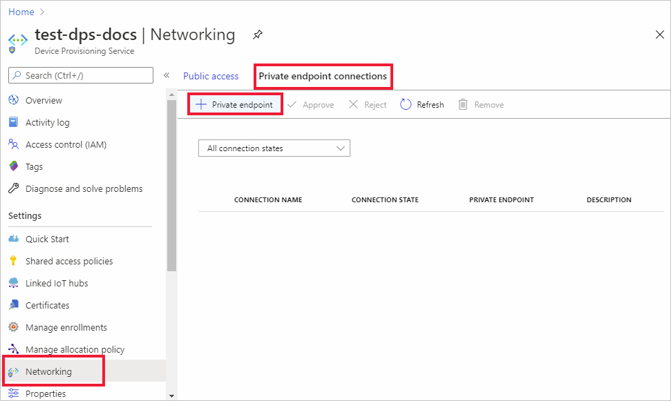
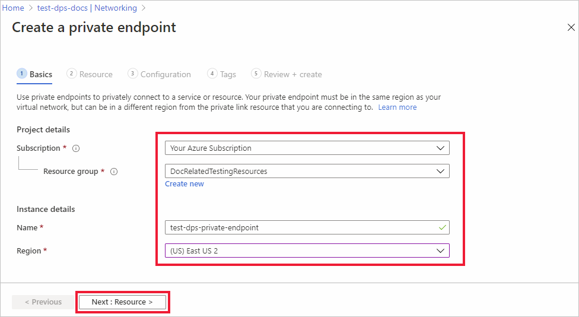
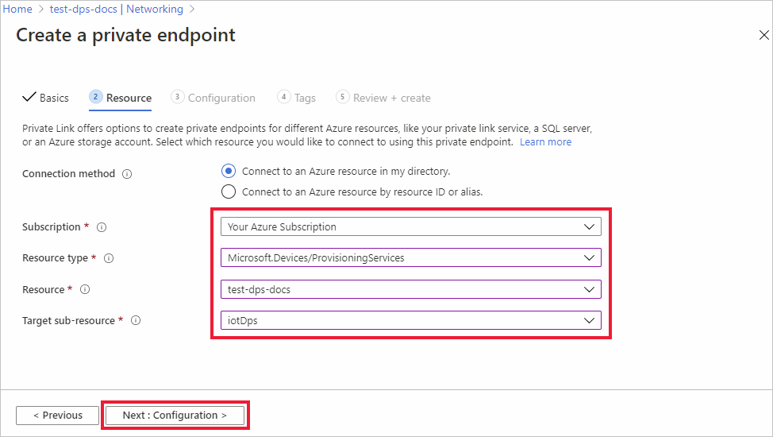
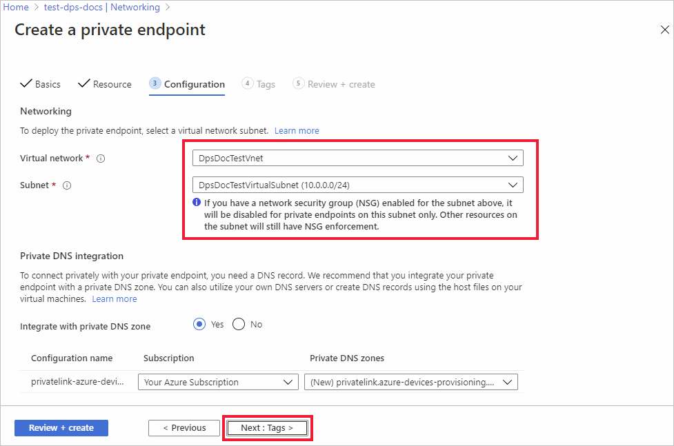
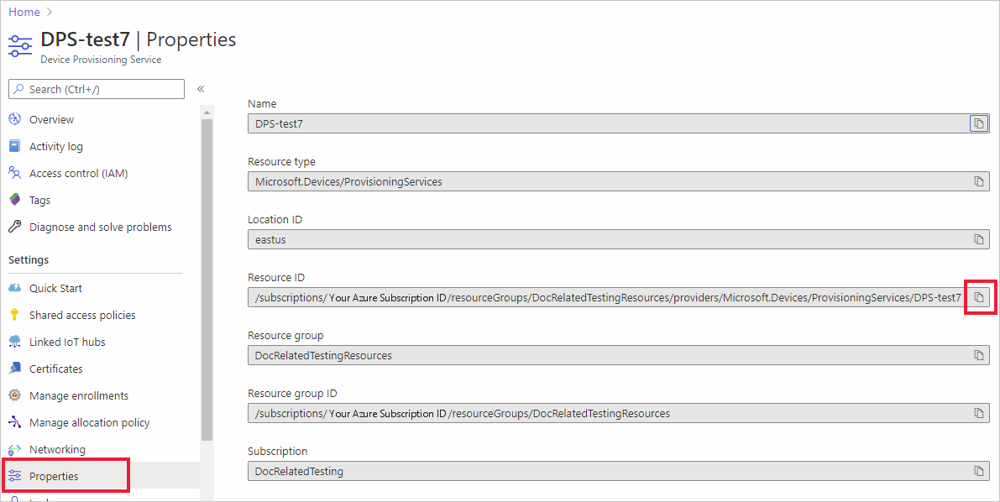
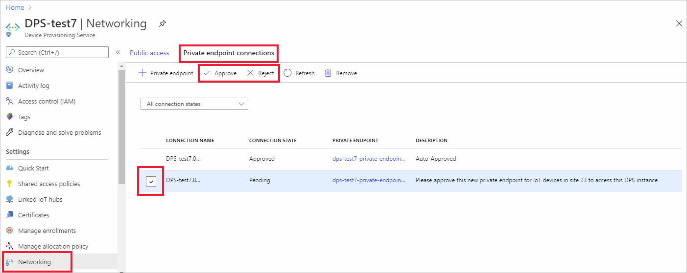

# Azure IoT Hub Device Provisioning Service (DPS) support for virtual networks

This article introduces the virtual network (VNET) connectivity pattern for IoT devices provisioning with IoT hubs using DPS. This pattern provides private connectivity between the devices, DPS, and the IoT hub inside a customer-owned Azure VNET.

In most scenarios where DPS is configured with a VNET, your IoT Hub is also configured in the same VNET. For more specific information on VNET support and configuration for IoT Hubs, see, [IoT Hub virtual network support](../iot-hub/virtual-network-support.md).

## Introduction

By default, DPS hostnames map to a public endpoint with a publicly routable IP address over the Internet. This public endpoint is visible to all customers. IoT devices over wide-area networks and on-premises networks can try to access the public endpoint.

For several reasons, customers may wish to restrict connectivity to Azure resources, like DPS. These reasons include:

* Prevent connection exposure over the public Internet. Exposure can be reduced by introducing more layers of security via network level isolation for your IoT hub and DPS resources

* Enabling a private connectivity experience from your on-premises network assets ensuring that your data and traffic is transmitted directly to Azure backbone network.

* Preventing exfiltration attacks from sensitive on-premises networks.

* Following established Azure-wide connectivity patterns using [private endpoints](../private-link/private-endpoint-overview.md).

Common approaches to restricting connectivity include [DPS IP filter rules](./iot-dps-ip-filtering.md) and Virtual networking (VNET) with [private endpoints](../private-link/private-endpoint-overview.md). The goal of this article is to describe the VNET approach for DPS using private endpoints.

Devices that operate in on-premises networks can use [Virtual Private Network (VPN)](../vpn-gateway/vpn-gateway-about-vpngateways.md) or [ExpressRoute](https://azure.microsoft.com/services/expressroute/) private peering to connect to a VNET in Azure and access DPS resources through private endpoints.

A private endpoint is a private IP address allocated inside a customer-owned VNET by which an Azure resource is accessible. By having a private endpoint for your DPS resource, you can allow devices operating inside your VNET to request provisioning by your DPS resource without allowing traffic to the public endpoint. Each DPS resource can support multiple private endpoints, each of which may be located in a VNET in a different region.

## Prerequisites

Before proceeding ensure that the following prerequisites are met:

* Your DPS resource is already created and linked to your IoT hubs. For guidance on setting up a new DPS resource, see, [Set up IoT Hub Device Provisioning Service with the Azure portal](./quick-setup-auto-provision.md)

* You have provisioned an Azure VNET with a subnet in which the private endpoint will be created. For more information, see, [create a virtual network using Azure CLI](../virtual-network/quick-create-cli.md).

* For devices that operate inside of on-premises networks, set up [Virtual Private Network (VPN)](../vpn-gateway/vpn-gateway-about-vpngateways.md) or [ExpressRoute](https://azure.microsoft.com/services/expressroute/) private peering into your Azure VNET.

## Private endpoint limitations

Note the following current limitations for DPS when using private endpoints:

* Private endpoints don't work when the DPS resource and the linked IoT hub are in different clouds. For example, [Azure Government and global Azure](../azure-government/documentation-government-welcome.md).

* Private endpoints in DPS use Azure Private Link, which are only supported in public regions. For more information, see [Azure Private Link availability](../private-link/availability.md).

* Currently, [custom allocation policies with Azure Functions](concepts-custom-allocation.md) for DPS doesn't work when the Azure function is locked down to a VNET and private endpoints.

* Current DPS VNET support is for data ingress into DPS only. Data egress, which is the traffic from DPS to IoT Hub, uses an internal service-to-service mechanism rather than a dedicated VNET. Support for full VNET-based egress lockdown between DPS and IoT Hub isn't currently available.

* The lowest latency allocation policy is used to assign a device to the IoT hub with the lowest latency. This allocation policy is not reliable in a virtual network environment.

* Enabling one or more private endpoints typically involves [disabling public access](public-network-access.md) to your DPS instance. Once public access is disabled, you can no longer use the Azure portal to manage enrollments. Instead you can manage enrollments using the Azure CLI, PowerShell, or service APIs from machines inside the VNET(s)/private endpoint(s) configured on the DPS instance.

* When using private endpoints, we recommend deploying DPS in one of the regions that support [Availability Zones](iot-dps-ha-dr.md). Otherwise, DPS instances with private endpoints enabled may see reduced availability in the event of outages.

>[!NOTE]
>**Data residency consideration:**
>
>DPS provides a **Global device endpoint** (`global.azure-devices-provisioning.net`). However, when you use the global endpoint, your data may be redirected outside of the region where the DPS instance was initially created. To ensure data residency within the initial DPS region, use private endpoints.

## Set up a private endpoint

To set up a private endpoint, follow these steps:

1. In the [Azure portal](https://portal.azure.com/), open your DPS resource and select the **Networking** tab. Select **Private endpoint connections** and **+ Private endpoint**.

    

2. On the _Create a private endpoint_ Basics page, enter the information mentioned in the following table.

    

    | Field | Value |
    | :---- | :-----|
    | **Subscription** | Choose the desired Azure subscription to contain the private endpoint.  |
    | **Resource group** | Choose or create a resource group to contain the private endpoint |
    | **Name**       | Enter a name for your private endpoint |
    | **Region**     | The region chosen must be the same as the region that contains the VNET, but it doesn't have to be the same as the DPS resource. |

    Select **Next : Resource** to configure the resource that the private endpoint points to.

3. On the _Create a private endpoint Resource_ page, enter the information mentioned in the following table.

    

    | Field | Value |
    | :---- | :-----|
    | **Subscription**        | Choose the Azure subscription that contains the DPS resource that your private endpoint points to.  |
    | **Resource type**       | Choose **Microsoft.Devices/ProvisioningServices**. |
    | **Resource**            | Select the DPS resource that the private endpoint maps to. |
    | **Target sub-resource** | Select **iotDps**. |

    > [!TIP]
    > Information on the **Connect to an Azure resource by resource ID or alias** setting is provided in the [Request a private endpoint](#request-a-private-endpoint) section in this article.

    Select **Next : Configuration** to configure the VNET for the private endpoint.

4. On the _Create a private endpoint Configuration_ page, choose your virtual network and subnet to create the private endpoint in.

    Select **Next : Tags**, and optionally provide any tags for your resource.

    

5. Select **Review + create** and then **Create** to create your private endpoint resource.

## Use private endpoints with devices

To use private endpoints with device provisioning code, your provisioning code must use the specific **Service endpoint** for your DPS instance as shown on the overview page of your DPS instance in the [Azure portal](https://portal.azure.com). The service endpoint has the following form.

`<Your DPS Tenant Name>.azure-devices-provisioning.net`

Most sample code demonstrated in our documentation and SDKs, use the **Global device endpoint** (`global.azure-devices-provisioning.net`) and **ID Scope** to resolve a particular DPS instance. Use the service endpoint in place of the global device endpoint when connecting to a DPS instance using private endpoints to provision your devices.

For example, the provisioning device client sample ([pro_dev_client_sample](https://github.com/Azure/azure-iot-sdk-c/tree/master/provisioning_client/samples/prov_dev_client_sample)) in the [Azure IoT C SDK](https://github.com/Azure/azure-iot-sdk-c) is designed to use the **Global device endpoint** as the global provisioning URI (`global_prov_uri`) in [prov_dev_client_sample.c](https://github.com/Azure/azure-iot-sdk-c/blob/master/provisioning_client/samples/prov_dev_client_sample/prov_dev_client_sample.c)

:::code language="c" source="~/iot-samples-c/provisioning_client/samples/prov_dev_client_sample/prov_dev_client_sample.c" range="60-64" highlight="4":::

:::code language="c" source="~/iot-samples-c/provisioning_client/samples/prov_dev_client_sample/prov_dev_client_sample.c" range="138-144" highlight="3":::

To use the sample with a private endpoint, the highlighted code above would be changed to use the service endpoint for your DPS resource. For example, if your service endpoint was `mydps.azure-devices-provisioning.net`, the code would look as follows.

```C
static const char* global_prov_uri = "global.azure-devices-provisioning.net";
static const char* service_uri = "mydps.azure-devices-provisioning.net";
static const char* id_scope = "[ID Scope]";
```

```C
    PROV_DEVICE_RESULT prov_device_result = PROV_DEVICE_RESULT_ERROR;
    PROV_DEVICE_HANDLE prov_device_handle;
    if ((prov_device_handle = Prov_Device_Create(service_uri, id_scope, prov_transport)) == NULL)
    {
        (void)printf("failed calling Prov_Device_Create\r\n");
    }
```

## Request a private endpoint

You can request a private endpoint to a DPS instance by resource ID. In order to make this request, you need the resource owner to supply you with the resource ID.

1. The resource ID is provided on to the properties tab for DPS resource as shown below.

    

    > [!CAUTION]
    > Be aware that the resource ID does contain the subscription ID.

2. Once you have the resource ID, follow the steps above in [Set up a private endpoint](#set-up-a-private-endpoint) to step 3 on the _Create a private endpoint Resource_ page. Select **Connect to an Azure resource by resource ID or alias** and enter the information in the following table. 

    | Field | Value |
    | :---- | :-----|
    | **Resource ID or alias** | Enter the resource ID for the DPS resource. |
    | **Target sub-resource** | Enter **iotDps** |
    | **Request message** | Enter a request message for the DPS resource owner.<br>For example, <br>`Please approve this new private endpoint`<br>`for IoT devices in site 23 to access this DPS instance`  |

    Select **Next : Configuration** to configure the VNET for the private endpoint.

3. On the _Create a private endpoint Configuration_ page, choose the virtual network and subnet to create the private endpoint in.

    Select **Next : Tags**, and optionally provide any tags for your resource.

4. Select **Review + create** and then **Create** to create your private endpoint request.

5. The DPS owner sees the private endpoint request in the **Private endpoint connections** list on DPS networking tab. On that page, the owner can **Approve** or **Reject** the private endpoint request.

    

## Pricing private endpoints

For pricing details, see [Azure Private Link pricing](https://azure.microsoft.com/pricing/details/private-link).

## Next steps

Use the links below to learn more about DPS security features:

* [Security](./concepts-service.md#attestation-mechanism)
* [TLS 1.2 Support](tls-support.md)