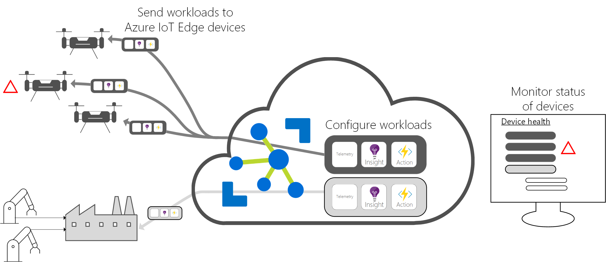

# What is Azure IoT Edge

Azure IoT Edge moves cloud analytics and custom business logic to devices so that your organization can focus on business insights instead of data management. Scale out your IoT solution by packaging your business logic into standard containers, then you can deploy those containers to any of your devices and monitor it all from the cloud.

Analytics drives business value in IoT solutions, but not all analytics needs to be in the cloud. If you want to respond to emergencies as quickly as possible, you can run anomaly detection workloads at the edge. If you want to reduce bandwidth costs and avoid transferring terabytes of raw data, you can clean and aggregate the data locally then only send the insights to the cloud for analysis.

Azure IoT Edge is made up of three components:

* **IoT Edge modules** are containers that run Azure services, third-party services, or your own code. Modules are deployed to IoT Edge devices and execute locally on those devices.
* The **IoT Edge runtime** runs on each IoT Edge device and manages the modules deployed to each device.
* A **cloud-based interface** enables you to remotely monitor and manage IoT Edge devices.

>[!NOTE]
>Azure IoT Edge is available in the free and standard tier of IoT Hub. The free tier is for testing and evaluation only. For more information about the basic and standard tiers, see [How to choose the right IoT Hub tier](../iot-hub/iot-hub-scaling.md).

## IoT Edge modules

IoT Edge modules are units of execution, implemented as Docker compatible containers, that run your business logic at the edge. Multiple modules can be configured to communicate with each other, creating a pipeline of data processing. You can develop custom modules or package certain Azure services into modules that provide insights offline and at the edge.

### Artificial intelligence at the edge

Azure IoT Edge allows you to deploy complex event processing, machine learning, image recognition, and other high value AI without writing it in-house. Azure services like Azure Functions, Azure Stream Analytics, and Azure Machine Learning can all be run on-premises via Azure IoT Edge. You’re not limited to Azure services, though. Anyone is able to create AI modules and make them available to the community for use through the Azure Marketplace.

### Bring your own code

When you want to deploy your own code to your devices, Azure IoT Edge supports that, too. Azure IoT Edge holds to the same programming model as the other Azure IoT services. You can run the same code on a device or in the cloud. Azure IoT Edge supports both Linux and Windows so you can code to the platform of your choice. It supports Java, .NET Core 2.0, Node.js, C, and Python so your developers can code in a language they already know and use existing business logic.

## IoT Edge runtime

The Azure IoT Edge runtime enables custom and cloud logic on IoT Edge devices. The runtime sits on the IoT Edge device, and performs management and communication operations. The runtime performs several functions:

* Installs and update workloads on the device.
* Maintains Azure IoT Edge security standards on the device.
* Ensures that IoT Edge modules are always running.
* Reports module health to the cloud for remote monitoring.
* Manages communication between downstream leaf devices and an IoT Edge device, between modules on an IoT Edge device, and between an IoT Edge device and the cloud.

How you use an Azure IoT Edge device is up to you. The runtime is often used to deploy AI to gateway devices which aggregate and process data from other on-premises devices, but this deployment model is just one option.

The Azure IoT Edge runtime runs on a large set of IoT devices that enables using it in a wide variety of ways. It supports both Linux and Windows operating systems and abstracts hardware details. Use a device smaller than a Raspberry Pi 3 if you’re not processing much data, or use an industrial server to run resource-intensive workloads.

## IoT Edge cloud interface

It's difficult to manage the software life cycle for millions of IoT devices that are often different makes and models or geographically scattered. Workloads are created and configured for a particular type of device, deployed to all of your devices, and monitored to catch any misbehaving devices. These activities can’t be done on a per device basis and must be done at scale.

Azure IoT Edge integrates seamlessly with Azure IoT solution accelerators to provide one control plane for your solution’s needs. Cloud services allow you to:

* Create and configure a workload to be run on a specific type of device.
* Send a workload to a set of devices.
* Monitor workloads running on devices in the field.

## Next steps

Try out these concepts by [deploying IoT Edge on a simulated device](quickstart.md).
