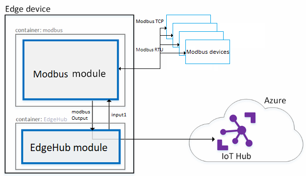

# Connect Modbus TCP devices through an IoT Edge device gateway

If you want to connect IoT devices that use Modbus TCP or RTU protocols to an Azure IoT hub, use an IoT Edge device as a gateway. The gateway device reads data from your Modbus devices, then communicates that data to the cloud using a supported protocol. 



This article covers how to create your own container image for a Modbus module (or you can use a prebuilt sample) and then deploy it to the IoT Edge device that will act as your gateway. 

This article assumes that you're using Modbus TCP protocol. For more information about how to configure the module to support Modbus RTU, refer to the [Azure IoT Edge Modbus module](https://github.com/Azure/iot-edge-modbus) project on Github. 

## Prerequisites
* An Azure IoT Edge device. For a walkthrough on how to set up one, see [Deploy Azure IoT Edge on a simulated device in Windows](quickstart.md) or [Linux](quickstart-linux.md). 
* The primary key connection string for the IoT Edge device.
* A physical or simulated Modbus device that supports Modbus TCP.

## Prepare a Modbus container

If you want to test the Modbus gateway functionality, Microsoft has a sample module that you can use. To use the sample module, go to the [Run the solution](#run-the-solution) section and enter the following as the Image URI: 

```URL
mcr.microsoft.com/azureiotedge/modbus:1.0
```

If you want to create your own module and customize it for your environment, there is an open source [Azure IoT Edge Modbus module](https://github.com/Azure/iot-edge-modbus) project on Github. Follow the guidance in that project to create your own container image. If you create your own container image, refer to [Develop and deploy a C# IoT Edge module](tutorial-csharp-module.md) for instructions on publishing container images to a registry, and deploying a custom module to your device. 


## Run the solution
1. On the [Azure portal](https://portal.azure.com/), go to your IoT hub.
2. Go to **IoT Edge** and click on your IoT Edge device.
3. Select **Set modules**.
4. Add the Modbus module:
   1. Click **Add** and select **IoT Edge module**.
   2. In the **Name** field, enter "modbus".
   3. In the **Image** field, enter the image URI of the sample container: `mcr.microsoft.com/azureiotedge/modbus:1.0`.
   4. Check the **Enable** box to update the module twin's desired properties.
   5. Copy the following JSON into the text box. Change the value of **SlaveConnection** to the IPv4 address of your Modbus device.

      ```JSON
      {  
        "properties.desired":{  
          "PublishInterval":"2000",
          "SlaveConfigs":{  
            "Slave01":{  
              "SlaveConnection":"<IPV4 address>",
              "HwId":"PowerMeter-0a:01:01:01:01:01",
              "Operations":{  
                "Op01":{  
                  "PollingInterval": "1000",
                  "UnitId":"1",
                  "StartAddress":"400001",
                  "Count":"2",
                  "DisplayName":"Voltage"
                }
              }
            }
          }
        }
      }
      ```

   6. Select **Save**.
5. Back in the **Add Modules** step, select **Next**.
7. In the **Specify Routes** step, copy the following JSON into the text box. This route sends all messages collected by the Modbus module to IoT Hub. In this route, ''modbusOutput'' is the endpoint that Modbus module use to output data, and ''upstream'' is a special destination that tells Edge Hub to send messages to IoT Hub. 
   ```JSON
   {
    "routes": {
      "modbusToIoTHub":"FROM /messages/modules/modbus/outputs/modbusOutput INTO $upstream"
    }
   }
   ```

8. Select **Next**. 
9. In the **Review Deployment** step, select **Submit**. 
10. Return to the device details page and select **Refresh**. You should see the new **modbus** module running along with the IoT Edge runtime.

## View data
View the data coming through the modbus module:
```cmd/sh
docker logs -f modbus
```

You can also view the telemetry the device is sending by using the [Azure IoT Toolkit extension for Visual Studio Code](https://marketplace.visualstudio.com/items?itemName=vsciot-vscode.azure-iot-toolkit). 

## Next steps

- To learn more about how IoT Edge devices can act as gateways, see [Create an IoT Edge device that acts as a transparent gateway][lnk-transparent-gateway-linux]
- For more information about how IoT Edge modules work, see [Understand Azure IoT Edge modules](iot-edge-modules.md)

<!-- Links -->
[lnk-transparent-gateway-linux]: ./how-to-create-transparent-gateway-linux.md
