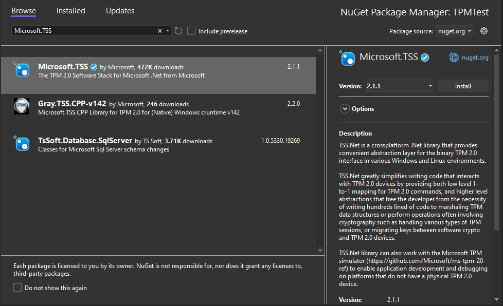
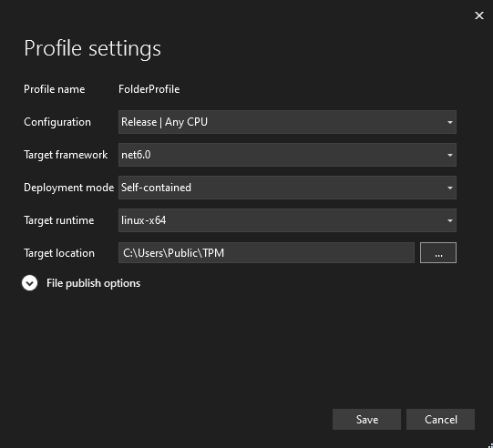
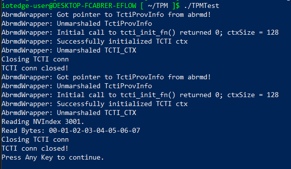

# dTPM access for Azure IoT Edge for Linux on Windows

[!INCLUDE [iot-edge-version-all-supported](../../includes/iot-edge-version-all-supported.md)]

Trusted platform module (TPM) technology is a technology designed to provide hardware-based, security-related functions. A TPM chip is a secure crypto-processor that is designed to carry out cryptographic operations. The Azure IoT Edge for Linux on Windows (EFLOW) virtual machine doesn't support vTPM. However, the user can enable or disable the TPM passthrough feature, that allows the EFLOW virtual machine to use the Windows host OS TPM. The TPM passthrough feature enables two main scenarios:

- Use TPM technology for IoT Edge device provisioning using Device Provision Service (DPS)
- Read-only access to cryptographic keys stored inside the TPM. 

This article describes how to develop a sample code in C# to read cryptographic keys stored inside the TPM. 

> [!IMPORTANT]
> The access to the TPM keys is limited to read-only. If you want to write keys to the TPM, you need to do it from the Windows host OS. 

## Prerequisites

- A Windows host OS with a TPM or vTPM
- EFLOW virtual machine with TPM passthrough enabled. For more information, see [Set-EflowVmFeature to enable TPM passthrough](./reference-iot-edge-for-linux-on-windows-functions.md#set-eflowvmfeature).
- Ensure that the NV index (default index=3001) is initialized and has 8 bytes of data written to it. The AuthValue used by default by the sample is {1,2,3,4,5,6,7,8} which corresponds to the NV (Windows) Sample in the TSS.MSR libraries when writing to the TPM. All index initialization must take place on the Windows Host before reading from the EFLOW VM. For more information about TPM samples, see [TSS.MSR](https://github.com/microsoft/TSS.MSR).

## Create the dTPM executable

The following steps in this section show how to create a sample executable to access a TPM index from the EFLOW VM. For more information about EFLOW TPM passthrough, see [Azure IoT Edge for Linux on Windows Security](./iot-edge-for-linux-on-windows-security.md).

> [!WARNING]
> Enabling TPM passthrough to the virtual machine may increase security risks.

1. Open Visual Studio 2019/2022.

1. Select _Create a new project_

1. Search for _Console App, select it and select _Next_. 

    

1. Fill in the _Project Name_, _Location_ and _Solution Name_ fields and select _Next_.

1. Select a target framework. We recommend using the latest .NET 6.0 LTS version. Once the framework is selected, select _Create_.

1. Once the solution is loaded, right-click on the project and select _Manage NuGet Packages_.

1. Select _Browse_ and then search for "Microsoft.TSS".

1. Select the "Microsoft.TSS" package and install it.

    

1. Open the _Program.cs_ file and replace the content with the [EFLOW TPM sample code - Program.cs](https://raw.githubusercontent.com/Azure/iotedge-eflow/main/samples/tpm-read-nv/Program.cs)

1. Build the project and make sure there are no errors.

1. Right-click the project and select _Publish_.

1. Select _Folder_ -> _Folder_ -> Chose _Folder location_ of the output location for the executable file to be generated and then select _Finish_. 

1. On the new _Publish_ opened tab, select _Show all settings_, change the following configurations and select _Save_. 
    - Target Runtime:  _linux-x64_.
    - Deployment mode: _Self-contained_.
    
    
 
1. Select the _Publish_ button and wait for the executable to be created. 

If everything was successfully, you should see the new files created under your output folder.

## Copy and run the executable
Once the executable file and dependency files were created, you need to copy the folder to the EFLOW virtual machine. The following steps in this section show how to copy all the necessary files and how to run the executable inside the EFLOW virtual machine.

1. Open an elevated _PowerShell_ session by starting with **Run as Administrator**.

1. Move to the parent folder that contains all the created files. 
    For example, if you have all your files under the folder _TPM_ in the directory `C:\Users\User`. you can use the following command to move to that parent folder.
    ```powershell
    cd "C:\Users\User"
    ```

1. Create a _tar_ file with all the files created in previous steps. For more information about PowerShell _.tar_ support, see [Tar and Curl Come to Windows](/virtualization/community/team-blog/2017/20171219-tar-and-curl-come-to-windows.md).
    For example, if you have all your files under the folder _TPM_, you can use the following command to create the _TPM.tar_ file.
    ```powershell
     tar -cvzf TPM.tar ".\TPM"
    ```

1. Once the _TPM.tar_ file was created successfully, use the `Copy-EflowVmFile` cmdlet to copy the _tar_ file created to the EFLOW VM.
    For example, if you have the _tar_ file name _TPM.tar_ in the directory `C:\Users\User`. you can use the following command to copy to the EFLOW VM.
    ```powershell
    Copy-EflowVmFile -fromFile "C:\Users\User\TPM.tar" -toFile "/home/iotedge-user/" -pushFile
    ```

1. Connect to the EFLOW virtual machine.
     ```powershell
    Connect-EflowVm
    ```

1. Move to the folder you copied the _tar_ file and check the file is available. If you used the example above, when connected to the EFLOW VM, you'll already be at the _iotedge-user_ root folder. Run `ls` to see all the files and folders in that folder.

1. Run the following command to extract all the content from the _tar_ file.
    ```bash
    tar -xvzf TPM.tar
    ```

1. If everything was successfully, you should see a new folder with all the extracted files. 

1. Add executable permission to the main executable file - For example, if your project name was _TPMRead_ you should have a file named _TPMRead_ and you should run the following command to make it executable.
    ```bash
    chmod +x TPMRead
    ```

1. To solve ICU globalization [issue](https://github.com/dotnet/core/issues/2186#issuecomment-472629489), for example, if your project name is _TPMTest_ run the following command:
    ```bash
     sed -i '/"configProperties": /a \\t"System.Globalization.Invariant\": true,' TPMTest.runtimeconfig.json
    ```

1. Final step is to run the executable file. For example, if your project name is _TPMTest_ use the following command
    ```bash
    ./TPMTest
    ```
    You should see an output similar to the following.

    

## Next steps

* Learn [How to develop IoT Edge modules with Linux containers using IoT Edge for Linux on Windows](./tutorial-develop-for-linux-on-windows.md). 
