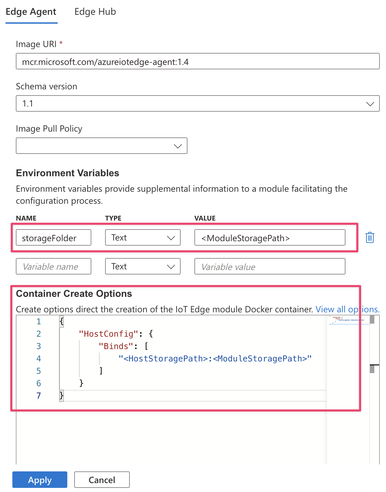

# Give modules access to a device's local storage

[!INCLUDE [iot-edge-version-all-supported](../../includes/iot-edge-version-all-supported.md)]

::: moniker range=">=iotedge-1.4"

IoT Edge modules can use storage on the host IoT Edge device itself for improved reliability, especially when operating offline.

## Configure system modules to use persistent storage

By default, IoT Edge system modules, IoT Edge agent and IoT Edge hub, store state in the ephemeral file system of their container instance. This state is lost when the container instance is recycled, for example, when module image version or createOptions is updated. 

For production scenarios, use a persistent storage location on the host filesystem to store system module state. Doing so improves solution robustness and cloud message delivery guarantees.

To set up system modules to use persistent storage:

1. For both IoT Edge hub and IoT Edge agent, add an environment variable called **storageFolder** that points to a directory in the module.
1. For both IoT Edge hub and IoT Edge agent, add binds to connect a local directory on the host machine to a directory in the module. For example:

   

Or, you can configure the local storage directly in the deployment manifest. For example:

```json
"systemModules": {
    "edgeAgent": {
        "settings": {
            "image": "mcr.microsoft.com/azureiotedge-agent:1.4",
            "createOptions": {
                "HostConfig": {
                    "Binds":["<HostStoragePath>:<ModuleStoragePath>"]
                }
            }
        },
        "type": "docker",
        "env": {
            "storageFolder": {
                "value": "<ModuleStoragePath>"
            }
        }
    },
    "edgeHub": {
        "settings": {
            "image": "mcr.microsoft.com/azureiotedge-hub:1.4",
            "createOptions": {
                "HostConfig": {
                    "Binds":["<HostStoragePath>:<ModuleStoragePath>"],
                    "PortBindings":{"5671/tcp":[{"HostPort":"5671"}],"8883/tcp":[{"HostPort":"8883"}],"443/tcp":[{"HostPort":"443"}]}}}
        },
        "type": "docker",
        "env": {
            "storageFolder": {
                "value": "<ModuleStoragePath>"
            }
        },
        "status": "running",
        "restartPolicy": "always"
    }
}
```

Replace `<HostStoragePath>` and `<ModuleStoragePath>` with your host and module storage path; both values must be an absolute path and `<HostStoragePath>` must exist. 

### Automatic host system permissions management

On version 1.4 and newer, there's no need for manually setting ownership or permissions for host storage backing the `storageFolder`. Permissions and ownership are automatically managed by the system modules during startup.

> [!NOTE]
> Automatic permission management of host bound storage only applies to system modules, IoT Edge agent and Edge hub. For custom modules, manual management of permissions and ownership of bound host storage is required if the custom module container is not running as `root` user. 


## Link module storage to device storage for custom modules

If your custom module requires access to persistent storage on the host file system, use the module's create options to bind a storage folder in module container to a folder on the host machine. For example:

```json
{
  "HostConfig": {
    "Mounts": [
      {
        "Target": "<ModuleStoragePath>",
        "Source": "<HostStoragePath>",
        "Type": "bind",
        "ReadOnly": false
      }
    ]
  }
}
```


Replace `<HostStoragePath>` and `<ModuleStoragePath>` with your host and module storage path; both values must be an absolute path. Refer to the [Docker Engine Mount specification](https://any-api.com/docker_com/engine/docs/Definitions/Mount) for option details.


### Host system permissions

Make sure that the user profile your module is using has the required read, write, and execute permissions to the host system directory. By default, containers run as `root` user that already has the required permissions. But your module's Dockerfile might specify use of a non-root user in which case host storage permissions must be manually configured. 

There are several ways to manage directory permissions on Linux systems, including using `chown` to change the directory owner and then `chmod` to change the permissions. For example to allow host storage access to a module running as non-root user ID 1000, use the following commands:

```bash
sudo chown 1000 <HostStoragePath>
sudo chmod 700 <HostStoragePath>
```
::: moniker-end

::: moniker range="<=iotedge-2020-11"

In addition to storing data using Azure storage services or in your device's container storage, you can also dedicate storage on the host IoT Edge device itself for improved reliability, especially when operating offline.

## Link module storage to device storage

To enable a link from module storage to the storage on the host system, create an environment variable for your module that points to a storage folder in the container. Then, use the create options to bind that storage folder to a folder on the host machine.

For example, if you wanted to enable the IoT Edge hub to store messages in your device's local storage and retrieve them later, you can configure the environment variables and the create options in the Azure portal in the **Runtime Settings** section.

1. For both IoT Edge hub and IoT Edge agent, add an environment variable called **storageFolder** that points to a directory in the module.
1. For both IoT Edge hub and IoT Edge agent, add binds to connect a local directory on the host machine to a directory in the module. For example, for version 1.1:

   

Or, you can configure the local storage directly in the deployment manifest. For example, for version 1.1:

```json
"systemModules": {
    "edgeAgent": {
        "settings": {
            "image": "mcr.microsoft.com/azureiotedge-agent:1.1",
            "createOptions": {
                "HostConfig": {
                    "Binds":["<HostStoragePath>:<ModuleStoragePath>"]
                }
            }
        },
        "type": "docker",
        "env": {
            "storageFolder": {
                "value": "<ModuleStoragePath>"
            }
        }
    },
    "edgeHub": {
        "settings": {
            "image": "mcr.microsoft.com/azureiotedge-hub:1.1",
            "createOptions": {
                "HostConfig": {
                    "Binds":["<HostStoragePath>:<ModuleStoragePath>"],
                    "PortBindings":{"5671/tcp":[{"HostPort":"5671"}],"8883/tcp":[{"HostPort":"8883"}],"443/tcp":[{"HostPort":"443"}]}}}
        },
        "type": "docker",
        "env": {
            "storageFolder": {
                "value": "<ModuleStoragePath>"
            }
        },
        "status": "running",
        "restartPolicy": "always"
    }
}
```

Replace `<HostStoragePath>` and `<ModuleStoragePath>` with your host and module storage path; both values must be an absolute path. If using version 1.3, update each image version with `1.3`. For example, `mcr.microsoft.com/azureiotedge-agent:1.3`.

For example, on a Linux system, `"Binds":["/etc/iotedge/storage/:/iotedge/storage/"]` means the directory **/etc/iotedge/storage** on your host system is mapped to the directory **/iotedge/storage/** in the container. On a Windows system, as another example, `"Binds":["C:\\temp:C:\\contemp"]` means the directory **C:\\temp** on your host system is mapped to the directory **C:\\contemp** in the container.

You can find more details about create options from [docker docs](https://docs.docker.com/engine/api/v1.32/#operation/ContainerCreate).

## Host system permissions

On Linux devices, make sure that the user profile for your module has the required read, write, and execute permissions to the host system directory. Returning to the earlier example of enabling IoT Edge hub to store messages in your device's local storage, you need to grant permissions to its user profile, UID 1000. There are several ways to manage directory permissions on Linux systems, including using `chown` to change the directory owner and then `chmod` to change the permissions, such as:

```bash
sudo chown 1000 <HostStoragePath>
sudo chmod 700 <HostStoragePath>
```

On Windows devices, you will also need to configure permissions on the host system directory. You can use PowerShell to set permissions:

```powershell
$acl = get-acl <HostStoragePath>
$ace = new-object system.security.AccessControl.FileSystemAccessRule('Authenticated Users','FullControl','Allow')
$acl.AddAccessRule($ace)
$acl | Set-Acl
```
::: moniker-end

## Encrypted data in module storage

When modules invoke the IoT Edge daemon's workload API to encrypt data, the encryption key is derived using the module ID and module's generation ID. A generation ID is used to protect secrets if a module is removed from the deployment and then another module with the same module ID is later deployed to the same device. You can view a module's generation ID using the Azure CLI command [az iot hub module-identity show](/cli/azure/iot/hub/module-identity).

If you want to share files between modules across generations, they must not contain any secrets or they will fail to be decrypted.

## Next steps

For an additional example of accessing host storage from a module, see [Store data at the edge with Azure Blob Storage on IoT Edge](how-to-store-data-blob.md).
