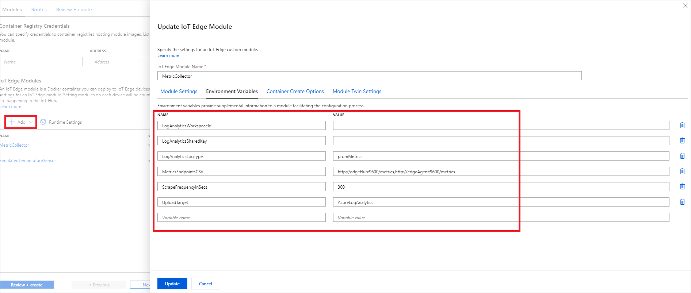
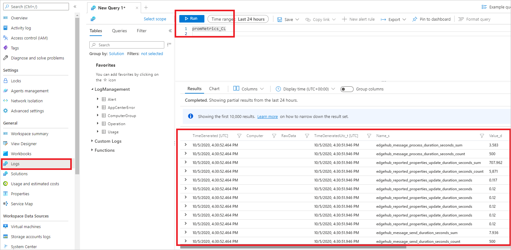

# Remote access to IoT Edge runtime metrics

The IoT Edge runtime components, IoT Edge Hub and Edge Agent, produce metrics in the [Prometheus exposition format](https://prometheus.io/docs/instrumenting/exposition_formats/) that are sent to the cloud. Access these metrics remotely to monitor and understand the health of an IoT Edge device.

## Metrics exposure

As of release 1.0.10, metrics are automatically exposed by default on **port 9600** of the edgeHub and edgeAgent modules (`http://edgeHub:9600/metrics` and `http://edgeAgent:9600/metics`). They are not port mapped to the host by default.

For mapping to host, expose the port from the edgeHub module's `createOptions`:

```
{
  "ExposedPorts": {
    "9600/tcp": {},
  }
  <other options, if any>
}
```

> [!NOTE]
> If you wish to disable metrics, set the `MetricsEnabled` environment variable to `false` for **edgeAgent**.

## Metrics collection

A **metrics collector module** is required to gather metrics exposed by the IoT Edge runtime and send them to the cloud. You can create your own or use the public sample module provided at `azureiotedge/azureiotedge-metrics-collector-sample:0.1`. You can see the code for this sample module [here](https://github.com/Azure/iotedge/tree/master/edge-modules/MetricsCollector).

This module collects metrics and sends them to an [Azure Log Analytics Workspace](https://docs.microsoft.com/azure/azure-monitor/learn/quick-create-workspace). It uses the **settings.json** file to target a workspace:

```json
    {
       "LogAnalyticsWorkspaceId": "",
       "LogAnalyticsSharedKey": "",
       "LogAnalyticsLogType": "IoTEdgeMetrics",
       "MetricsEndpointsCSV": "http://edgeHub:9600/metrics,http://edgeAgent:9600/metrics",
       "ScrapeFrequencyInSecs": 300,
       "UploadTarget": "AzureLogAnalytics",
       "MessageIdentifier": "IoTEdgeMetrics"
    }
```

To test the sample metrics collector module, you will need an IoT Edge device. The following steps will help you set up the rest of the resources you need:

1. Create an Azure Log Analytics Workspace:
    1. Sign in to the [Microsoft Azure portal](https://portal.azure.com).

    2. In the left pane, select **Create a resource**, and then search for **Log Analytics Workspace**.  

    3. Select **Create**. Select your **Subscription**, **Resource group**, and **Region**. Provide a unique name for your workspace.

    4. Select **Review + create** and then, once validation passes, **Create**.

    5. Once the deployment is complete, select **Go to resource**.

    6. In the left-hand panel, under **Settings**, select **Agents management**. Note the **Workspace ID** and **Primary key**.

    

2. Navigate to your IoT Edge device and create your deployment:

    1. Select **Set modules**.

    2. Add a **SimulatedTemperatureSensor** from the **Azure Marketplace** to the deployment.

    3. Add the **MetricCollector** using an **IoT Edge Module** and enter `azureiotedge/azureiotedge-metrics-collector-sample:0.1` for the **Image URI**.

    4. Set the **MetricCollector** module's environment variables to the following:

        | Name | Value |
        |-|-|
        | LogAnalyticsWorkspaceId | `Workspace ID` |
        | LogAnalyticsSharedKey | `Primary key` |
        | Log AnalyticsLogType | `promMetrics` |
        | MetricsEndpointsCSV | http://edgeHub:9600/metics,http://edgeAgent:9600/metrics (add metrics URLs from additional modules exposing Prometheus endpoints using this comma-separated list) |
        | ScrapeFrequencyInSecs | 300 (use this to increase or decrease collection frequency) |
        | UploadTarget | AzureLogAnalytics |

    5. Select **Review + create** and, once validation passes, **Create**.

    

3. Once your modules successfully deploy, it may take up to 20 minutes for metrics data to appear in your Log Analytics Workspace. It will normally take 5-10 minutes. Navigate to your Log Analytics Workspace and view your device's metrics:

    1. In the left-hand panel, under **General**, select **Logs**.

    2. Type the query `promMetrics_CL` and select **Run**.

    

You can view the details of the collected metrics by using the arrow on the left-hand side of each metric in the list or using the scroll bar at the bottom of the list. For each metric, you will see a **TimeGenerated**, a **Name**, a **Value**, and its corresponding **Tags**.

Additional information about the components that make up these metrics and what metrics are exposed by the edgeAgent and edgeHub modules is provided below.

## Available metrics

Metrics contain tags to help identify the nature of the metric being collected. All metrics contain the following tags:

| Tag | Description |
|-|-|
| iothub | The hub the device is talking to |
| edge_device | The device id of the current device |
| instance_number | A GUID representing the current runtime. On restart, all metrics will be reset. This GUID makes it easier to reconcile restarts. |

The **edgeHub** module produces the following metrics:

| Name | Dimensions | Description  | Type |
|-|-|-|-|
| `edgehub_gettwin_total` | `source` (operation source)<br> `id` (module ID) | Total number of GetTwin calls | counter |
| `edgehub_messages_received_total` | `route_output` (output that sent message)<br> `id` | Total number of messages received from clients | counter |
| `edgehub_messages_sent_total` |  `from` (message source)<br> `to` (message destination)<br>`from_route_output`<br> `to_route_input` (message destination input (empty when "to" is $upstream))<br> `priority` (message priority to destination) | Total number of messages sent to clients or upstream | counter |
| `edgehub_reported_properties_total` |  `target`(update target)<br> `id` | Total reported property updates calls | counter |
| `edgehub_message_size_bytes` |  `id`<br> `quantile`(percentile (50, 90, 95, 99, 99.9, 99.99)) | P50, P90, P95, P99, P99.9 and P99.99 message size from clients (values may be reported as `NaN` if no new measurements are reported for a certain period of time (currently 10 minutes)); as this is `summary` type, corresponding `_count` and `_sum` counters will be emitted. | summary |
| `edgehub_gettwin_duration_seconds` |  `source` <br> `id`<br> `quantile` | P50, P90, P95, P99, P99.9 and P99.99  time taken for get twin operations | summary |
| `edgehub_message_send_duration_seconds` | `from`<br> `to`<br> `from_route_output`<br> `to_route_input`<br> `quantile` | P50, P90, P95, P99, P99.9 and P99.99 time taken to send a message | summary |
| `edgehub_message_process_duration_seconds` |  `from` <br> `to` <br> `priority` <br> `quantile` | P50, P90, P95, P99, P99.9 and P99.99 time taken to process a message from the queue | summary |
| `edgehub_reported_properties_update_duration_seconds` | `target`<br> `id` <br> `quantile` | P50, P90, P95, P99, P99.9 and P99.99 time taken to update reported properties | summary |
| `edgehub_direct_method_duration_seconds`       |  `from` (Caller)<br> `to` (Reciever)<br> `quantile` | P50, P90, P95, P99, P99.9 and P99.99 time taken to resolve a direct message | summary |
| `edgehub_direct_methods_total` |  `from`<br> `to` | Total number of direct messages sent | counter |
| `edgehub_queue_length` | `endpoint` (message source)<br> `priority` (queue priority) | Current length of edgeHub's queue for a given priority | gauge |
| `edgehub_messages_dropped_total` |  `reason` (no_route, ttl_expiry)<br> `from` <br> `from_route_output` | Total number of messages removed because of reason | counter |
| `edgehub_messages_unack_total` | `reason` (storage_failure)<br> `from`<br> `from_route_output` | Total number of messages unacknowledged because storage failure | counter |
| `edgehub_offline_count_total` |  `id` | Total number of times edgeHub went offline | counter | 
| `edgehub_offline_duration_seconds`|  `id`<br> `quantile` | P50, P90, P95, P99, P99.9 and P99.99 time edge hub was offline | summary |
| `edgehub_operation_retry_total` |  `id`<br> `operation` (operation name) | Total number of times edgeHub operations were retried | counter |
| `edgehub_client_connect_failed_total` | `id` <br> `reason` (not authenticated)<br> | Total number of times clients failed to connect to edgeHub | counter |

The **edgeAgent** module produces the following metrics:

| Name | Dimensions | Description | Type |
|-|-|-|-|
| `edgeAgent_total_time_running_correctly_seconds` | `module_name` | The amount of time the module was specified in the deployment and was in the  running state | gauge |
| `edgeAgent_total_time_expected_running_seconds` | `module_name` | The amount of time the module was specified in the deployment | gauge |
| `edgeAgent_module_start_total` | `module_name`, `module_version` | Number of times edgeAgent asked docker to start the module | counter |
| `edgeAgent_module_stop_total` | `module_name`, `module_version` | Number of times edgeAgent asked docker to stop the module | counter |
| `edgeAgent_command_latency_seconds` | `command` | How long it took docker to execute the given command. Possible commands are: create, update,  remove, start, stop, restart | gauge |
| `edgeAgent_iothub_syncs_total` |  | The amount of times edgeAgent attempted to sync its twin with iotHub, both successful and unsuccessful. This incudes both Agent requesting a twin and Hub notifying of a twin update | counter |
| `edgeAgent_unsuccessful_iothub_syncs_total` |  | The amount of times edgeAgent failed to sync its twin with iotHub. | counter |
| `edgeAgent_deployment_time_seconds` |  | The amount of time it took to complete a new deployment after receiving a change. | counter |
| `edgeagent_direct_method_invocations_count` | `method_name` | Number of times a built-in edgeAgent direct method is called, such as Ping or Restart. | counter |
| `edgeAgent_host_uptime_seconds` || How long the host has been on | gauge |
| `edgeAgent_iotedged_uptime_seconds` || How long iotedged has been running | gauge |
| `edgeAgent_available_disk_space_bytes` | `disk_name`, `disk_filesystem`, `disk_filetype` | Amount of space left on the disk | gauge |
| `edgeAgent_total_disk_space_bytes` | `disk_name`, `disk_filesystem`, `disk_filetype`| Size of the disk | gauge |
| `edgeAgent_used_memory_bytes` | `module_name` | Amount of RAM used by all processes | gauge |
| `edgeAgent_total_memory_bytes` | `module_name` | RAM available | gauge |
| `edgeAgent_used_cpu_percent` | `module_name` | Percent of cpu used by all processes | histogram |
| `edgeAgent_created_pids_total` | `module_name` | The number of processes or threads the container has created | gauge |
| `edgeAgent_total_network_in_bytes` | `module_name` | The amount of bytes recieved from the network | gauge |
| `edgeAgent_total_network_out_bytes` | `module_name` | The amount of bytes sent to network | gauge |
| `edgeAgent_total_disk_read_bytes` | `module_name` | The amount of bytes read from the disk | gauge |
| `edgeAgent_total_disk_write_bytes` | `module_name` | The amount of bytes written to disk | gauge |
| `edgeAgent_metadata` | `edge_agent_version`, `experimental_features`, `host_information` | General metadata about the device. The value is always 0, information is encoded in the tags. Note `experimental_features` and `host_information` are json objects. `host_information` looks like ```{"OperatingSystemType": "linux", "Architecture": "x86_64", "Version": "1.0.10~dev20200803.4", "Provisioning": {"Type": "dps.tpm", "DynamicReprovisioning": false, "AlwaysReprovisionOnStartup": true}, "ServerVersion": "19.03.6", "KernelVersion": "5.0.0-25-generic", "OperatingSystem": "Ubuntu 18.04.4 LTS", "NumCpus": 6, "Virtualized": "yes"}```. Note `ServerVersion` is the Docker version and `Version` is the IoT Edge Security Daemon version. | gauge |

## Runtime Quality Telemetry

IoT Edge collects anonymized telemetry from the host runtime and system modules to improve product quality. This information is called Runtime Quality Telemetry (RQT). RQT is periodically sent as device-to-cloud messages to IoT Hub from the IoT Edge Agent. RQT messages do not appear in customer's regular telemetry and do not consume any message quota.

A subset of the edgeAgent and edgeHub metrics listed above are collected by the IoT Edge Agent as part of RQT. Metrics collected as a part of RQT include the tag `ms_telemetry`.

As part of the anonymization, any personally or organizationally identifiable information, such as device and module names, are removed before upload.

The default frequency of RQT is one message sent to IoT Hub every 24 hours and local collection by edgeAgent every hour.

> [!NOTE]
> If you wish to opt out of RQT, there are two ways to do so:
>
> 1. Uncheck option in portal during deployment authoring experience
>
> 2. Set the `SendRuntimeQualityTelemetry` environment variable to `false` for **edgeAgent**

## Next steps

[Properties of the IoT Edge agent and IoT Edge hub module twins](module-edgeagent-edgehub.md)
