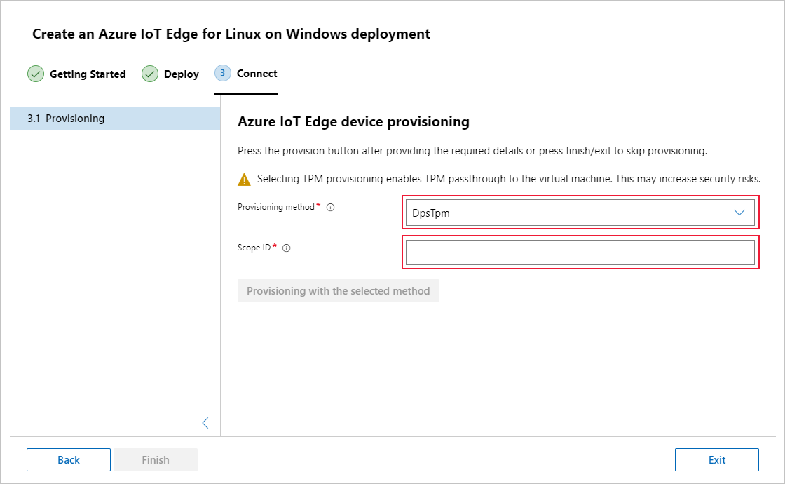

# Create and provision an IoT Edge for Linux on Windows device with TPM attestation

[!INCLUDE [iot-edge-version-201806](../../includes/iot-edge-version-201806.md)]

Azure IoT Edge devices can be provisioned using the [Device Provisioning Service](../iot-dps/index.yml) just like devices that are not edge-enabled. If you're unfamiliar with the process of auto-provisioning, review the [provisioning](../iot-dps/about-iot-dps.md#provisioning-process) overview before continuing.

DPS supports Trusted Platform Module (TPM) attestation for IoT Edge devices only for individual enrollment, not group enrollment.

This article shows you how to use auto-provisioning on a device running IoT Edge for Linux on Windows with the following steps:

* Install IoT Edge for Linux on Windows.
* Retrieve the TPM information from your device.
* Create an individual enrollment for the device.
* Provision your device with its TPM information.

## Prerequisites

* A Windows device. For supported Windows versions, see [Operating systems](support.md#operating-systems).
* An active IoT hub.
* An instance of the IoT Hub Device Provisioning Service in Azure, linked to your IoT hub.
  * If you don't have a Device Provisioning Service instance, follow the instructions in [Set up the IoT Hub DPS](../iot-dps/quick-setup-auto-provision.md).
  * After you have the Device Provisioning Service running, copy the value of **ID Scope** from the overview page. You use this value when you provision the IoT Edge device.

> [!NOTE]
> TPM 2.0 is required when using TPM attestation with DPS and can only be used to create individual, not group, enrollments.

## Install IoT Edge for Linux on Windows

The installation steps in this section are abridged to highlight the steps specific to the TPM provisioning scenario. For more detailed instructions, including prerequisites and remote installation steps, see [Install and provision Azure IoT Edge for Linux on a Windows device](how-to-install-iot-edge-on-windows.md).

# [PowerShell](#tab/powershell)

1. Open an elevated PowerShell session on the Windows device.

1. Download IoT Edge for Linux on Windows.

   ```powershell
   $msiPath = $([io.Path]::Combine($env:TEMP, 'AzureIoTEdge.msi'))
   $ProgressPreference = 'SilentlyContinue'
   Invoke-WebRequest "https://aka.ms/AzEflowMSI" -OutFile $msiPath
   ```

1. Install IoT Edge for Linux on Windows on your device.

   ```powershell
   Start-Process -Wait msiexec -ArgumentList "/i","$([io.Path]::Combine($env:TEMP, 'AzureIoTEdge.msi'))","/qn"
   ```

1. For the deployment to run successfully, you need to set the execution policy on the device to `AllSigned` if it is not already.

   1. Check the current execution policy.

      ```powershell
      Get-ExecutionPolicy -List
      ```

   1. If the execution policy of `local machine` is not `AllSigned`, update the execution policy.

      ```powershell
      Set-ExecutionPolicy -ExecutionPolicy AllSigned -Force
      ```

1. Deploy IoT Edge for Linux on Windows.

   ```powershell
   Deploy-Eflow
   ```

1. Enter `Y` to accept the license terms.

1. Enter `O` or `R` to toggle **Optional diagnostic data** on or off, depending on your preference.

1. The output will report **Deployment successful** once IoT Edge for Linux on Windows has been successfully deployed to your device.

# [Windows Admin Center](#tab/windowsadmincenter)

>[!NOTE]
>The Azure IoT Edge extension for Windows Admin Center is currently in [public preview](https://azure.microsoft.com/support/legal/preview-supplemental-terms/). Installation and management processes may be different than for generally available features.

1. Have Windows Admin Center configured with the **Azure IoT Edge** extension.

1. On the Windows Admin Center connections page, select **Add**.

1. On the **Add or create resources** pane, located the **Azure IoT Edge** tile. Select **Create new** to install a new instance of Azure IoT Edge for Linux on Windows on a device.

1. Follow the steps in the deployment wizard to install and configure IoT Edge for Linux on Windows.

   1. On the **Getting Started** steps, review the prerequisites, accept the license terms, and choose whether or not to send diagnostic data.

   1. On the **Deploy** steps, choose your device and its configuration settings. Then observe the progress as IoT Edge is deployed to your device.

   1. Select **Next** to continue to the **Connect** step, where you provide the provisioning information for your device.

1. Stop following the deployment wizard on the **Provisioning** page, as there are some steps to take to prepare your device for provisioning with TPM before you can continue. Keep the Windows Admin Center window open, as you'll return at the end of this article to complete the provisioning steps.

---

## Enable TPM passthrough

The IoT Edge for Linux on Windows virtual machine has a TPM feature that can be enabled or disabled. By default, it's disabled. When this feature is enabled, the virtual machine can access the host machine's TPM.

1. Open PowerShell in an elevated session.

1. If you haven't already, set the execution policy on your device to `AllSigned` so that you can run the IoT Edge for Linux on Windows PowerShell functions.

   ```powershell
   Set-ExecutionPolicy -ExecutionPolicy AllSigned -Force
   ```

1. Turn on the TPM feature.

   ```powershell
   Set-EflowVmFeature -feature 'DpsTpm' -enable
   ```

## Retrieve the TPM information from your device

To provision your device, you need to gather information from your TPM chip and provide it to your instance of the Device Provisioning Service (DPS) so that the service can recognize your device when it tries to connect.

First, you need to determine the **Endorsement key**, which is unique to each TPM chip and is obtained from the TPM chip manufacturer associated with it. Then, you need to provide a **Registration ID** for your device. You can derive a unique registration ID for your TPM device by, for example, creating an SHA-256 hash of the endorsement key.

IoT Edge for Linux on Windows provides a PowerShell fucntion to help retrieve this information from your TPM. To use the script, follow these steps on your device:

1. Open PowerShell in an elevated session.

1. Run the command.

   ```powershell
   Get-EflowVmTpmProvisioningInfo
   ```

### Simulate a TPM (optional)

If you don't have a physical TPM available and want to test this provisioning method, you can simulate a TPM on your device.

IoT Hub Device Provisioning Service provides samples that simulate a TPM and return the endorsement key and registration ID for you.

1. Choose one of the samples from the following list, based on your preferred language.
1. Stop following the DPS sample steps once you have the simulated TPM running and have collected the endorsement key and registration ID. Do not press *Enter* to run registration in the sample application.
1. Keep the window hosting the simulated TPM running until you're completely finished testing this scenario.
1. Return to this article to create a DPS enrollment and configure your device.

Simulated TPM samples:

* [C](../iot-dps/quick-create-simulated-device.md)
* [Java](../iot-dps/quick-create-simulated-device-tpm-java.md)
* [C#](../iot-dps/quick-create-simulated-device-tpm-csharp.md)
* [Node.js](../iot-dps/quick-create-simulated-device-tpm-node.md)
* [Python](../iot-dps/quick-create-simulated-device-tpm-python.md)

## Create a device enrollment entry

The Device Provisioning Service supports two types of enrollments. Enrollment groups are used to enroll multiple related devices. Individual enrollments are used to enroll a single device. TPM attestation only supports individual enrollments because a group of devices cannot share TPM information. Therefore, this article demonstrates individual enrollments.

1. Sign in to the [Azure portal](https://portal.azure.com) and navigate to your instance of the Device Provisioning Service.

1. From the Device Provisioning Service menu, select **Manage enrollments**. Select the **Add individual enrollment** button at the top.

1. In the **Add Enrollment** panel, enter the following information:

   * Select **TPM** as the identity attestation mechanism.
   * Enter the registration ID and endorsement key for your TPM device from the values you noted previously.
   * Select an IoT hub linked with your provisioning service.
   * Optionally, enter a unique device ID. If you choose not to provide one, the registration ID will be used to identify the device instead.
   * Select **True** to declare that this enrollment is for an IoT Edge device.

1. Select **Save** to save your individual enrollment.

## Configure the device with provisioning information

# [PowerShell](#tab/powershell)

1. Open an elevated PowerShell session on the Windows device.

1. Provision your device using the **Scope ID** that you collected from your instance of Device Provisioning Service.

   ```powershell
   Provision-EflowVM -provisioningType "DpsTpm" -scopeId "<scope id>"
   ```

# [Windows Admin Center](#tab/windowsadmincenter)

1. On the **Connect** step, provision your device.

   1. Select the **DpsTpm** provisioning method.
   1. Provide the **Scope ID** that you retrieve from your instance of the Device Provisioning Service.

   

1. Select **Provisioning with the selected method**.

1. Once IoT Edge has successfully been installed and provisioned on your device, select **Finish** to exit the deployment wizard.

---

## Verify successful configuration

Verify that IoT Edge for Linux on Windows was successfully installed and configured on your IoT Edge device.

If the runtime started successfully, you can go into your IoT Hub and start deploying IoT Edge modules to your device.

You can verify that the individual enrollment that you created in Device Provisioning Service was used. Navigate to your Device Provisioning Service instance in the Azure portal. Open the enrollment details for the individual enrollment that you created. Notice that the status of the enrollment is **assigned** and the device ID is listed.

# [PowerShell](#tab/powershell)

Use the following commands on your device to verify that the IoT Edge installed and started successfully.

1. Connect to your IoT Edge for Linux on Windows virtual machine using the following command in your PowerShell session:

   ```powershell
   Connect-EflowVm
   ```

   >[!NOTE]
   >The only account allowed to SSH to the virtual machine is the user that created it.

1. Once you are logged in, you can check the list of running IoT Edge modules using the following Linux command:

   ```bash
   sudo iotedge list
   ```

1. If you need to troubleshoot the IoT Edge service, use the following Linux commands.

    1. If you need to troubleshoot the service, retrieve the service logs.

       ```bash
       sudo journalctl -u iotedge
       ```

    2. Use the `check` tool to verify configuration and connection status of the device.

       ```bash
       sudo iotedge check
       ```

# [Windows Admin Center](#tab/windowsadmincenter)

1. Select your IoT Edge device from the list of connected devices in Windows Admin Center to connect to it.

1. The device overview page displays some information about the device:

   * The **IoT Edge Module List** section shows running modules on the device. When the IoT Edge service starts for the first time, you should only see the **edgeAgent** module running. The edgeAgent module runs by default and helps to install and start any additional modules that you deploy to your device.

   * The **IoT Edge Status** section shows the service status, and should be reporting **active (running)**.

---

## Next steps

The Device Provisioning Service enrollment process lets you set the device ID and device twin tags at the same time as you provision the new device. You can use those values to target individual devices or groups of devices using automatic device management. Learn how to [Deploy and monitor IoT Edge modules at scale using the Azure portal](how-to-deploy-at-scale.md) or [using Azure CLI](how-to-deploy-cli-at-scale.md)
