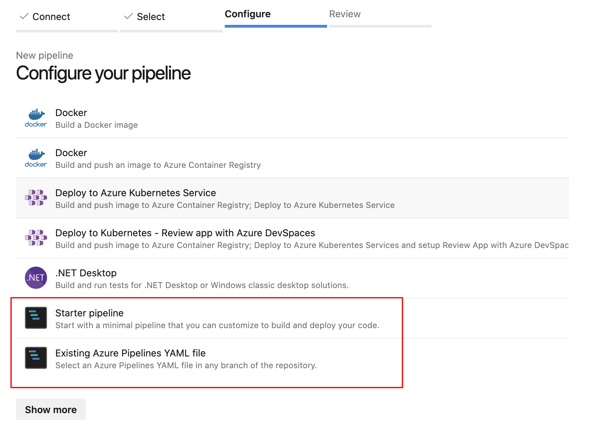
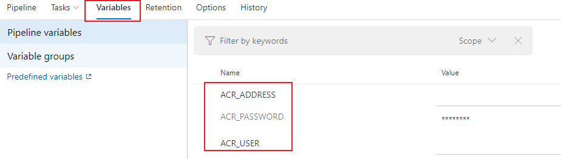
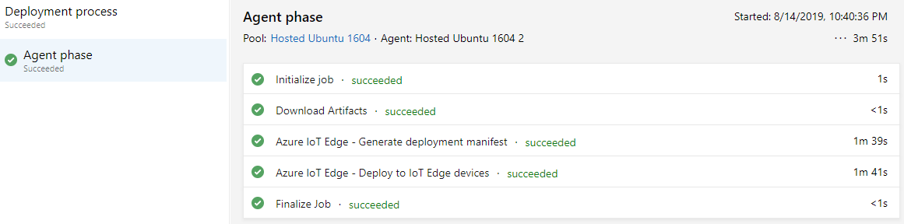

# Continuous integration and continuous deployment to Azure IoT Edge devices

You can easily adopt DevOps with your Azure IoT Edge applications with the built-in Azure IoT Edge tasks in Azure Pipelines. This article demonstrates how you can use the continuous integration and continuous deployment features of Azure Pipelines to build, test, and deploy applications quickly and efficiently to your Azure IoT Edge using YAML. Alternatively, you can [use the classic editor](how-to-ci-cd-classic.md).

In this article, you learn how to use the built-in [Azure IoT Edge tasks](https://docs.microsoft.com/azure/devops/pipelines/tasks/build/azure-iot-edge) for Azure Pipelines to create build and release pipelines for your IoT Edge solution. Each Azure IoT Edge task added to your pipeline implements one of the following four actions:

 | Action | Description |
 | --- | --- |
 | Build module images | Takes your IoT Edge solution code and builds the container images.|
 | Push module images | Pushes module images to the container registry you specified. |
 | Generate deployment manifest | Takes a deployment.template.json file and the variables, then generates the final IoT Edge deployment manifest file. |
 | Deploy to IoT Edge devices | Creates IoT Edge deployments to one or more IoT Edge devices. |

Unless otherwise specified, the procedures in this article do not explore all the functionality available through task parameters. For additional information, see the following:

* [Task version](https://docs.microsoft.com/azure/devops/pipelines/process/tasks?view=azure-devops&tabs=classic#task-versions)
* **Advanced** - If applicable, specify modules that you do not want built.
* [Control Options](https://docs.microsoft.com/azure/devops/pipelines/process/tasks?view=azure-devops&tabs=classic#task-control-options)
* [Environment Variables](https://docs.microsoft.com/azure/devops/pipelines/process/variables?view=azure-devops&tabs=yaml%2Cbatch#environment-variables)
* [Output variables](https://docs.microsoft.com/azure/devops/pipelines/process/variables?view=azure-devops&tabs=yaml%2Cbatch#use-output-variables-from-tasks)

## Prerequisites

* An Azure Repos repository. If you don't have one, you can [Create a new Git repo in your project](https://docs.microsoft.com/azure/devops/repos/git/create-new-repo?view=vsts&tabs=new-nav). For this article, we created a repository called **IoTEdgeRepo**. That repository contains **IoTEdgeSolution** which has the code for a module named **filtermodule**.
* An IoT Edge solution committed and pushed to your repository. If you want to create a new sample solution for testing this article, follow the steps in [Develop and debug modules in Visual Studio Code](how-to-vs-code-develop-module.md) or [Develop and debug C# modules in Visual Studio](how-to-visual-studio-develop-csharp-module.md).

   For this article, all you need is the solution folder created by the IoT Edge templates in either Visual Studio Code or Visual Studio. You don't need to build, push, deploy, or debug this code before proceeding. You'll set those processes up in Azure Pipelines.

   If you're creating a new solution, clone your repository locally first. Then, when you create the solution you can choose to create it directly in the repository folder. You can easily commit and push the new files from there.

* A container registry where you can push module images. You can use [Azure Container Registry](https://docs.microsoft.com/azure/container-registry/) or a third-party registry.
* An active Azure [IoT hub](../iot-hub/iot-hub-create-through-portal.md) with at least two IoT Edge devices for testing the separate test and production deployment stages. You can follow the quickstart articles to create an IoT Edge device on [Linux](quickstart-linux.md) or [Windows](quickstart.md)

For more information about using Azure Repos, see [Share your code with Visual Studio and Azure Repos](https://docs.microsoft.com/azure/devops/repos/git/share-your-code-in-git-vs?view=vsts)

## Create a build pipeline for continuous integration

In this section, you create a new build pipeline. You configure the pipeline to run automatically when you check in any changes to the sample IoT Edge solution and to publish build logs.

1. Sign in to your Azure DevOps organization (`https://dev.azure.com/{your organization}`) and open the project that contains your IoT Edge solution repository.

   

2. From the left pane menu in your project, select **Pipelines**. Select **Create Pipeline** at the center of the page. Or, if you already have build pipelines, select the **New pipeline** button in the top right.

    

3. On the **Where is your code?** page, select **Azure Repos Git `YAML`**. If you wish to use the classic editor to create your project's build pipelines, see the [classic editor guide](how-to-ci-cd-classic.md).

4. Select the repository you are creating a pipeline for.

    

5. On the **Configure your pipeline** page, select **Starter pipeline**. If you have a preexisting Azure Pipelines YAML file you wish to use to create this pipeline, you can select **Existing Azure Pipelines YAML file** and provide the branch and path in the repository to the file.

    

6. On the **Review your pipeline YAML** page, you can click the default name `azure-pipelines.yml` to rename your pipeline's configuration file.

   Select **Show assistant** to open the **Tasks** palette.

    

7. To add a task, place your cursor at the end of the YAML or wherever you want the instructions for your task to be added. Search for and select **Azure IoT Edge**. Fill out the task's parameters as follows. Then, select **Add**.

   | Parameter | Description |
   | --- | --- |
   | Action | Select **Build module images**. |
   | .template.json file | Provide the path to the **deployment.template.json** file in the repository that contains your IoT Edge solution. |
   | Default platform | Select the appropriate operating system for your modules based on your targeted IoT Edge device. |

    

   >[!TIP]
   > After each task is added, the editor will automatically highlighted the added lines. To prevent accidental overwriting, deselect the lines and provide a new space for your next task before adding additional tasks.

8. Repeat this process to add three more tasks with the following parameters:

   * Task: **Azure IoT Edge**

       | Parameter | Description |
       | --- | --- |
       | Action | Select **Push module images**. |
       | Container registry type | Use the default type: **Azure Container Registry**. |
       | Azure subscription | Select your subscription. |
       | Azure Container Registry | Choose the registry that you want to use for the pipeline. |
       | .template.json file | Provide the path to the **deployment.template.json** file in the repository that contains your IoT Edge solution. |
       | Default platform | Select the appropriate operating system for your modules based on your targeted IoT Edge device. |

   * Task: **Copy Files**

       | Parameter | Description |
       | --- | --- |
       | Source Folder | The source folder to copy from. Empty is the root of the repo. Use variables if files are not in the repo. Example: `$(agent.builddirectory)`.
       | Contents | Add two lines: `deployment.template.json` and `**/module.json`. |
       | Target Folder | Specify the variable `$(Build.ArtifactStagingDirectory)`. See [Build variables](https://docs.microsoft.com/azure/devops/pipelines/build/variables?view=azure-devops&tabs=yaml#build-variables) to learn about the description. |

   * Task: **Publish Build Artifacts**

       | Parameter | Description |
       | --- | --- |
       | Path to publish | Specify the variable `$(Build.ArtifactStagingDirectory)`. See [Build variables](https://docs.microsoft.com/azure/devops/pipelines/build/variables?view=azure-devops&tabs=yaml#build-variables) to learn about the description. |
       | Artifact name | Specify the default name: `drop` |
       | Artifact publish location | Use the default location: `Azure Pipelines` |

9. Select **Save** from the **Save and run** dropdown in the top right.

Continue to the next section to build the release pipeline.

## Create a release pipeline for continuous deployment

In this section, you create a release pipeline that is configured to run automatically when your build pipeline drops artifacts, and it will show deployment logs in Azure Pipelines.

Create a new pipeline, and add a new stage:

1. In the **Releases** tab under **Pipelines**, choose **+ New pipeline**. Or, if you already have release pipelines, choose the **+ New** button and select **+ New release pipeline**.  

    

2. When prompted to select a template, choose to start with an **Empty job**.

    

3. Your new release pipeline initializes with one stage, called **Stage 1**. Rename Stage 1 to **dev** and treat it as a continuous deployment pipeline for your development environment. Usually, continuous deployment pipelines have multiple stages including **dev**, **staging** and **prod**. You can use different names and create more based on your DevOps practice. Close the stage details window once it's renamed.

   You can also rename your release pipeline by selecting the "New release pipeline" text at the top.

4. Link the release to the build artifacts that are published by the build pipeline. Click **Add** in artifacts area.

   

5. On the **Add an artifact page**, select **Build** as the **Source type**. Choose the project and the build pipeline you created. If you wish, you can change the **Source alias** to something more descriptive. Then, select **Add**.

   

6. Open the artifact triggers and select the toggle to enable the continuous deployment trigger. Now, a new release will be created each time a new build is available.

   

7. The **dev** stage is preconfigured with one job and zero tasks. From the pipeline menu, select **Tasks** then choose the **dev** stage. Select the **Agent job** and change its **Display name** to **QA**. You can configure details about the agent job, but the deployment task is platform insensitive so you can use any **Agent specification** in the chosen **Agent pool**.

   

8. On the QA job, select the plus sign (**+**) to add two tasks. Search for and add **Azure IoT Edge** twice.

9. Select the first **Azure IoT Edge** task and configure it with the following values:

    | Parameter | Description |
    | --- | --- |
    | Display name | The display name is automatically updated when the Action field changes. |
    | Action | Select `Generate deployment manifest`. |
    | .template.json file | Specify the path: `$(System.DefaultWorkingDirectory)/Drop/drop/deployment.template.json`. The path is published from build pipeline. |
    | Default platform | Select the appropriate operating system for your modules based on your targeted IoT Edge device. |
    | Output path| Put the path `$(System.DefaultWorkingDirectory)/Drop/drop/configs/deployment.json`. This path is the final IoT Edge deployment manifest file. |

    These configurations helps replace the module image URLs in the `deployment.template.json` file. The **Generate deployment manifest** also helps replace the variables with the exact value you defined in the `deployment.template.json` file. In VS/VS Code, you are specifying the actual value in a `.env` file. In Azure Pipelines, you set the value in Release Pipeline Variables tab. Move to Variables tab and configure the Name and Value as following.

    * **ACR_ADDRESS**: Your Azure Container Registry **Login server** value. You can retrieve the Login server from the Overview page of your container registry in the Azure portal.
    * **ACR_PASSWORD**: Your Azure Container Registry password.
    * **ACR_USER**: Your Azure Container Registry username.

    If you have other variables in your project, you can specify the name and value in this tab. The **Generate deployment manifest** can only recognize the variables are in `${VARIABLE}` flavor, make sure you are using this in your `*.template.json` files.

    

10. Select the second **Azure IoT Edge** task and configure it with the following values:

    | Parameter | Description |
    | --- | --- |
    | Display name | The display name is automatically updated when the Action field changes. |
    | Action | Select `Deploy to IoT Edge devices`. |
    | Deployment file | Put the path `$(System.DefaultWorkingDirectory)/Drop/drop/configs/deployment.json`. This path is the file IoT Edge deployment manifest file. |
    | Azure subscription | Select the subscription that contains your IoT Hub.|
    | IoT Hub name | Select your IoT hub.|
    | Choose single/multiple device | Choose whether you want the release pipeline to deploy to one or multiple devices. If you deploy to a single device, enter the **IoT Edge device ID**. If you are deploying to multiple devices, specify the device **target condition**. The target condition is a filter to match a set of IoT Edge devices in IoT Hub. If you want to use Device Tags as the condition, you need to update your corresponding devices Tags with IoT Hub device twin. Update the **IoT Edge deployment ID** and **IoT Edge deployment priority** in the advanced settings. For more information about creating a deployment for multiple devices, see [Understand IoT Edge automatic deployments](module-deployment-monitoring.md). |
    | Device ID or target condition | Depending on the prior selection, specify a device ID or [target condition](module-deployment-monitoring.md#target-condition) to deploy to multiple devices. |
    | Advanced | For the IoT Edge deployment ID, specify `$(System.TeamProject)-$(Release.EnvironmentName)`. This maps the project and release name with your IoT Edge deployment ID. |

    

11. Select **Save** to save your changes to the new release pipeline. Return to the pipeline view by selecting **Pipeline** tab from the menu.

## Verify IoT Edge CI/CD with the build and release pipelines

To trigger a build job, you can either push a commit to source code repository or manually trigger it. In this section, you manually trigger the CI/CD pipeline to test that it works. Then verify that the deployment succeeds.

1. From the left pane menu, select **Pipelines** and open the build pipeline that you created at the beginning of this article.

2. You can trigger a build job in your build pipeline by selecting the **Run pipeline** button in the top right.

    

3. Review the **Run pipeline** settings. Then, select **Run**.

    

4. Select **Agent job 1** to watch the run's progress. You can review the logs of the job's output by selecting the job. 

    

5. If the build pipeline is completed successfully, it triggers a release to **dev** stage. The successful **dev** release creates IoT Edge deployment to target IoT Edge devices.

    

6. Click **dev** stage to see release logs.

    

## Next steps

* IoT Edge DevOps best practices sample in [Azure DevOps Project for IoT Edge](how-to-devops-project.md)
* Understand the IoT Edge deployment in [Understand IoT Edge deployments for single devices or at scale](module-deployment-monitoring.md)
* Walk through the steps to create, update, or delete a deployment in [Deploy and monitor IoT Edge modules at scale](how-to-deploy-at-scale.md).
