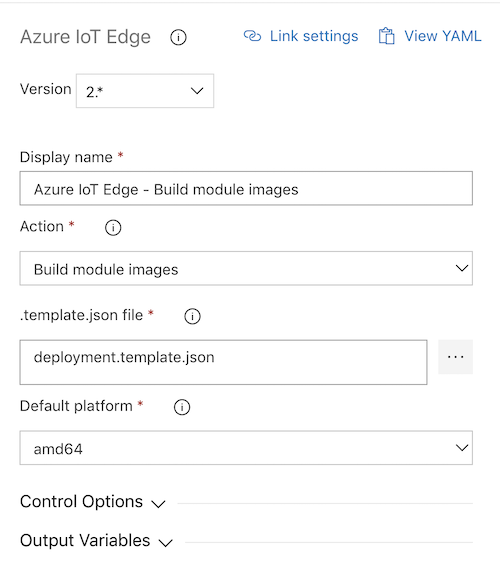
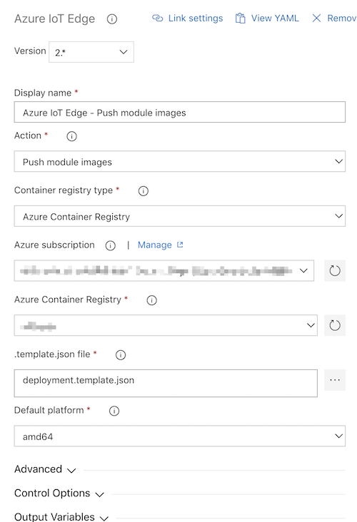
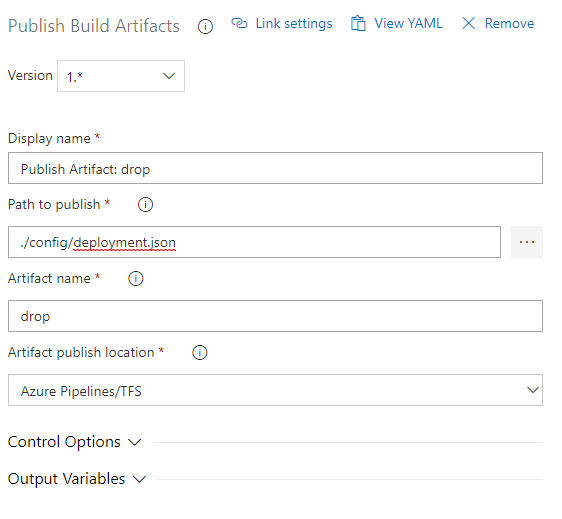
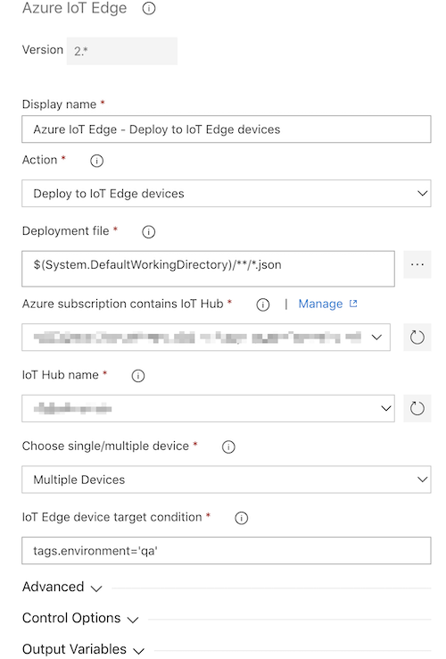
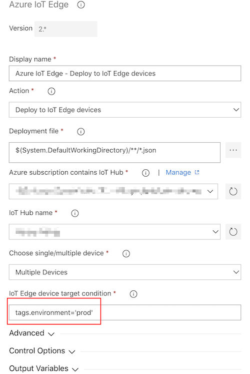
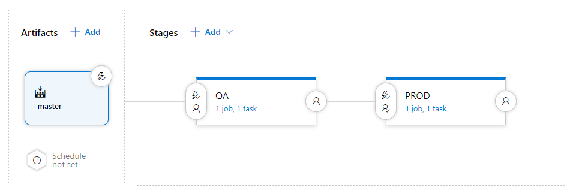
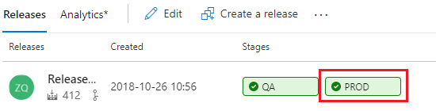

# Continuous integration and continuous deployment to Azure IoT Edge

You can easily adopt DevOps with your Azure IoT Edge applications with the built-in Azure IoT Edge tasks in Azure Pipelines or [Azure IoT Edge plugin for Jenkins](https://plugins.jenkins.io/azure-iot-edge) on your Jenkins server. This article demonstrates how you can use the continuous integration and continuous deployment features of Azure Pipelines and Azure DevOps Server to build, test, and deploy applications quickly and efficiently to your Azure IoT Edge. 

In this article, you will learn how to:
* Create and check in a sample IoT Edge solution.
* Configure continuous integration (CI) to build the solution.
* Configure continuous deployment (CD) to deploy the solution and view responses.

It will take 20 minutes to complete the steps in this article.

## Create a sample Azure IoT Edge solution using Visual Studio Code

In this section, you will create a sample IoT Edge solution containing unit tests that you can execute as part of the build process. Before following the guidance in this section, complete the steps in [Develop an IoT Edge solution with multiple modules in Visual Studio Code](tutorial-multiple-modules-in-vscode.md).

1. In VS Code command palette, type and run the command **Azure IoT Edge: New IoT Edge solution**. Then select your workspace folder, provide the solution name (The default name is **EdgeSolution**), and create a C# Module (**FilterModule**) as the first user module in this solution. You also need to specify the Docker image repository for your first module. The default image repository is based on a local Docker registry (`localhost:5000/filtermodule`). Change it to Azure Container Registry(`<your container registry address>/filtermodule`) or Docker Hub for further continuous integration.

    

2. The VS Code window will load your IoT Edge solution workspace. You can optionally type and run **Azure IoT Edge: Add IoT Edge module** to add more modules. There is a `modules` folder, a `.vscode` folder, and a deployment manifest template file in the root folder. All user module codes will be subfolders under the folder `modules`. The `deployment.template.json` is the deployment manifest template. Some of the parameters in this file will be parsed from the `module.json`, which exists in every module folder.

3. Now your sample IoT Edge solution is ready. The default C# module acts as a pipe message module. In the `deployment.template.json`, you will see this solution contains two modules. The message will be generated from the `tempSensor` module, and will be directly piped via `FilterModule`, then sent to your IoT hub.

4. Save these projects, then check it into your Azure Repos or Azure DevOps Server repository.
    
> [!NOTE]
> For more information about using Azure Repos, see [Share your code with Visual Studio and Azure Repos](https://docs.microsoft.com/azure/devops/repos/git/share-your-code-in-git-vs?view=vsts).

## Configure Azure Pipelines for continuous integration
In this section, you will create a build pipeline that is configured to run automatically when you check in any changes to the sample IoT Edge solution, and it will show build logs in Azure Pipelines.

1. Sign into your Azure DevOps organization (**https://dev.azure.com/{your organization}/**) and open the project where you checked in the sample app.

    

1. In your Azure Pipelines, open the **Builds** tab, choose **+ New pipeline**. Or, if you already have build pipelines, choose the **+ New** button. Then select **New build pipeline**.

    

1. If prompted, select **Azure DevOps Git** the source type. Then select the project, repository, and branch where your code is located. Choose **Continue**.

    

    In **Select a template** window, choose **start with an Empty process**.

    

1. In the pipeline editor, choose the agent pool. 
    
    * If you would like to build your modules in platform amd64 for Linux containers, choose **Hosted Ubuntu 1604**
    * If you would like to build your modules in platform amd64 for Windows containers, choose **Hosted VS2017** 
    * If you would like to build your modules in platform arm32v7 for Linux containers, you need to Set up your own build agent by clicking the **Manage** button.
    
    

1. In Agent job, click "+" to add three tasks in the build pipeline. The first two are from **Azure IoT Edge**. And the third one is from **Publish Build Artifacts**
    
    

1. In the first **Azure IoT Edge** task, update the **Display name** to **Azure IoT Edge - Build module images**, and in the **Action** dropdown list, select **Build module images**. In the **.template.json file** control, select the **deployment.template.json** file, which describes your IoT Edge solution. Then choose **Default platform**, make sure you select the same platform as your IoT Edge device. This task will build all modules in the solution with the target platform you specified. And also generate the **deployment.json** file, you can find the file path in Output Variables. Setup the alias to `edge` for this variable.
    
    

1. In the second **Azure IoT Edge** task, update the **Display name** to **Azure IoT Edge - Push module images**, and in the **Action** dropdown list, select **Push module images**. Choose Container Registry Type, make sure you configure and select the same registry in your code(module.json). In the **.template.json file** control, select the **deployment.template.json** file, which describes your IoT Edge solution. Then choose **Default platform**, make sure you select the same platform for your built module images. This task will push all module images to the container registry you selected. And also add container registry credentials in the **deployment.json** file, you can find the file path in Output Variables. Setup the alias to `edge` for this variable. If you have multiple container registries to host your module images, you need to duplicate this task, select different container registry, and use **Bypass module(s)** in the advanced settings to bypass the images which are not for this specific registry.

    

1. In **Publish Build Artifacts** task, you would specify the deployment file generated by the build task. Set the **Path to publish** to `$(edge.DEPLOYMENT_FILE_PATH)`.

    

1. Open the **Triggers** tab and turn on the **Continuous integration** trigger. Make sure the branch containing your code is included.

    

    Save the new build pipeline. Click the **Save** button.

## Configure Azure Pipelines for continuous deployment
In this section, you will create a release pipeline that is configured to run automatically when your build pipeline drops artifacts, and it will show deployment logs in Azure Pipelines.

1. In the **Releases** tab, choose **+ New pipeline**. Or, if you already have release pipelines, choose the **+ New** button.  

    

    In **Select a template** window, choose **start with an Empty job.**

    

2. Then the release pipeline would initialize with one stage: **Stage 1**. Rename the **Stage 1** to **QA** and treat it as a test environment. In a typical continuous deployment pipeline, it usually exists multiple stages, you can create more based on your DevOps practice.

    

3. Link the release to the build artifacts. Click **Add** in artifacts area.

      
    
    In **Add an artifact page**, choose Source type **Build**. Then select the project and the build pipeline you created. Then Click **Add**.

    

    Open continuous deployment trigger so that new release will be created each time a new build is available.

    

4. Navigate to **QA stage** and configure the tasks in this stage.

    

   Deployment task is platform insensitive, which means you can choose either **Hosted VS2017** or **Hosted Ubuntu 1604** in the **Agent pool** (or any other agent managed by yourself). Click "+" and add one task.

    

5. In the Azure IoT Edge task, navigate to the **Action** dropdown list, select **Deploy to IoT Edge device**. Select your **Azure subscription** and input your **IoT Hub name**. You can choose to deploy to single or multiple devices. If you are deploying to **multiple devices**, you need to specify the device **target condition**. The target condition is a filter to match a set of Edge devices in IoT Hub. If you want to use Device Tags as the condition, you need to update your corresponding devices Tags with IoT Hub device twin. Update the **IoT Edge deployment ID** to "deploy-qa" in advanced settings. Assume you have several IoT Edge devices have been tagged as 'qa', then the task configuration should be as in the following screenshot. 

    

    Save the new release pipeline. Click the **Save** button. And then click **Pipeline** to go back to the pipeline.

6. The second stage is for your production environment. To add a new stage "PROD", you can clone the Stage "QA" and rename cloned stage to **PROD**,

    

7. Configure the tasks for your production environment. Assume you have several IoT Edge devices have been tagged as 'prod', in the task configurations, update the Target Condition to "prod", and set the deployment id as "deploy-prod" in advanced settings. Click the **Save** button. And then click **Pipeline** to go back to the pipeline.
    
    

7. Currently, our build artifact will be triggered continuously on **QA** stage and then **PROD** stage. But most of the times you need to integrate some test cases on the QA devices and manually approve the bits. Later the bits will be deployed to PROD environment. Set up an approval in PROD stage as the following screenshot.

    1. Open **Pre-deployment conditions** setting panel.

            

    2. Set **Enabled** in **Pre-deployment approvals**. And fill in the **Approvers** input. Then click **Save**.
    
        

8. Now your release pipeline has been set up as following screenshot.

    

    
## Verify IoT Edge CI/CD with the build and release pipelines

In this section, you will trigger a build to make the CI/CD pipeline work. Then verify the deployment succeeds.

1. To trigger a build job, you can either push a commit to source code repository or manually trigger it. You can trigger a build job in your build pipeline by clicking the **Queue** button as in following screenshot.

    

2. If the build pipeline is completed successfully, it will trigger a release to **QA** stage. Navigate to build pipeline logs and you should see the following.

    

3. The successful deployment to **QA** stage would trigger a notification to the approver. Navigate to release pipeline, you can see the following. 

    

4. After the approver approve this change, it can be deployed to **PROD**.

    

## Next steps

* Understand the IoT Edge deployment in [Understand IoT Edge deployments for single devices or at scale](module-deployment-monitoring.md)
* Walk through the steps to create, update, or delete a deployment in [Deploy and monitor IoT Edge modules at scale](how-to-deploy-monitor.md).
