# Continuous integration and continuous deployment to Azure IoT Edge

This article demonstrates how you can use the continuous integration and continuous deployment features of Azure DevOps Services and Microsoft Team Foundation Server (TFS) to build, test, and deploy applications quickly and efficiently to your Azure IoT Edge. 

In this article, you will learn how to:
* Create and check in a sample IoT Edge solution containing unit tests.
* Install Azure IoT Edge extension for your Azure DevOps.
* Configure continuous integration (CI) to build the solution and run the unit tests.
* Configure continuous deployment (CD) to deploy the solution and view responses.

It will take 30 minutes to complete the steps in this article.


## Create a sample Azure IoT Edge solution using Visual Studio Code

In this section, you will create a sample IoT Edge solution containing unit tests that you can execute as part of the build process. Before following the guidance in this section, complete the steps in [Develop an IoT Edge solution with multiple modules in Visual Studio Code](tutorial-multiple-modules-in-vscode.md).

1. In VS Code command palette, type and run the command **Edge: New IoT Edge solution**. Then select your workspace folder, provide the solution name (The default name is **EdgeSolution**), and create a C# Module (**FilterModule**) as the first user module in this solution. You also need to specify the Docker image repository for your first module. The default image repository is based on a local Docker registry (`localhost:5000/filtermodule`). You need to change it to Azure Container Registry(`<your container registry address>/filtermodule`) or Docker Hub for further continuous integration.

    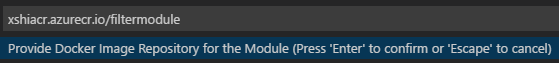

2. The VS Code window will load your IoT Edge solution workspace. You can optionally type and run **Edge: Add IoT Edge module** to add more modules. There is a `modules` folder, a `.vscode` folder, and a deployment manifest template file in the root folder. All user module codes will be subfolders under the folder `modules`. The `deployment.template.json` is the deployment manifest template. Some of the parameters in this file will be parsed from the `module.json`, which exists in every module folder.

3. Now your sample IoT Edge solution is ready. The default C# module acts as a pipe message module. In the `deployment.template.json`, you will see this solution contains two modules. The message will be generated from the `tempSensor` module, and will be directly piped via `FilterModule`, then sent to your IoT hub. Replace the entire **Program.cs** file with below content. For more information about this code snippet, you can refer to [Create an IoT Edge C# module project](https://docs.microsoft.com/azure/iot-edge/tutorial-csharp-module#create-an-iot-edge-module-project).

    ```csharp
    namespace FilterModule
    {
        using System;
        using System.IO;
        using System.Runtime.InteropServices;
        using System.Runtime.Loader;
        using System.Security.Cryptography.X509Certificates;
        using System.Text;
        using System.Threading;
        using System.Threading.Tasks;
        using Microsoft.Azure.Devices.Client;
        using Microsoft.Azure.Devices.Client.Transport.Mqtt;
        using System.Collections.Generic;     // for KeyValuePair<>
        using Microsoft.Azure.Devices.Shared; // for TwinCollection
        using Newtonsoft.Json;                // for JsonConvert

        public class MessageBody
        {
            public Machine machine { get; set; }
            public Ambient ambient { get; set; }
            public string timeCreated { get; set; }
        }
        public class Machine
        {
            public double temperature { get; set; }
            public double pressure { get; set; }
        }
        public class Ambient
        {
            public double temperature { get; set; }
            public int humidity { get; set; }
        }

        public class Program
        {
            static int counter;
            static int temperatureThreshold { get; set; } = 25;

            static void Main(string[] args)
            {
                Init().Wait();

                // Wait until the app unloads or is cancelled
                var cts = new CancellationTokenSource();
                AssemblyLoadContext.Default.Unloading += (ctx) => cts.Cancel();
                Console.CancelKeyPress += (sender, cpe) => cts.Cancel();
                WhenCancelled(cts.Token).Wait();
            }

            /// <summary>
            /// Handles cleanup operations when app is cancelled or unloads
            /// </summary>
            public static Task WhenCancelled(CancellationToken cancellationToken)
            {
                var tcs = new TaskCompletionSource<bool>();
                cancellationToken.Register(s => ((TaskCompletionSource<bool>)s).SetResult(true), tcs);
                return tcs.Task;
            }

            /// <summary>
            /// Initializes the ModuleClient and sets up the callback to receive
            /// messages containing temperature information
            /// </summary>
            static async Task Init()
            {
                MqttTransportSettings mqttSetting = new MqttTransportSettings(TransportType.Mqtt_Tcp_Only);
                ITransportSettings[] settings = { mqttSetting };

                // Open a connection to the Edge runtime
                ModuleClient ioTHubModuleClient = await ModuleClient.CreateFromEnvironmentAsync(settings);
                await ioTHubModuleClient.OpenAsync();
                Console.WriteLine("IoT Hub module client initialized.");

                // Register callback to be called when a message is received by the module
                await ioTHubModuleClient.SetInputMessageHandlerAsync("input1", FilterMessage, ioTHubModuleClient);
            }

            /// <summary>
            /// This method is called whenever the module is sent a message from the EdgeHub. 
            /// It just pipe the messages without any change.
            /// It prints all the incoming messages.
            /// </summary>
            static async Task<MessageResponse> FilterMessage(Message message, object userContext)
            {
                int counterValue = Interlocked.Increment(ref counter);

                var moduleClient = userContext as ModuleClient;
                if (moduleClient == null)
                {
                    throw new InvalidOperationException("UserContext doesn't contain " + "expected values");
                }

                byte[] messageBytes = message.GetBytes();
                string messageString = Encoding.UTF8.GetString(messageBytes);
                Console.WriteLine($"Received message: {counterValue}, Body: [{messageString}]");

                var filteredMessage = filter(message);

                if (filteredMessage != null && !string.IsNullOrEmpty(messageString))
                {
                    var pipeMessage = new Message(messageBytes);
                    foreach (var prop in message.Properties)
                    {
                        pipeMessage.Properties.Add(prop.Key, prop.Value);
                    }
                    await moduleClient.SendEventAsync("output1", pipeMessage);
                    Console.WriteLine("Received message sent");
                }
                return MessageResponse.Completed;
            }

            public static Message filter(Message message)
            {
                var counterValue = Interlocked.Increment(ref counter);

                var messageBytes = message.GetBytes();
                var messageString = Encoding.UTF8.GetString(messageBytes);
                Console.WriteLine($"Received message {counterValue}: [{messageString}]");

                // Get message body
                var messageBody = JsonConvert.DeserializeObject<MessageBody>(messageString);

                if (messageBody != null && messageBody.machine.temperature > temperatureThreshold)
                {
                    Console.WriteLine($"Machine temperature {messageBody.machine.temperature} " +
                        $"exceeds threshold {temperatureThreshold}");
                    var filteredMessage = new Message(messageBytes);
                    foreach (KeyValuePair<string, string> prop in message.Properties)
                    {
                        filteredMessage.Properties.Add(prop.Key, prop.Value);
                    }

                    filteredMessage.Properties.Add("MessageType", "Alert");
                    return filteredMessage;
                }
                return null;
            }
        }
    }
    ```

4. Create a .Net Core unit test project. In VS Code file explorer, create a new folder **tests\FilterModuleTest** in your workspace. Then in VS Code integrated terminal (**Ctrl + `**), run following commands to create a xunit test project and add reference to the **FilterModule** project.

    ```cmd
    cd tests\FilterModuleTest
    dotnet new xunit
    dotnet add reference ../../modules/FilterModule/FilterModule.csproj
    ```

    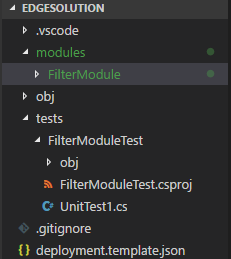

5. In the **FilterModuleTest** folder, update the file name of **UnitTest1.cs** to **FilterModuleTest.cs**. Select and open **FilterModuleTest.cs**, replace the entire code with below code snippet, which contains the unit tests against the FilterModule project.

    ```csharp
    using Xunit;
    using FilterModule;
    using Newtonsoft.Json;
    using System;
    using System.IO;
    using System.Runtime.InteropServices;
    using System.Runtime.Loader;
    using System.Security.Cryptography.X509Certificates;
    using System.Text;
    using System.Threading;
    using System.Threading.Tasks;
    using Microsoft.Azure.Devices.Client;
    using Microsoft.Azure.Devices.Client.Transport.Mqtt;

    namespace FilterModuleTest
    {
        public class FilterModuleTest
        {
            [Fact]
            public void filterLessThanThresholdTest()
            {
                var source = createMessage(25 - 1);
                var result = Program.filter(source);
                Assert.True(result == null);
            }

            [Fact]
            public void filterMoreThanThresholdAlertPropertyTest()
            {
                var source = createMessage(25 + 1);
                var result = Program.filter(source);
                Assert.True(result.Properties["MessageType"] == "Alert");
            }

            [Fact]
            public void filterMoreThanThresholdCopyPropertyTest()
            {
                var source = createMessage(25 + 1);
                source.Properties.Add("customTestKey", "customTestValue");
                var result = Program.filter(source);
                Assert.True(result.Properties["customTestKey"] == "customTestValue");
            }

            private Message createMessage(int temperature)
            {
                var messageBody = createMessageBody(temperature);
                var messageString = JsonConvert.SerializeObject(messageBody);
                var messageBytes = Encoding.UTF8.GetBytes(messageString);
                return new Message(messageBytes);
            }

            private MessageBody createMessageBody(int temperature)
            {
                var messageBody = new MessageBody
                {
                    machine = new Machine
                    {
                        temperature = temperature,
                        pressure = 0
                    },
                    ambient = new Ambient
                    {
                        temperature = 0,
                        humidity = 0
                    },
                    timeCreated = string.Format("{0:O}", DateTime.Now)
                };

                return messageBody;
            }
        }
    }
    ```

6. In integrated terminal, you can enter following commands to run unit tests locally. 
    ```cmd
    dotnet test
    ```

    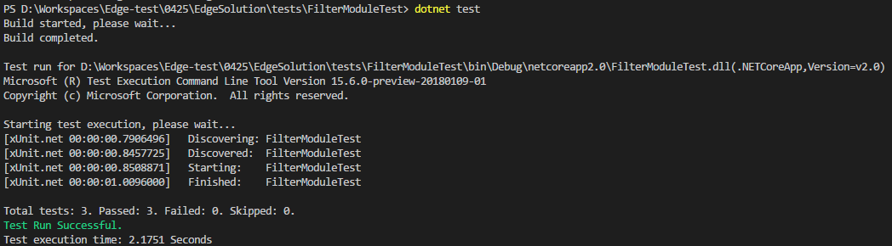

7. Save these projects, then check it into your Azure DevOps or TFS repository.
    

> [!NOTE]
> For more information about using Azure Repos, see [Share your code with Visual Studio and Azure Repos](https://docs.microsoft.com/azure/devops/repos/git/share-your-code-in-git-vs?view=vsts).


## Configure continuous integration
In this section, you will create a build pipeline that is configured to run automatically when you check in any changes to the sample IoT Edge solution, and it will automatically execute the unit tests it contains.

1. Sign into your Azure DevOps organization (**https://**_your-account_**.visualstudio.com**) and open the project where you checked in the sample app.

    

1. Visit [Azure IoT Edge For Azure DevOps](https://marketplace.visualstudio.com/items?itemName=vsc-iot.iot-edge-build-deploy) on Azure DevOps Marketplace. Click **Get it free** and follow the wizard to install this extension to your Azure DevOps organization or download to your TFS.

    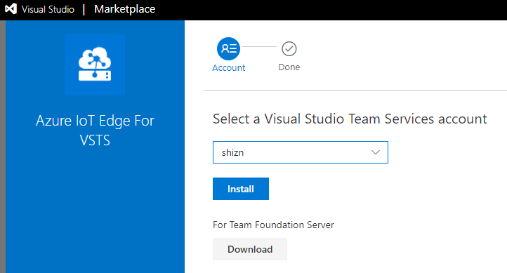

1. In your Azure DevOps, open the **Build &amp; Release** hub and, in the **Builds** tab, choose **+ New pipeline**. Or, if you already have build pipelines, choose the **+ New** button. 

    

1. If prompted, select the **Azure DevOps Git** source type; then select the project, repository, and branch where your code is located. Choose **Continue**.

    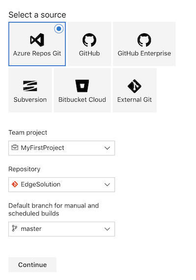

1. In **Select a template** window, choose **start with an Empty process**.

    

1. Click **+** on the right side of **Phase 1** to add a task to the phase. Then search and select **.Net Core**, and click **Add** to add this task to the phase.

    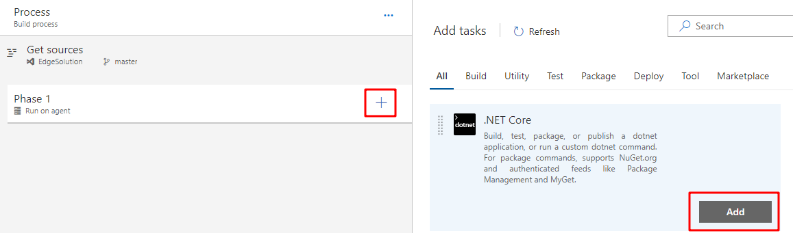

1. Update the **Display name** to **dotnet test**, and in the **Command** dropdown list, select **test**. Add below path to the **Path to project(s)**.

    ```
    tests/FilterModuleTest/*.csproj
    ```

    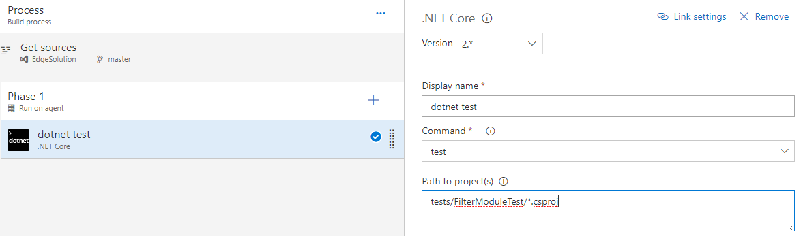

1. Click **+** on the right side of **Phase 1** to add a task to the phase. Then search and select **Azure IoT Edge**, and click **Add** button **twice** to add these tasks to the phase.

    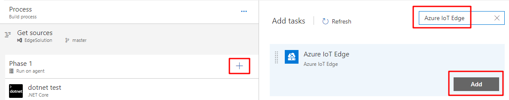

1. In the first Azure IoT Edge task, update the **Display name** to **Module Build and Push**, and in the **Action** dropdown list, select **Build and Push**. In the **Module.json File** textbox, add below path to it. Then choose **Container Registry Type**, make sure you configure and select the same registry in your code. This task will build and push all your modules in the solution and publish to the container registry you specified. If your modules will be pushed to different registries, you can have multiple **Module Build and Push** tasks.

    ```
    **/module.json
    ```

    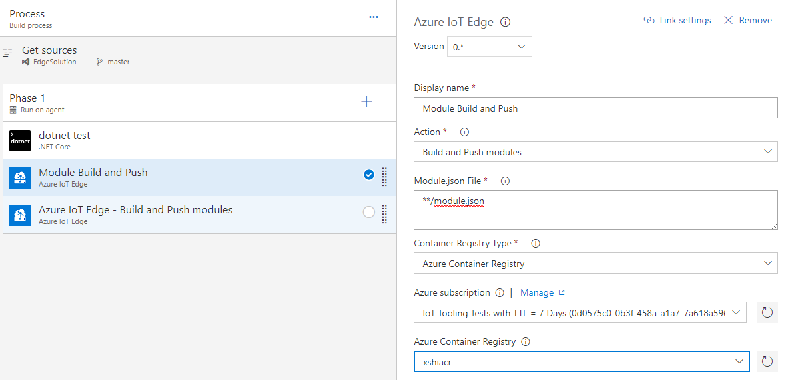

1. In the second Azure IoT Edge task, update the **Display name** to **Deploy to IoT Edge device**, and in the **Action** dropdown list, select **Deploy to IoT Edge device**. Select your Azure subscription and input your IoT Hub name. You can specify an IoT Edge deployment ID and the deployment priority. You can also choose to deploy to single or multiple devices. If you are deploying to multiple devices, you need to specify the device target condition. For example, if you want to use device Tags as the condition, you need to update your corresponding devices Tags before the deployment. 

    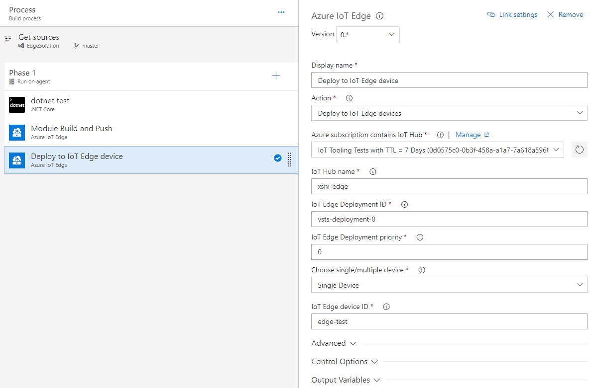

1. Click the **Process** and make sure your **Agent queue** is **Hosted Linux Preview**.

    

1. Open the **Triggers** tab and turn on the **Continuous integration** trigger. Make sure the branch containing your code is included.

    

1. Save the new build pipeline and queue a new build. Click the **Save & queue** button.

1. Choose the link to the build in the message bar that appears. Or go to build pipeline to see the latest queued build job.

    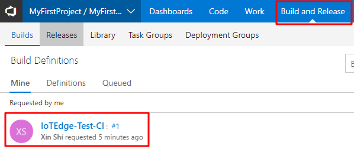

1. After the build has finished, you see the summary for each task and the results in the live log file. 
    
    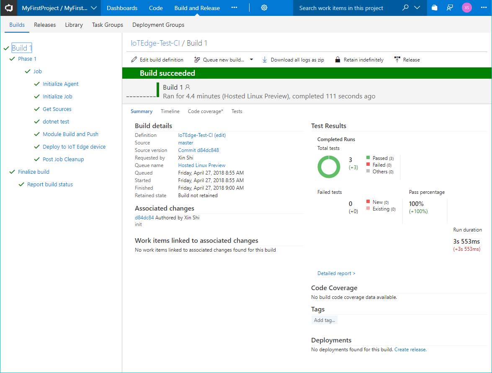

1. You can go back to VS Code and check the IoT Hub device explorer. The Edge device with the module should start running (Make sure you've added registry credentials to Edge runtime).

    

## Continuous deployment to IoT Edge devices

To enable continuous deployment, basically you need to set up CI jobs with proper IoT Edge devices, enabling the **Triggers** for your branches in your project. In a classic DevOps practice, a project contains two main branches. The master branch should be the stable version of the code, and the develop branch contains the latest code changes. Every developer in the team should fork develop branch to his or her own feature branch when starting updating the code, which means all commits happens on feature branches off the develop branch. And every pushed commit should be tested via the CI system. After fully tested the code locally, the feature branch should be merged to the develop branch via a pull request. When the code on developer branch is tested via CI system, it can be merged to master branch via a pull request.

So, when deploying to IoT Edge devices, there are three main environments.
- On feature branch, you can use simulated IoT Edge device on your development machine or deploy to a physical IoT Edge device.
- On develop branch, you should deploy to a physical IoT Edge device.
- On master branch, the target IoT Edge devices should be the production devices.

## Next steps

* Understand the IoT Edge deployment in [Understand IoT Edge deployments for single devices or at scale](module-deployment-monitoring.md)
* Walk through the steps to create, update, or delete a deployment in [Deploy and monitor IoT Edge modules at scale](how-to-deploy-monitor.md).
