# Continuous integration and continuous deployment to Azure IoT Edge

You can easily adopt DevOps with your Azure IoT Edge applications with the built-in Azure IoT Edge tasks in Azure Pipelines. This article demonstrates how you can use the continuous integration and continuous deployment features of Azure Pipelines to build, test, and deploy applications quickly and efficiently to your Azure IoT Edge. 

In this article, you learn how to use the built-in Azure IoT Edge tasks for Azure Pipelines to create two pipelines for your IoT Edge solution. The first takes your code and builds the solution, pushing your module images to your container registry and creating a deployment manifest. The second deploys your modules to targeted IoT Edge devices.  

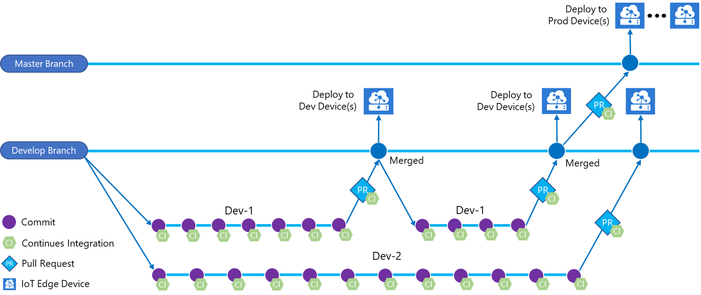

## Prerequisites

* An Azure Repos repository. If you don't have one, you can [Create a new Git repo in your project](https://docs.microsoft.com/azure/devops/repos/git/create-new-repo?view=vsts&tabs=new-nav).
* An IoT Edge solution committed and pushed to your repository. If you want to create a new sample solution for testing this article, follow the steps in [Develop and debug modules in Visual Studio Code](how-to-vs-code-develop-module.md) or [Develop and debug C# modules in Visual Studio](how-to-visual-studio-develop-csharp-module.md).
   * For this article, all you need is the solution folder created by the IoT Edge templates in either Visual Studio Code or Visual Studio. You don't need to build, push, deploy, or debug this code before proceeding. You'll set those processes up in Azure Pipelines. 
   * If you're creating a new solution, clone your repository locally first. Then, when you create the solution you can choose to create it directly in the repository folder. You can easily commit and push the new files from there. 
* A container registry where you can push module images. You can use [Azure Container Registry](https://docs.microsoft.com/azure/container-registry/) or a third-party registry. 
* An active [IoT hub](../iot-hub/iot-hub-create-through-portal.md) with at least IoT Edge devices for testing the separate test and production deployment stages. You can follow the quickstart articles to create an IoT Edge device on [Linux](quickstart-linux.md) or [Windows](quickstart.md)

For more information about using Azure Repos, see [Share your code with Visual Studio and Azure Repos](https://docs.microsoft.com/azure/devops/repos/git/share-your-code-in-git-vs?view=vsts)

## Configure continuous integration
In this section, you create a new build pipeline. Configure the pipeline to run automatically when you check in any changes to the sample IoT Edge solution, and publish build logs.

>[!NOTE]
>This article uses the Azure DevOps visual designer. Before you follow the steps in this section, turn off the preview feature for the new YAML pipeline creation experience. 
>1. In Azure DevOps, select your profile icon then select **Preview features**.
>2. Turn **New YAML pipeline creation experience** off. 
>
>For more information, see [Create a build pipeline](https://docs.microsoft.com/azure/devops/pipelines/get-started-designer?view=vsts&tabs=new-nav#create-a-build-pipeline).

1. Sign into your Azure DevOps organization (**https:\//dev.azure.com/{your organization}/**) and open the project that contains your IoT Edge solution repository.

   For this article, we created a repository called **IoTEdgeRepo**. That repository contains **IoTEdgeSolution** which has the code for a module named **filtermodule**. 

   

2. Navigate to Azure Pipelines in your project. Open the **Builds** tab and select **New pipeline**. Or, if you already have build pipelines, select the **New** button. Then choose **New build pipeline**.

    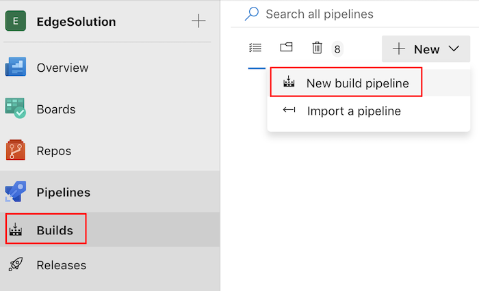

3. Follow the prompts to create your pipeline. 

   1. Provide the source information for your new build pipeline. Select **Azure Repos Git** as the source, then select the project, repository, and branch where your IoT Edge solution code is located. Then, select **Continue**. 

      

   2. Select **Empty job** instead of a template. 

      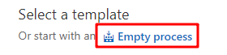

4. Once your pipeline is created, you are taken to the pipeline editor. In your pipeline description, choose the correct agent pool based on your target platform: 
    
   * If you would like to build your modules in platform amd64 for Linux containers, choose **Hosted Ubuntu 1604**

   * If you would like to build your modules in platform amd64 for Windows 1809 containers, you need to [set up self-hosted agent on Windows](https://docs.microsoft.com/azure/devops/pipelines/agents/v2-windows?view=vsts).

   * If you would like to build your modules in platform arm32v7 for Linux containers, you need to [set up self-hosted agent on Linux](https://blogs.msdn.microsoft.com/iotdev/2018/11/13/setup-azure-iot-edge-ci-cd-pipeline-with-arm-agent/).
    
     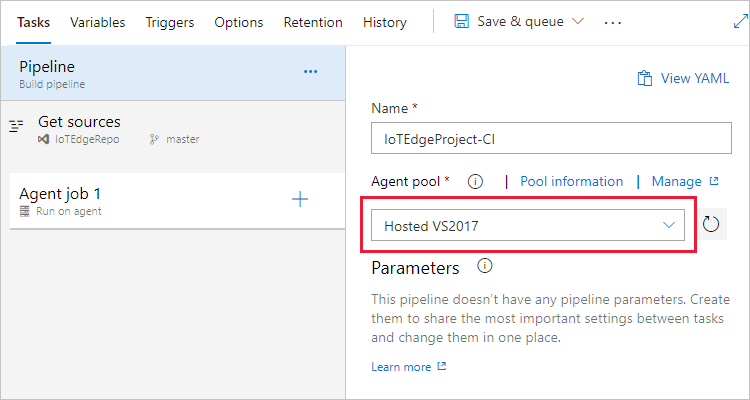

5. Your pipeline comes preconfigured with a job called **Agent job 1**. Select the plus sign (**+**) to add three tasks to the job: **Azure IoT Edge** twice, and **Publish Build Artifacts** once. (Hover over the name of each task to see the **Add** button.)

   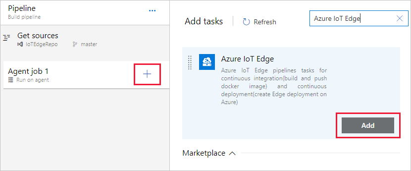

   When all three tasks are added, your Agent job looks like the following example:
    
   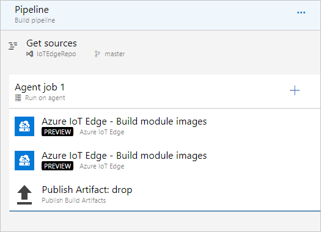

6. Select the first **Azure IoT Edge** task to edit it. This task builds all modules in the solution with the target platform that you specify, It also generates the **deployment.json** file which tells your IoT Edge devices how to configure the deployment.

   * **Display name**: Accept the default **Azure IoT Edge - Build module images**.
   * **Action**: Accept the default **Build module images**. 
   * **.template.json file**: Select the ellipsis (**...**) and navigate to the **deployment.template.json** file in the repository that contains your IoT Edge solution. 
   * **Default platform**: Select the appropriate platform for your modules based on your target IoT Edge device. 
   * **Output variables**: The output variables include a reference name that you can use to configure the file path where your deployment.json file will be generated. Set the reference name to something memorable like **edge**. 

7. Select the second **Azure IoT Edge** task to edit it. This task pushes all module images to the container registry that you select. It also adds your container registry credentials to the **deployment.json** file so that your IoT Edge device can access the module images. 

   * **Display name**: The display name is automatically updated when the action field changes. 
   * **Action**: Use the dropdown list to select **Push module images**. 
   * **Container registry type**: Select the type of container registry that you use to store your module images. Depending on which registry type you choose, the form changes. If you choose **Azure Container Registry**, use the dropdown lists to select the Azure subscription and the name of your container registry. If you choose **Generic Container Registry**, select **New** to create a registry service connection. 
   * **.template.json file**: Select the ellipsis (**...**) and navigate to the **deployment.template.json** file in the repository that contains your IoT Edge solution. 
   * **Default platform**: Select the same platform as your built module images.

   If you have multiple container registries to host your module images, you need to duplicate this task, select different container registry, and use **Bypass module(s)** in the advanced settings to bypass the images which are not for this specific registry.

8. Select the **Publish Build Artifacts** task to edit it. Provide the file path to the deployment file generated by the build task. Set the **Path to publish** value to match the output variable that you set in the build module task. For example, `$(edge.DEPLOYMENT_FILE_PATH)`. Leave the other values as their defaults. 

9. Open the **Triggers** tab and check the box to **Enable continuous integration**. Make sure the branch containing your code is included.

    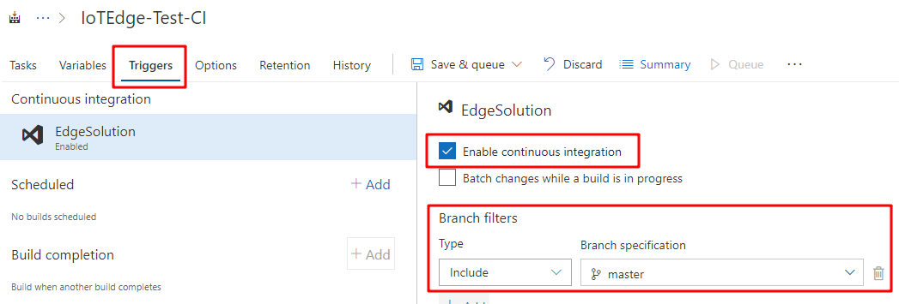

10. Save the new build pipeline with **Save** button.

This pipeline is now configured to run automatically when you push new code to your repo. The last task, publishing the pipeline artifacts, triggers a release pipeline. Continue to the next section to build the release pipeline. 

## Configure continuous deployment
In this section, you create a release pipeline that is configured to run automatically when your build pipeline drops artifacts, and it will show deployment logs in Azure Pipelines.

In this section, you create two different stages, one for test deployments and one for production deployments. 

### Create test stage

Create a new pipeline, and configure its first stage for quality assurance (QA) deployments. 

1. In the **Releases** tab, choose **+ New pipeline**. Or, if you already have release pipelines, choose the **+ New** button and select **+ New release pipeline**.  

    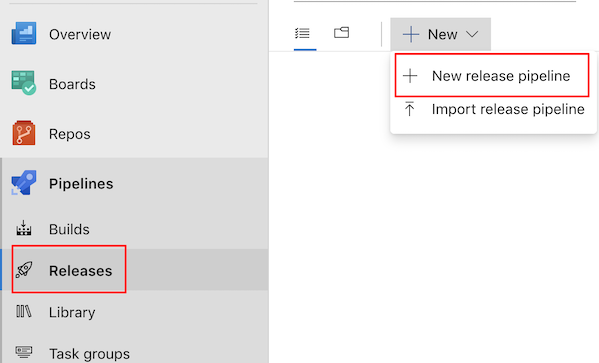

2. When prompted to select a template, choose to start with an **Empty job**.

    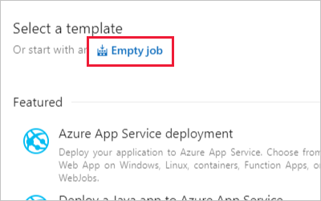

3. Your new release pipeline initializes with one stage, called **Stage 1**. Rename Stage 1 to **QA** and treat it as a test environment. Usually, continuous deployment pipelines have multiple stages. You can create more based on your DevOps practice. Close the stage details window once it's renamed. 

    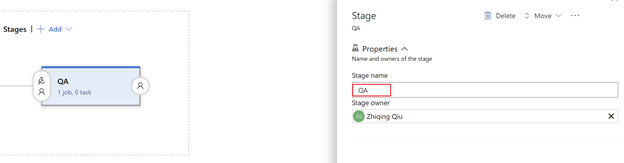

4. Link the release to the build artifacts that are published by the build pipeline. Click **Add** in artifacts area.

   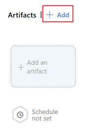  
    
5. In **Add an artifact page**, select source type **Build**. Then, select the project and the build pipeline you created. Then, select **Add**.

   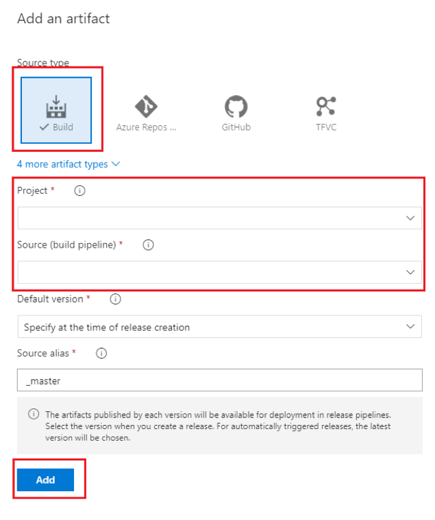

6. Open the artifact triggers and select the toggle to enable the continuous deployment trigger. Now, a new release will be created each time a new build is available.

   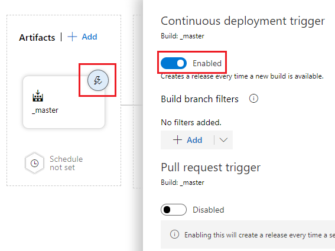

7. The **QA** stage is preconfigured with one job and zero tasks. From the pipeline menu, select **Tasks** then choose the **QA** stage.  Select the job and task count to configure the tasks in this stage.

    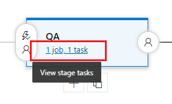

8. In the QA stage, you should see a default **Agent job**. You can configure details about the agent job, but the deployment task is platform insensitive so you can use either **Hosted VS2017** or **Hosted Ubuntu 1604** in the **Agent pool** (or any other agent managed by yourself). 

9. Select the plus sign (**+**) to add one task. Search for and add **Azure IoT Edge**. 

    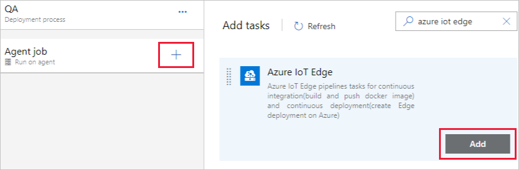

10. Select the new Azure IoT Edge task and configure it with the following values:

    * **Display name**: The display name is automatically updated when the action field changes. 
    * **Action**: Use the dropdown list to select **Deploy to IoT Edge device**. Changing the action value also updates the task display name to match.
    * **Azure subscription**: Select the subscription that contains your IoT Hub.
    * **IoT Hub name**: Select your IoT hub. 
    * **Choose single/multiple device**: Choose whether you want the release pipeline to deploy to one device or multiple devices. 
      * If you deploy to a single device, enter the **IoT Edge device ID**. 
      * If you are deploying to multiple devices, specify the device **target condition**. The target condition is a filter to match a set of Edge devices in IoT Hub. If you want to use Device Tags as the condition, you need to update your corresponding devices Tags with IoT Hub device twin. Update the **IoT Edge deployment ID** and **IoT Edge deployment priority** in the advanced settings. For more information about creating a deployment for multiple devices, see [Understand IoT Edge automatic deployments](module-deployment-monitoring.md).

11. Select **Save** to save your changes to the new release pipeline. Return to the pipeline view by selecting **Pipeline** from the menu. 

### Create production stage

Create a second stage in your release pipeline for production deployment. 

1. Make a second stage for production by cloning the QA stage. Hover your cursor over the QA stage, then select the clone button. 

    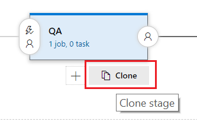

2. Select the new stage, called **Copy of QA**, to open its properties. Change the stage name to **PROD**, for production. Close the stage properties window. 

3. To open the PROD stage tasks, select **Tasks** from the pipeline menu then choose the **PROD** stage. 

4. Select the Azure IoT Edge task to configure if for your production environment. The deployment settings are probably the same for QA and for PROD, except that you want to target a different device or set of devices in production. Update the device ID field, or the target condition and deployment ID fields for your production devices. 

5. Save it with the **Save** button. And then select **Pipeline** to go back to the pipeline view.
    
6. The way this release pipeline is currently configured, build artifact will trigger the **QA** stage and then **PROD** stage every time a new build is completed. However, you usually want to integrate some test cases on the QA devices and manually approve the deployment for production. Use the following steps to create an approval condition for the PROD stage:

    1. Open the **Pre-deployment conditions** settings panel.

        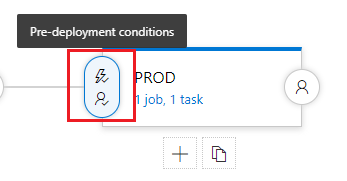    

    2. Toggle the **Pre-deployment approvals** condition to **Enabled**. Add one or more users or groups in the **Approvers** field, and customize any other approval policies that you want. To save your changes, close the pre-deployment conditions panel.
    
       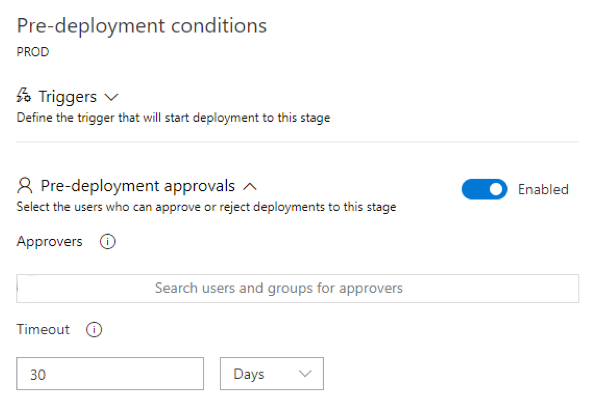

7. Save your release pipeline with the **Save** button. 

    
## Verify IoT Edge CI/CD with the build and release pipelines

To trigger a build job, you can either push a commit to source code repository or manually trigger it. In this section, you manually trigger the CI/CD pipeline to test that it works. Then verify that the deployment succeeds.

1. Navigate to the build pipeline that you created at the beginning of this article. 

2. You can trigger a build job in your build pipeline by selecting the **Queue** button as in following screenshot.

    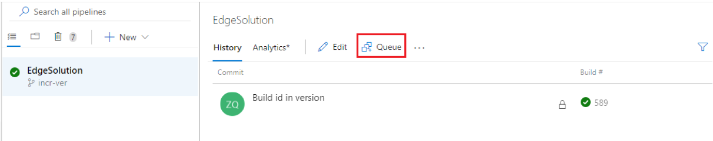

3. Select the build job to watch its progress. If the build pipeline is completed successfully, it triggers a release to **QA** stage. 

    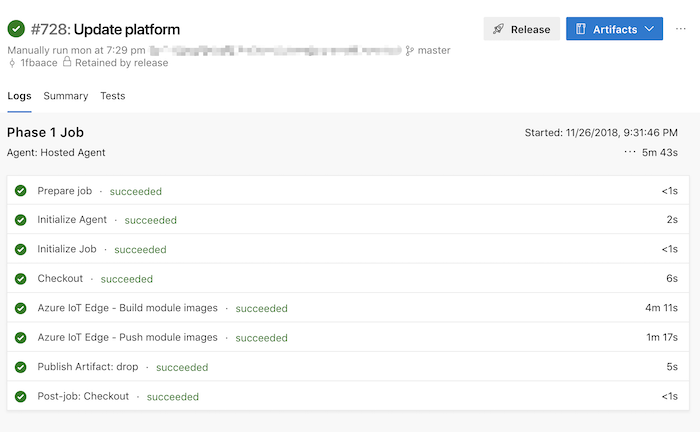

4. The successful deployment to **QA** stage triggers a notification to the approver. Verify that the modules deployed successfully on the device or devices that you targeted with the QA stage. Then, navigate to release pipeline and give approval for the release to go to the PROD stage by selecting the **PROD** button and then selecting **Approve**. 

    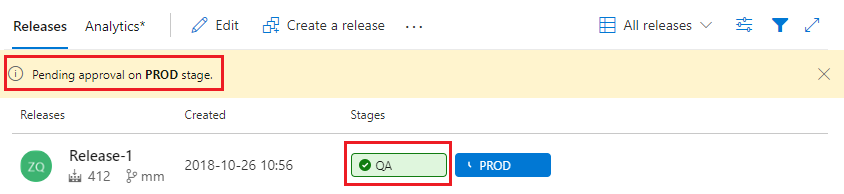

5. After the approver approve this change, it can be deployed to **PROD**.

## Next steps

* Understand the IoT Edge deployment in [Understand IoT Edge deployments for single devices or at scale](module-deployment-monitoring.md)
* Walk through the steps to create, update, or delete a deployment in [Deploy and monitor IoT Edge modules at scale](how-to-deploy-monitor.md).
