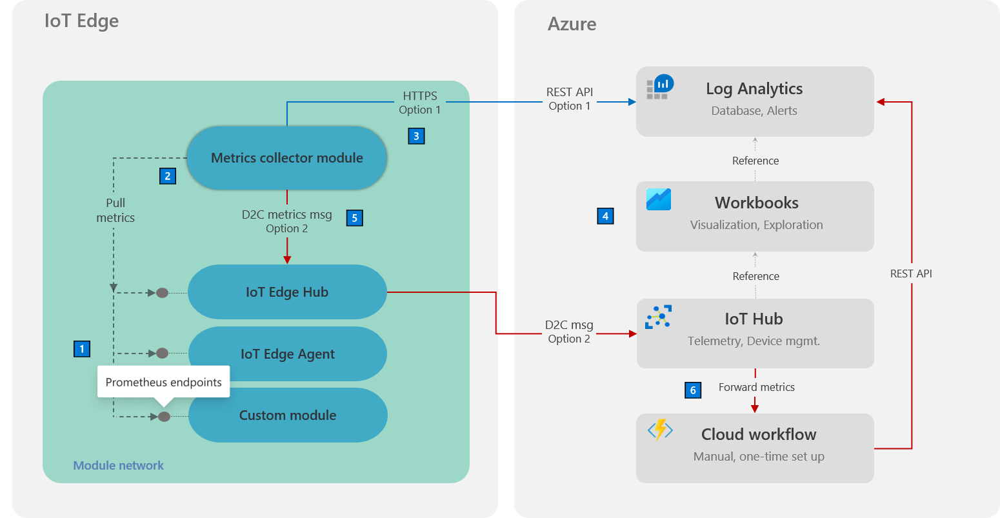

# Collect and transport metrics (Preview)

[!INCLUDE [iot-edge-version-all-supported](../../includes/iot-edge-version-all-supported.md)]

You can remotely monitor your IoT Edge fleet using Azure Monitor and built-in metrics integration. To enable this capability on your device, add the metrics-collector module to your deployment and configure it to collect and transport module metrics to Azure Monitor.

## Architecture

[](./media/how-to-collect-and-transport-metrics/arch.png#lightbox)

| Note | Description |
|-|-|
|  1 | All modules must emit metrics using the [Prometheus data model](https://prometheus.io/docs/concepts/data_model/). While [built-in metrics](how-to-access-built-in-metrics.md) enable broad workload visibility by default, custom modules can also be used to emit scenario-specific metrics to enhance the monitoring solution. Learn how to instrument custom modules using open-source libraries in the [Add custom metrics](how-to-add-custom-metrics.md) article. |
|  2️ | The [metrics-collector module](https://aka.ms/edgemon-metrics-collector) is a Microsoft-supplied IoT Edge module that collects workload module metrics and transports them off-device. Metrics collection uses a *pull* model. Collection frequency, endpoints, and filters can be configured to control the data egressed from the module. For more information, see [metrics collector configuration section](#metrics-collector-configuration) later in this article. |
|  3️ | You have two options for sending metrics from the metrics-collector module to the cloud. *Option 1* sends the metrics to Log Analytics.<sup>1</sup> The collected metrics are ingested into the specified Log Analytics workspace using a fixed, native table called `InsightsMetrics`. This table's schema is compatible with the Prometheus metrics data model.<br><br> This option requires access to the workspace on outbound port 443. The Log Analytics workspace ID and key must be specified as part  of the module configuration. To enable in restricted networks, see [Enable in restricted network access scenarios](#enable-in-restricted-network-access-scenarios) later in this article.
|  4️ | Each metric entry contains the `ResourceId` that was specified as part of [module configuration](#metrics-collector-configuration). This association automatically  links the metric with the specified resource (for example, IoT Hub). As a result, the [curated IoT Edge workbook templates](how-to-explore-curated-visualizations.md) can retrieve metrics by issuing queries against the resource. <br><br> This approach also allows multiple IoT hubs to safely share a single Log Analytics workspace as a metrics database. |
|  5️ | *Option 2* sends the metrics to IoT Hub.<sup>1</sup> The collector module can be configured to send the collected metrics as UTF-8 encoded JSON [device-to-cloud messages](../iot-hub/iot-hub-devguide-messages-d2c.md) via the `edgeHub` module. This option unlocks monitoring of locked-down IoT Edge devices that are allowed external access to only the  IoT Hub endpoint. It also enables monitoring of child IoT Edge devices in a nested configuration where child devices can only access their parent device. |
|  6️ | When metrics are routed via IoT Hub, a (one-time) cloud workflow needs to be set up. The workflow processes messages arriving from the metrics-collector module and sends them to the Log Analytics workspace. The workflow enables the [curated visualizations](how-to-explore-curated-visualizations.md) and [alerts](how-to-create-alerts.md) functionality even for metrics arriving via this optional path. See the [Route metrics through IoT Hub](#route-metrics-through-iot-hub) section for details on how to set up this cloud workflow. |

<sup>1</sup> Currently, using *option 1* to directly transport metrics to Log Analytics from the IoT Edge device is the simpler path that requires minimal setup. The first option is preferred unless your specific scenario demands the *option 2* approach so that the IoT Edge device communicates only with IoT Hub.

## Metrics collector module

A Microsoft-supplied metrics-collector module can be added to an IoT Edge deployment to collect module metrics and send them to Azure Monitor. The module code is open-source and available in the [IoT Edge GitHub repo](https://github.com/Azure/iotedge/tree/release/1.1/edge-modules/azure-monitor).

The metrics-collector module is provided as a multi-arch Docker container image that supports Linux X64, ARM32, ARM64, and Windows X64 (version 1809). It is publicly available at **[`mcr.microsoft.com/azureiotedge-metrics-collector`](https://aka.ms/edgemon-metrics-collector)**.

It also available in the [IoT Edge Module Marketplace](https://aka.ms/edgemon-module-marketplace).

## Metrics collector configuration

All configuration for the metrics-collector is done using environment variables. Minimally, the variables noted in the table below marked as **Required** need to be specified.

| Environment variable name | Description |
|-|-|
| `ResourceId` | Resource ID of the IoT hub that the device communicates with. For the steps to retrieve the resource ID, see the [Resource ID](#resource-id) section.  <br><br>  **Required** <br><br> Default value: *none* |
| `UploadTarget` |  Controls whether metrics are sent directly to Azure Monitor over HTTPS or to IoT Hub as D2C messages. For more information, see [upload target](#upload-target). <br><br>Can be either **AzureMonitor** or **IoTMessage**  <br><br>  **Not required** <br><br> Default value: *AzureMonitor* |
| `LogAnalyticsWorkspaceId` | [Log Analytics workspace ID](../azure-monitor/agents/log-analytics-agent.md#workspace-id-and-key). <br><br>**Required** only if *UploadTarget* is *AzureMonitor* <br><br>Default value: *none* |
| `LogAnalyticsSharedKey` | [Log Analytics workspace key](../azure-monitor/agents/log-analytics-agent.md#workspace-id-and-key). <br><br>**Required** only if  *UploadTarget*  is  *AzureMonitor*   <br><br> Default value: *none* |
| `ScrapeFrequencyInSecs` | Recurring time interval in seconds at which to collect and transport metrics.<br><br>  Example: *600* <br><br>  **Not required** <br><br> Default value: *300* |
| `MetricsEndpointsCSV` | Comma-separated list of endpoints to collect Prometheus metrics from. All module endpoints to collect metrics from must appear in this list.<br><br>  Example: *http://edgeAgent:9600/metrics, http://edgeHub:9600/metrics, http://MetricsSpewer:9417/metrics* <br><br>  **Not required** <br><br> Default value: *http://edgeHub:9600/metrics, http://edgeAgent:9600/metrics* |
| `AllowedMetrics` | List of metrics to collect, all other metrics will be ignored. Set to an empty string to disable. For more information, see [allow and disallow lists](#allow-and-disallow-lists). <br><br>Example: *metricToScrape{quantile=0.99}[endpoint=http://MetricsSpewer:9417/metrics]*<br><br>  **Not required** <br><br> Default value: *empty* |
| `BlockedMetrics` | List of metrics to ignore. Overrides *AllowedMetrics*, so a metric will not be reported if  it is included in both lists. For more information, see [allow and disallow lists](#allow-and-disallow-lists). <br><br>   Example: *metricToIgnore{quantile=0.5}[endpoint=http://VeryNoisyModule:9001/metrics], docker_container_disk_write_bytes*<br><br>  **Not required**  <br><br>Default value: *empty* |
| `CompressForUpload` | Controls is compression should be used when uploading metrics. Applies to all upload targets.<br><br>  Example: *true* <br><br>    **Not required** <br><br>  Default value: *true* |
| `AzureDomain` | Specifies the top-level Azure domain to use when ingesting metrics directly to Log Analytics. <br><br>  Example: *azure.us* <br><br>    **Not required** <br><br>  Default value: *azure.com* |

### Resource ID

The metrics-collector module requires the Azure Resource Manager ID of the IoT hub that the IoT Edge device belongs to. Provide this ID as the value of the **ResourceID** environment variable.

The resource ID takes the following format:

```input
/subscriptions/<subscription id>/resourceGroups/<resource group name>/providers/Microsoft.Devices/IoTHubs/<iot hub name>
```

You can find the resource ID in the **Properties** page of the IoT hub in the Azure portal.

:::image type="content" source="./media/how-to-collect-and-transport-metrics/resource-id.png" alt-text="Retrieve resource ID from the IoT Hub properties.":::

Or, you retrieve the ID with the [az resource show](/cli/azure/resource#az_resource_show) command:

```azurecli-interactive
az resource show -g \<group> -n \<name> --resource-type "Microsoft.Devices/IoTHubs"`
```

### Upload target

The **UploadTarget** configuration option controls whether metrics are sent directly to Azure Monitor or to IoT Hub.

If you set **UploadTarget** to **IoTMessage**, then your module metrics are published as IoT messages. These messages are emitted as UTF8-encoded json from the endpoint `/messages/modules/<module name>/outputs/metricOutput`. The format is as follows:

```json
[{
    "TimeGeneratedUtc": "<time generated>",
    "Name": "<prometheus metric name>",
    "Value": <decimal value>,
    "Label": {
        "<label name>": "<label value>"
    }
}, {
    "TimeGeneratedUtc": "2020-07-28T20:00:43.2770247Z",
    "Name": "docker_container_disk_write_bytes",
    "Value": 0.0,
    "Label": {
        "name": "AzureMonitorForIotEdgeModule"
    }
}]
```

### Allow and disallow lists

The `AllowedMetrics` and `BlockedMetrics` configuration options take space- or comma-separated lists of metric selectors. A metric will match the list and be included or excluded if it matches one or more metrics in either list.

Metric selectors use a format similar to a subset of the [PromQL](https://prometheus.io/docs/prometheus/latest/querying/basics/) query language.

```query
metricToSelect{quantile=0.5,otherLabel=~Re[ge]*|x}[http://VeryNoisyModule:9001/metrics]
```

Metric selectors consist of three parts:

Metric name (`metricToSelect`).

* Wildcards `*` (any characters) and `?` (any single character) can be used in metric names. For example, `*CPU` would match `maxCPU` and `minCPU` but not `CPUMaximum`. `???CPU` would match `maxCPU` and `minCPU` but not `maximumCPU`.
* This component is required in a metrics selector.

Label-based selectors (`{quantile=0.5,otherLabel=~Re[ge]*|x}`).

* Multiple metric values can be included in the curly brackets. The values should be comma-separated.
* A metric will be matched if at least all labels in the selector are present and also match.
* Like PromQL, the following matching operators are allowed.
  * `=` Match labels exactly equal to the provided string (case sensitive).
  * `!=` Match labels not exactly equal to the provided string.
  * `=~` Match labels to a provided regex. ex: `label=~CPU|Mem|[0-9]*`
  * `!=` Match labels that do not fit a provided regex.
  * Regex is fully anchored (A ^ and $ are automatically added to the start and end of each regex)
  * This component is optional in a metrics selector.

Endpoint selector (`[http://VeryNoisyModule:9001/metrics]`).

* The URL should exactly match a URL listed in `MetricsEndpointsCSV`.
* This component is optional in a metrics selector.

A metric must match all parts of a given selector to be selected. It must match the name *and* have all the same tags with matching values *and* come from the given endpoint. For example, `mem{quantile=0.5,otherLabel=foobar}[http://VeryNoisyModule:9001/metrics]` would not match the selector `mem{quantile=0.5,otherLabel=~foo|bar}[http://VeryNoisyModule:9001/metrics]`. Multiple selectors should be used to create or-like behavior instead of and-like behavior.

For example, to allow the metric `mem` from a module `module1` whatever tags but only allow the same metric from `module2` with the tag `agg=p99`, the following selector can be added to `AllowedMetrics`:

```query
mem{}[http://module1:9001/metrics] mem{agg="p99"}[http://module2:9001/metrics]
```

Or, to allow the metrics `mem` and `cpu` whatever the tags or endpoint, add the following to `AllowedMetrics`:

```query
mem cpu
```

## Enable in restricted network access scenarios

If you're sending metrics directly to the Log Analytics workspace, allow outbound access to the following URLs:

* `https://<LOG_ANALYTICS_WORKSPACE_ID>.ods.opinsights.azure.com/*`
* `https://<LOG_ANALYTICS_WORKSPACE_ID>.oms.opinsights.azure.com/*`

### Proxy considerations

The metrics-collector module is written in .NET Core. So use the same guidance as for system modules to [allow communication through a proxy server](how-to-configure-proxy-support.md#configure-deployment-manifests).

Metrics collection from local modules uses http protocol. Exclude local communication from going through the proxy server by setting the `NO_PROXY` environment variable.

Set `NO_PROXY` value to a comma-separated list of hostnames that should be excluded. Use module names for hostnames. For example: *edgeHub,edgeAgent,myCustomModule*.

## Route metrics through IoT Hub

Sometimes it is necessary to ingest metrics though IoT Hub instead of sending them directly to Log Analytics. For example, when monitoring [IoT Edge devices in a nested configuration](tutorial-nested-iot-edge.md) where child devices have access only to the IoT Edge hub of their parent device. Another example is when deploying an IoT Edge device with outbound network access only to IoT Hub.

To enable monitoring in this scenario, the metrics-collector module can be configured to send metrics as device-to-cloud (D2C) messages via the edgeHub module. The capability can be turned on by setting the `UploadTarget` environment variable to `IoTMessage` in the collector [configuration](#metrics-collector-configuration).

>[!TIP]
>Remember to add an edgeHub route to deliver metrics messages from the collector module to IoT Hub. It looks like `FROM /messages/modules/replace-with-collector-module-name/* INTO $upstream`.

This option does require [extra setup](how-to-collect-and-transport-metrics.md#sample-cloud-workflow) to deliver metrics messages arriving at IoT Hub to the Log Analytics workspace. Without this set up, the other portions of the integration like [curated visualizations](how-to-explore-curated-visualizations.md) and [alerts](how-to-create-alerts.md) will not work.

>[!NOTE]
>Be aware of additional costs with this option. Metrics messages will count against your IoT Hub message quota. You will also be charged for Log Analytics ingestion and cloud workflow resources.

### Sample cloud workflow

A cloud workflow that delivers metrics messages from IoT Hub to Log Analytics is available as part of the [IoT Edge logging and monitoring sample](https://github.com/Azure-Samples/iotedge-logging-and-monitoring-solution#monitoring-architecture-reference). The sample can be deployed on to existing cloud resources or serve as a production deployment reference.

## Next steps

Explore the types of [curated visualizations](how-to-explore-curated-visualizations.md) that Azure Monitor enables.
