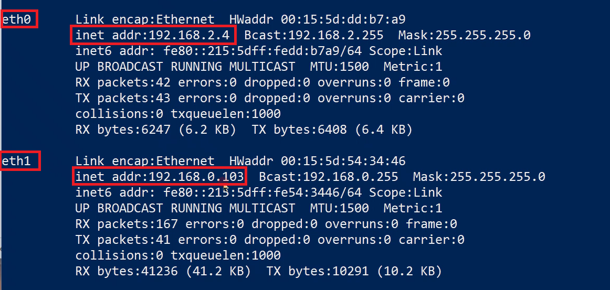
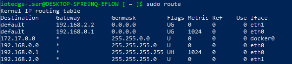

# Azure IoT Edge for Linux on Windows Industrial IoT & DMZ configuration

[!INCLUDE [iot-edge-version-all-supported](../../includes/iot-edge-version-all-supported.md)]

Industrial IoT is transcurring the era of IT and OT convergence. However, making traditional OT assets more intelligent with IT technologies also means a larger exposure to cyberattacks. This is one of the main reasons why multiple environments are designed using demilitarized zones or also known as DMZs. 

Suppose in a workflow you have a networking configuration divided into two different networks/zones. First, you have a Secure network or also defined as the offline network, which has no internet connectivity and is limited to internal access. Secondly, you have a demilitarized zone (DMZ), in which you may have a couple of devices that have limited internet connectivity. When moving the workflow to run on the EFLOW VM, you may have problems accessing the different networks since the EFLOW VM by default has only one NIC attached.

This article describes how to configure the Azure IoT Edge for Linux (EFLOW) VM to support multiple network interface cards (NICs) and connect to multiple networks. By enabling multiple NIC support, applications running on the EFLOW VM can communicate with devices connected to the offline network, and at the same time, use IoT Edge to send data to the cloud.

## Prerequisites

- A Windows device with EFLOW already set up. For more information on EFLOW installation and configuration, see [Create and provision an IoT Edge for Linux on Windows device using symmetric keys](./how-to-provision-single-device-linux-on-windows-symmetric.md).
- Virtual switch different from the default one used during EFLOW installation. For more information on creating a virtual switch, see [Create a virtual switch for Azure IoT Edge for Linux on Windows](./how-to-create-virtual-switch.md).

## Industrial Scenario 

Suppose you have an environment with some devices like PLCs or OPC UA compatible devices connected to the offline network, and you want to upload all the device's information to Azure using the OPC Publisher module running on the EFLOW VM.

Since the EFLOW host device and the PLC/OPC UA devices are physically connected to the offline network, we can use the [Azure IoT Edge for Linux on Windows virtual multiple NIC configurations](./how-to-configure-multiple-nics.md) to connect the EFLOW VM to the offline network. Then, using an External Virtual Switch, we can get the EFLOW VM connected to the offline network and directly communicate with all the other offline devices.

On the other end, the EFLOW host device is also physically connected to the DMZ (online network), with internet and Azure connectivity. Using an Internal/External Switch, we can get the EFLOW VM connected to Azure IoT Hub using IoT Edge modules and upload the information sent by the offline devices through the offline NIC.


We can summarize the described scenario:

- For the Secure network:
    - No internet connectivity, access restricted.
    - PLCs or UPC UA compatible devices connected.
    - EFLOW VM connected using an External virtual switch.

- For the DMZ:
    - Internet connectivity - Azure connection allowed.
    - EFLOW VM connected to Azure IoT Hub, using either an Internal/External virtual switch.
    - OPC Publisher running as a module inside the EFLOW VM used to publish data to Azure.


## Configure VM network virtual switches

The following steps in this section are specific for the networking described above. Ensure that the virtual switches used and the configurations used align with your networking environment.

>[!INFO]
> We will continue the steps in this tutorial supposing that the EFLOW VM was deployed with an _External virtual switch_ connected to the Secure Network (offline). You can change the following steps to your specific network configuration you want to achieve. For more information about EFLOW multiple NIcs support, see [Azure IoT Edge for Linux on Windows virtual multiple NIC configurations](./how-to-configure-multiple-nics.md).

To finish the provisioning of the EFLOW VM and communicate with Azure, we need to assign another NIC that is connected to the DMZ network (online). 

For this tutorial, we'll assign an _External Virtual Switch_ connected to the DMZ network. For more information, review [Create a virtual switch for Hyper-V virtual machines](/windows-server/virtualization/hyper-v/get-started/create-a-virtual-switch-for-hyper-v-virtual-machines). 

To create the new virtual switch, follow these steps:

1. Open Hyper-V Manager.
2. On the right bar, select Virtual Switch Manager. 
3. On the Virtual Switch Manager window, select New Virtual network switch on the left bar.
4. Select type _External_ and select _Create Virtual Switch_.
5. Use a name that represents the Secure network, like _OnlineOPCUA_.
6. Under _Connection Type_, select _External Network_ and select the Network Adapter connected to your DMZ network.
7. Select _Apply_.

Once the External Virtual Switch is created, we need to attach this VM switch to the EFLOW VM. For more information, check [EFLOW Multiple NICs](https://github.com/Azure/iotedge-eflow/wiki/Multiple-NICs). For our custom new External Virtual Switch, using Static IP, the necessary commands are the following: 

1. `Add-EflowNetwork -vswitchName "OnlineOPCUA" -vswitchType "External"`

    

2. `Add-EflowVmEndpoint -vswitchName "OnlineOPCUA" -vEndpointName "OnlineEndpoint" -ip4Address 192.168.0.103 -ip4PrefixLength 24 -ip4GatewayAddress 192.168.0.1`

    

If everything is correct, we'll have the _OnlineOPCUA_ switch assigned to the EFLOW VM. To check the multiple NIC attachment, use the following steps:

1. Open an elevated _PowerShell_ session by starting with **Run as Administrator**.

1. Connect to the EFLOW virtual machine.
    ```powershell
    Connect-EflowVm
    ```

1. List all the network interfaces assigned to the EFLOW virtual machine
    ```bash
    ipconfig
    ```

1. Check the IP configuration - Make sure you see the eth0 interface (connected to the Secure network) and the eth1 interface (connected to the DMZ network).

    


## Configure VM network routing 

When using EFLOW multiple NICs feature, you may want to set up the different routes priorities. By default, EFLOW will create one Default route per _ehtX_ interface assigned to the VM and assign a random priority. If all interfaces are connected to the internet, random priorities may not be a problem. However, if one of the NICs is connected to an Offline network, you may want to prioritize the Online NIC over the Offline NIC to get the EFLOW VM connected to the internet.

EFLOW uses [route](https://man7.org/linux/man-pages/man8/route.8.html) service to manage the network routing alternatives. In order to check the available EFLOW VM routes, use the following steps:

1. Open an elevated _PowerShell_ session by starting with **Run as Administrator**.

1. Connect to the EFLOW virtual machine.
    ```powershell
    Connect-EflowVm
    ```

1. List all the network routes configure in EFLOW virtual machine
    ```bash
    sudo route
    ```

    

    >[!TIP]
    >Image above shows the route command output with the two NIC's assigned (_eth0_ and _eth1_). The virtual machine will create two different _default_ destinations rules with different Metrics (the lower the metric, the higher the priority). This routing table will vary depending on the networking scenario configured in the previous steps.


###  Static Routes fix

Every time EFLOW VM starts, the networking services will recreate all routes, and any previously assigned priority could change. A workaround is to assign the desired priority for each route every time the EFLOW VM starts. We can create a service that is executed every time the VM starts and use the `route` command to set the desired route priorities.

First, create a bash script that will execute the necessary commands to set the routes. For example, following the tutorial networking scenario, EFLOW VM that has two NICs (offline and online networks). First NIC, _eth0_, is connected using the GW IP xxx.xxx.xxx.xxx. The second NIC, _eth1_, is connected using the GW IP yyy.yyy.yyy.yyy. 

The script below will reset the _default_ routes for both _eth0_ and _eth1_, and set them using a desire <number> metric. _Remember: The lower the metric, the higher the priority._ 

```
#!/bin/sh

# Wait 30s for the interfaces to be up
sleep 30

# Delete previous eth0 route and create a new one with desired metric
sudo ip route del default via xxx.xxx.xxx.xxx dev eth0
sudo route add -net default gw xxx.xxx.xxx.xxx netmask 0.0.0.0 dev eth0 metric <number>

# Delete previous eth1 route and create a new one with desired metric
sudo ip route del default via yyy.yyy.yyy.yyy dev eth1
sudo route add -net default gw yyy.yyy.yyy.yyy netmask 0.0.0.0 dev eth1 metric <number>
```

You can use the above script to create your own custom script specific to your networking scenario. Once script is defined, make sure you save it, and assign execute permission. For example, if the script name is _route-setup.sh_, you can assign execute permission using the command `sudo chmod +x route-setup.sh`. You can test if the script is running by executing it manually using the command `sudo sh ./route-setup.sh` and then checking the routing table using the `sudo route` command. 
        
The final step is to create a Linux service that will run on startup, and execute the bash script to set the routes. You'll have to create a systemd unit file, to load the service. Below is an example of that file.
        
```
[Unit]
after=network

[Service]
Type=simple
ExecStart=/bin/bash /home/iotedge-user/route-setup.sh

[Install]
WantedBy=default.target
```

 To check the service is working, reboot the EFLOW VM (`Stop-EflowVm` & `Start-EflowVm`),  then `Connect-EflowVm` to get inside the VM, and finally list the routes. You should be able to see the new _Default_ rules, with the assigned metric.

## Next steps
Follow the steps in [How to configure networking for Azure IoT Edge for Linux on Windows](./how-to-configure-iot-edge-for-linux-on-windows-networking.md) to make sure all the networking configurations were applied correctly.
