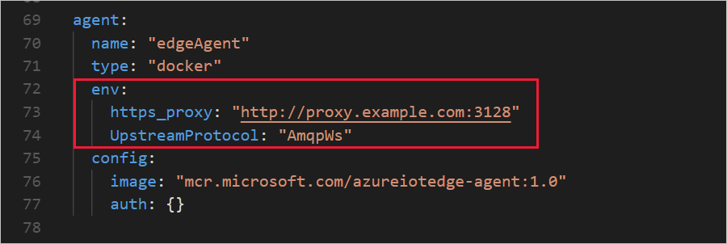
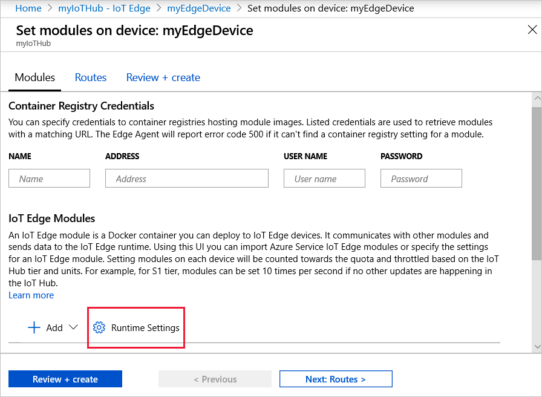
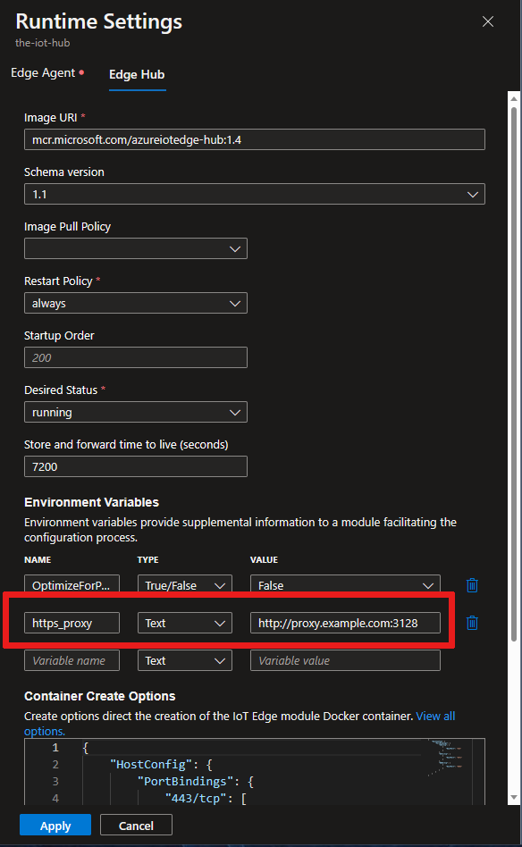

# Configure an IoT Edge device to communicate through a proxy server

IoT Edge devices send HTTPS requests to communicate with IoT Hub. If your device is connected to a network that uses a proxy server, you need to configure the IoT Edge runtime to communicate through the server. Proxy servers can also affect individual IoT Edge modules if they make HTTP or HTTPS requests that aren't routed through the IoT Edge hub.

This article walks through the following four steps to configure and then manage an IoT Edge device behind a proxy server:

1. **Install the IoT Edge runtime on your device.**

   The IoT Edge installation scripts pull packages and files from the internet, so your device needs to communicate through the proxy server to make those requests. For detailed steps, see the [Install the runtime through a proxy](#install-the-runtime-through-a-proxy) section of this article. For Windows devices, the installation script also provides an [Offline installation](how-to-install-iot-edge-windows.md#offline-installation) option.

   This step is a one-time process performed on the IoT Edge device when you first set it up. The same connections are also required when you update the IoT Edge runtime.

2. **Configure the Docker daemon and the IoT Edge daemon on your device.**

   IoT Edge uses two daemons on the device, both of which need to make web requests through the proxy server. The IoT Edge daemon is responsible for communications with IoT Hub. The Moby daemon is responsible for container management, so communicates with container registries. For detailed steps, see the [Configure the daemons](#configure-the-daemons) section of this article.

   This step is a one-time process performed on the IoT Edge device when you first set it up.

3. **Configure the IoT Edge agent properties in the config.yaml file on your device.**

   The IoT Edge daemon starts the edgeAgent module initially, but then the edgeAgent module is responsible for retrieving the deployment manifest from IoT Hub and starting all the other modules. For the IoT Edge agent to make the initial connection to IoT Hub, configure the edgeAgent module environment variables manually on the device itself. After the initial connection, you can configure the edgeAgent module remotely. For detailed steps, see the [Configure the IoT Edge agent](#configure-the-iot-edge-agent) section of this article.

   This step is a one-time process performed on the IoT Edge device when you first set it up.

4. **For all future module deployments, set environment variables for any module communicating through the proxy.**

   Once your IoT Edge device is set up and connected to IoT Hub through the proxy server, you need to maintain the connection in all future module deployments. For detailed steps, see the [Configure deployment manifests](#configure-deployment-manifests) section of this article.

   This step is an ongoing process performed remotely so that every new module or deployment update maintains the device's ability to communicate through the proxy server.

## Know your proxy URL

Before you begin any of the steps in this article, you need to know your proxy URL.

Proxy URLs take the following format: **protocol**://**proxy_host**:**proxy_port**.

* The **protocol** is either HTTP or HTTPS. The Docker daemon can use either protocol, depending on your container registry settings, but the IoT Edge daemon and runtime containers should always use HTTP to connect to the proxy.

* The **proxy_host** is an address for the proxy server. If your proxy server requires authentication, you can provide your credentials as part of the proxy host with the following format: **user**:**password**\@**proxy_host**.

* The **proxy_port** is the network port at which the proxy responds to network traffic.

## Install the runtime through a proxy

Whether your IoT Edge device runs on Windows or Linux, you need to access the installation packages through the proxy server. Depending on your operating system, follow the steps to install the IoT Edge runtime through a proxy server.

### Linux devices

If you're installing the IoT Edge runtime on a Linux device, configure the package manager to go through your proxy server to access the installation package. For example, [Set up apt-get to use a http-proxy](https://help.ubuntu.com/community/AptGet/Howto/#Setting_up_apt-get_to_use_a_http-proxy). Once your package manager is configured, follow the instructions in [Install Azure IoT Edge runtime on Linux](how-to-install-iot-edge-linux.md) as usual.

### Windows devices

If you're installing the IoT Edge runtime on a Windows device, you need to go through the proxy server twice. The first connection downloads the installer script file, and the second connection is during the installation to download the necessary components. You can configure proxy information in Windows settings, or include your proxy information directly in the PowerShell commands.

The following steps demonstrate an example of a windows installation using the `-proxy` argument:

1. The Invoke-WebRequest command needs proxy information to access the installer script. Then the Deploy-IoTEdge command needs the proxy information to download the installation files.

   ```powershell
   . {Invoke-WebRequest -proxy <proxy URL> -useb aka.ms/iotedge-win} | Invoke-Expression; Deploy-IoTEdge -proxy <proxy URL>
   ```

2. The Initialize-IoTEdge command doesn't need to go through the proxy server, so the second step only requires proxy information for Invoke-WebRequest.

   ```powershell
   . {Invoke-WebRequest -proxy <proxy URL> -useb aka.ms/iotedge-win} | Invoke-Expression; Initialize-IoTEdge
   ```

If you have complicated credentials for the proxy server that can't be included in the URL, use the `-ProxyCredential` parameter within `-InvokeWebRequestParameters`. For example,

```powershell
$proxyCredential = (Get-Credential).GetNetworkCredential()
. {Invoke-WebRequest -proxy <proxy URL> -ProxyCredential $proxyCredential -useb aka.ms/iotedge-win} | Invoke-Expression; `
Deploy-IoTEdge -InvokeWebRequestParameters @{ '-Proxy' = '<proxy URL>'; '-ProxyCredential' = $proxyCredential }
```

For more information about proxy parameters, see [Invoke-WebRequest](https://docs.microsoft.com/powershell/module/microsoft.powershell.utility/invoke-webrequest). For more information about Windows installation options, including offline installation, see [Install Azure IoT Edge runtime on Windows](how-to-install-iot-edge-windows.md).

## Configure the daemons

IoT Edge relies on two daemons running on the IoT Edge device. The Moby daemon makes web requests to pull container images from container registries. The IoT Edge daemon makes web requests to communicate with IoT Hub.

Both the Moby and the IoT Edge daemons need to be configured to use the proxy server for ongoing device functionality. This step takes place on the IoT Edge device during initial device setup.

### Moby daemon

Since Moby is built on Docker, refer to the Docker documentation to configure the Moby daemon with environment variables. Most container registries (including DockerHub and Azure Container Registries) support HTTPS requests, so the parameter that you should set is **HTTPS_PROXY**. If you're pulling images from a registry that doesn't support transport layer security (TLS), then you should set the **HTTP_PROXY** parameter.

Choose the article that applies to your IoT Edge device operating system:

* [Configure Docker daemon on Linux](https://docs.docker.com/config/daemon/systemd/#httphttps-proxy)
    The Moby daemon on Linux devices keeps the name Docker.
* [Configure Docker daemon on Windows](https://docs.microsoft.com/virtualization/windowscontainers/manage-docker/configure-docker-daemon#proxy-configuration)
    The Moby daemon on Windows devices is called iotedge-moby. The names are different because it's possible to run both Docker Desktop and Moby in parallel on a Windows device.

### IoT Edge daemon

The IoT Edge daemon is configured in a similar manner to the Moby daemon. Use the following steps to set an environment variable for the service, based on your operating system.

The IoT Edge daemon always uses HTTPS to send requests to IoT Hub.

#### Linux

Open an editor in the terminal to configure the IoT Edge daemon.

```bash
sudo systemctl edit iotedge
```

Enter the following text, replacing **\<proxy URL>** with your proxy server address and port. Then, save and exit.

```ini
[Service]
Environment="https_proxy=<proxy URL>"
```

Refresh the service manager to pick up the new configuration for IoT Edge.

```bash
sudo systemctl daemon-reload
```

Restart IoT Edge for the changes to take effect.

```bash
sudo systemctl restart iotedge
```

Verify that your environment variable was created, and the new configuration was loaded.

```bash
systemctl show --property=Environment iotedge
```

#### Windows

Open a PowerShell window as an administrator and run the following command to edit the registry with the new environment variable. Replace **\<proxy url>** with your proxy server address and port.

```powershell
reg add HKLM\SYSTEM\CurrentControlSet\Services\iotedge /v Environment /t REG_MULTI_SZ /d https_proxy=<proxy URL>
```

Restart IoT Edge for the changes to take effect.

```powershell
Restart-Service iotedge
```

## Configure the IoT Edge agent

The IoT Edge agent is the first module to start on any IoT Edge device. It's started for the first time based on the information in the IoT Edge config.yaml file. The IoT Edge agent then connects to IoT Hub to retrieve deployment manifests, which declare what other modules should be deployed on the device.

This step takes place once on the IoT Edge device during initial device setup.

1. Open the config.yaml file on your IoT Edge device. On Linux systems, this file is located at **/etc/iotedge/config.yaml**. On Windows systems, this file is located at **C:\ProgramData\iotedge\config.yaml**. The configuration file is protected, so you need administrative privileges to access it. On Linux systems, use the `sudo` command before opening the file in your preferred text editor. On Windows, open a text editor like Notepad as administrator and then open the file.

2. In the config.yaml file, find the **Edge Agent module spec** section. The IoT Edge agent definition includes an **env** parameter where you can add environment variables.

3. Remove the curly brackets that are placeholders for the env parameter, and add the new variable on a new line. Remember that indents in YAML are two spaces.

   ```yaml
   https_proxy: "<proxy URL>"
   ```

4. The IoT Edge runtime uses AMQP by default to talk to IoT Hub. Some proxy servers block AMQP ports. If that's the case, then you also need to configure edgeAgent to use AMQP over WebSocket. Add a second environment variable.

   ```yaml
   UpstreamProtocol: "AmqpWs"
   ```

   

5. Save the changes to config.yaml and close the editor. Restart IoT Edge for the changes to take effect.

   * Linux:

      ```bash
      sudo systemctl restart iotedge
      ```

   * Windows:

      ```powershell
      Restart-Service iotedge
      ```

## Configure deployment manifests  

Once your IoT Edge device is configured to work with your proxy server, you need to continue to declare the environment variables in future deployment manifests. You can edit deployment manifests either using the Azure portal wizard or by editing a deployment manifest JSON file.

Always configure the two runtime modules, edgeAgent and edgeHub, to communicate through the proxy server so they can maintain a connection with IoT Hub. If you remove the proxy information from the edgeAgent module, the only way to reestablish connection is by editing the config.yaml file on the device, as described in the previous section.

Other IoT Edge modules that connect to the internet should be configured to communicate through the proxy server, too. However, modules that route their messages through edgeHub or that only communicate with other modules on the device don't need the proxy server details.

This step is ongoing throughout the life of the IoT Edge device.

### Azure portal

When you use the **Set modules** wizard to create deployments for IoT Edge devices, every module has an **Environment Variables** section that you can use to configure proxy server connections.

To configure the IoT Edge agent and IoT Edge hub modules, select **Runtime Settings** on the first step of the wizard.



Add the **https_proxy** environment variable to both the IoT Edge agent and IoT Edge hub module definitions. If you included the **UpstreamProtocol** environment variable in the config.yaml file on your IoT Edge device, add that to the IoT Edge agent module definition too.



All other modules that you add to a deployment manifest follow the same pattern. In the page where you set the module name and image, there is an environment variables section.

### JSON deployment manifest files

If you create deployments for IoT Edge devices using the templates in Visual Studio Code or by manually creating JSON files, you can add the environment variables directly to each module definition.

Use the following JSON format:

```json
"env": {
    "https_proxy": {
        "value": "<proxy URL>"
    }
}
```

With the environment variables included, your module definition should look like the following edgeHub example:

```json
"edgeHub": {
    "type": "docker",
    "settings": {
        "image": "mcr.microsoft.com/azureiotedge-hub:1.0",
        "createOptions": ""
    },
    "env": {
        "https_proxy": {
            "value": "http://proxy.example.com:3128"
        }
    },
    "status": "running",
    "restartPolicy": "always"
}
```

If you included the **UpstreamProtocol** environment variable in the confige.yaml file on your IoT Edge device, add that to the IoT Edge agent module definition too.

```json
"env": {
    "https_proxy": {
        "value": "<proxy URL>"
    },
    "UpstreamProtocol": {
        "value": "AmqpWs"
    }
}
```

## Next steps

Learn more about the roles of the [IoT Edge runtime](iot-edge-runtime.md).

Troubleshoot installation and configuration errors with [Common issues and resolutions for Azure IoT Edge](troubleshoot.md)
