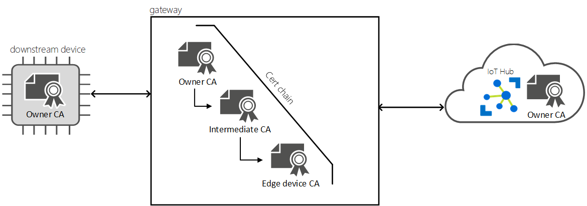
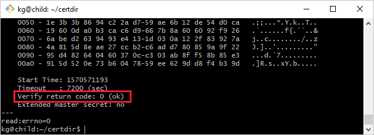

# Connect a downstream device to an Azure IoT Edge gateway

This article provides instructions for establishing a trusted connection between downstream devices and IoT Edge transparent gateways. In a transparent gateway scenario, one or more devices can pass their messages through a single gateway device that maintains the connection to IoT Hub. A downstream device can be any application or platform that has an identity created with the [Azure IoT Hub](https://docs.microsoft.com/azure/iot-hub) cloud service. In many cases, these applications use the [Azure IoT device SDK](../iot-hub/iot-hub-devguide-sdks.md). A downstream device could even be an application running on the IoT Edge gateway device itself.

There are three general steps to set up a successful transparent gateway connection. This article covers the third step:

1. The gateway device needs to securely connect to downstream devices, receive communications from downstream devices, and route messages to the proper destination. For more information, see [Configure an IoT Edge device to act as a transparent gateway](how-to-create-transparent-gateway.md).
2. The downstream device needs a device identity to be able to authenticate with IoT Hub, and know to communicate through its gateway device. For more information, see [Authenticate a downstream device to Azure IoT Hub](how-to-authenticate-downstream-device.md).
3. **The downstream device needs to connect to its gateway device securely.**

This article identifies common problems with downstream device connections and guides you in setting up your downstream devices by:

* Explaining transport layer security (TLS) and certificate fundamentals.
* Explaining how TLS libraries work across different operating systems and how each operating system deals with certificates.
* Walking through Azure IoT samples in several languages to help get you started.

In this article, the terms *gateway* and *IoT Edge gateway* refer to an IoT Edge device configured as a transparent gateway.

## Prerequisites

* Have the **azure-iot-test-only.root.ca.cert.pem** certificate file that was generated in [Configure an IoT Edge device to act as a transparent gateway](how-to-create-transparent-gateway.md) available on your downstream device. Your downstream device uses this certificate to validate the identity of the gateway device.
* Have the modified connection string that points to the gateway device, as explained in [Authenticate a downstream device to Azure IoT Hub](how-to-authenticate-downstream-device.md).

## Prepare a downstream device

A downstream device can be any application or platform that has an identity created with the [Azure IoT Hub](https://docs.microsoft.com/azure/iot-hub) cloud service. In many cases, these applications use the [Azure IoT device SDK](../iot-hub/iot-hub-devguide-sdks.md). A downstream device could even be an application running on the IoT Edge gateway device itself. However, another IoT Edge device cannot be downstream of an IoT Edge gateway.

>[!NOTE]
>IoT devices that have identities registered in IoT Hub can use [module twins](../iot-hub/iot-hub-devguide-module-twins.md) to isolate different process, hardware, or functions on a single device. IoT Edge gateways support downstream module connections using symmetric key authentication but not X.509 certificate authentication.

To connect a downstream device to an IoT Edge gateway, you need two things:

* A device or application that's configured with an IoT Hub device connection string appended with information to connect it to the gateway.

    This step is explained in [Authenticate a downstream device to Azure IoT Hub](how-to-authenticate-downstream-device.md).

* The device or application has to trust the gateway's **root CA** certificate to validate the TLS connections to the gateway device.

    This step is explained in detail in the rest of this article. This step can be performed one of two ways: by installing the CA certificate in the operating system's certificate store, or (for certain languages) by referencing the certificate within applications using the Azure IoT SDKs.

## TLS and certificate fundamentals

The challenge of securely connecting downstream devices to IoT Edge is just like any other secure client/server communication that occurs over the internet. A client and a server securely communicate over the internet using [Transport layer security (TLS)](https://en.wikipedia.org/wiki/Transport_Layer_Security). TLS is built using standard [Public key infrastructure (PKI)](https://en.wikipedia.org/wiki/Public_key_infrastructure) constructs called certificates. TLS is a fairly involved specification and addresses a wide range of topics related to securing two endpoints. This section summarizes the concepts relevant for you to securely connect devices to an IoT Edge gateway.

When a client connects to a server, the server presents a chain of certificates, called the *server certificate chain*. A certificate chain typically comprises a root certificate authority (CA) certificate, one or more intermediate CA certificates, and finally the server's certificate itself. A client establishes trust with a server by cryptographically verifying the entire server certificate chain. This client validation of the server certificate chain is called *server chain validation*. The client cryptographically challenges the service to prove possession of the private key associated with the server certificate in a process called *proof of possession*. The combination of server chain validation and proof of possession is called *server authentication*. To validate a server certificate chain, a client needs a copy of the root CA certificate that was used to create (or issue) the server's certificate. Normally when connecting to websites, a browser comes pre-configured with commonly used CA certificates so the client has a seamless process.

When a device connects to Azure IoT Hub, the device is the client and the IoT Hub cloud service is the server. The IoT Hub cloud service is backed by a root CA certificate called **Baltimore CyberTrust Root**, which is publicly available and widely used. Since the IoT Hub CA certificate is already installed on most devices, many TLS implementations (OpenSSL, Schannel, LibreSSL) automatically use it during server certificate validation. A device that may successfully connect to IoT Hub may have issues trying to connect to an IoT Edge gateway.

When a device connects to an IoT Edge gateway, the downstream device is the client and the gateway device is the server. Azure IoT Edge allows operators (or users) to build gateway certificate chains however they see fit. The operator may choose to use a public CA certificate, like Baltimore, or use a self-signed (or in-house) root CA certificate. Public CA certificates often have a cost associated with them, so are typically used in production scenarios. Self-signed CA certificates are preferred for development and testing. The transparent gateway setup articles listed in the introduction use self-signed root CA certificates.

When you use a self-signed root CA certificate for an IoT Edge gateway, it needs to be installed on or provided to all the downstream devices attempting to connect to the gateway.



To learn more about IoT Edge certificates and some production implications, see [IoT Edge certificate usage details](iot-edge-certs.md).

## Provide the root CA certificate

To verify the gateway device's certificates, the downstream device needs its own copy of the root CA certificate. If you used the scripts provided in the IoT Edge git repository to create test certificates, then the root CA certificate is called **azure-iot-test-only.root.ca.cert.pem**. If you haven't already as part of the other downstream device preparation steps, move this certificate file to any directory on your downstream device. You can use a service like [Azure Key Vault](https://docs.microsoft.com/azure/key-vault) or a function like [Secure copy protocol](https://www.ssh.com/ssh/scp/) to move the certificate file.

## Install certificates in the OS

Installing the root CA certificate in the operating system's certificate store generally allows most applications to use the root CA certificate. There are some exceptions, like NodeJS applications that don't use the OS certificate store but rather use the Node runtime's internal certificate store. If you can't install the certificate at the operating system level, skip ahead to [Use certificates with Azure IoT SDKs](#use-certificates-with-azure-iot-sdks).

### Ubuntu

The following commands are an example of how to install a CA certificate on an Ubuntu host. This example assumes that you're using the **azure-iot-test-only.root.ca.cert.pem** certificate from the prerequisites articles, and that you've copied the certificate into a location on the downstream device.

```bash
sudo cp <path>/azure-iot-test-only.root.ca.cert.pem /usr/local/share/ca-certificates/azure-iot-test-only.root.ca.cert.pem.crt
sudo update-ca-certificates
```

You should see a message that says, "Updating certificates in /etc/ssl/certs... 1 added, 0 removed; done."

### Windows

The following steps are an example of how to install a CA certificate on a Windows host. This example assumes that you're using the **azure-iot-test-only.root.ca.cert.pem** certificate from the prerequisites articles, and that you've copied the certificate into a location on the downstream device.

You can install certificates using PowerShell's [Import-Certificate](https://docs.microsoft.com/powershell/module/pkiclient/import-certificate?view=win10-ps) as an administrator:

```powershell
import-certificate  <file path>\azure-iot-test-only.root.ca.cert.pem -certstorelocation cert:\LocalMachine\root
```

You can also install certificates using the **certlm** utility:

1. In the Start menu, search for and select **Manage computer certificates**. A utility called **certlm** opens.
2. Navigate to **Certificates - Local Computer** > **Trusted Root Certification Authorities**.
3. Right-click **Certificates** and select **All Tasks** > **Import**. The certificate import wizard should launch.
4. Follow the steps as directed and import certificate file `<path>/azure-iot-test-only.root.ca.cert.pem`. When completed, you should see a "Successfully imported" message.

You can also install certificates programmatically using .NET APIs, as shown in the .NET sample later in this article.

Typically applications use the Windows provided TLS stack called [Schannel](https://docs.microsoft.com/windows/desktop/com/schannel) to securely connect over TLS. Schannel *requires* that any certificates be installed in the Windows certificate store before attempting to establish a TLS connection.

## Use certificates with Azure IoT SDKs

This section describes how the Azure IoT SDKs connect to an IoT Edge device using simple sample applications. The goal of all the samples is to connect the device client and send telemetry messages to the gateway, then close the connection and exit.

Have two things ready before using the application-level samples:

* Your downstream device's IoT Hub connection string modified to point to the gateway device, and any certificates required to authenticate your downstream device to IoT Hub. For more information, see [Authenticate a downstream device to Azure IoT Hub](how-to-authenticate-downstream-device.md).

* The full path to the root CA certificate that you copied and saved somewhere on your downstream device.

    For example, `<path>/azure-iot-test-only.root.ca.cert.pem`.

### NodeJS

This section provides a sample application to connect an Azure IoT NodeJS device client to an IoT Edge gateway. For NodeJS applications, you must install the root CA certificate at the application level as shown here. NodeJS applications don't use the system's certificate store.

1. Get the sample for **edge_downstream_device.js** from the [Azure IoT device SDK for Node.js samples repo](https://github.com/Azure/azure-iot-sdk-node/tree/master/device/samples).
2. Make sure that you have all the prerequisites to run the sample by reviewing the **readme.md** file.
3. In the edge_downstream_device.js file, update the **connectionString** and **edge_ca_cert_path** variables.
4. Refer to the SDK documentation for instructions on how to run the sample on your device.

To understand the sample that you're running, the following code snippet is how the client SDK reads the certificate file and uses it to establish a secure TLS connection:

```javascript
// Provide the Azure IoT device client via setOptions with the X509
// Edge root CA certificate that was used to setup the Edge runtime
var options = {
    ca : fs.readFileSync(edge_ca_cert_path, 'utf-8'),
};
```

### .NET

This section introduces a sample application to connect an Azure IoT .NET device client to an IoT Edge gateway. However, .NET applications are automatically able to use any installed certificates in the system's certificate store on both Linux and Windows hosts.

1. Get the sample for **EdgeDownstreamDevice** from the [IoT Edge .NET samples folder](https://github.com/Azure/iotedge/tree/master/samples/dotnet/EdgeDownstreamDevice).
2. Make sure that you have all the prerequisites to run the sample by reviewing the **readme.md** file.
3. In the **Properties / launchSettings.json** file, update the **DEVICE_CONNECTION_STRING** and **CA_CERTIFICATE_PATH** variables. If you want to use the certificate installed in the trusted certificate store on the host system, leave this variable blank.
4. Refer to the SDK documentation for instructions on how to run the sample on your device.

To programmatically install a trusted certificate in the certificate store via a .NET application, refer to the **InstallCACert()** function in the **EdgeDownstreamDevice / Program.cs** file. This operation is idempotent, so can be run multiple times with the same values with no additional effect.

### C

This section introduces a sample application to connect an Azure IoT C device client to an IoT Edge gateway. The C SDK can operate with many TLS libraries, including OpenSSL, WolfSSL, and Schannel. For more information, see the [Azure IoT C SDK](https://github.com/Azure/azure-iot-sdk-c).

1. Get the **iotedge_downstream_device_sample** application from the [Azure IoT device SDK for C samples](https://github.com/Azure/azure-iot-sdk-c/tree/master/iothub_client/samples).
2. Make sure that you have all the prerequisites to run the sample by reviewing the **readme.md** file.
3. In the iotedge_downstream_device_sample.c file, update the **connectionString** and **edge_ca_cert_path** variables.
4. Refer to the SDK documentation for instructions on how to run the sample on your device.

The Azure IoT device SDK for C provides an option to register a CA certificate when setting up the client. This operation doesn't install the certificate anywhere, but rather uses a string format of the certificate in memory. The saved certificate is provided to the underlying TLS stack when establishing a connection.

```C
(void)IoTHubDeviceClient_SetOption(device_handle, OPTION_TRUSTED_CERT, cert_string);
```

On Windows hosts, if you're not using OpenSSL or another TLS library, the SDK default to using Schannel. For Schannel to work, the IoT Edge root CA certificate should be installed in the Windows certificate store, not set using the `IoTHubDeviceClient_SetOption` operation.

### Java

This section introduces a sample application to connect an Azure IoT Java device client to an IoT Edge gateway.

1. Get the sample for **Send-event** from the [Azure IoT device SDK for Java samples](https://github.com/Azure/azure-iot-sdk-java/tree/master/device/iot-device-samples).
2. Make sure that you have all the prerequisites to run the sample by reviewing the **readme.md** file.
3. Refer to the SDK documentation for instructions on how to run the sample on your device.

### Python

This section introduces a sample application to connect an Azure IoT Python device client to an IoT Edge gateway.

1. Get the sample for **send_message** from the [Azure IoT device SDK for Python samples](https://github.com/Azure/azure-iot-sdk-python/tree/master/azure-iot-device/samples/advanced-edge-scenarios).
2. Ensure that you are either running in an IoT Edge container, or in a debug scenario, have the `EdgeHubConnectionString` and `EdgeModuleCACertificateFile` environment variables set.
3. Refer to the SDK documentation for instructions on how to run the sample on your device.

## Test the gateway connection

Use this sample command to test that your downstream device can connect to the gateway device:

```cmd/sh
openssl s_client -connect mygateway.contoso.com:8883 -CAfile <CERTDIR>/certs/azure-iot-test-only.root.ca.cert.pem -showcerts
```

This command tests connections over MQTTS (port 8883). If you're using a different protocol, adjust the command as necessary for AMQPS (5671) or HTTPS (433)

The output of this command may be long, including information about all the certificates in the chain. If your connection is successful, you'll see a line like `Verification: OK` or `Verify return code: 0 (ok)`.



## Troubleshoot the gateway connection

If your leaf device has intermittent connection to its gateway device, try the following steps for resolution.

1. Is the gateway hostname in the connection string the same as the hostname value in the IoT Edge config.yaml file on the gateway device?
2. Is the gateway hostname resolvable to an IP Address? You can resolve intermittent connections either by using DNS or by adding a host file entry on the leaf device.
3. Are communication ports open in your firewall? Communication based on the protocol used (MQTTS:8883/AMQPS:5671/HTTPS:433) must be possible between downstream device and the transparent IoT Edge.

## Next steps

Learn how IoT Edge can extend [offline capabilities](offline-capabilities.md) to downstream devices.
