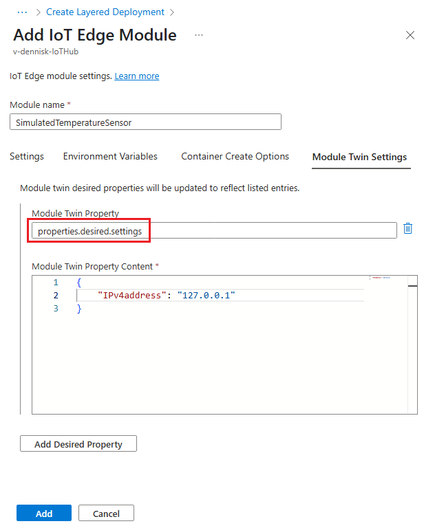

# Deploy IoT Edge modules at scale using the Azure portal

Create an **IoT Edge automatic deployment** in the Azure portal to manage ongoing deployments for many devices at once. Automatic deployments for IoT Edge are part of the [automatic device management](/azure/iot-hub/iot-hub-automatic-device-management) feature of IoT Hub. Deployments are dynamic processes that enable you to deploy multiple modules to multiple devices, track the status and health of the modules, and make changes when necessary.

For more information, see [Understand IoT Edge automatic deployments for single devices or at scale](module-deployment-monitoring.md).

## Identify devices using tags

Before you can create a deployment, you have to be able to specify which devices you want to affect. Azure IoT Edge identifies devices using **tags** in the device twin. Each device can have multiple tags that you define in any way that makes sense for your solution.

For example, if you manage a campus of smart buildings, you might add location, room type, and environment tags to a device:

```json
"tags":{
  "location":{
    "building": "20",
    "floor": "2"
  },
  "roomtype": "conference",
  "environment": "prod"
}
```

For more information about device twins and tags, see [Understand and use device twins in IoT Hub](../iot-hub/iot-hub-devguide-device-twins.md).

## Create a deployment

IoT Edge provides two different types of automatic deployments that you can use to customize your scenario. You can create a standard *deployment*, which includes that system runtime modules and any additional modules and routes. Each device can only apply one deployment. Or you can create a *layered deployment*, which only includes custom modules and routes, not the system runtime. Many layered deployments can be combined on a device, on top of a standard deployment. For more information about how the two types of automatic deployments work together, see [Understand IoT Edge automatic deployments for single devices or at scale](module-deployment-monitoring.md).

The steps for creating a deployment and a layered deployment are very similar. Any differences are called out in the following steps.

1. In the [Azure portal](https://portal.azure.com), go to your IoT Hub.
1. On the menu in the left pane, select **IoT Edge** under **Automatic Device Management**.
1. On the upper bar, select **Create Deployment** or **Create Layered Deployment**.

There are five steps to create a deployment. The following sections walk through each one.

### Step 1: Name and label

1. Give your deployment a unique name that is up to 128 lowercase letters. Avoid spaces and the following invalid characters: `& ^ [ ] { } \ | " < > /`.
1. You can add labels as key-value pairs to help track your deployments. For example, **HostPlatform** and **Linux**, or **Version** and **3.0.1**.
1. Select **Next: Modules** to move to step two.

### Step 2: Modules

You can add up to 20 modules to a deployment. If you create a deployment with no modules, it removes any current modules from the target devices.

In deployments, you can manage the settings for the IoT Edge agent and IoT Edge hub modules. Select **Runtime Settings** to configure the two runtime modules. In layered deployment, the runtime modules are not included so cannot be configured.

You can add three types of modules:

* IoT Edge Module
* Marketplace Module
* Azure Stream Analytics Module

#### Add an IoT Edge module

To add custom code as a module, or to manually add an Azure service module, follow these steps:

1. In the **Container Registry Credentials** section of the page, provide the names and credentials for any private container registries that contain the module images for this deployment. The IoT Edge Agent will report error 500 if it can't find the container registry credential for a Docker image.
1. In the **IoT Edge Modules** section of the page, click **Add**.
1. Select **IoT Edge Module** from the drop-down menu.
1. Give your module a **IoT Edge Module Name**.
1. For the **Image URI** field, enter the container image for your module.
1. Use the drop-down menu to select a **Restart policy**. Choose from the following options:
   * **always** - The module always restarts if it shuts down for any reason.
   * **never** - The module never restarts if it shuts down for any reason.
   * **on-failure** - The module restarts if it crashes, but not if it shuts down cleanly.
   * **on-unhealthy** - The module restarts if it crashes or returns an unhealthy status. It's up to each module to implement the health status function.
1. Use the drop-down menu to select the **Desired Status** for the module. Choose from the following options:
   * **running** - Running is the default option. The module will start running immediately after being deployed.
   * **stopped** - After being deployed, the module will remain idle until called upon to start by you or another module.
1. Specify any **Container Create Options** that should be passed to the container. For more information, see [docker create](https://docs.docker.com/engine/reference/commandline/create/).
1. Select **Module Twin Settings** if you want to add tags or other properties to the module twin.
1. Enter **Environment Variables** for this module. Environment variables provide configuration information to a module.
1. Select **Add** to add your module to the deployment.

#### Add a module from the Marketplace

To add a module from the Azure Marketplace, follow these steps:

1. In the **IoT Edge Modules** section of the page, click **Add**.
1. Select **Marketplace Module** from the drop-down menu.
1. Choose a module from the **IoT Edge Module Marketplace** page. The module you select is automatically configured for your subscription, resource group, and device. It then appears in your list of IoT Edge modules. Some modules may require additional configuration. For more information, see [Deploy modules from Azure Marketplace](how-to-deploy-modules-portal.md#deploy-modules-from-azure-marketplace).

#### Add a Stream Analytics module

To add a module from Azure Stream Analytics, follow these steps:

1. In the **IoT Edge Modules** section of the page, click **Add**.
1. Select **Azure Stream Analytics module** from the drop-down menu.
1. On the right pane, choose your **Subscription**.
1. Choose your IoT **Edge job**.
1. Select **Save** to add your module to the deployment.

#### Configure module settings

After you add a module to a deployment, you can select its name to open the **Update IoT Edge Module** page. On this page, you can edit the module settings, environment variables, create options, and module twin. If you added a module from the marketplace, it may already have some of these parameters filled in.

If you're creating a layered deployment, you may be configuring a module that exists in other deployments targeting the same devices. To update the module twin without overwriting other versions, open the **Module Twin Settings** tab. Create a new **Module Twin Property** with a unique name for a subsection within the module twin's desired properties, for example `properties.desired.settings`. If you define properties within just the `properties.desired` field, it will overwrite the desired properties for the module defined in any lower priority deployments.



For more information about module twin configuration in layered deployments, see [Layered deployment](module-deployment-monitoring.md#layered-deployment).

Once you have all the modules for a deployment configured, select **Next: Routes** to move to step three.

### Step 3: Routes

Routes define how modules communicate with each other within a deployment. By default the wizard gives you a route called **upstream** and defined as **FROM /messages/\* INTO $upstream**, which means that any messages output by any modules are sent to your IoT hub.  

Add or update the routes with information from [Declare routes](module-composition.md#declare-routes), then select **Next** to continue to the review section.

Select **Next: Metrics**.

### Step 4: Metrics

Metrics provide summary counts of the various states that a device may report back as a result of applying configuration content.

1. Enter a name for **Metric Name**.

1. Enter a query for **Metric Criteria**. The query is based on IoT Edge hub module twin [reported properties](module-edgeagent-edgehub.md#edgehub-reported-properties). The metric represents the number of rows returned by the query.

   For example:

   ```sql
   SELECT deviceId FROM devices
     WHERE properties.reported.lastDesiredStatus.code = 200
   ```

Select **Next: Target Devices**.

### Step 5: Target devices

Use the tags property from your devices to target the specific devices that should receive this deployment.

Since multiple deployments may target the same device, you should give each deployment a priority number. If there's ever a conflict, the deployment with the highest priority (larger values indicate higher priority) wins. If two deployments have the same priority number, the one that was created most recently wins.

If multiple deployments target the same device, then only the one with the higher priority is applied. If multiple layered deployments target the same device then they are all applied. However, if any properties are duplicated, like if there are two routes with the same name, then the one from the higher priority layered deployment overwrites the rest.

Any layered deployment targeting a device must have a higher priority than the base deployment in order to be applied.

1. Enter a positive integer for the deployment **Priority**.
1. Enter a **Target condition** to determine which devices will be targeted with this deployment. The condition is based on device twin tags or device twin reported properties and should match the expression format. For example, `tags.environment='test'` or `properties.reported.devicemodel='4000x'`.

Select **Next: Review + Create** to move on to the final step.

### Step 6: Review and create

Review your deployment information, then select **Create**.

To monitor your deployment, see [Monitor IoT Edge deployments](how-to-monitor-iot-edge-deployments.md).

## Modify a deployment

When you modify a deployment, the changes immediately replicate to all targeted devices. You can modify the following settings and features for an existing deployment:

* Target conditions
* Custom metrics
* Labels
* Tags
* Desired properties

### Modify target conditions, custom metrics, and labels

1. In your IoT hub, select **IoT Edge** from the left pane menu.
1. Select the **IoT Edge deployments** tab and then select the deployment you want to configure.
1. Select the **Target Condition** tab. Change the **Target Condition** to target the intended devices. You can also adjust the **Priority**.  Select **Save**.

    If you update the target condition, the following updates occur:

    * If a device didn't meet the old target condition, but meets the new target condition and this deployment is the highest priority for that device, then this deployment is applied to the device.
    * If a device currently running this deployment no longer meets the target condition, it uninstalls this deployment and takes on the next highest priority deployment.
    * If a device currently running this deployment no longer meets the target condition and doesn't meet the target condition of any other deployments, then no change occurs on the device. The device continues running its current modules in their current state, but is not managed as part of this deployment anymore. Once it meets the target condition of any other deployment, it uninstalls this deployment and takes on the new one.

1. Select the **Metrics** tab and click the **Edit Metrics** button. Add or modify custom metrics, using the example syntax as a guide. Select **Save**.

    

1. Select the **Labels** tab and make any desired changes and select **Save**.

## Delete a deployment

When you delete a deployment, any deployed devices take on their next highest priority deployment. If your devices don't meet the target condition of any other deployment, then the modules are not removed when the deployment is deleted.

1. Sign in to the [Azure portal](https://portal.azure.com) and navigate to your IoT Hub.
1. Select **IoT Edge**.
1. Select the **IoT Edge Deployments** tab.

   

1. Use the checkbox to select the deployment that you want to delete.
1. Select **Delete**.
1. A prompt will inform you that this action will delete this deployment and revert to the previous state for all devices. A deployment with a lower priority will apply. If no other deployment is targeted, no modules will be removed. If you want to remove all modules from your device, create a deployment with zero modules and deploy it to the same devices. Select **Yes** to continue.

## Next steps

Learn more about [Deploying modules to IoT Edge devices](module-deployment-monitoring.md).
