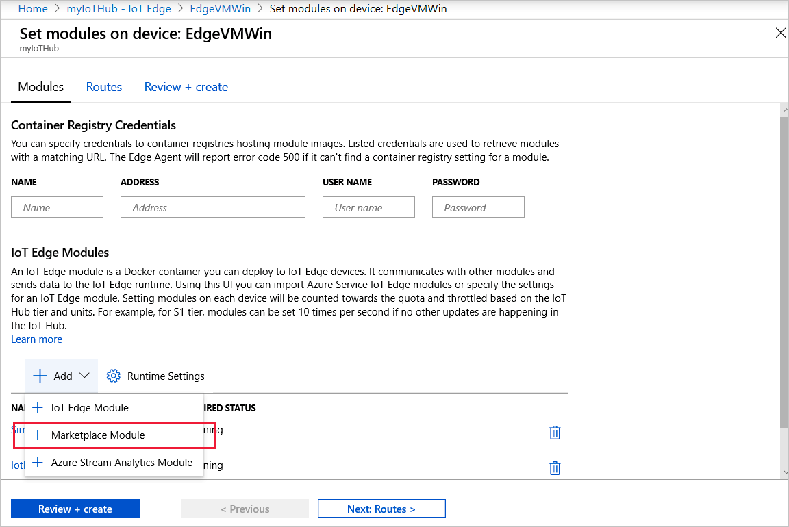

# Deploy Azure IoT Edge modules from the Azure portal

Once you create IoT Edge modules with your business logic, you want to deploy them to your devices to operate at the edge. If you have multiple modules that work together to collect and process data, you can deploy them all at once and declare the routing rules that connect them.

This article shows how the Azure portal guides you through creating a deployment manifest and pushing the deployment to an IoT Edge device. For information about creating a deployment that targets multiple devices based on their shared tags, see [Deploy and monitor IoT Edge modules at scale](how-to-deploy-monitor.md).

## Prerequisites

* An [IoT hub](../iot-hub/iot-hub-create-through-portal.md) in your Azure subscription.
* An [IoT Edge device](how-to-register-device.md#register-in-the-azure-portal) with the IoT Edge runtime installed.

## Configure a deployment manifest

A deployment manifest is a JSON document that describes which modules to deploy, how data flows between the modules, and desired properties of the module twins. For more information about how deployment manifests work and how to create them, see [Understand how IoT Edge modules can be used, configured, and reused](module-composition.md).

The Azure portal has a wizard that walks you through creating the deployment manifest, instead of building the JSON document manually. It has three steps: **Add modules**, **Specify routes**, and **Review deployment**.

### Select device and add modules

1. Sign in to the [Azure portal](https://portal.azure.com) and navigate to your IoT hub.
1. On the left pane, select **IoT Edge** from the menu.
1. Click on the ID of the target device from the list of devices.
1. On the upper bar, select **Set Modules**.
1. In the **Container Registry Settings** section of the page, provide the credentials to access any private container registries that contain your module images.
1. In the **IoT Edge Modules** section of the page, select **Add**.
1. Look at the types of modules from the drop-down menu:

   * **IoT Edge Module** - You provide the module name and container image URI. For example, the image URI for the sample SimulatedTemperatureSensor module is `mcr.microsoft.com/azureiotedge-simulated-temperature-sensor:1.0`. If the module image is stored in a private container registry, add the credentials on this page to access the image. 
   * **Marketplace Module** - Modules hosted in the Azure Marketplace. Some marketplace modules require additional configuration, so review the module details in the [Azure Marketplace IoT Edge Modules](https://azuremarketplace.microsoft.com/marketplace/apps/category/internet-of-things?page=1&subcategories=iot-edge-modules) list.
   * **Azure Stream Analytics Module** - Modules generated from an Azure Stream Analytics workload. 

1. After adding a module, select the module name from the list to open the module settings. Fill out the optional fields if necessary. For more information about container create options, restart policy, and desired status see [EdgeAgent desired properties](module-edgeagent-edgehub.md#edgeagent-desired-properties). For more information about the module twin see [Define or update desired properties](module-composition.md#define-or-update-desired-properties).
1. If needed, repeat steps 5 through 8 to add additional modules to your deployment.
1. Select **Next: Routes** to continue to the routes section.

### Specify routes

On the **Routes** tab, you define how messages are passed between modules and the IoT Hub. Messages are constructed using name/value pairs. By default a route is called **route** and defined as **FROM /messages/\* INTO $upstream**, which means that any messages output by any modules are sent to your IoT hub.  

Add or update the routes with information from [Declare routes](module-composition.md#declare-routes), then select **Next: Review + create** to continue to the next step of the wizard.

### Review deployment

The review section shows you the JSON deployment manifest that was created based on your selections in the previous two sections. Note that there are two modules declared that you didn't add: **$edgeAgent** and **$edgeHub**. These two modules make up the [IoT Edge runtime](iot-edge-runtime.md) and are required defaults in every deployment.

Review your deployment information, then select **Create**.

## View modules on your device

Once you've deployed modules to your device, you can view all of them in the device details page of your IoT Hub. This page displays the name of each deployed module, as well as useful information like the deployment status and exit code.

## Deploy modules from Azure Marketplace

[Azure Marketplace](https://azuremarketplace.microsoft.com/) is an online applications and services marketplace where you can browse through a wide range of enterprise applications and solutions that are certified and optimized to run on Azure, including [IoT Edge modules](https://azuremarketplace.microsoft.com/marketplace/apps/category/internet-of-things?page=1&subcategories=iot-edge-modules).

You can deploy an IoT Edge module from the Azure Marketplace and from your IoT Hub.

### Deploy from Azure Marketplace

Peruse the IoT Edge modules in the marketplace and when you find the one you want you can deploy it by selecting **Create** or **Get it now**. Proceed with the deployment wizard steps which may vary depending on the IoT Edge module you selected:

1. Acknowledge the provider's terms of use and privacy policy by selecting **Continue**. You may first have to provide contact information.
1. Choose your subscription and the IoT Hub to which the target device is attached.
1. Choose **Deploy to a device**.
1. Enter the name of the device or select **Find Device** to browse among the devices registered with the hub.
1. Select **Create** to continue the standard process of configuring a deployment manifest, including adding other modules if desired. Details for the new module such as image URI, create options, and desired properties are predefined but can be changed.

Verify that the module is deployed in your IoT Hub in the Azure portal. Select your device, select **Set Modules** and the module should be listed in the **IoT Edge Modules** section.

### Deploy from Azure IoT Hub

You can quickly deploy a module from the Azure Marketplace onto your device in your IoT Hub in the Azure portal.

1. In the Azure portal, navigate to your IoT Hub.
1. On the left pane, under **Automatic Device Management**, select **IoT Edge**.
1. Select the IoT Edge device that is to receive the deployment.
1. On the upper bar, select **Set Modules**.
1. In the **IoT Edge Modules** section, click **Add**, and select **Marketplace Module** from the drop-down menu.

Choose a module from the **IoT Edge Module Marketplace** page. The module you select is automatically configured for your subscription, resource group, and device. It then appears in your list of IoT Edge modules. Some modules may require additional configuration.

> [!TIP]
> The information about IoT Edge modules from the Azure IoT Hub is limited. You can first learn more about the [IoT Edge modules](https://azuremarketplace.microsoft.com/marketplace/apps/category/internet-of-things?page=1&subcategories=iot-edge-modules) in the Azure Marketplace.

Select **Next: Routes** and continue with deployment as described by [Specify routes](#specify-routes) and [Review Deployment](#review-deployment) earlier in this article.

## Next steps

Learn how to [Deploy and monitor IoT Edge modules at scale](how-to-deploy-monitor.md)
