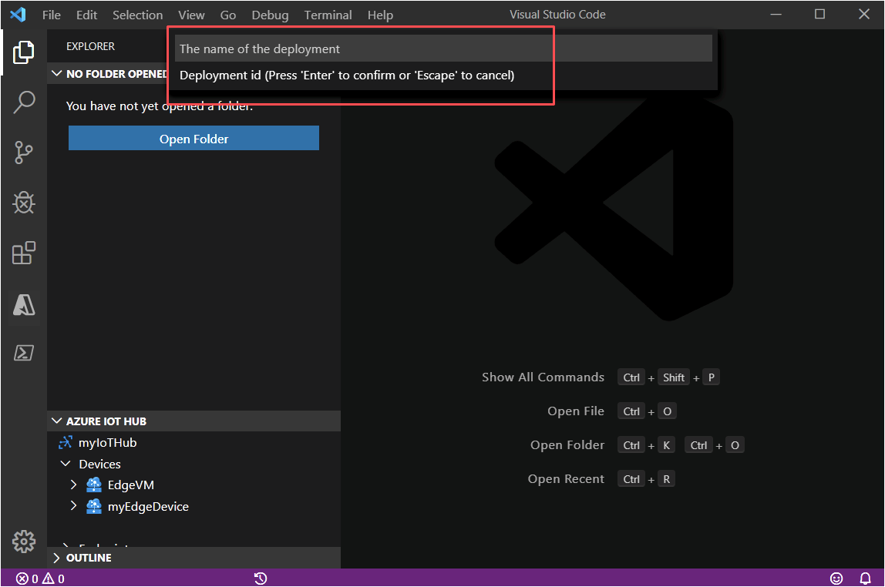

# Deploy IoT Edge modules at scale using Visual Studio Code

You can create an **IoT Edge automatic deployment** using Visual Studio Code to manage ongoing deployments for many devices at once. Automatic deployments for IoT Edge are part of the [automatic device management](/azure/iot-hub/iot-hub-automatic-device-management) feature of IoT Hub. Deployments are dynamic processes that enable you to deploy multiple modules to multiple devices. You can also track the status and health of the modules, and make changes when necessary.

For more information, see [Understand IoT Edge automatic deployments for single devices or at scale](module-deployment-monitoring.md).

In this article, you set up Visual Studio Code and the IoT extension. You then learn how to deploy modules to a set of IoT Edge devices.

## Prerequisites

* An [IoT hub](../iot-hub/iot-hub-create-through-portal.md) in your Azure subscription.
* An [IoT Edge device](how-to-register-device.md#register-with-visual-studio-code) with the IoT Edge runtime installed.
* [Visual Studio Code](https://code.visualstudio.com/).
* [Azure IoT Tools](https://marketplace.visualstudio.com/items?itemName=vsciot-vscode.azure-iot-tools#overview) for Visual Studio Code.

## Sign in to access your IoT hub

You can use the Azure IoT extensions for Visual Studio Code to do operations with your Hub. For these operations to work, you need to sign into your Azure account and select the IoT hub that you are working on.

1. In Visual Studio Code, open the **Explorer** view.

1. At the bottom of the Explorer, expand the **Azure IoT Hub** section.

1. Click on the **...** in the **Azure IoT Hub** section header. If you don't see the ellipsis, hover over the header.

1. Choose **Select IoT Hub**.

1. If you are not signed into your Azure account, follow the prompts to do so.

1. Select your Azure subscription.

1. Select your IoT hub.

## Configure a deployment manifest

A deployment manifest is a JSON document that describes which modules to deploy. It also describes how data flows between the modules, and desired properties of the module twins. For more information, see [Learn how to deploy modules and establish routes in IoT Edge](module-composition.md).

To deploy modules using Visual Studio Code, save the deployment manifest locally as a .JSON file. You will need to provide its location when you run the command to apply the configuration to your device.

Here's a basic deployment manifest with one module as an example:

```json
{
  "content": {
    "modulesContent": {
      "$edgeAgent": {
        "properties.desired": {
          "schemaVersion": "1.0",
          "runtime": {
            "type": "docker",
            "settings": {
              "minDockerVersion": "v1.25",
              "loggingOptions": "",
              "registryCredentials": {}
            }
          },
          "systemModules": {
            "edgeAgent": {
              "type": "docker",
              "settings": {
                "image": "mcr.microsoft.com/azureiotedge-agent:1.0",
                "createOptions": "{}"
              }
            },
            "edgeHub": {
              "type": "docker",
              "status": "running",
              "restartPolicy": "always",
              "settings": {
                "image": "mcr.microsoft.com/azureiotedge-hub:1.0",
                "createOptions": "{\"HostConfig\":{\"PortBindings\":{\"5671/tcp\":[{\"HostPort\":\"5671\"}],\"8883/tcp\":[{\"HostPort\":\"8883\"}],\"443/tcp\":[{\"HostPort\":\"443\"}]}}}"
              }
            }
          },
          "modules": {
            "SimulatedTemperatureSensor": {
              "version": "1.0",
              "type": "docker",
              "status": "running",
              "restartPolicy": "always",
              "settings": {
                "image": "mcr.microsoft.com/azureiotedge-simulated-temperature-sensor:1.0",
                "createOptions": "{}"
              }
            }
          }
        }
      },
      "$edgeHub": {
        "properties.desired": {
          "schemaVersion": "1.0",
          "routes": {
            "upstream": "FROM /messages/* INTO $upstream"
          },
          "storeAndForwardConfiguration": {
            "timeToLiveSecs": 7200
          }
        }
      },
      "SimulatedTemperatureSensor": {
        "properties.desired": {
          "SendData": true,
          "SendInterval": 5
        }
      }
    }
  }
}
```

If you need to determine which IoT Edge devices you can currently configure, run the **IoT Edge: Get Device Info** command.

## Identify devices with target conditions

To identify the IoT Edge devices that are to receive the deployment, you must specify a target condition. A target condition is met when specified criteria is matched by a deviceId, tag value, or a reported property value.

You configure tags in the device twin. Here is an example of a device twin that has tags:

```json
"tags":{
  "location":{
    "building": "20",
    "floor": "2"
  },
  "roomtype": "conference",
  "environment": "prod"
}
```

This device will receive a deployment if the target condition for the deployment contains an expression that matches one of the tag's values, such as `tag.location.building = '20'`.

If you want to target a specific device regardless of its tags or other values, just specify the `deviceId` for the target condition.

Here are some more examples:

* deviceId ='linuxprod1'
* deviceId = 'linuxprod1' OR deviceId = 'linuxprod2' OR deviceId = 'linuxprod3'
* tags.environment ='prod'
* tags.environment = 'prod' AND tags.location = 'westus2'
* tags.environment = 'prod' OR tags.location = 'westus2'
* tags.operator = 'John' AND tags.environment = 'prod' AND NOT deviceId = 'linuxprod1'

See [target condition](module-deployment-monitoring.md#target-condition) for details. For more information about device twins and tags, see [Understand and use device twins in IoT Hub](../iot-hub/iot-hub-devguide-device-twins.md).

### Edit the device twin

You can edit the device twin in Visual Studio Code to configure the tags. From the **View** menu, select **Command Palette** and run the **IoT Edge: Edit Device Twin** command. Select your IoT Edge device and the device twin appears.

In this example, no tags have been defined. Replace the current empty section `"tags": {}` with your own tags definition.

```json
{
    "deviceId": "myEdgeDevice",
    "etag": "AAAAAAAAAAE=",
    "deviceEtag": "NTgwMDg5MDAz",
    "status": "enabled",
    "statusUpdateTime": "0001-01-01T00:00:00Z",
    "connectionState": "Disconnected",
    "lastActivityTime": "0001-01-01T00:00:00Z",
    "cloudToDeviceMessageCount": 0,
    "authenticationType": "sas",
    "x509Thumbprint": {
        "primaryThumbprint": null,
        "secondaryThumbprint": null
    },
    "version": 2,
    "properties": {
        "desired": {
            "$metadata": {
                "$lastUpdated": "2019-12-29T00:58:49.9315265Z"
            },
            "$version": 1
        },
        "reported": {
            "$metadata": {
                "$lastUpdated": "2019-12-29T00:58:49.9315265Z"
            },
            "$version": 1
        }
    },
    "capabilities": {
        "iotEdge": true
    },
    "deviceScope": "ms-azure-iot-edge://myEdgeDevice-637131779299315265",
    "tags": {}
}
```

After you save the local file, run the **IoT Edge: Update Device Twin** command.

## Create deployment at scale

After you have configured the deployment manifest and configured tags in the device twin, you're ready to deploy.

1. From the **View** menu, select **Command Palette** and select the **Azure IoT Edge: Create Deployment at Scale** command.

1. Navigate to the deployment manifest JSON file that you want to use, and click **Select Edge Deployment Manifest**.

1. Provide values as prompted, starting with the **deployment ID**.

   

   Specify values for these parameters:

  | Parameter | Description |
  | --- | --- |
  | Deployment ID | The name of the deployment that will be created in the IoT hub. Give your deployment a unique name that is up to 128 lowercase letters. Avoid spaces and the following invalid characters: `& ^ [ ] { } \ | " < > /`. |
  | Target condition | Enter a target condition to determine which devices will be targeted with this deployment. The condition is based on device twin tags or device twin reported properties and should match the expression format. For example, `tags.environment='test' and properties.reported.devicemodel='4000x'`. |
  | Priority |  A positive integer. If two or more deployments are targeted at the same device, the deployment with the highest numerical value for Priority will apply. |

  After specifying the priority, the terminal should display output similar to the following depiction:

   ```cmd
   [Edge] Start deployment with deployment id [{specified-value}] and target condition [{specified-value}]
   [Edge] Deployment with deployment id [{specified-value}] succeeded.
   ```

## Monitoring and modifying deployments

Use the [Azure portal](how-to-monitor-iot-edge-deployments.md#monitor-a-deployment-in-the-azure-portal) or the [Azure CLI](how-to-monitor-iot-edge-deployments.md#monitor-a-deployment-with-azure-cli) to monitor, modify, and delete deployments. Both provide metrics on your deployments.

## Next steps

Learn more about [Deploying modules to IoT Edge devices](module-deployment-monitoring.md).
