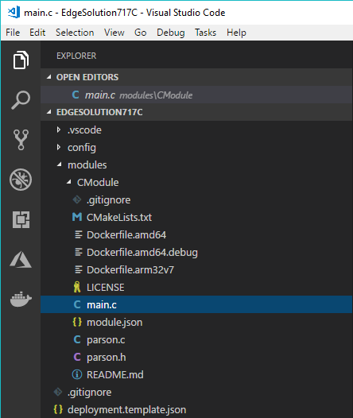
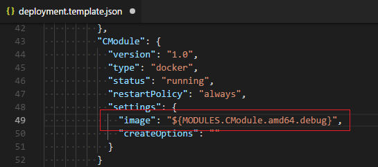
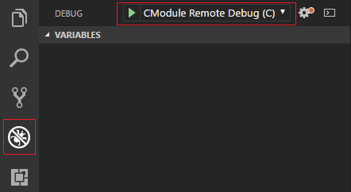

# Use Visual Studio Code to develop and debug C modules for Azure IoT Edge

You can turn your business logic into modules for Azure IoT Edge. This article shows you how to use Visual Studio Code (VS Code) as the main tool to develop and debug C modules.

## Prerequisites
This article assumes that you use a computer or virtual machine running Windows or Linux as your development machine. And you simulate your IoT Edge device on your development machine with IoT Edge security daemon.

> [!NOTE]
> This debugging article demonstrates how to attach a process in a module container and debug it with VS Code. You can only debug C modules in Linux amd64 containers. If you aren't familiar with the debugging capabilities of Visual Studio Code, read about [Debugging](https://code.visualstudio.com/Docs/editor/debugging).

Because this article uses Visual Studio Code as the main development tool, install VS Code. Then add the necessary extensions:
* [Visual Studio Code](https://code.visualstudio.com/) 
* [Azure IoT Edge extension](https://marketplace.visualstudio.com/items?itemName=vsciot-vscode.azure-iot-edge) 
* [C/C++ extension](https://marketplace.visualstudio.com/items?itemName=ms-vscode.cpptools) for Visual Studio Code.
* [Docker extension](https://marketplace.visualstudio.com/items?itemName=PeterJausovec.vscode-docker)

To create a module, you need Docker to build the module image, and a container registry to hold the module image:
* [Docker Community Edition](https://docs.docker.com/install/) on your development machine. 
* [Azure Container Registry](https://docs.microsoft.com/azure/container-registry/) or [Docker Hub](https://docs.docker.com/docker-hub/repos/#viewing-repository-tags)
   * You can use a local Docker registry for prototype and testing purposes instead of a cloud registry. 

To test your module on a device, you need an active IoT hub with at least one IoT Edge device. To use your computer as an IoT Edge device, follow the steps in the quickstart for [Linux](quickstart-linux.md). 

## Create a new solution template

Take these steps to create an IoT Edge module based on Azure IoT C SDK using Visual Studio Code and the Azure IoT Edge extension. First you create a solution, and then you generate the first module in that solution. Each solution can contain more than one module. 

1. In Visual Studio Code, select **View** > **Integrated Terminal**.

2. Select **View** > **Command Palette**. 

3. In the command palette, enter and run the command **Azure IoT Edge: New IoT Edge Solution**.

   

4. Browse to the folder where you want to create the new solution. Choose **Select folder**. 

5. Enter a name for your solution. 

6. Select **C Module** as the template for the first module in the solution.

7. Enter a name for your module. Choose a name that's unique within your container registry. 

8. Provide the name of the module's image repository. VS Code autopopulates the module name with **localhost:5000**. Replace it with your own registry information. If you use a local Docker registry for testing, then **localhost** is fine. If you use Azure Container Registry, then use the login server from your registry's settings. The login server looks like **\<registry name\>.azurecr.io**. Only replace the localhost part of the string, don't delete your module name. 

   

VS Code takes the information you provided, creates an IoT Edge solution, and then loads it in a new window.

   

There are four items within the solution: 
* A **.vscode** folder contains debug configurations.
* A **modules** folder has subfolders for each module. At this point, you only have one. But you can add more in the command palette with the command **Azure IoT Edge: Add IoT Edge Module**. 
* An **.env** file lists your environment variables. If Azure Container Registry is your registry, you'll have an Azure Container Registry username and password in it. 

   > [!NOTE]
   > The environment file is only created if you provide an image repository for the module. If you accepted the localhost defaults to test and debug locally, then you don't need to declare environment variables. 

* A **deployment.template.json** file lists your new module along with a sample **tempSensor** module that simulates data you can use for testing. For more information about how deployment manifests work, see [Learn how to use deployment manifests to deploy modules and establish routes](module-composition.md). 

## Develop your module

The default C module code that comes with the solution is located at **modules** > [your module name] > **main.c**. The module and the deployment.template.json file are set up so that you can build the solution, push it to your container registry, and deploy it to a device to start testing without touching any code. The module is built to simply take input from a source (in this case, the tempSensor module that simulates data) and pipe it to IoT Hub. 

When you're ready to customize the C template with your own code, use the [Azure IoT Hub SDKs](../iot-hub/iot-hub-devguide-sdks.md) to build modules that address the key needs for IoT solutions such as security, device management, and reliability. 

## Build and deploy your module for debugging

In each module folder, there are several Docker files for different container types. Use any of these files that end with the extension **.debug** to build your module for testing. Currently, C modules support debugging only in Linux amd64 containers.

1. In VS Code, navigate to the `deployment.template.json` file. Update your module image URL by adding **.debug** to the end.

    

2. Replace the C module createOptions in **deployment.template.json** with below content and save this file: 
    
    ```json
    "createOptions": "{\"HostConfig\": {\"Privileged\": true}}"
    ```

2. In the VS Code command palette, enter and run the command **Azure IoT Edge: Build and Push IoT Edge solution**.
3. Select the `deployment.template.json` file for your solution from the command palette. 
4. In Azure IoT Hub Device Explorer, right-click an IoT Edge device ID. Then select **Create deployment for Single Device**. 
5. Open your solution's **config** folder. Then select the `deployment.json` file. Choose **Select Edge Deployment Manifest**. 

You'll see the deployment successfully created with a deployment ID in a VS Code-integrated terminal.

Check your container status in the VS Code Docker explorer or by running the `docker ps` command in the terminal.

## Start debugging C module in VS Code
VS Code keeps debugging configuration information in a `launch.json` file located in a `.vscode` folder in your workspace. This `launch.json` file was generated when you created a new IoT Edge solution. It updates each time you add a new module that supports debugging. 

1. Navigate to the VS Code debug view. Select the debug configuration file for your module. The debug option name should be similar to **ModuleName Remote Debug (C)**

   

2. Navigate to `main.c`. Add a breakpoint in this file.

3. Select **Start Debugging** or select **F5**. Select the process to attach to.

4. In VS Code Debug view, you'll see the variables in the left panel. 

The preceding example shows how to debug C IoT Edge modules on containers. It added exposed ports in your module container createOptions. After you finish debugging your C modules, we recommend you remove these exposed ports for production-ready IoT Edge modules.

## Next steps

After you've built your module, learn how to [deploy Azure IoT Edge modules from Visual Studio Code](how-to-deploy-modules-vscode.md).

To develop modules for your IoT Edge devices, [Understand and use Azure IoT Hub SDKs](../iot-hub/iot-hub-devguide-sdks.md).
