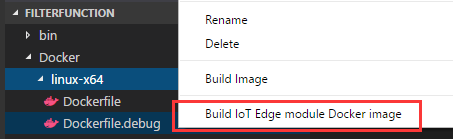
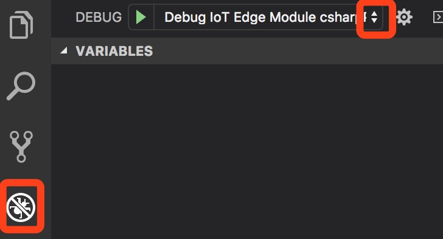

# Use Visual Studio Code to develop and debug Azure functions for Azure IoT Edge

This article shows you how to use [Visual Studio Code (VS Code)](https://code.visualstudio.com/) to debug your Azure functions on Azure IoT Edge.

## Prerequisites
This article assumes that you use a computer or virtual machine running Windows or Linux as your development machine. Your IoT Edge device can be another physical device. Or you can simulate your IoT Edge device on your development machine.

> [!NOTE]
> This debugging article demonstrates how to attach a process in a module container and debug it with VS Code. You can only debug C# functions in Linux amd64 containers. If you aren't familiar with the debugging capabilities of Visual Studio Code, read about [Debugging](https://code.visualstudio.com/Docs/editor/debugging). 

This article uses Visual Studio Code as the main development tool. Install VS Code. Then add the necessary extensions: 

* [Visual Studio Code](https://code.visualstudio.com/) 
* [Azure IoT Edge extension](https://marketplace.visualstudio.com/items?itemName=vsciot-vscode.azure-iot-edge) 
* [C# extension](https://marketplace.visualstudio.com/items?itemName=ms-vscode.csharp) 
* [Docker extension](https://marketplace.visualstudio.com/items?itemName=PeterJausovec.vscode-docker)

To create a module, you need .NET to build the project folder, Docker to build the module image, and a container registry to hold the module image:

* [.NET Core 2.1 SDK](https://www.microsoft.com/net/download)
* [Docker Community Edition](https://docs.docker.com/install/) on your development machine 
* [Azure Container Registry](https://docs.microsoft.com/azure/container-registry/) or [Docker Hub](https://docs.docker.com/docker-hub/repos/#viewing-repository-tags)
   * You can use a local Docker registry for prototype and testing purposes instead of a cloud registry. 

To test your module on a device, you need an active IoT hub with at least one IoT Edge device. To use your computer as an IoT Edge device, follow the steps in the quickstart for [Windows](quickstart.md) or [Linux](quickstart-linux.md). 

## Create a new solution template

Take these steps to create an IoT Edge solution that has one C# function module. Each solution can have several modules.

1. In Visual Studio Code, select **View** > **Integrated Terminal**.
3. Select **View** > **Command Palette**.
4. In the command palette, enter and run the command **Azure IoT Edge: New IoT Edge Solution**. 

   

5. Browse to the folder where you want to create the new solution. Choose **Select folder**. 
6. Enter a name for your solution. 
7. Choose **Azure Functions - C#** as the template for the first module in the solution.
8. Enter a name for your module. Choose a name that's unique within your container registry. 
9. Provide the image repository for the module. VS Code autopopulates the module name with **localhost:5000**. Replace it with your own registry information. If you use a local Docker registry for testing, then **localhost** is fine. If you use Azure Container Registry, then use the login server from your registry's settings. The login server looks like **\<registry name\>.azurecr.io**. Only replace the localhost part of the string, don't delete your module name.

   

VS Code takes the information you provided, creates an IoT Edge solution with an Azure Functions project, and then loads it in a new window.

There are four items within the solution: 

* A **.vscode** folder contains debug configurations.
* A **modules** folder has subfolders for each module. At this point, you only have one. But you can add more through the command palette with the command **Azure IoT Edge: Add IoT Edge Module**.
* An **.env** file lists your environment variables. If Azure Container Registry is your registry, you'll have an Azure Container Registry username and password in it. 

   >[!NOTE]
   >The environment file is only created if you provide an image repository for the module. If you accepted the localhost defaults to test and debug locally, then you don't need to declare environment variables. 

* A **deployment.template.json** file lists your new module along with a sample **tempSensor** module that simulates data you can use for testing. For more information about how deployment manifests work, see [Learn how to use deployment manifests to deploy modules and establish routes](module-composition.md).

## Develop your module

The default Azure Function code that comes with the solution is located at **modules** > [your module name] > **EdgeHubTrigger-Csharp** > **run.csx**. The module and the deployment.template.json file are set up so that you can build the solution, push it to your container registry, and deploy it to a device to start testing without touching any code. The module is built to simply take input from a source (in this case, the tempSensor module that simulates data) and pipe it to IoT Hub. 

When you're ready to customize the Azure Function template with your own code, use the [Azure IoT Hub SDKs](../iot-hub/iot-hub-devguide-sdks.md) to build modules that address the key needs for IoT solutions such as security, device management, and reliability. 

## Build your module for debugging
1. To start debugging, use **Dockerfile.amd64.debug** to rebuild your docker image and deploy your Edge solution again. In VS Code explorer, navigate to the `deployment.template.json` file. Update your function image URL by adding `.debug` to the end.

    

2. Rebuild your solution. In the VS Code command palette, enter and run the command **Azure IoT Edge: Build IoT Edge solution**.
3. In Azure IoT Hub Devices explorer, right-click an IoT Edge device ID, and then select **Create deployment for Edge device**. Select the `deployment.json` file in the `config` folder. You'll see the deployment successfully created with a deployment ID in a VS Code-integrated terminal.

Check your container status in VS Code Docker explorer or by running the `docker ps` command in the terminal.

## Start debugging C# functions in VS Code
1. VS Code keeps debugging configuration information in a `launch.json` file located in a `.vscode` folder in your workspace. This `launch.json` file was generated when you created a new IoT Edge solution. It updates each time you add a new module that supports debugging. Navigate to the debug view. Select the corresponding debug configuration file. The debug option name should be similar to **ModuleName Remote Debug (.NET Core)**.

   

2. Navigate to `run.csx`. Add a breakpoint in the function.
3. Select **Start Debugging** or select **F5**. Select the process to attach to.
4. In VS Code debug view, you'll see the variables in the left panel. 

> [!NOTE]
> This example shows how to debug .Net Core IoT Edge functions on containers. It's based on the debug version of the `Dockerfile.amd64.debug`, which includes the .NET Core command-line debugger VSDBG in your container image while building it. We recommend that you directly use or customize the `Dockerfile` without VSDBG for production-ready IoT Edge functions after you debug your C# functions.

## Next steps

After you've built your module, learn how to [Deploy Azure IoT Edge modules from Visual Studio Code](how-to-deploy-modules-vscode.md).

To develop modules for your IoT Edge devices, [Understand and use Azure IoT Hub SDKs](../iot-hub/iot-hub-devguide-sdks.md).
