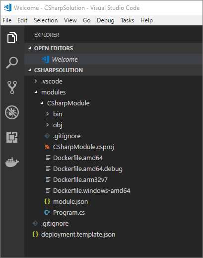
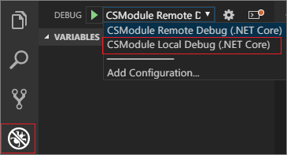
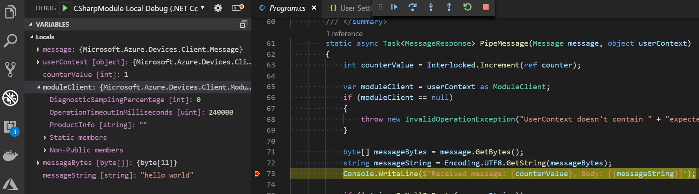
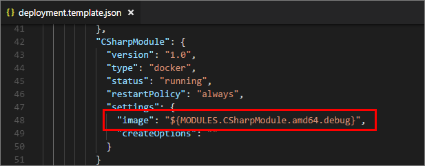
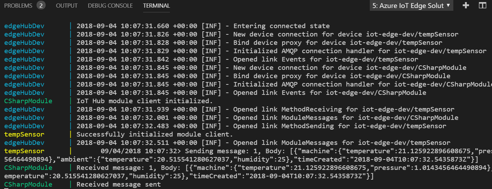
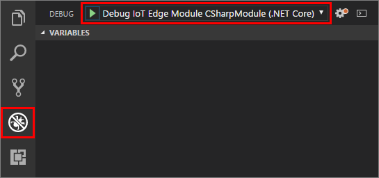

# Use Visual Studio Code to develop and debug C# modules for Azure IoT Edge

You can turn your business logic into modules for Azure IoT Edge. This article shows you how to use Visual Studio Code (VS Code) as the main tool to develop and debug C# modules.

## Prerequisites

You can use a computer or a virtual machine running Windows, macOS, or Linux as your development machine. An IoT Edge device can be another physical device.

There are two ways to debug your C# module in VS Code. One way is to attach a process in a module container, another way is to launch the module code in debug mode. If you aren't familiar with the debugging capabilities of Visual Studio Code, read about [Debugging](https://code.visualstudio.com/Docs/editor/debugging).

Please install Visual Studio Code first, then add the following necessary extensions:
* [Visual Studio Code](https://code.visualstudio.com/) 
* [Azure IoT Edge extension](https://marketplace.visualstudio.com/items?itemName=vsciot-vscode.azure-iot-edge) 
* [C# extension](https://marketplace.visualstudio.com/items?itemName=ms-vscode.csharp) 
* [Docker extension](https://marketplace.visualstudio.com/items?itemName=PeterJausovec.vscode-docker)

To create a module, you need .NET to build the project folder, Docker to build the module image, and a container registry to hold the module image:
* [.NET Core 2.1 SDK](https://www.microsoft.com/net/download).
* [Docker Community Edition](https://docs.docker.com/install/) on your development machine. 
* [Azure Container Registry](https://docs.microsoft.com/azure/container-registry/) or [Docker Hub](https://docs.docker.com/docker-hub/repos/#viewing-repository-tags)
   * You can use a local Docker registry for prototype and testing purposes instead of a cloud registry. 

To setup local development environment to debug, run and test your IoT Edge solution, you need [Azure IoT EdgeHub Dev Tool](https://pypi.org/project/iotedgehubdev/). Install [Python (2.7/3.6) and Pip](https://www.python.org/). Then install **iotedgehubdev** by running below command in your terminal.

   ```cmd
   pip install --upgrade iotedgehubdev
   ```

To test your module on a device, you need an active IoT hub with at least one IoT Edge device ID created. If you are running IoT Edge daemon on development machine, you might need to stop EdgeHub and EdgeAgent before you move to next step. 

## Create a new solution with C# module

Take these steps to create an IoT Edge module based on .NET Core 2.1 using Visual Studio Code and the Azure IoT Edge extension. First you create a solution, and then you generate the first module in that solution. Each solution can contain more than one module. 

1. In Visual Studio Code, select **View** > **Integrated Terminal**.
2. Select **View** > **Command Palette**. 
3. In the command palette, enter and run the command **Azure IoT Edge: New IoT Edge Solution**.

   

4. Browse to the folder where you want to create the new solution. Choose **Select folder**. 
5. Enter a name for your solution. 
6. Select **C# Module** as the template for the first module in the solution.
7. Enter a name for your module. Choose a name that's unique within your container registry. 
8. Provide the name of the module's image repository. VS Code autopopulates the module name with **localhost:5000**. Replace it with your own registry information. If you use a local Docker registry for testing, then **localhost** is fine. If you use Azure Container Registry, then use the login server from your registry's settings. The login server looks like **\<registry name\>.azurecr.io**. Only replace the localhost part of the string, don't delete your module name.

   

VS Code takes the information you provided, creates an IoT Edge solution, and then loads it in a new window.

   

There are four items within the solution: 

* A **.vscode** folder contains debug configurations.
* A **modules** folder has subfolders for each module. At this point, you only have one. But you can add more in the command palette with the command **Azure IoT Edge: Add IoT Edge Module**. 
* An **.env** file lists your environment variables. If Azure Container Registry is your registry, you'll have an Azure Container Registry username and password in it. 

   >[!NOTE]
   >The environment file is only created if you provide an image repository for the module. If you accepted the localhost defaults to test and debug locally, then you don't need to declare environment variables. 

* A **deployment.template.json** file lists your new module along with a sample **tempSensor** module that simulates data you can use for testing. For more information about how deployment manifests work, see [Learn how to use deployment manifests to deploy modules and establish routes](module-composition.md). 

## Develop your module

The default C# module code that comes with the solution is located at **modules** > ** [your module name] ** > **Program.cs**. The module and the deployment.template.json file are set up so that you can build the solution, push it to your container registry, and deploy it to a device to start testing without touching any code. The module is built to simply take input from a source (in this case, the tempSensor module that simulates data) and pipe it to IoT Hub. 

When you're ready to customize the C# template with your own code, use the [Azure IoT Hub SDKs](../iot-hub/iot-hub-devguide-sdks.md) to build modules that address the key needs for IoT solutions such as security, device management, and reliability. 

The C# support in VS Code is optimized for cross-platform .NET Core development. Learn more about [how to work with C# in VS Code](https://code.visualstudio.com/docs/languages/csharp).

## Launch and debug module code without container

The IoT Edge C# module is a .Net Core application. And it depends on Azure IoT C# Device SDK. Because the IoT C# module requires the environment settings to start and run, in the default module code you initialize a **ModuleClient** with environment settings and input name. You also need to send or route messages to the input channels. Your default C# module only contains one input channel and the name is **input1**.

### Setup IoT Edge simulator for single module app

1. To setup and start the simulator, in VS Code command palette, type and select **Azure IoT Edge: Start IoT Edge Hub Simulator for Single Module**. You also need to specify the input names for your single module application, type **input1** and press Enter. The command will trigger **iotedgehubdev** CLI and start IoT Edge simulator and a testing utility module container. You can see the outputs below in the integrated terminal if the simulator has been started in single module mode successfully. You can also see a `curl` command to help send message through. You will use it later.

   

   You can move to Docker Explorer and see the module running status.

   

   The **edgeHubDev** container is the core of the local IoT Edge simulator. It can run on your development machine without IoT Edge security daemon and provide environment settings for your native module app or module containers. The **input** container exposed restAPIs to help bridge messages to target input channel on your module.

2. In VS Code command palette, type and select **Azure IoT Edge: Set Module Credentials to User Settings** to set the module environment settings into `azure-iot-edge.EdgeHubConnectionString` and `azure-iot-edge.EdgeModuleCACertificateFile` in user settings. You can find these environment settings are referenced in **.vscode** > **launch.json** and [VS Code user settings](https://code.visualstudio.com/docs/getstarted/settings).

### Build module app and debug in launch mode

1. In integrated terminal, change directory to **CSharpModule** folder, run the following command to build .Net Core application.

    ```cmd
    dotnet build
    ```

2. Navigate to `program.cs`. Add a breakpoint in this file.

3. Navigate to VS Code debug view: View > Debug. Select the debug configuration **ModuleName Local Debug (.NET Core)** from the dropdown. 

  

4. Click **Start Debugging** or press **F5**. You will start the debug session.

   > [!NOTE]
   > If your .Net Core `TargetFramework` is not consistent with your program path in `launch.json`. You need to manually update the program path in `launch.json` to respect the `TargetFramework` in your .csproj file. So that VS Code can successfully launch this program.

5. In VS Code integrated terminal, run the following command to send a **Hello World** message to your module. This is the command showed in previous steps when setup IoT Edge simulator successfully.

    ```cmd
    curl --header "Content-Type: application/json" --request POST --data '{"inputName": "input1","data":"hello world"}' http://localhost:53000/api/v1/messages
    ```

   > [!NOTE]
   > If you are using Windows, making sure the shell of your VS Code integrated terminal is **Git Bash** or **WSL Bash**. You cannot run `curl` command in PowerShell or Command Prompt. 
   
   > [!TIP]
   > You can also use [PostMan](https://www.getpostman.com/) or other API tools to send messages through instead of `curl`.

6. In VS Code Debug view, you'll see the variables in the left panel. 

    

7. To stop debugging session, click the Stop button or press **Shift + F5**. And in VS Code command palette, type and select **Azure IoT Edge: Stop IoT Edge Simulator** stop and clean the simulator.

## Build module container for debugging and debug in attach mode

Your default solution contains two modules, one is a simulated temperature sensor module and the other is the C# pipe module. The simulated temperature sensor keeps sending messages to the C# pipe module, then the messages are piped to IoT Hub. In the module folder you created, there are several Docker files for different container types. Use any of these files that end with the extension **.debug** to build your module for testing. Currently, C# modules support debugging only in Linux amd64 containers in attach mode.

### Setup IoT Edge simulator for IoT Edge solution

In your development machine, you can start IoT Edge simulator instead of installing the IoT Edge security daemon to run your IoT Edge solution. 

1. In device explorer on the left side, right-click on your IoT Edge device ID, select **Setup IoT Edge Simulator** to start the simulator with the device connection string.

2. You can see the IoT Edge Simulator has been successfully setup in integrated terminal.

### Build and run container for debugging and debug in attach mode

1. In VS Code, navigate to the `deployment.template.json` file. Update your C# module image URL by adding **.debug** to the end.

   

2. Navigate to `program.cs`. Add a breakpoint in this file.

3. In the VS Code file explorer, select the `deployment.template.json` file for your solution, in the context-menu, click **Build and Run IoT Edge solution in Simulator**. You can watch all the module container logs in the same window. You can also navigate to Docker Explorer to watch container status.

   

4. Navigate to the VS Code debug view. Select the debug configuration file for your module. The debug option name should be similar to **ModuleName Remote Debug (.NET Core)**

   

5. Select **Start Debugging** or select **F5**. Select the process to attach to.

6. In VS Code Debug view, you'll see the variables in the left panel.

7. To stop debugging session, click the Stop button or press **Shift + F5**. And in VS Code command palette, type and select **Azure IoT Edge: Stop IoT Edge Simulator**.

    > [!NOTE]
    > This example shows how to debug .NET Core IoT Edge modules on containers. It's based on the debug version of `Dockerfile.debug`, which includes the Visual Studio .NET Core command-line debugger (VSDBG) in your container image while building it. After you debug your C# modules, we recommend that you directly use or customize `Dockerfile` without VSDBG for production-ready IoT Edge modules.


## Next steps

After you've built your module, learn how to [deploy Azure IoT Edge modules from Visual Studio Code](how-to-deploy-modules-vscode.md).

To develop modules for your IoT Edge devices, [Understand and use Azure IoT Hub SDKs](../iot-hub/iot-hub-devguide-sdks.md).
