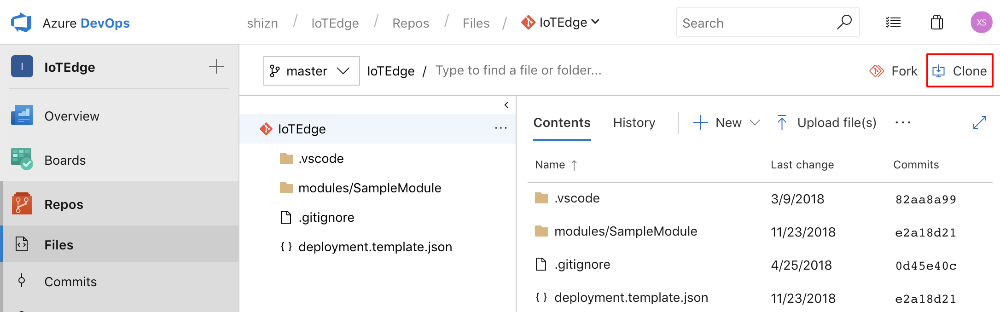
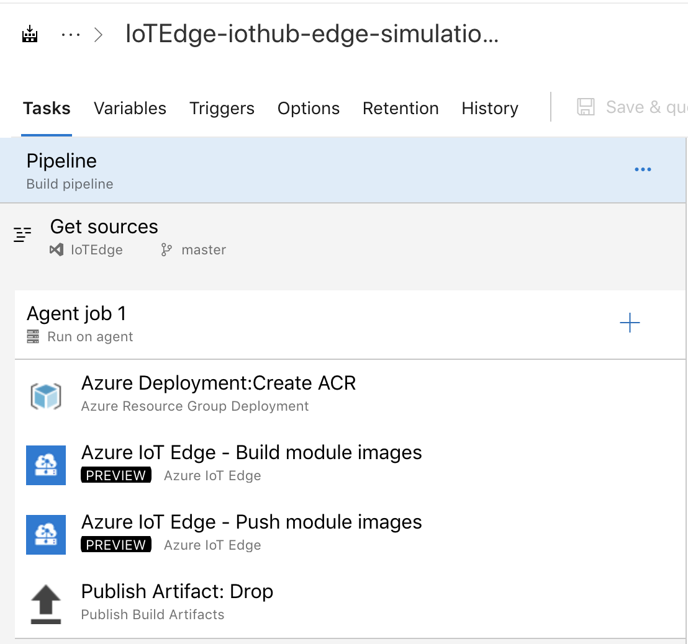

# Create a CI/CD pipeline for IoT Edge with Azure DevOps Projects (Preview)

Configure continuous integration (CI) and continuous delivery (CD) for your IoT Edge application with DevOps Projects. DevOps Projects simplifies the initial configuration of a build and release pipeline in Azure Pipelines.

If you don't have an active Azure subscription, create a [free account](https://azure.microsoft.com/free) before you begin.

## Sign in to the Azure portal

DevOps Projects creates a CI/CD pipeline in Azure DevOps. You can create a new Azure DevOps organization or use an  existing organization. DevOps Projects also creates Azure resources in the Azure subscription of your choice.

1. Sign in to the [Microsoft Azure portal](https://portal.azure.com).

1. In the left pane, select **Create a resource** icon in the left navigation bar, and then search for **DevOps Projects**.  

1.  Select **Create**.

## Select a sample application and Azure service

1. Your Azure IoT Edge module(s) can be written in [C#](tutorial-csharp-module.md), [Node.js](tutorial-node-module.md), [Python](tutorial-python-module.md), [C](tutorial-c-module.md) and [Java](tutorial-java-module.md). Select your preferred language to start a new application. Correspondingly, you can select **.NET**, **Node.js**, **Python**, **C**, or **Java**, and then click **Next**.

    

2. Select **Simple IoT (Preview)**, and then click **Next**.

    

3. Select **IoT Edge**, and then click **Next**.

    

## Configure Azure DevOps and an Azure subscription

1. Create a new free Azure DevOps organization or choose an existing organization.

	a. Choose a name for your project. 

	b. Select your Azure subscription and location, choose a name for your application, and then select **Done**.  

    

1. After a few minutes, the DevOps Projects dashboard is displayed in the Azure portal. A sample IoT Edge application is set up in a repository in your Azure DevOps organization, a build is executed, and your application is deployed to the IoT Edge device. This dashboard provides visibility into your code repository, the  CI/CD pipeline, and your application in Azure.

    

## Commit code changes and execute CI/CD

DevOps Projects created a Git repository in Azure Repos or GitHub. To view the repository and make code changes to your application, do the following steps:

1. On the left of the DevOps Projects dashboard, select the link for your **master** branch.  
This link opens a view to the newly created Git repository.

1. To view the repository clone URL, select **Clone** from the top right of the browser. You can clone your Git repository in VS Code or other you preferred tools. In the next few steps, you use the web browser to make and commit code changes directly to the master branch.

    

1. On the left of the browser, go to the **modules/FilterModule/module.json** file.

1. Select **Edit**, and then make a change to `"version"` under the `"tag"`. For example, you can update it to `"version": "${BUILD_BUILDID}"` to use [Azure DevOps build variables](https://docs.microsoft.com/azure/devops/pipelines/build/variables?view=vsts#build-variables) as a part of your Azure IoT Edge module image tag.

    

1. Select **Commit**, and then save your changes.

1. In your browser, go to the Azure DevOps Project dashboard.  You should now see a build is in progress. The changes you made are automatically built and deployed via a CI/CD pipeline.

    

## Examine the CI/CD pipeline

In the previous step, Azure DevOps Projects automatically configured a full CI/CD pipeline for your IoT Edge application. Explore and customize the pipeline as needed. Take the following steps to familiarize yourself with the Azure DevOps build and release pipelines.

1. At the top of the DevOps Projects dashboard, select **Build Pipelines**.  
This link opens a browser tab and the Azure DevOps build pipeline for your new project.

1. Select **Edit**.

    

1. In this pane, you can examine the various tasks for your build pipeline. The build performs various tasks, such as fetching sources from the Git repository, building IoT Edge module images, pushing IoT Edge modules, and publishing outputs used that are used for deployments. To know more about Azure IoT Edge tasks for CI, you can visit [Configure Azure Pipelines for continuous integration](https://docs.microsoft.com/azure/iot-edge/how-to-ci-cd#configure-azure-pipelines-for-continuous-integration).

    

1. At the top of the build pipeline, select the build pipeline name.

1. Change the name of your build pipeline to something more descriptive, select **Save & queue**, and then select **Save**.

1. Under your build pipeline name, select **History**.   
In the **History** pane, you see an audit trail of your recent changes for the build.  Azure Pipelines keeps track of any changes that are made to the build pipeline, and it allows you to compare versions.

1. Select **Triggers**. DevOps Projects automatically created a CI trigger, and every commit to the repository starts a new build.  You can optionally choose to include or exclude branches from the CI process.

1. Select **Retention**. Depending on your scenario, you can specify policies to keep or remove a certain number of builds.

1. Select **Release** under **Pipelines**. DevOps Projects creates a release pipeline to manage deployments to Azure IoT Edge.

    

1. Select **Edit**. The release pipeline contains a pipeline, which defines the release process.  

1. Under **Artifacts**, select **Drop**. The build pipeline you examined in the previous steps produces the output used for the artifact. 

1. Next to the **Drop** icon, select the **Continuous deployment trigger**.  
This release pipeline has an enabled CD trigger, which runs a deployment every time there is a new build artifact available. Optionally, you can disable the trigger so that your deployments require manual execution.  

1. On the left, select **Tasks**. The tasks are the activities that your deployment process performs. In this example, a task was created to deploy your module images to Azure IoT Edge. To know more about Azure IoT Edge tasks for CD, you can visit [Configure Azure Pipelines for continuous deployment](https://docs.microsoft.com/azure/iot-edge/how-to-ci-cd#configure-azure-pipelines-for-continuous-deployment).

    

1. On the right, select **View releases**. This view shows a history of releases.

1. Select the ellipsis (...) next to one of your releases, and then select **Open**.  
There are several menus to explore, such as a release summary, associated work items, and tests.

1. Select **Commits**. This view shows code commits that are associated with the specific deployment. 

1. Select **Logs**. The logs contain useful information about the deployment process. They can be viewed both during and after deployments.

## Clean up resources

You can delete Azure App Service and other related resources that you created when you don't need them anymore. Use the **Delete** functionality on the DevOps Projects dashboard.

## Next steps
* Learn about the Tasks for Azure IoT Edge on Azure DevOps in [Continuous integration and continuous deployment to Azure IoT Edge](how-to-ci-cd.md)
* Understand the IoT Edge deployment in [Understand IoT Edge deployments for single devices or at scale](module-deployment-monitoring.md)
* Walk through the steps to create, update, or delete a deployment in [Deploy and monitor IoT Edge modules at scale](how-to-deploy-monitor.md).
