# Create a CI/CD pipeline for IoT Edge with Azure DevOps Projects

Configure continuous integration (CI) and continuous delivery (CD) for your IoT Edge application with DevOps Projects. DevOps Projects simplifies the initial configuration of a build and release pipeline in Azure Pipelines.

If you don't have an active Azure subscription, create a [free account](https://azure.microsoft.com/free) before you begin.

## Sign in to the Azure portal

DevOps Projects creates a CI/CD pipeline in Azure DevOps. You can create a new Azure DevOps organization or use an existing organization. DevOps Projects also creates Azure resources in the Azure subscription of your choice.

1. Sign in to the [Microsoft Azure portal](https://portal.azure.com).

1. In the left pane, select **Create a resource**, and then search for **DevOps Projects**.  

1.  Select **Create**.

## Create a new application pipeline 

1. Your Azure IoT Edge module(s) can be written in [C#](tutorial-csharp-module.md), [Node.js](tutorial-node-module.md), [Python](tutorial-python-module.md), [C](tutorial-c-module.md) and [Java](tutorial-java-module.md). Select your preferred language to start a new application: **.NET**, **Node.js**, **Python**, **C**, or **Java**. Select **Next** to continue.

   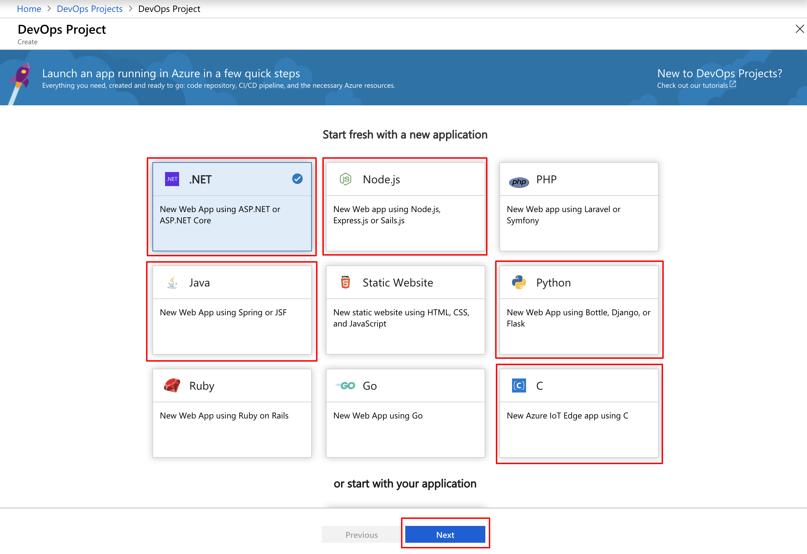

2. Select **Simple IoT** as your application framework, and then select **Next**.

   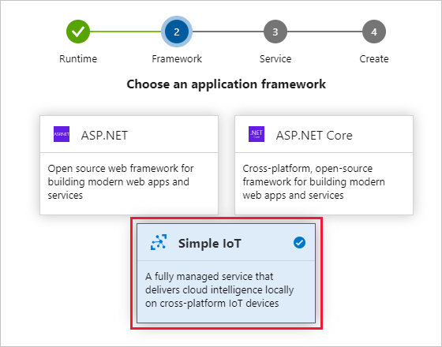

3. Select **IoT Edge** as the Azure service that deploys your application, and then select **Next**.

   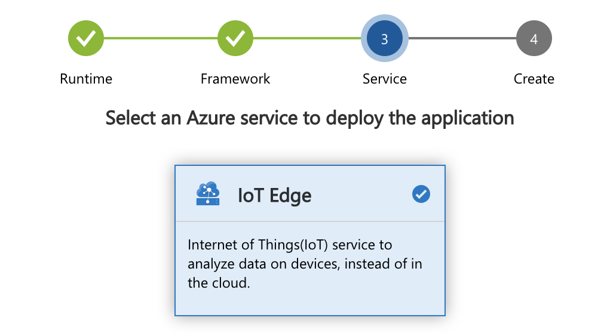

4. Create a new free Azure DevOps organization or choose an existing organization.

   1. Provide a name for your project. 

   2. Select your Azure DevOps organization. If you don't have an existing organization, select **Additional settings** to create a new one. 

   3. Select your Azure subscription.

   4. Use the IoT Hub name generated by your project name, or provide your own.

   5. Select **Additional settings** to configure the Azure resources that DevOps Projects creates on your behalf.

   6. Select **Done** to finish creating your project. 

   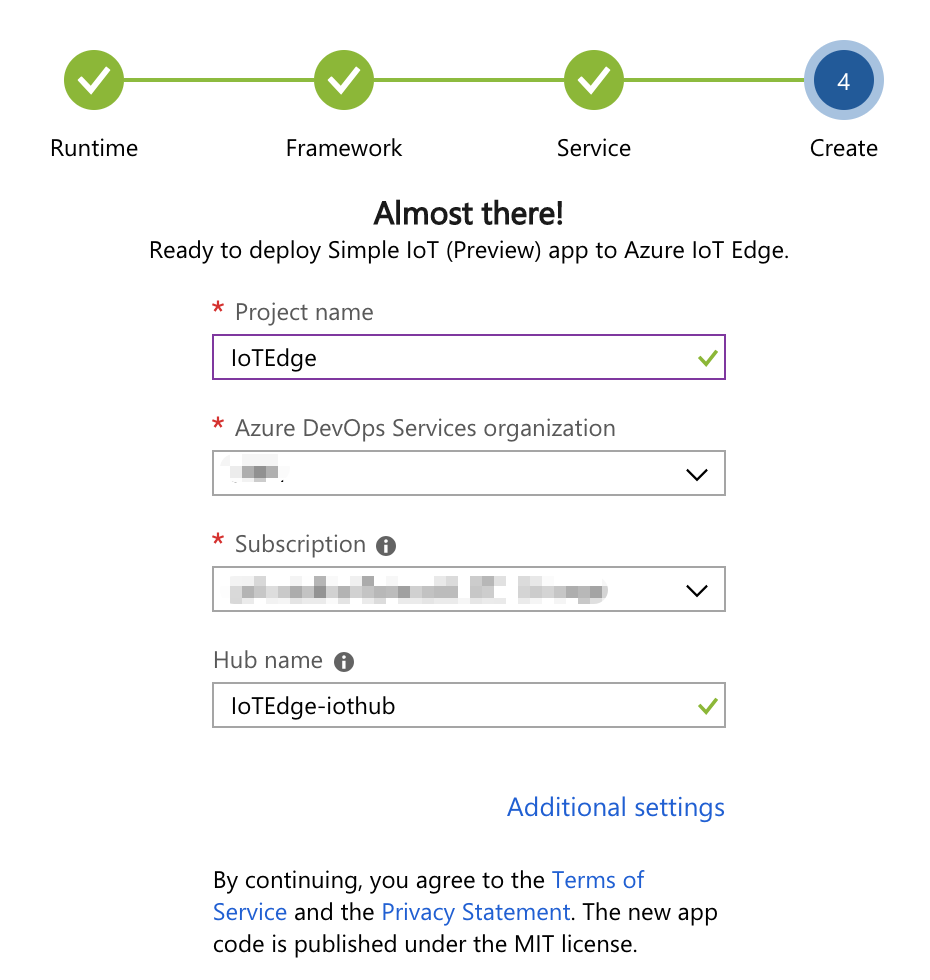

After a few minutes, the DevOps Projects dashboard is displayed in the Azure portal. Select your project name to see the progress. You may need to refresh the page. A sample IoT Edge application is set up in a repository in your Azure DevOps organization, a build is executed, and your application is deployed to the IoT Edge device. This dashboard provides visibility into your code repository, the  CI/CD pipeline, and your application in Azure.

   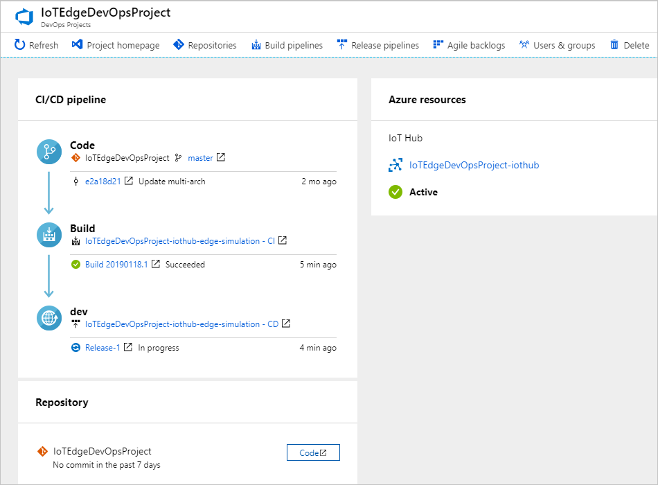

## Commit code changes and execute CI/CD

DevOps Projects created a Git repository for your project in Azure Repos. In this section, you view the repository and make code changes to your application.

1. To navigate to the repo created for your project, select **Repositories** in the menu of your project dashboard.  

   

2. The following steps walk through using the web browser to make code changes. If you want to clone your repository locally instead, select **Clone** from the top right of the window. Use the provided URL to clone your Git repository in Visual Studio Code or your preferred development tool. 

3. The repository already contains code for a module called **SampleModule** based on the application language that you chose in the creation process. Open the **modules/SampleModule/module.json** file.

   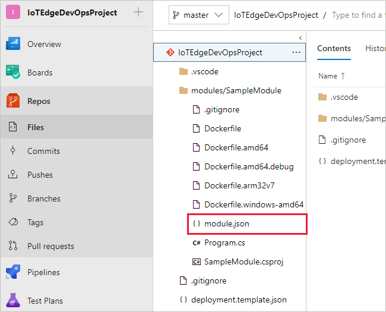

4. Select **Edit**, and then make a change to `"version"` under the `"tag"`. For example, you can update it to `"version": "${BUILD_BUILDID}"` to use [Azure DevOps build variables](https://docs.microsoft.com/azure/devops/pipelines/build/variables?view=vsts#build-variables) as a part of your Azure IoT Edge module image tag.

   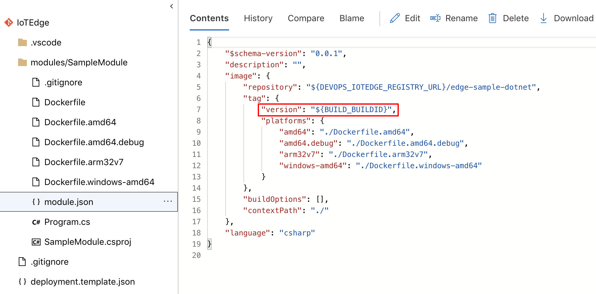

5. Select **Commit**, and then save your changes.

6. In your browser, go back to your DevOps Projects dashboard in the Azure portal. You should now see a build is in progress. The changes you made are automatically built and deployed via a CI/CD pipeline.

    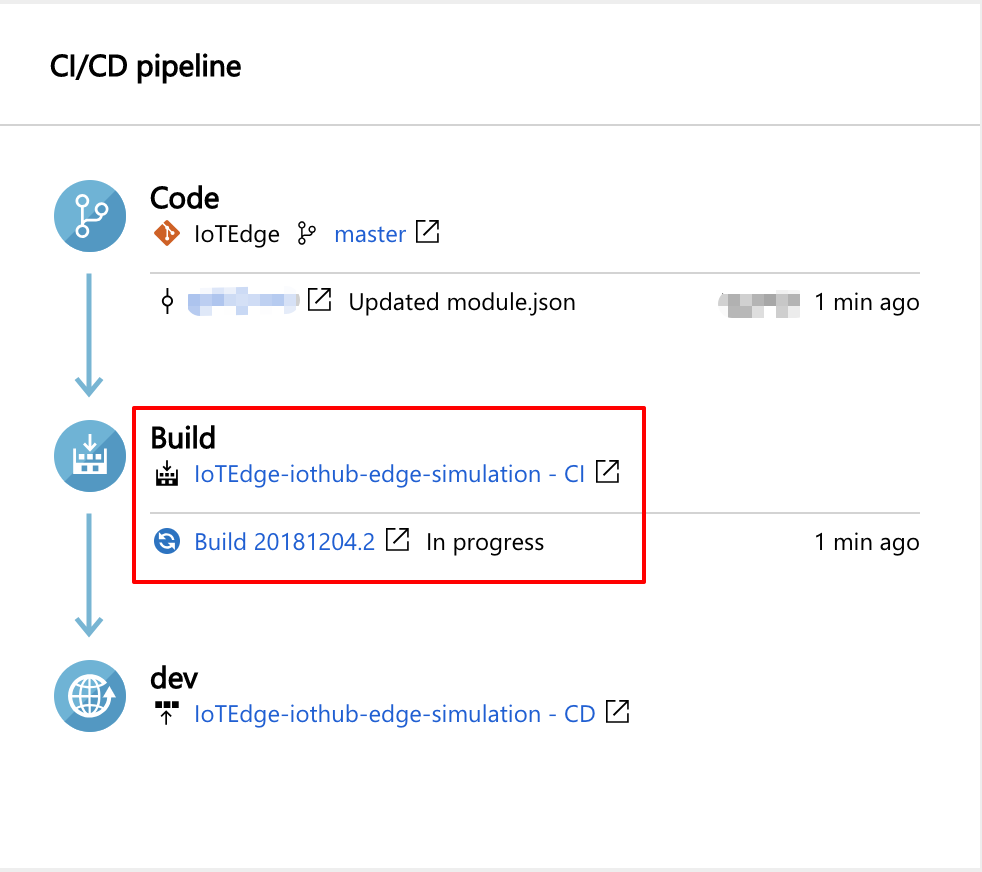

## Examine the CI/CD pipeline

In the previous sections, Azure DevOps Projects automatically configured a full CI/CD pipeline for your IoT Edge application. Then you tested that build pipeline by committing changes to one of the files. Now, explore and customize the pipeline as needed. Take the following steps to familiarize yourself with the Azure DevOps build and release pipelines.

1. To view the build pipelines in your DevOps project, select **Build Pipelines** in the menu of your project dashboard. This link opens a browser tab and the Azure DevOps build pipeline for your new project.

   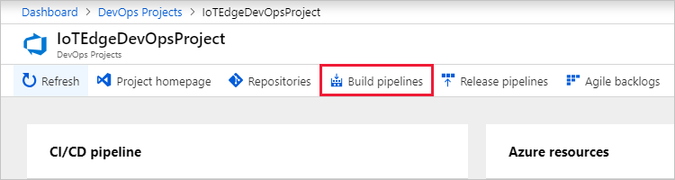

2. Select **Edit**.

    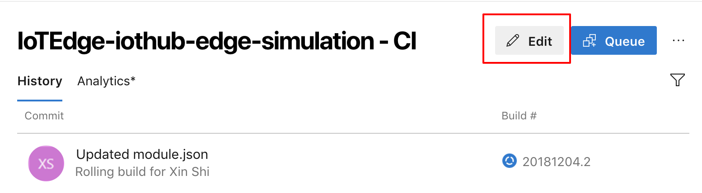

3. In the panel that opens, you can examine the tasks that occur when your build pipeline runs. The build pipeline performs various tasks, such as fetching sources from the Git repository, building IoT Edge module images, pushing IoT Edge modules to a container registry, and publishing outputs that are used for deployments. To learn more about Azure IoT Edge tasks in Azure DevOps, see [Configure Azure Pipelines for continuous integration](how-to-ci-cd.md#configure-continuous-integration).

4. Select the **Pipeline** header at the top of the build pipeline to open the pipeline details. Change the name of your build pipeline to something more descriptive.

   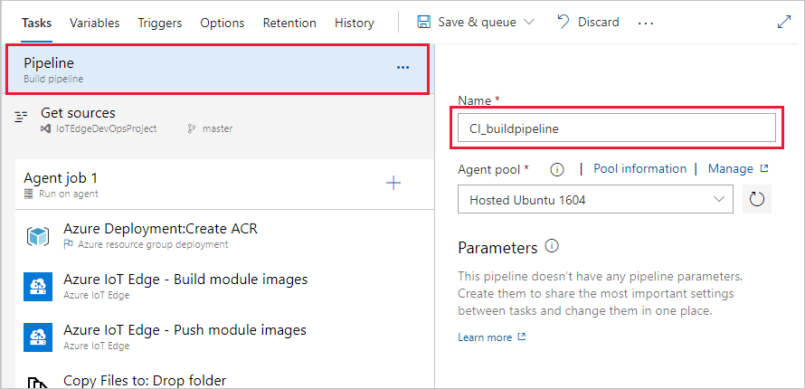

5. Select **Save & queue**, and then select **Save**.

6. In the menu for your build pipeline, select **Triggers** in the menu. DevOps Projects automatically created a CI trigger, and every commit to the repository starts a new build.  You can optionally choose to include or exclude branches from the CI process.

7. Select **Retention**. Depending on your scenario, you can specify policies to keep or remove a certain number of builds.

8. Select **History**. The history panel contains an audit trail of recent changes to the build. Azure Pipelines keeps track of any changes that are made to the build pipeline, and it allows you to compare versions.

9. When you're done exploring the build pipeline, navigate to the corresponding release pipeline. Select **Releases** under **Pipelines**, then select **Edit** to view the pipeline details.

    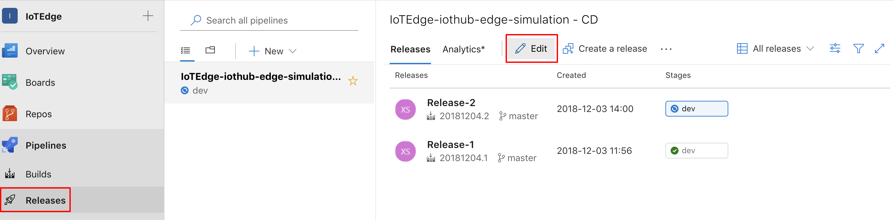

10. Under **Artifacts**, select **Drop**. The source that this artifact watches is the output of the build pipeline you examined in the previous steps. 

11. Next to the **Drop** icon, select the **Continuous deployment trigger** that looks like a lightning bolt. This release pipeline has enabled the trigger, which runs a deployment every time there is a new build artifact available. Optionally, you can disable the trigger so that your deployments require manual execution.  

12. In the menu for your release pipeline, select **Tasks** then choose the **dev** stage from the dropdown list. DevOps Projects created a release stage for you that creates an IoT hub, creates an IoT Edge device in that hub, deploys the sample module from the build pipeline, and provisions a virtual machine to run as your IoT Edge device. To learn more about Azure IoT Edge tasks for CD, see [Configure Azure Pipelines for continuous deployment](how-to-ci-cd.md#configure-continuous-deployment).

    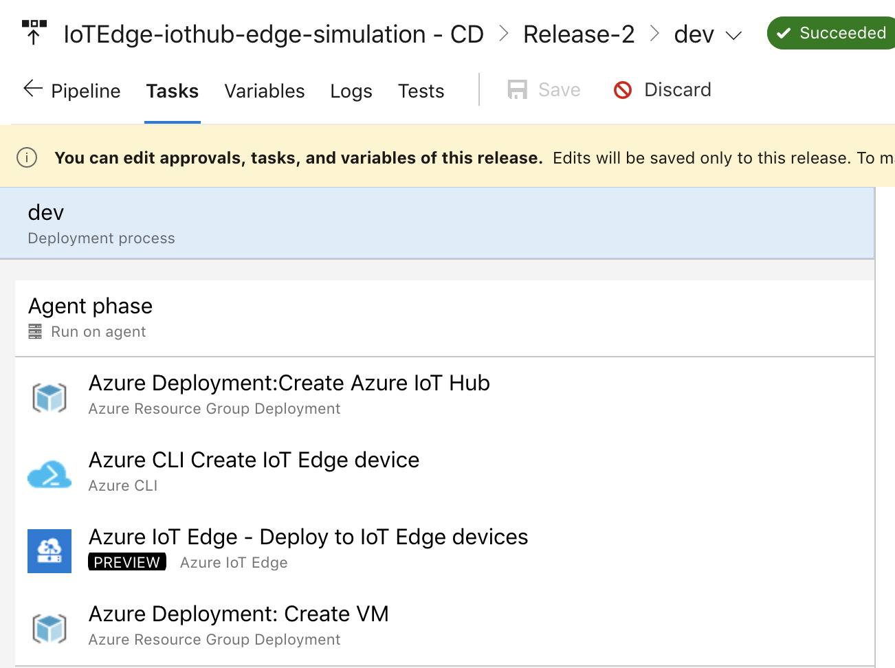

13. On the right, select **View releases**. This view shows a history of releases.

14. Select the name of a release to view more information about it.

## Clean up resources

You can delete Azure App Service and other related resources that you created when you don't need them anymore. Use the **Delete** functionality on the DevOps Projects dashboard.

## Next steps
* Learn about the Tasks for Azure IoT Edge on Azure DevOps in [Continuous integration and continuous deployment to Azure IoT Edge](how-to-ci-cd.md)
* Understand the IoT Edge deployment in [Understand IoT Edge deployments for single devices or at scale](module-deployment-monitoring.md)
* Walk through the steps to create, update, or delete a deployment in [Deploy and monitor IoT Edge modules at scale](how-to-deploy-monitor.md).
