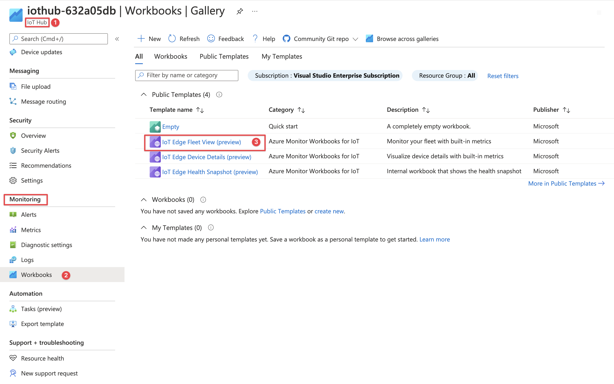
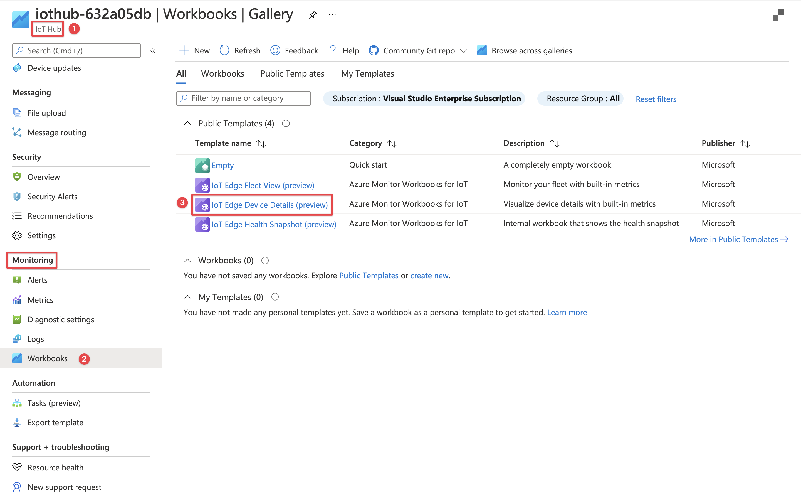
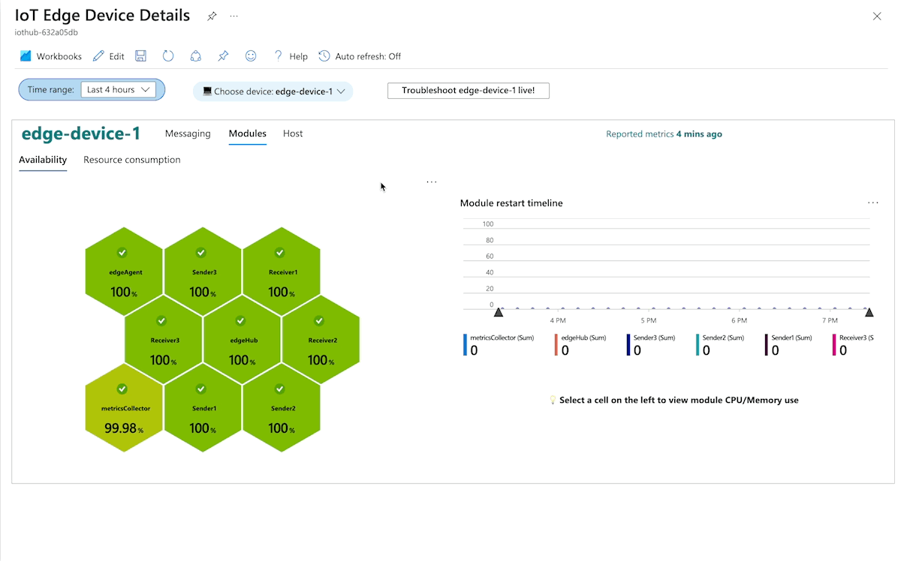
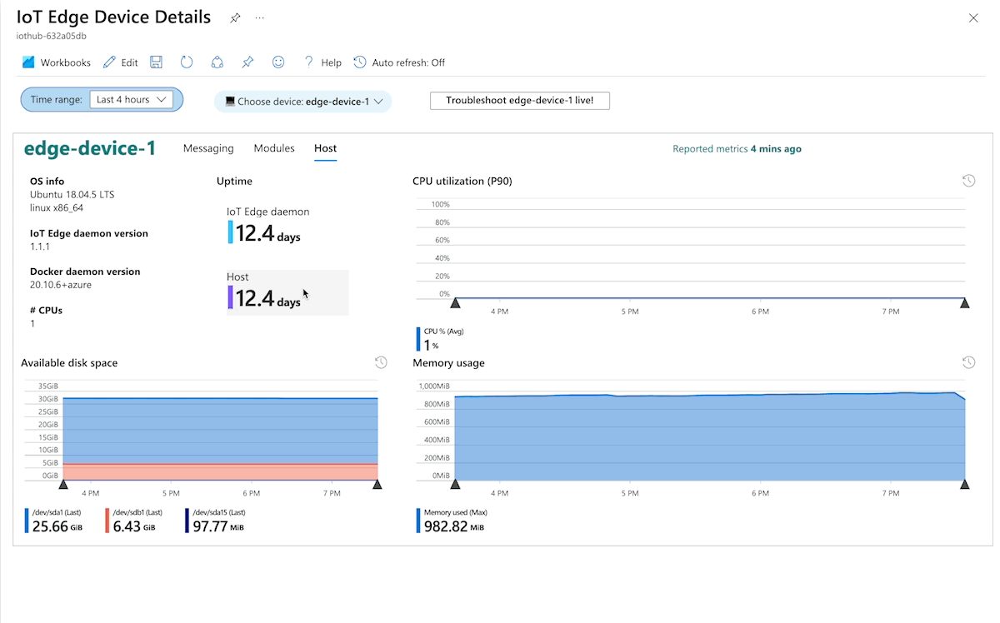
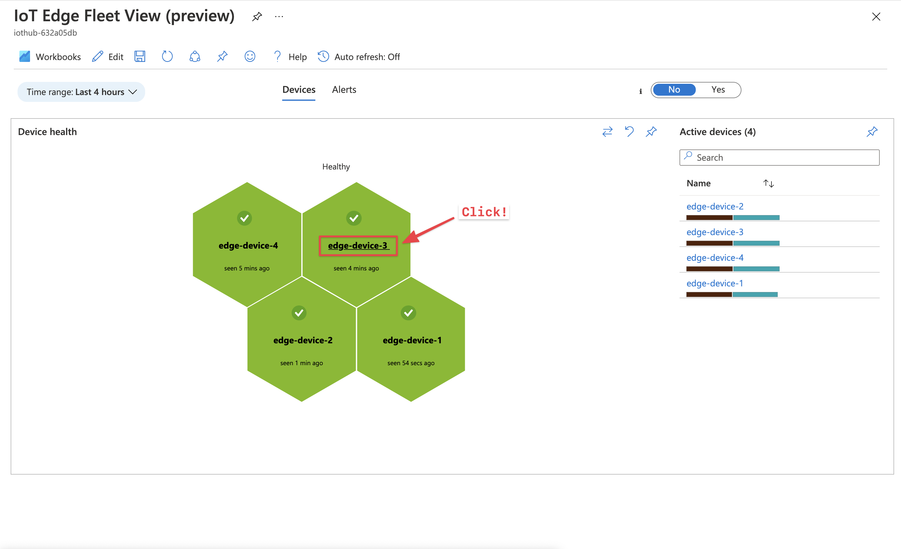
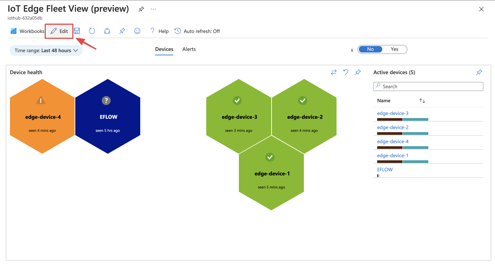

# Explore curated visualizations

[!INCLUDE [iot-edge-version-all-supported](../../includes/iot-edge-version-all-supported.md)]

You can visualize and explore metrics collected from the edge device right in the Azure portal using Azure Monitor Workbooks. Curated monitoring workbooks for IoT Edge devices are provided in the form of public templates you can access in the **IoT Hub** blade from **Workbooks** page (under Monitoring section).

The curated workbooks use [built-in metrics](how-to-access-built-in-metrics.md) from the IoT Edge runtime. These views don't need any metrics instrumentation from the workload modules. 

See the details of the curated workbooks below.

## IoT Edge Fleet View workbook

Use the tabs below to explore the capabilities of this Workbook.

# [How to access](#tab/how-to-access)

||
|-|
| Access the workbook from the **IoT Hub** portal blade (not Log Analytics). Click the **Fleet View** public template from the **Workbooks** page (under **Monitoring**). |

# [Fleet view](#tab/fleet-view)

||
|-|
| See the overview of active devices sending metrics in the **Fleet view**. This view shows devices associated with the current IoT Hub.  On the right, there's the device list with composite bars showing local and upstream messages sent. You can filter the list by device name and click on the device name link to see its detailed metrics.     On the left, the hive cell visualization shows which devices are healthy or unhealthy. It also shows when the device last sent metrics. Devices that haven't sent metrics for more than 30 minutes are shown in Blue. Click on the device name in the hive cell to see its health snapshot. Only the last 3 measurements from the device are considered when determining health. Using only recent data accounts for temporary spikes in the reported metrics.|

# [Alerts view](#tab/alerts-view)

||
|-|
| See the generated alerts from [pre-created alert rules](how-to-create-alerts.md) in this view. This view lets you see alerts from multiple IoT Hubs.    On the left, there's a list of alert severities with their count. On the right, there's map with total alerts per region.    Click on a severity row to see alerts details. The **Alert rule** link takes you to the alert context and the **Device** link opens the detailed metrics workbook. When opened from this view, the device details workbook is automatically adjusted to the time range around when the alert fired.|

---

## IoT Edge Device Details workbook

Use the tabs below to explore the capabilities of this Workbook.

# [How to access](#tab/how-to-access-details)

||
|-|
| Access the workbook from the **IoT Hub** portal blade (not Log Analytics). Click the **Device Details** public template from the **Workbooks** page (under **Monitoring**). 

# [Messaging](#tab/messaging)

||
|-|
| Messaging tab present three subsections - routing details, graph, and health. Drag and let go on any time chart to adjust the global time range to the selected range.    Routing details shows message flow between sending modules and receiving modules. It presents information such as message count, rate, and number of connected clients. Click on a sender or receiver to drill in further. Clicking a sender shows the latency trend chart experienced by the sender and number of messages it sent. Clicking a receiver shows the queue length trend for the receiver and number of messages it received.    The graph section shows a visual representation of message flow between modules. You can drag and zoom to adjust the graph.     The health section presents various metrics related to overall health of the messaging subsystem. You can progressively drill-in to details if any errors are noted.|

# [Modules](#tab/module)

||
|-|
| Modules tab presents metrics from the Edge Agent. It includes information such as:  * Module availability   * Per-module CPU and memory use   * CPU and memory use across all modules   * Modules restart count and restart timeline.|

# [Host](#tab/host)

||
|-|
| Host tab presents metrics from the Edge Agent. It includes information such as:  * Host component version information   * Uptime   * CPU, memory, and disk space use at the host-level|

# [Live logs](#tab/livelogs)

||
|-|
| This workbook integrates directly with the Portal-based troubleshooting experience. Clicking on the **Troubleshoot live** button takes you directly to the troubleshoot screen. Here, you can easily view logs pulled from the device, on-demand. The time range is automatically set to the workbook's time range, so you're immediately in temporal context. You can also restart any module from this experience.|

---

## IoT Edge Health Snapshot workbook

Use the tabs below to explore the capabilities of this Workbook.

# [How to access](#tab/how-to-access-health)

||
|-|
| The Health Snapshot workbook needs to accessed from the Fleet View workbook. The Fleet View workbook passes in some parameters required to initialize the health snapshot view. Click the device name link in the hive cell to see the health snapshot.|

# [Explore health snapshot](#tab/explore-health-snapshot)

||
|-|
| Out of the box, the health snapshot is made up of six signals. These signals are measured against configurable thresholds to determine if a device is healthy or not. The thresholds can be adjusted or new signals can be added by editing the workbook. Workbook customizations are discussed in the next section.|

---

## Customize workbooks

[Workbooks](../azure-monitor/visualize/workbooks-overview.md) are very customizable. You can edit the public templates to suit your requirements. All the visualizations are driven by resource-centric [KQL](https://aka.ms/kql) queries on the [InsightsMetrics](https://docs.microsoft.com/azure/azure-monitor/reference/tables/insightsmetrics) table. See the example below that edits the health thresholds.

# [How to enter editing mode](#tab/how-to-edit)

||
|-|
| Enter editing mode by clicking the **Edit** button on the top bar.|

# [Example: change health thresholds](#tab/change-health-thresholds)

||
|-|
| Curated workbooks make extensive use of workbook groups. You may need to click **Edit** on several nested groups before being able to view a visualization query. Save your changes as a new workbook. You can [share](../azure-monitor/visualize/workbooks-access-control.md) the saved workbook with your team or [deploy them programmatically](../azure-monitor/visualize/workbooks-automate.md) as part of your organization's resource deployments.|

---

