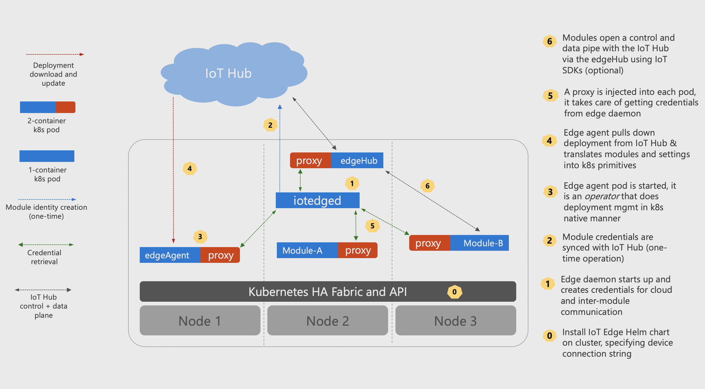

# How to install IoT Edge on Kubernetes (Preview)

IoT Edge can integrate with Kubernetes using it as a resilient, highly available infrastructure layer. It registers an IoT Edge *Custom Resource Definition* (CRD) with the Kubernetes API Server. Additionally, it provides an *Operator* (IoT Edge agent) that reconciles cloud-managed desired state with the local cluster state.

Module lifetime is managed by the Kubernetes scheduler, which maintains module availability and chooses their placement. IoT Edge manages the edge application platform running on top, continuously reconciling the desired state specified in IoT Hub with the state on the edge cluster. The edge application model is still the familiar model based on IoT Edge modules and routes. The IoT Edge agent operator performs *automatic* translation to the Kubernetes natives constructs like pods, deployments, services etc.

Here is a high-level architecture diagram:



Every component of the edge deployment is scoped to a Kubernetes namespace specific to the device, making it possible to share the same cluster resources among multiple edge devices and their deployments.

>[!NOTE]
>IoT Edge on Kubernetes is in [public preview](https://azure.microsoft.com/support/legal/preview-supplemental-terms/).

## Install locally for a quick test environment

### Prerequisites

* Kubernetes 1.10 or newer. If you don't have an existing cluster setup, you can use [Minikube](https://kubernetes.io/docs/setup/minikube/) for a local cluster environment.

* [Helm](https://helm.sh/docs/using_helm/#quickstart-guide), the Kubernetes package manager.

* [kubectl](https://kubernetes.io/docs/tasks/tools/install-kubectl/) for viewing and interacting with the cluster.

### Setup steps

1. Start **Minikube**

    ``` shell
    minikube start
    ```

1. Initialize the **Helm** server component (*tiller*) in your cluster

    ``` shell
    helm init
    ```

1. Add IoT Edge repo and update the helm installation

    ``` shell
    helm repo add edgek8s https://edgek8s.blob.core.windows.net/helm/
    helm repo update
    ```

1. [Create an IoT Hub](../iot-hub/iot-hub-create-through-portal.md), [register an IoT Edge device](how-to-register-device.md), and note its connection string.

1. Install iotedged and IoT Edge agent into your cluster

    ```shell
    helm install \
    --name k8s-edge1 \
    --set "deviceConnectionString=replace-with-device-connection-string" \
    edgek8s/edge-kubernetes
    ```

1. Open the Kubernetes dashboard in the browser

    ```shell
    minikube dashboard
    ```

    Under the cluster namespaces, you will see one for the IoT Edge device following the convention *msiot-\<iothub-name>-\<edgedevice-name>*. The IoT Edge agent and iotedged pods should be up and running in this namespace.

1. Add a simulated temperature sensor module using the steps in the [Deploy a module](quickstart-linux.md#deploy-a-module) section of the quickstart. IoT Edge module management is done from the IoT Hub portal just like any other IoT Edge device. Making local changes to module configuration via Kubernetes tools is not recommended as they might get overwritten.

1. In a few seconds, refreshing the **Pods** page under the edge device namespace in the dashboard will list the IoT Edge hub and simulated sensor pods as running with the IoT Edge hub pod ingesting data into IoT Hub.

## Clean up resources

To remove all resources created by the edge deployment, use the following command with the name used in step 5 of the previous section.

``` shell
helm delete --purge k8s-edge1
```

## Next steps

### Deploy as a highly available edge gateway

The edge device in a Kubernetes cluster can be used as an IoT gateway for downstream devices. It can be configured to be resilient to node failure thus providing high availability to edge deployments. See this [detailed walkthrough](https://github.com/Azure-Samples/iotedge-gateway-on-kubernetes) to use IoT Edge in this scenario.
