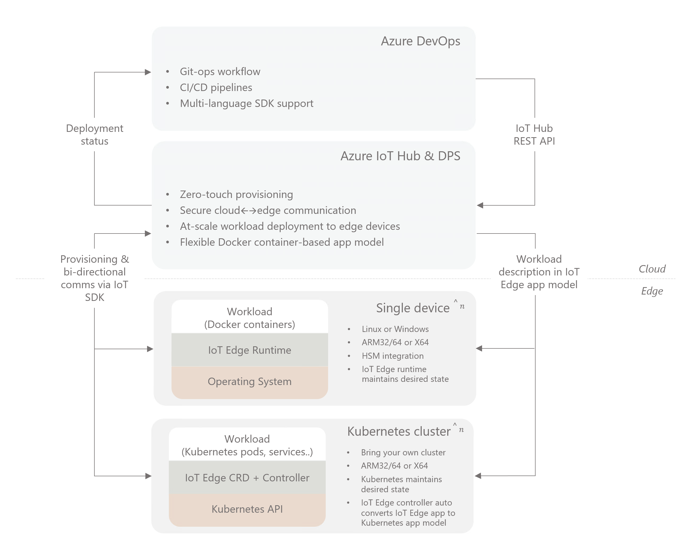
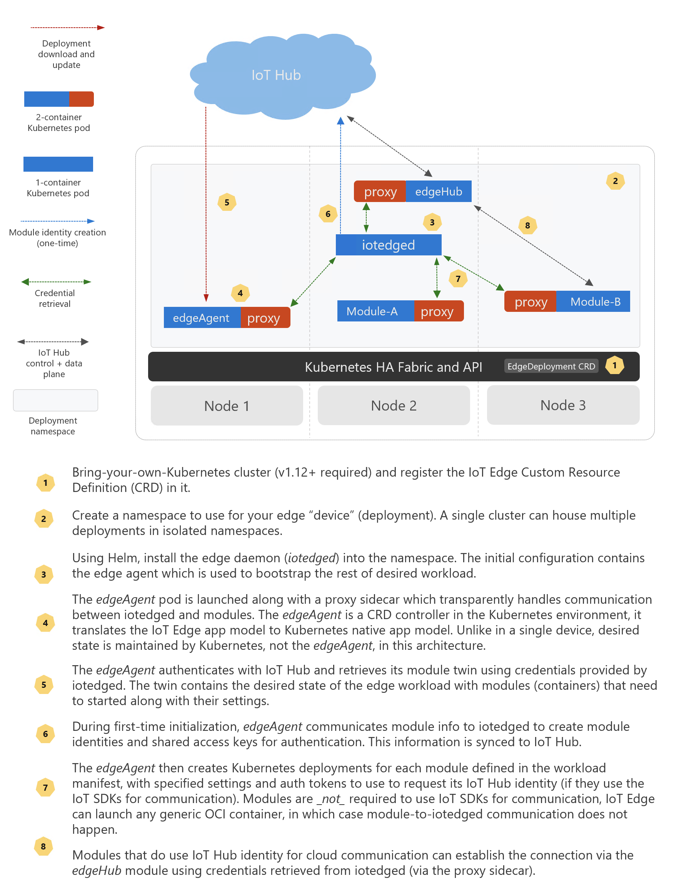

# How to install IoT Edge on Kubernetes (Preview)

IoT Edge can integrate with Kubernetes using it as a resilient, highly available infrastructure layer. Here is where this support fits in a high level IoT Edge solution:

>[!TIP]
>A good mental model for this integration is to think of Kubernetes as another operating environment IoT Edge applications can run on in addition to Linux and Windows.

## Architecture 
On Kubernetes, IoT Edge provides *Custom Resource Definition* (CRD) for edge workload deployments. IoT Edge Agent assumes the role of a  *CRD controller* that reconciles cloud-managed desired state with the local cluster state.

Module lifetime is managed by the Kubernetes scheduler, which maintains module availability and chooses their placement. IoT Edge manages the edge application platform running on top, continuously reconciling the desired state specified in IoT Hub with the state on the edge cluster. The application model is still the familiar model based on IoT Edge modules and routes. The IoT Edge Agent controller performs *automatic* translation IoT Edge's application model to the Kubernetes native constructs like pods, deployments, services etc.

Here is a high-level architecture diagram:

Every component of the edge deployment is scoped to a Kubernetes namespace specific to the device, making it possible to share the same cluster resources among multiple edge devices and their deployments.

>[!NOTE]
>IoT Edge on Kubernetes is in [public preview](https://azure.microsoft.com/support/legal/preview-supplemental-terms/).

## Tutorials and references 

Please see the [IoT Edge on Kubernetes preview docs mini-site](https://aka.ms/edgek8sdoc) for more information, including in-depth tutorials and references.
