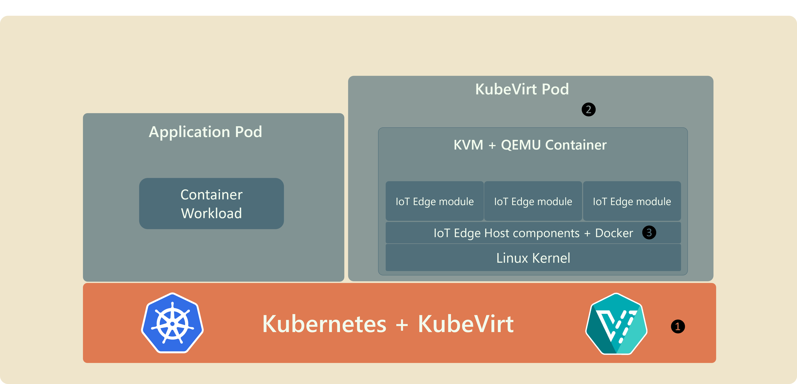

# How to install IoT Edge on Kubernetes

IoT Edge can be installed on Kubernetes by using [KubeVirt](https://www.cncf.io/projects/kubevirt/) technology. KubeVirt is open source CNCF project that offers a Kubernetes virtualization API and runtime to define and manage virtual machines. 

## Architecture

| Note | Description |
|-|-|
|  1 | Install KubeVirt Custom Resource Definitions (CRDs) into the Kubernetes cluster. Like the Kubernetes cluster, management and updates to KubeVirt components are outside the purview of IoT Edge. |
|  2️ | A KubeVirt `VirtualMachine` custom resource is used to define a virtual machine of required resources and base operating system. A running *instance* of this VM template is created in a Kubernetes Pod using [KVM](https://en.wikipedia.org/wiki/Kernel-based_Virtual_Machine) and [QEMU](https://wiki.qemu.org/Main_Page) technologies. |
|  3️ | The environment inside the QEMU container is just like any other virtual machine. IoT Edge and its dependencies (like the Docker container engine) can be installed in it just like in any VM or bare metal system. |

## Sample
A functional sample for running IoT Edge on Azure Kubernetes Service (AKS) using KubeVirt is available at [https://aka.ms/iotedge-kubevirt](https://aka.ms/iotedge-kubevirt). 

> [!NOTE]
> Based on feedback, the prior translation-based preview of IoT Edge integration with Kubernetes has been discontinued and will not be made generally available. An exception being Azure Stack Edge devices where tranlation-based Kubernetes integration will be supported until IoT Edge v1.1 is maintained (Dec 2022).

Please see the [IoT Edge on Kubernetes preview docs mini-site](https://aka.ms/edgek8sdoc) for more information, including in-depth tutorials and references.
