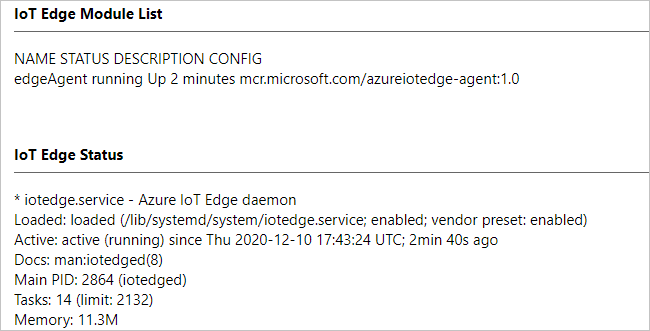

# Install and provision the Azure IoT Edge for Linux on Windows runtime

The Azure IoT Edge runtime is what turns a device into an IoT Edge device. The runtime can be deployed on devices as small as a Raspberry Pi or as large as an industrial server. Once a device is configured with the IoT Edge runtime, you can start deploying business logic to it from the cloud. To learn more, see [Understand the Azure IoT Edge runtime and its architecture](iot-edge-runtime.md).

This article lists the steps to install the Azure IoT Edge for Linux on Windows runtime on Azure IoT Edge devices.

## Prerequisites

* An Azure account with a valid subscription. If you don't have an [Azure subscription](../guides/developer/azure-developer-guide.md#understanding-accounts-subscriptions-and-billing), create a [free account](https://azure.microsoft.com/free/) before you begin.
* A free or standard tier [IoT Hub](../iot-hub/iot-hub-create-through-portal.md) in Azure.
* An [Azure IoT Edge device](how-to-manual-provision-symmetric-key.md#create-an-iot-edge-device-in-the-azure-portal).
* Access to [Windows Admin Center (WAC) with the Azure IoT Edge extension for WAC installed](https://microsoft.sharepoint.com/teams/AzureEFLOW/Wiki/Windows%20Admin%20Center.aspx). <!-- Update with proper links -->

Minimum system requirements:

* Windows 10 Version 1809 or later; build 17763 or later
* Professional, Enterprise, or Server editions
* Minimum RAM: 4 GB
* Minimum Storage: 10 GB

<!-- Temporary note; signage should be good by release -->
> [!NOTE]
> The execution policy on the target device needs to be set to `Bypass` or `RemoteSigned`, because the IoT Edge for Windows module is not properly signed. Any deployment attempt with a different execution policy will fail as the module cannot be loaded.
>
> Signing of the Azure IoT Edge for Windows collaterals is ongoing work.
>
> You can check the current execution policy in an elevated PowerShell prompt using:
>
>    ```azurepowershell-interactive
>    Get-ExecutionPolicy -List
>    ```
>
> If the execution policy of `local machine` is either `AllSigned` or `Restricted`, set the execution policy to `Bypass` or `RemoteSigned`:
>
>    ```azurepowershell-interactive
>    Set-ExecutionPolicy - ExecutionPolicy RemoteSigned -Force
>    ```

## Create a new deployment

On the Windows Admin Center start page, under the list of connections, you will see a local host connection representing the PC where you running Windows Admin Center. In this guide, this local host connection will also serve as the target device for the deployment of Azure IoT Edge for Linux on Windows.

   

> [!NOTE]
> If you do not see your desired target device in the list, follow the [instructions to add your device before proceeding](https://docs.microsoft.com/windows-server/manage/windows-admin-center/use/get-started#connecting-to-managed-nodes-and-clusters).

1. Select **Add**.

1. On the **Add or create resources** pane, locate the **Azure IoT Edge** tile. This guide creates a deployment to a new device. Select **Create new**

   

1. The **Create an Azure IoT Edge for Linux on Windows deployment** pane will open. On the **1. Getting Started** tab, verify that your target device meets the minimum requirements, and select **Next**.

1. Review the license terms, check **I Accept**, and select **Next**.

1. You can toggle **Optional diagnostic data** on or off, depending on your preference.

1. Select **Next: Deploy**.

   

1. On the **2. Deploy** tab, under **Select a target device**, click on your listed device to validate it meets the minimum requirements. Once its status is confirmed as supported, select **Next**.

   <!-- Visuals may change with updates; fewer settings visible to customers in future -->
   

1. Accept the default settings on the **2.2 Settings** tab.

1. On the **2.3 Deployment** tab, you can watch the progress of the deployment. The full process includes downloading the Azure IoT Edge for Linux on Windows package, installing the package, configuring the host device, and setting up the Linux virtual machine. This process may take several minutes to complete. A successful deployment is pictured below.

   

Once your deployment is complete, you are ready to provision your device. Select **Next: Connect** to proceed to the **3. Connect** tab, which handles Azure IoT Edge device provisioning.

To provision your device, you have three options:

* [Manual provisioning using your IoT Edge device's connection string](how-to-install-iot-edge-on-windows.md#provisioning-manually-using-the-connection-string)
* [Automatic provisioning using Device Provisioning Service (DPS) and symmetric keys](how-to-install-iot-edge-on-windows.md#provisioning-via-dps-using-symmetric-keys)
* [Automatic provisioning using DPS and X.509 certificates](how-to-install-iot-edge-on-windows.md#provisioning-via-dps-using-x.509-certificates)

## Provision your device

Choose a method for provisioning your device and follow the instructions in the appropriate section.

### Provisioning manually using the connection string

This section covers provisioning your device manually using your Azure IoT Edge device's connection string.

1. On the **Azure IoT Edge device provisioning** pane, select **Connection String (Manual)** from the provisioning method dropdown.

1. In the [Azure portal](https://ms.portal.azure.com/), navigate to the **IoT Edge** tab of your IoT Hub.

1. Click on the device ID of your device. Copy the **Primary Connection String** field. 

1. Paste it into the device connection string field in the Windows Admin Center. Then, choose **Provisioning with the selected method**.

   

Continue to the [finish provisioning section](how-to-install-iot-edge-on-windows.md#finish-provisioning-your-device) for the final steps.

### Provisioning via DPS using symmetric keys

This section covers provisioning your device automatically using DPS and symmetric keys. To continue with these steps, follow the [instructions on how to use DPS and symmetric keys to automatically provision an IoT Edge device](how-to-auto-provision-symmetric-keys.md) to create an instance of DPS, link your DPS instance to your IoT Hub, and create a DPS enrollment. Once you complete these steps, return here.

1. On the **Azure IoT Edge device provisioning** pane, select **Symmetric Key (DPS)** from the provisioning method dropdown.

1. In the [Azure portal](https://ms.portal.azure.com/), navigate to your DPS instance.

1. On the **Overview** tab, copy the **ID Scope** value. Paste it into the scope ID field in the Windows Admin Center.

1. On the **Manage enrollments** tab in the Azure portal, switch to the **Individual Enrollments** tab. Copy the registration ID of the enrollment you created. Paste it into the registration ID field in the Windows Admin Center.

1. On the **Manage enrollments** tab in the Azure portal, select the enrollment you created. Copy the **Primary Key** value in the enrollment details. Paste it into the symmetric key field in the Windows Admin Center.

1. Choose **Provisioning with the selected method**.

   

1. Once the provisioning is complete, select **Finish**. You will be taken back to the main dashboard. Now, you should see a new device listed, whose type is `IoT Edge Devices`.

   

1. You can select the IoT Edge device to connect to it. Once on its **Overview** page, you can view the **IoT Edge Module List** and **IoT Edge Status** of your device.

   

Continue to the [finish provisioning section](how-to-install-iot-edge-on-windows.md#finish-provisioning-your-device) for the final steps.

### Provisioning via DPS using X.509 certificates

This section covers provisioning your device automatically using DPS and X.509 certificates. To continue with these steps, follow the [instructions on how to use DPS and X.509 certificates to automatically provision an IoT Edge device](how-to-auto-provision-x509-certs.md) to create test certificates if necessary, create an instance of DPS, link your DPS instance to your IoT Hub, and create a DPS enrollment. Once you complete these steps, return here.

1. On the **Azure IoT Edge device provisioning** pane, select **X.509 Certificate (DPS)** from the provisioning method dropdown.

1. In the [Azure portal](https://ms.portal.azure.com/), navigate to your DPS instance.

1. On the **Overview** tab, copy the **ID Scope** value. Paste it into the scope ID field in the Windows Admin Center.

1. On the **Manage enrollments** tab in the Azure portal, switch to the **Individual Enrollments** tab. Copy the registration ID of the enrollment you created. Paste it into the registration ID field in the Windows Admin Center.

1. Upload your certificate and private key files.

1. Choose **Provisioning with the selected method**.

   

Continue to the [finish provisioning section](how-to-install-iot-edge-on-windows.md#finish-provisioning-your-device) for the final steps.

### Finish provisioning your device

1. Once the provisioning is complete, select **Finish**. You will be taken back to the main dashboard. Now, you should see a new device listed, whose type is `IoT Edge Devices`.

   

1. You can select the IoT Edge device to connect to it. Once on its **Overview** page, you can view the **IoT Edge Module List** and **IoT Edge Status** of your device.

   

## Next steps

Continue to [deploy IoT Edge modules](how-to-deploy-modules-portal.md) to learn how to deploy modules onto your device.
