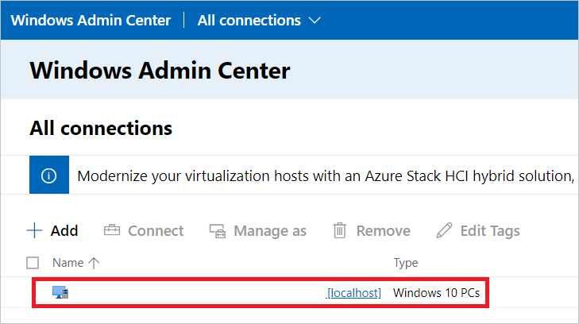
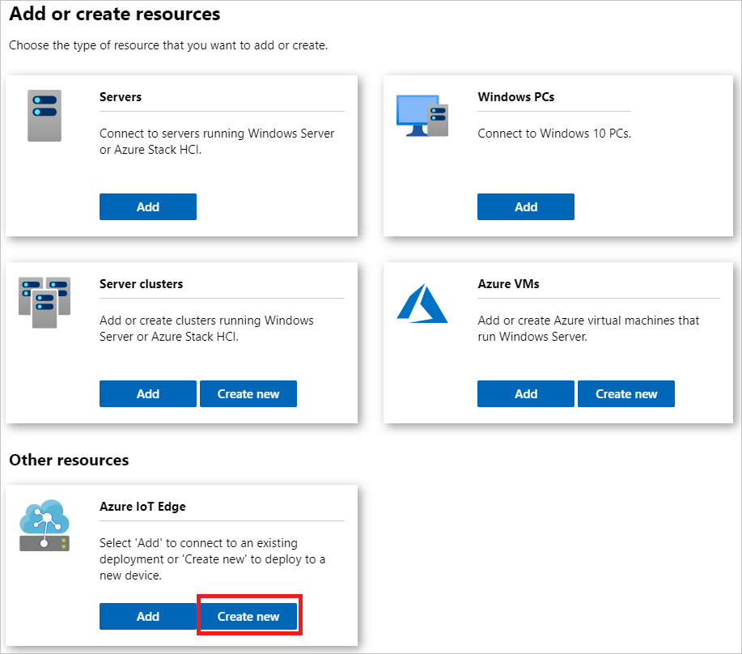
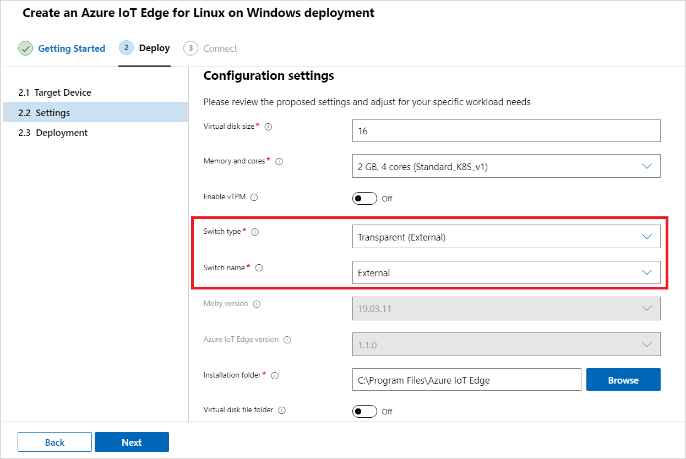
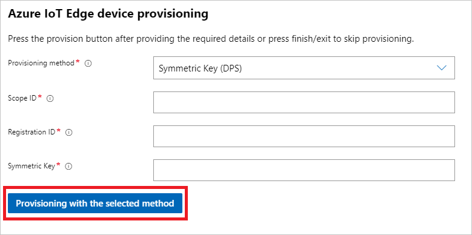
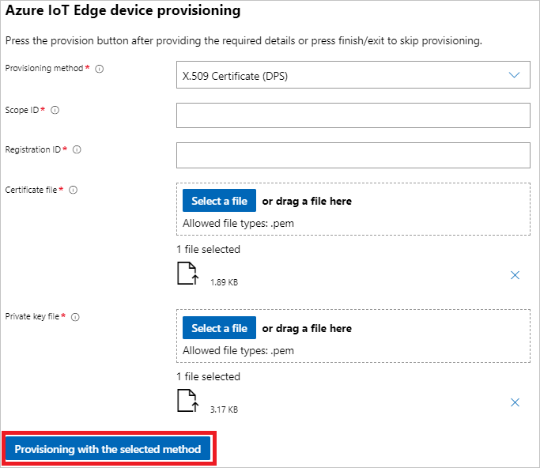

# Install and provision Azure IoT Edge for Linux on a Windows device (Preview)

[!INCLUDE [iot-edge-version-201806](../../includes/iot-edge-version-201806.md)]

The Azure IoT Edge runtime is what turns a device into an IoT Edge device. The runtime can be deployed on devices from PC class to industrial servers. Once a device is configured with the IoT Edge runtime, you can start deploying business logic to it from the cloud. To learn more, see [Understand the Azure IoT Edge runtime and its architecture](iot-edge-runtime.md).

Azure IoT Edge for Linux on Windows allows you to use Azure IoT Edge on Windows devices by using Linux virtual machines. The Linux version of Azure IoT Edge and any Linux modules deployed with it run on the virtual machine. From there, Windows applications and code and the IoT Edge runtime and modules can freely interact with each other.

This article lists the steps to set up IoT Edge on a Windows device. These steps deploy a Linux virtual machine that contains the IoT Edge runtime to run on your Windows device, then provision the device with its IoT Hub device identity.

>[!NOTE]
>IoT Edge for Linux on Windows is in [public preview](https://azure.microsoft.com/support/legal/preview-supplemental-terms/).
>
>While IoT Edge for Linux on Windows is the recommended experience for using Azure IoT Edge in a Windows environment, Windows containers are still available. If you prefer to use Windows containers, see the how-to guide on [installing and managing Azure IoT Edge for Windows](how-to-install-iot-edge-windows-on-windows.md).

## Prerequisites

* An Azure account with a valid subscription. If you don't have an [Azure subscription](../guides/developer/azure-developer-guide.md#understanding-accounts-subscriptions-and-billing), create a [free account](https://azure.microsoft.com/free/) before you begin.

* A free or standard tier [IoT Hub](../iot-hub/iot-hub-create-through-portal.md) in Azure.

* A Windows device with the following minimum system requirements:

  * Windows 10 Version 1809 or later; build 17763 or later
  * Professional, Enterprise, or Server editions
  * Minimum Free Memory: 1 GB
  * Minimum Free Disk Space: 10 GB
  * If you're creating a new deployment using Windows 10, make sure you enable Hyper-V. For more information, see how to [Install Hyper-V on Windows 10](/virtualization/hyper-v-on-windows/quick-start/enable-hyper-v).
  * If you're creating a new deployment using Windows Server, make sure you install Hyper-V role. For more information, see how to [Install the Hyper-V role on Windows Server](/windows-server/virtualization/hyper-v/get-started/install-the-hyper-v-role-on-windows-server).
  * If you're creating a new deployment using a VM, make sure you configure nested virtualization correctly. For more information, see the [nested virtualization](nested-virtualization.md) guide.

* Access to Windows Admin Center with the Azure IoT Edge extension for Windows Admin Center installed:

   1. Download the [Windows Admin Center installer](https://aka.ms/wacdownload).

   1. Run the downloaded installer and follow the install wizard prompts to install Windows Admin Center. 

   1. Once installed, use a supported browser to open Windows Admin Center. Supported browsers include Microsoft Edge (Windows 10, version 1709 or later), Google Chrome, and Microsoft Edge Insider.

   1. On the first use of Windows Admin Center, you will be prompted to select a certificate to use. Select **Windows Admin Center Client** as your certificate.

   1. It is time to install the Azure IoT Edge extension. Select the gear icon in the top right of the Windows Admin Center dashboard.

      

   1. On the **Settings** menu, under **Gateway**, select **Extensions**.

   1. On the **Available extensions** tab, find **Azure IoT Edge** in the list of extensions. Choose it, and select the **Install** prompt above the list of extensions.

   1. After the installation completes, you should see Azure IoT Edge in the list of installed extensions on the **Installed extensions** tab.

## Choose your provisioning method

Azure IoT Edge for Linux on Windows supports the following provisioning methods:

* Manual provisioning using your IoT Edge device's connection string. To use this method, register your device and retrieve a connection string using the steps in [Register an IoT Edge device in IoT Hub](how-to-register-device.md).
  * Choose the symmetric key authentication option, as X.509 self-signed certificates are not currently supported by IoT Edge for Linux on Windows.
* Automatic provisioning using Device Provisioning Service (DPS) and symmetric keys. Learn more about [creating and provisioning an IoT Edge device with DPS and symmetric keys](how-to-auto-provision-symmetric-keys.md).
* Automatic provisioning using DPS and X.509 certificates. Learn more about [creating and provisioning an IoT Edge device with DPS and X.509 certificates](how-to-auto-provision-x509-certs.md).

Manual provisioning is easier to get started with a few devices. The Device Provisioning Service is helpful for provisioning many devices.

If you plan on using one of the DPS methods to provision your device or devices, follow the steps in the appropriate article linked above to create an instance of DPS, link your DPS instance to your IoT Hub, and create a DPS enrollment. You can create an *individual enrollment* for a single device or a *group enrollment* for a group of devices. For more information about the enrollment types, visit the [Azure IoT Hub Device Provisioning Service concepts](../iot-dps/concepts-service.md#enrollment).

## Create a new deployment

Create your deployment of Azure IoT Edge for Linux on Windows on your target device.

# [Windows Admin Center](#tab/windowsadmincenter)

On the Windows Admin Center start page, under the list of connections, you will see a local host connection representing the PC where you running Windows Admin Center. Any additional servers, PCs, or clusters that you manage will also show up here.

You can use Windows Admin Center to make install and manage Azure IoT Edge for Linux on Windows on either your local device or remote managed devices. In this guide, the local host connection will serve as the target device for the deployment of Azure IoT Edge for Linux on Windows.

If you want to deploy to a remote target device instead of your local device and you do not see your desired target device in the list, follow the [instructions to add your device.](/windows-server/manage/windows-admin-center/use/get-started#connecting-to-managed-nodes-and-clusters).

   

1. Select **Add**.

1. On the **Add or create resources** pane, locate the **Azure IoT Edge** tile. Select **Create new** to install a new instance of Azure IoT Edge for Linux on Windows on a device.

   If you already have IoT Edge for Linux on Windows running on a device, you could select **Add** to connect to that existing IoT Edge device and manage it with Windows Admin Center.

   

1. The **Create an Azure IoT Edge for Linux on Windows deployment** pane will open. On the **1. Getting Started** tab, verify that your target device meets the minimum requirements, and select **Next**.

1. Review the license terms, check **I Accept**, and select **Next**.

1. You can toggle **Optional diagnostic data** on or off, depending on your preference.

1. Select **Next: Deploy**.

   

1. On the **2. Deploy** tab, under **Select a target device**, click on your listed device to validate it meets the minimum requirements. Once its status is confirmed as supported, select **Next**.

   

1. On the **2.2 Settings** tab, review the configuration settings of your deployment. Once you are satisfied with the settings, select **Next**.

   

   >[!NOTE]
   >If you are using a Windows virtual machine, it is recommended to use a default switch rather than an external switch to ensure the Linux virtual machine created in the deployment can obtain an IP address.
   >
   >Using a default switch assigns the Linux virtual machine an internal IP address. This internal IP address cannot be reached from outside the Windows virtual machine, but it can be connected to locally while logged onto the Windows virtual machine.
   >
   >If you are using Windows Server, please note that Azure IoT Edge for Linux on Windows does not automatically support the default switch. For a local Windows Server virtual machine, ensure the Linux virtual machine can obtain an IP address through the external switch. For a Windows Server virtual machine in Azure, set up an internal switch before deploying IoT Edge for Linux on Windows.

1. On the **2.3 Deployment** tab, you can watch the progress of the deployment. The full process includes downloading the Azure IoT Edge for Linux on Windows package, installing the package, configuring the host device, and setting up the Linux virtual machine. This process may take several minutes to complete. A successful deployment is pictured below.

   

Once your deployment is complete, you are ready to provision your device. Select **Next: Connect** to proceed to the **3. Connect** tab, which handles Azure IoT Edge device provisioning.

# [PowerShell](#tab/powershell)

Install IoT Edge for Linux on Windows onto your target device if you have not already.

> [!NOTE]
> The following PowerShell process outlines how to create a local host deployment of Azure IoT Edge for Linux on Windows. To create a deployment to a remote target device using PowerShell, you can use [Remote PowerShell](/powershell/module/microsoft.powershell.core/about/about_remote) to establish a connection to a remote device and run these commands remotely on that device.

1. In an elevated PowerShell session, run each of the following commands to download IoT Edge for Linux on Windows.

   ```azurepowershell-interactive
   $msiPath = $([io.Path]::Combine($env:TEMP, 'AzureIoTEdge.msi'))
   $ProgressPreference = 'SilentlyContinue'
   ​Invoke-WebRequest "https://aka.ms/AzEflowMSI" -OutFile $msiPath
   ```

1. Install IoT Edge for Linux on Windows on your device.

   ```azurepowershell-interactive
   Start-Process -Wait msiexec -ArgumentList "/i","$([io.Path]::Combine($env:TEMP, 'AzureIoTEdge.msi'))","/qn"
   ```

   > [!NOTE]
   > You can specify custom IoT Edge for Linux on Windows installation and VHDX directories by adding the INSTALLDIR="<FULLY_QUALIFIED_PATH>" and VHDXDIR="<FULLY_QUALIFIED_PATH>" parameters to the install command above.

1. For the deployment to run successfully, you need to set the execution policy on the target device to `AllSigned` if it is not already. You can check the current execution policy in an elevated PowerShell prompt using:

   ```azurepowershell-interactive
   Get-ExecutionPolicy -List
   ```

   If the execution policy of `local machine` is not `AllSigned`, you can set the execution policy using:

   ```azurepowershell-interactive
   Set-ExecutionPolicy -ExecutionPolicy AllSigned -Force
   ```

1. Create the IoT Edge for Linux on Windows deployment.

   ```azurepowershell-interactive
   Deploy-Eflow
   ```

   > [!NOTE]
   > You can run this command without parameters or optionally customize deployment with parameters. You can refer to [the IoT Edge for Linux on Windows PowerShell script reference](reference-iot-edge-for-linux-on-windows-scripts.md#deploy-eflow) to see parameter meaning​s and default values.

1. Enter 'Y' to accept the license terms.

1. Enter 'O' or 'R' to toggle **Optional diagnostic data** on or off, depending on your preference. A successful deployment is pictured below.

   

Once your deployment is complete, you are ready to provision your device.

---

To provision your device, you can follow the links below to jump to the section for your selected provisioning method:

* [Option 1: Manual provisioning using your IoT Edge device's connection string](#option-1-provisioning-manually-using-the-connection-string)
* [Option 2: Automatic provisioning using Device Provisioning Service (DPS) and symmetric keys](#option-2-provisioning-via-dps-using-symmetric-keys)
* [Option 3: Automatic provisioning using DPS and X.509 certificates](#option-3-provisioning-via-dps-using-x509-certificates)

## Provision your device

Choose a method for provisioning your device and follow the instructions in the appropriate section. You can use the Windows Admin Center or an elevated PowerShell session to provision your devices.

### Option 1: Provisioning manually using the connection string

This section covers provisioning your device manually using your Azure IoT Edge device's connection string.

# [Windows Admin Center](#tab/windowsadmincenter)

1. On the **Azure IoT Edge device provisioning** pane, select **Connection String (Manual)** from the provisioning method dropdown.

1. In the [Azure portal](https://ms.portal.azure.com/), navigate to the **IoT Edge** tab of your IoT Hub.

1. Click on the device ID of your device. Copy the **Primary Connection String** field.

1. Paste it into the device connection string field in the Windows Admin Center. Then, choose **Provisioning with the selected method**.

   

1. Once the provisioning is complete, select **Finish**. You will be taken back to the main dashboard. Now, you should see a new device listed, whose type is `IoT Edge Devices`. You can select the IoT Edge device to connect to it. Once on its **Overview** page, you can view the **IoT Edge Module List** and **IoT Edge Status** of your device.

# [PowerShell](#tab/powershell)

1. In the [Azure portal](https://ms.portal.azure.com/), navigate to the **IoT Edge** tab of your IoT Hub.

1. Click on the device ID of your device. Copy the **Primary Connection String** field.

1. Paste over the placeholder text in the following command and run it in an elevated PowerShell session on your target device.

   ```azurepowershell-interactive
   Provision-EflowVm -provisioningType manual -devConnString "<CONNECTION_STRING_HERE>"​
   ```

---

### Option 2: Provisioning via DPS using symmetric keys

This section covers provisioning your device automatically using DPS and symmetric keys.

# [Windows Admin Center](#tab/windowsadmincenter)

1. On the **Azure IoT Edge device provisioning** pane, select **Symmetric Key (DPS)** from the provisioning method dropdown.

1. In the [Azure portal](https://ms.portal.azure.com/), navigate to your DPS instance.

1. On the **Overview** tab, copy the **ID Scope** value. Paste it into the scope ID field in the Windows Admin Center.

1. On the **Manage enrollments** tab in the Azure portal, select the enrollment you created. Copy the **Primary Key** value in the enrollment details. Paste it into the symmetric key field in the Windows Admin Center.

1. Provide the registration ID of your device in the registration ID field in the Windows Admin Center.

1. Choose **Provisioning with the selected method**.

   

1. Once the provisioning is complete, select **Finish**. You will be taken back to the main dashboard. Now, you should see a new device listed, whose type is `IoT Edge Devices`. You can select the IoT Edge device to connect to it. Once on its **Overview** page, you can view the **IoT Edge Module List** and **IoT Edge Status** of your device.

# [PowerShell](#tab/powershell)

1. Copy the following command into a text editor. Replace the placeholder text with your information as detailed.

   ```azurepowershell-interactive
   Provision-EflowVm -provisioningType symmetric -​scopeId <ID_SCOPE_HERE> -registrationId <REGISTRATION_ID_HERE> -symmKey <PRIMARY_KEY_HERE>
   ```

1. In the [Azure portal](https://ms.portal.azure.com/), navigate to your DPS instance.

1. On the **Overview** tab, copy the **ID Scope** value. Paste it over the appropriate placeholder text in the command.

1. On the **Manage enrollments** tab in the Azure portal, select the enrollment you created. Copy the **Primary Key** value in the enrollment details. Paste it over the appropriate placeholder text in the command.

1. Provide the registration ID of the device to replace the appropriate placeholder text in the command.

1. Run the command in an elevated PowerShell session on the target device.

---

### Option 3: Provisioning via DPS using X.509 certificates

This section covers provisioning your device automatically using DPS and X.509 certificates.

# [Windows Admin Center](#tab/windowsadmincenter)

1. On the **Azure IoT Edge device provisioning** pane, select **X.509 Certificate (DPS)** from the provisioning method dropdown.

1. In the [Azure portal](https://ms.portal.azure.com/), navigate to your DPS instance.

1. On the **Overview** tab, copy the **ID Scope** value. Paste it into the scope ID field in the Windows Admin Center.

1. Provide the registration ID of your device in the registration ID field in the Windows Admin Center.

1. Upload your certificate and private key files.

1. Choose **Provisioning with the selected method**.

   

1. Once the provisioning is complete, select **Finish**. You will be taken back to the main dashboard. Now, you should see a new device listed, whose type is `IoT Edge Devices`. You can select the IoT Edge device to connect to it. Once on its **Overview** page, you can view the **IoT Edge Module List** and **IoT Edge Status** of your device.

# [PowerShell](#tab/powershell)

1. Copy the following command into a text editor. Replace the placeholder text with your information as detailed.

   ```azurepowershell-interactive
   Provision-EflowVm -provisioningType x509 -​scopeId <ID_SCOPE_HERE> -registrationId <REGISTRATION_ID_HERE> -identityCertLocWin <ABSOLUTE_CERT_SOURCE_PATH_ON_WINDOWS_MACHINE> -identityPkLocWin <ABSOLUTE_PRIVATE_KEY_SOURCE_PATH_ON_WINDOWS_MACHINE> -identityCertLocVm <ABSOLUTE_CERT_DEST_PATH_ON_LINUX_MACHINE -identityPkLocVm <ABSOLUTE_PRIVATE_KEY_DEST_PATH_ON_LINUX_MACHINE>
   ```

1. In the [Azure portal](https://ms.portal.azure.com/), navigate to your DPS instance.

1. On the **Overview** tab, copy the **ID Scope** value. Paste it over the appropriate placeholder text in the command.

1. Provide the registration ID of the device to replace the appropriate placeholder text in the command.

1. Replace the appropriate placeholder text with the absolute source path to your certificate file.

1. Replace the appropriate placeholder text with the absolute source path to your private key file.

1. Run the command in an elevated PowerShell session on the target device.

---

## Verify successful configuration

Verify that IoT Edge for Linux on Windows was successfully installed and configured on your IoT Edge device.

# [Windows Admin Center](#tab/windowsadmincenter)

1. Select your IoT Edge device from the list of connected devices in Windows Admin Center to connect to it.

1. The device overview page displays some information about the device:

    1. The **IoT Edge Module List** section shows running modules on the device. When the IoT Edge service starts for the first time, you should only see the **edgeAgent** module running. The edgeAgent module runs by default and helps to install and start any additional modules that you deploy to your device.
    1. The **IoT Edge Status** section shows the service status, and should be reporting **active (running)**.

1. If you need to troubleshoot the IoT Edge service, use the **Command Shell** tool on the device page to ssh (secure shell) into the virtual machine and run the Linux commands.

    1. If you need to troubleshoot the service, retrieve the service logs.

       ```bash
       journalctl -u iotedge
       ```

    2. Use the `check` tool to verify configuration and connection status of the device.

       ```bash
       sudo iotedge check
       ```

# [PowerShell](#tab/powershell)

1. Log in to your IoT Edge for Linux on Windows virtual machine using the following command in your PowerShell session:

   ```azurepowershell-interactive
   Ssh-EflowVm
   ```

   >[!NOTE]
   >The only account allowed to SSH to the virtual machine is the user that created it.

1. Once you are logged in, you can check the list of running IoT Edge modules using the following Linux command:

   ```bash
   iotedge list
   ```

1. If you need to troubleshoot the IoT Edge service, use the following Linux commands.

    1. If you need to troubleshoot the service, retrieve the service logs.

       ```bash
       journalctl -u iotedge
       ```

    2. Use the `check` tool to verify configuration and connection status of the device.

       ```bash
       sudo iotedge check
       ```

---

## Next steps

* Continue to [deploy IoT Edge modules](how-to-deploy-modules-portal.md) to learn how to deploy modules onto your device.
* Learn how to [manage certificates on your IoT Edge for Linux on Windows virtual machine](how-to-manage-device-certificates.md) and transfer files from the host OS to your Linux virtual machine.
* Learn how to [configure your IoT Edge devices to communicate through a proxy server](how-to-configure-proxy-support.md).
