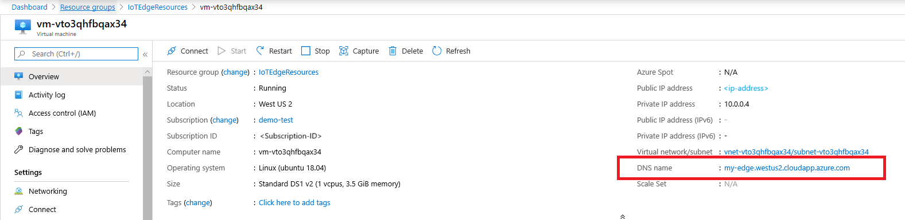

# Run Azure IoT Edge on Ubuntu Virtual Machines by using Bicep

[!INCLUDE [iot-edge-version-201806-or-202011](../../includes/iot-edge-version-201806-or-202011.md)]

The Azure IoT Edge runtime is what turns a device into an IoT Edge device. The runtime can be deployed on devices as small as a Raspberry Pi or as large as an industrial server. Once a device is configured with the IoT Edge runtime, you can start deploying business logic to it from the cloud.

To learn more about how the IoT Edge runtime works and what components are included, see [Understand the Azure IoT Edge runtime and its architecture](iot-edge-runtime.md).

:::moniker range="iotedge-2018-06"
This article lists the steps to deploy an Ubuntu 18.04 LTS virtual machine with the Azure IoT Edge runtime installed and configured using a pre-supplied device connection string. The deployment is accomplished using a [cloud-init](../virtual-machines/linux/using-cloud-init.md) based [Bicep file](../azure-resource-manager/bicep/overview.md) maintained in the [iotedge-vm-deploy](https://github.com/Azure/iotedge-vm-deploy/tree/1.1) project repository.

On first boot, the virtual machine [installs the latest version of the Azure IoT Edge runtime via cloud-init](https://github.com/Azure/iotedge-vm-deploy/blob/1.1/cloud-init.txt). It also sets a supplied connection string before the runtime starts, allowing you to easily configure and connect the IoT Edge device without the need to start an SSH or remote desktop session.
:::moniker-end
:::moniker range=">=iotedge-2020-11"
This article lists the steps to deploy an Ubuntu 20.04 LTS virtual machine with the Azure IoT Edge runtime installed and configured using a pre-supplied device connection string. The deployment is accomplished using a [cloud-init](../virtual-machines/linux/using-cloud-init.md) based [Bicep file](../azure-resource-manager/bicep/overview.md) maintained in the [iotedge-vm-deploy](https://github.com/Azure/iotedge-vm-deploy/tree/1.3) project repository.

On first boot, the virtual machine [installs the latest version of the Azure IoT Edge runtime via cloud-init](https://github.com/Azure/iotedge-vm-deploy/blob/1.3/cloud-init.txt). It also sets a supplied connection string before the runtime starts, allowing you to easily configure and connect the IoT Edge device without the need to start an SSH or remote desktop session.
:::moniker-end

## Deploy from Azure CLI

You can't deploy a remote Bicep file. Save a copy of the [Bicep file](https://raw.githubusercontent.com/Azure/iotedge-vm-deploy/master/edgeDeploy.bicep) locally as **main.bicep**.

1. Ensure that you have installed the Azure CLI iot extension with:

   ```azurecli
   az extension add --name azure-iot
   ```

1. Next, if you're using Azure CLI on your desktop, start by logging in:

   ```azurecli
   az login
   ```

1. If you have multiple subscriptions, select the subscription you'd like to use:
   1. List your subscriptions:

      ```azurecli
      az account list --output table
      ```

   1. Copy the SubscriptionID field for the subscription you'd like to use.

   1. Set your working subscription with the ID that you copied:

      ```azurecli
      az account set -s <SubscriptionId>
      ```

1. Create a new resource group (or specify an existing one in the next steps):

   ```azurecli
   az group create --name IoTEdgeResources --location westus2
   ```

1. Create a new virtual machine:
   :::moniker range="iotedge-2018-06"
   To use an **authenticationType** of `password`, see the example below:

   ```azurecli
   az deployment group create \
   --resource-group IoTEdgeResources \
   --template-file "main.bicep" \
   --parameters dnsLabelPrefix='my-edge-vm1' \
   --parameters deviceConnectionString=$(az iot hub device-identity connection-string show --device-id <REPLACE_WITH_DEVICE-NAME> --hub-name <REPLACE-WITH-HUB-NAME> -o tsv) \
   --parameters authenticationType='password' \
   --parameters adminUsername='<REPLACE_WITH_USERNAME>' \
   --parameters adminPasswordOrKey="<REPLACE_WITH_SECRET_PASSWORD>"
   ```

   To authenticate with an SSH key, you may do so by specifying an **authenticationType** of `sshPublicKey`, then provide the value of the SSH key in the **adminPasswordOrKey** parameter.  An example is shown below.

   ```azurecli
   #Generate the SSH Key
   ssh-keygen -m PEM -t rsa -b 4096 -q -f ~/.ssh/iotedge-vm-key -N ""

   #Create a VM using the iotedge-vm-deploy script
   az deployment group create \
   --resource-group IoTEdgeResources \
   --template-file "main.bicep" \
   --parameters dnsLabelPrefix='my-edge-vm1' \
   --parameters deviceConnectionString=$(az iot hub device-identity connection-string show --device-id <REPLACE_WITH_DEVICE-NAME> --hub-name <REPLACE-WITH-HUB-NAME> -o tsv) \
   --parameters authenticationType='sshPublicKey' \
   --parameters adminUsername='<REPLACE_WITH_USERNAME>' \
   --parameters adminPasswordOrKey="$(< ~/.ssh/iotedge-vm-key.pub)"
   ```

   :::moniker-end
   :::moniker range=">=iotedge-2020-11"
   To use an **authenticationType** of `password`, see the example below:

   ```azurecli
   az deployment group create \
   --resource-group IoTEdgeResources \
   --template-file "main.bicep" \
   --parameters dnsLabelPrefix='my-edge-vm1' \
   --parameters deviceConnectionString=$(az iot hub device-identity connection-string show --device-id <REPLACE_WITH_DEVICE-NAME> --hub-name <REPLACE-WITH-HUB-NAME> -o tsv) \
   --parameters authenticationType='password' \
   --parameters adminUsername='<REPLACE_WITH_USERNAME>' \
   --parameters adminPasswordOrKey="<REPLACE_WITH_SECRET_PASSWORD>"
   ```

   To authenticate with an SSH key, you may do so by specifying an **authenticationType** of `sshPublicKey`, then provide the value of the SSH key in the **adminPasswordOrKey** parameter.  An example is shown below.

   ```azurecli
   #Generate the SSH Key
   ssh-keygen -m PEM -t rsa -b 4096 -q -f ~/.ssh/iotedge-vm-key -N ""

   #Create a VM using the iotedge-vm-deploy script
   az deployment group create \
   --resource-group IoTEdgeResources \
   --template-file "main.bicep" \
   --parameters dnsLabelPrefix='my-edge-vm1' \
   --parameters deviceConnectionString=$(az iot hub device-identity connection-string show --device-id <REPLACE_WITH_DEVICE-NAME> --hub-name <REPLACE-WITH-HUB-NAME> -o tsv) \
   --parameters authenticationType='sshPublicKey' \
   --parameters adminUsername='<REPLACE_WITH_USERNAME>' \
   --parameters adminPasswordOrKey="$(< ~/.ssh/iotedge-vm-key.pub)"
   ```

   :::moniker-end

1. Verify that the deployment has completed successfully.  A virtual machine resource should have been deployed into the selected resource group.  Take note of the machine name, this should be in the format `vm-0000000000000`. Also, take note of the associated **DNS Name**, which should be in the format `<dnsLabelPrefix>`.`<location>`.cloudapp.azure.com.

    The **DNS Name** can be obtained from the JSON-formatted output of the previous step, within the **outputs** section as part of the **public SSH** entry.  The value of this entry can be used to SSH into to the newly deployed machine.

    ```bash
    "outputs": {
      "public SSH": {
        "type": "String",
        "value": "ssh <adminUsername>@<DNS_Name>"
      }
    }
    ```

    The **DNS Name** can also be obtained from the **Overview** section of the newly deployed virtual machine within the Azure portal.

    > [!div class="mx-imgBorder"]
    > [](./media/how-to-install-iot-edge-ubuntuvm/iotedge-vm-dns-name.png)

1. If you want to SSH into this VM after setup, use the associated **DNS Name** with the command:
    `ssh <adminUsername>@<DNS_Name>`

## Next steps

Now that you have an IoT Edge device provisioned with the runtime installed, you can [deploy IoT Edge modules](how-to-deploy-modules-portal.md).

If you are having problems with the IoT Edge runtime installing properly, check out the [troubleshooting](troubleshoot.md) page.

To update an existing installation to the newest version of IoT Edge, see [Update the IoT Edge security daemon and runtime](how-to-update-iot-edge.md).

If you'd like to open up ports to access the VM through SSH or other inbound connections, refer to the Azure Virtual Machines documentation on [opening up ports and endpoints to a Linux VM](../virtual-machines/linux/nsg-quickstart.md)
