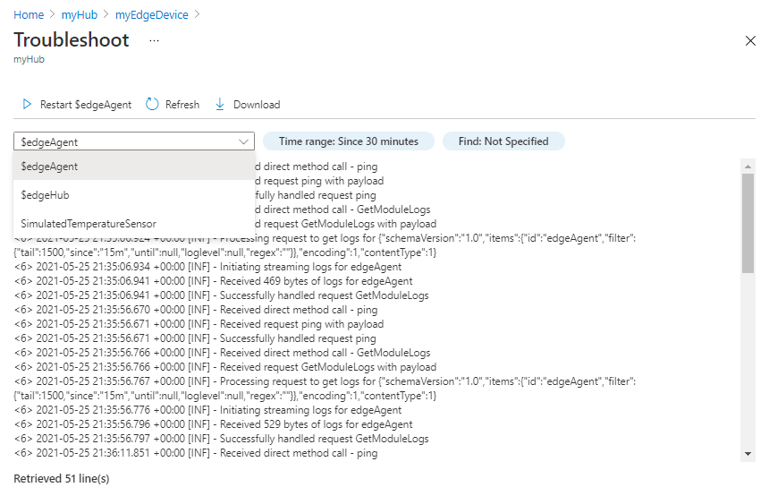
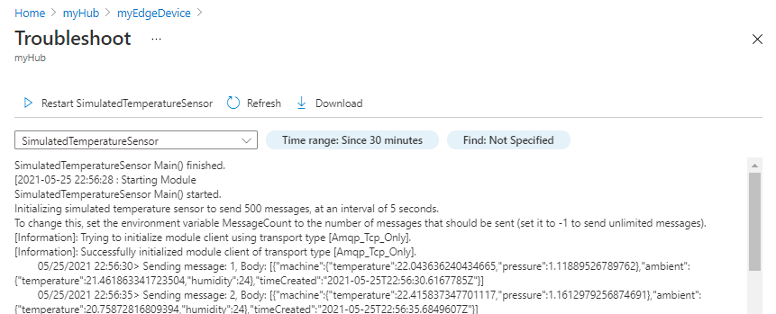

# Monitor and troubleshoot IoT Edge devices from the Azure portal

[!INCLUDE [iot-edge-version-all-supported](../../includes/iot-edge-version-all-supported.md)]

Retrieve logs from your deployed IoT Edge modules through the Azure portal. IoT Edge provides a built-in troubleshooting tool for each device that enables you to view the logs from each deployed module and remotely restart them.

## Prerequisites

The full functionality of this tool requires IoT Edge devices running version 1.1.3 or newer if you're on the long-term support branch, or version 1.2.1 or newer if you're on the latest stable branch.

## Access the troubleshooting tool

You can access the troubleshooting tool in the portal through either the IoT Edge device details page or the IoT Edge module details page.

1. Sign in to the [Azure portal](https://portal.azure.com) and navigate to your IoT hub.

1. In the left pane, select **IoT Edge** from the menu.

1. Select the IoT Edge device that you want to monitor from the list of devices.

1. From the device details page, you can either select **Troubleshoot** from the menu or select the runtime status of a particular module that you want to inspect.

   >

1. From the device details page, you can also select the name of a module to open the module details page. From there, you can select **Troubleshoot** from the menu to open the tool.

   >

## View module logs in the portal

On the **Troubleshoot** page, you can retrieve and download logs from any of the running modules on your IoT Edge device. Use the dropdown menu to choose which module to inspect.

>

By default, the tool displays the last fifteen minutes of logs. Select the **Time range** filter to see different logs. Use the slider to select a time window within the last 60 minutes, or check **Enter time instead** to choose a specific datetime window.

>

Once you have the logs from the module that you want to troubleshoot during the time range that you want to inspect, you can use the **Find** filter to retrieve specific lines from the logs. You can filter for either warnings or errors, or provide a specific term or phrase to search for. The **Find** feature supports plaintext searches or [.NET regular expressions](/dotnet/standard/base-types/regular-expression-language-quick-reference) for more complex searches.

You can download the module logs as a text file. The downloaded log file will reflect any active filters you have applied to the logs.

## Restart modules

The **Troubleshoot** page includes a feature to restart a module. Selecting this option sends a command to the IoT Edge agent to restart the selected module. Restarting a module won't affect your ability to retrieve logs from before the restart.

>

## Next steps

Find more tips for [Troubleshooting your IoT Edge device](troubleshoot.md) or learn about [Common issues and resolutions](troubleshoot-common-errors.md). 

If you have more questions, create a [Support request](https://portal.azure.com/#create/Microsoft.Support) for help.
