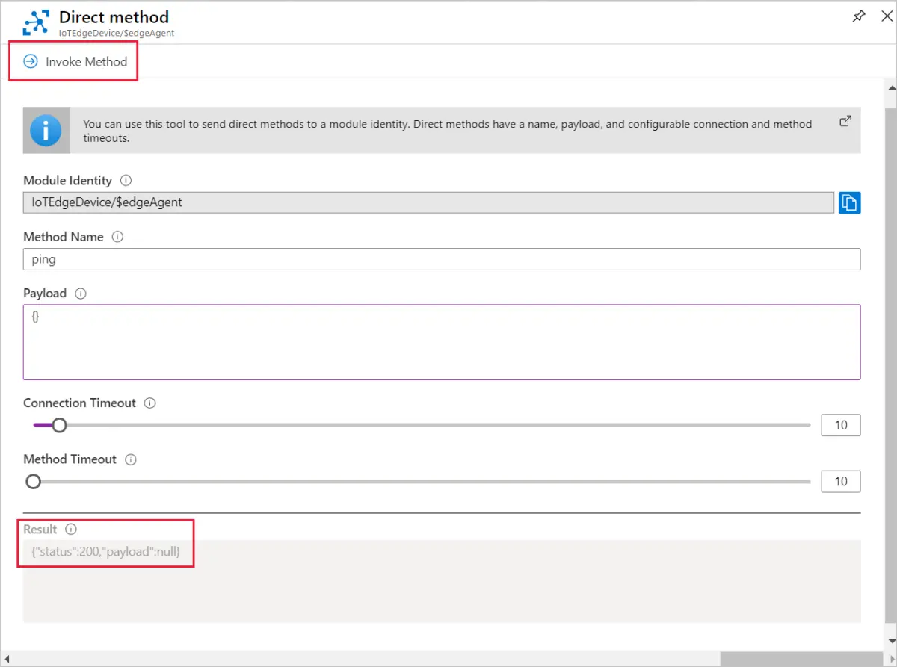
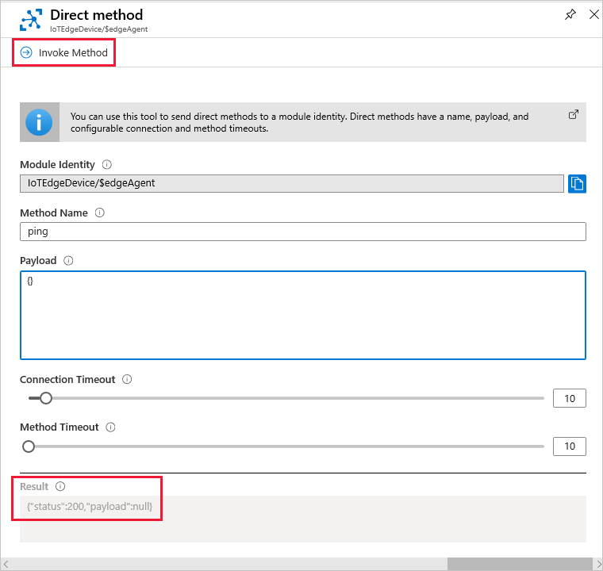

# Communicate with edgeAgent using built-in direct methods

Monitor and manage IoT Edge deployments by using the direct methods included in the IoT Edge agent module. Direct methods are implemented on the device, and then can be invoked from the cloud. The IoT Edge agent includes direct methods that help you monitor and manage your IoT Edge devices remotely.

For more information about direct methods, how to use them, and how to implement them in your own modules, see [Understand and invoke direct methods from IoT Hub](../iot-hub/iot-hub-devguide-direct-methods.md).

## Ping

The **ping** method is useful for checking whether IoT Edge is running on a device, or whether the device has an open connection to ioT Hub. Use this direct method to ping the IoT Edge agent and get its status. A successful ping returns an empty payload and **"status": 200**.

For example:

```azurecli
az iot hub invoke-module-method --method-name 'ping' -n <hub name> -d <device name> -m '$edgeAgent'
```

In the Azure portal, invoke the method with the method name **ping** and an empty JSON payload **{}**.



## Restart module

The **RestartModule** method allows for remote management of modules running on an IoT Edge device. If a module is reporting a failed state or other unhealthy behavior, you can trigger the IoT Edge agent to restart it. A successful restart command returns an empty payload and **"status": 200**.

You can use the **RestartModule** direct method on any module running on an IoT Edge device, including the edgeAgent module itself. However, if you use this direct method to shut down the edgeAgent, you won't receive a success result since the connection is disrupted while the module restarts.

For example:

```azurecli
az iot hub invoke-module-method --method-name 'RestartModule' -n <hub name> -d <device name> -m '$edgeAgent' --method-payload \
'
    {
        "schemaVersion": "1.0",
        "id": "<module name>"
    }
'
```

In the Azure portal, invoke the method with the method name **RestartModule** and the following JSON payload:

```json
{
    "schemaVersion": "1.0",
    "id": "<module name>"
}
```



## Experimental methods

New direct method options are available as experimental features to test, including:

* [UploadLogs](https://github.com/Azure/iotedge/blob/master/doc/built-in-logs-pull.md): Retrieve module logs and upload them to Azure Blob Storage.
* [GetTaskStatus](https://github.com/Azure/iotedge/blob/master/doc/built-in-logs-pull.md#gettaskstatus): Check on the status of an upload logs request.

## Next steps

[Properties of the IoT Edge agent and IoT Edge hub module twins](module-edgeagent-edgehub.md)
